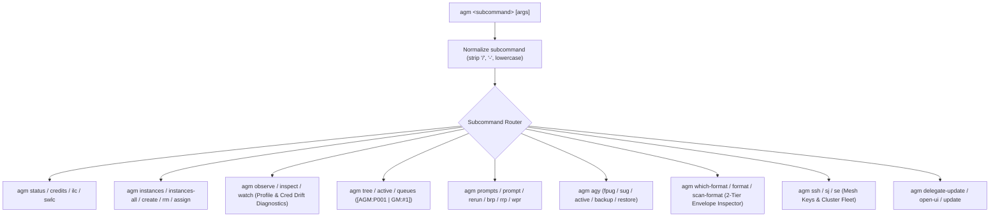

# AGM Native Terminal CLI Suite

Manages the autonomous native terminal companion (`agm`) for Antigravity-Manager implemented in `src-tauri/src/bin/agm.rs` and `src-tauri/src/modules/cli.rs`.

## Architectural Overview

The `agm` CLI operates completely decoupled from the Tauri GUI and WebView2 display server, functioning as a standalone headless binary for local terminals, remote SSH execution, and automated CI/CD pipelines.



## Core Subcommand Categories

### 1. Status, Quotas & Account Switching
- `agm status` / `agm credits`: Displays node identity, local IPv4, active account, 5h rolling quota, 7d weekly quota, and running prompt counts. Supports `--json` (`-j`).
- `agm is-low-credit-for-switch` (`ilc`): Non-mutating probe returning exit code 0/1 or machine telemetry in `--json` mode.
- `agm switch-if-low-credit` (`swlc` / `sfc`): Evaluates threshold percentage, switching to the highest-scoring candidate if active quota is depleted. Supports `-f <file>` export.
- `agm switch <account_email_or_id>`: Direct credential switch for the active profile.
- `agm ff` / `smart-switch`: Immediate fast-forward rotation to the freshest standby account (>100% 4h quota).

### 2. Multi-Instance Management & Diagnostics
- `agm instances` (alias `ls`): Lists all configured sandbox instances with status, PID, data directory, and bound accounts.
- `agm instances create <name> [--data-only]`: Creates new profile sandbox. `--data-only` (`do`) creates lightweight sandboxes sharing the base binary.
- `agm instances assign <target> <repo_path...>`: Binds workspace project folders to an instance profile.
- `agm instances all ff`: Broadcasts fast-forward rotation across every registered instance sequentially.
- `agm instances rm-all`: Removes all secondary instances, strictly protecting the default instance.
- **Operational Observation & Diagnostics (`agm observe`)**:
  - Syntax: `agm observe [target] [--json]` (aliases: `inspect`, `watch`).
  - Scans live conscious PIDs via `find_pids_for_data_dir`.
  - Queries `state.vscdb` (`ItemTable`) via `db::read_injected_email` and compares against `bound_account_email` to detect credential drift.
  - Inspects bound workspaces and validates `.antigravity_goal_heartbeat.json` for live prompt goal freshness.
  - Returns `ObservedInstanceState` in terminal or machine-readable `--json`.

### 3. Dual-Sequence Tree View & Prompt Dispatch
- `agm tree` (or `agm active`): Emits deterministic dual-sequence tree view:
  ```
  [AGM:P001 | GM:#1] [ProjID: <id>] <repo_path> [Instance: #<seq> <name> (<email>)]
  ├─ [AGM:C001 | GM:<cid>] "<Title>" (<status> · <steps> steps)
  │  └─ [Prompt ≤200w]: "<truncated prompt text>"
  ```
- `agm prompt <target> "<prompt_text>" [--instance <id>] [--node <node>]`: Injects instruction prompts by resolving target sequence (`P001`, `C001`, `GM:#1`, or repo slug).

### 4. Prompt Backup, Recovery & Rerun
- `agm which-prompts-running` (`wpr`): Scans `workspaceStorage` and `repo_prompts.db` for active tasks.
- `agm backup-running-prompts` (`brp`): Backs up active prompts and multimodal images before account switches.
- `agm restore-running-prompts` (`rrp`): Restores backed-up prompts to active state.
- `agm rerun prompts <N>`: Reruns last N prompts in ascending order, pulling git upstream first.
- `agm finish-prompts-until-green` (`fpug`): Waits for running tasks to complete green.
- `agm shutdown-until-green` (`sug`): Waits for tasks to complete green, then initiates system shutdown.
- `agm prompt-start-goal [--instance <id>] [--project <path>] [--interval <sec>]`: Starts background 5s heartbeat worker, writing to `.antigravity_goal_prompt.log` and generating `AGM_INSTANCE_STATUS.md`.
- `agm prompt-check-goal [--instance <id>] [--project <path>]`: Validates real-time heartbeat liveness (interval + 4s tolerance) and reports latest telemetry.
- `agm prompt-worker-goal`: Internal loop worker executing detached prompt goal heartbeats.

### 5. Format Inspection & Bulk Operations
- `agm which-format <files...>` (aliases: `format`, `inspect-format`, `scan-format`): Two-tier JSON envelope inspector classifying files into canonical schemas (`agm/accounts-export`, `agm/supabase-endpoints`, `agm/ssh-nodes-export`, etc.) and generating single-line copy-pasteable import commands.

### 6. Mesh SSH & Fleet Management (`agm ssh ...`)
- `agm ssh <target> [cmd...]`: Connects or runs commands on remote nodes, preferentially forwarding to `gitmap ssh` or falling back to the native `ssh_manager` engine.
- `agm se <target> "<cmd>"`: Short-circuit alias for remote execution (`agm ssh exec`).
- `agm sj <target>`: Short-circuit alias for interactive SSH shell (`agm ssh jump`).
- `agm ssh deploy-keys [all] [--dry-run]`: Executes parallel 2-phase mesh deployment of public keys across the cluster.
- `agm ssh fix-auth <target> [-i <pubkey>]` / `agm ssh copy-id <target>`: Repairs remote authorization by appending public keys.
- `agm ssh keys [ls|create|cat|config]`: Discovers, generates (`ed25519`/`rsa`), and configures local SSH keys with managed `~/.ssh/config` injection.
- `agm ssh nodes [ls|export-json|import-json]`: Inspects and synchronizes the cluster node fleet using portable two-tier JSON envelopes.

### 7. Autonomous Instance Flow & Verification
- `agm test-instance-flow` (`tif`): Autonomous local verification flow exercising sandbox creation, conscious PID termination, account rotation, prompt restoration, and CDP/Win32 visual snapshot generation.
- `agm test-training`: Verification harness validating model prompt instruction tuning and recovery.

## Key Invariants & Rules

1. **Headless Early Interception**: Administrative commands (`delegate-update`, `open-ui`, `update`, `which-format`) must execute before initializing any graphical or windowing subsystem.
2. **Deterministic Dual Bracket Notation**: Tree output must strictly conform to `[AGM:P001 | GM:#1]` and `[AGM:C001 | GM:<cid>]`.
3. **Machine-Readable Contract**: Any command supporting `--json` must emit valid JSON matching its respective serde DTO to stdout.
4. **Default Instance Immunity**: The default profile (`id == "default"`) can never be removed or unbound.

## Verification Checklist

- [ ] Command compiles cleanly in `src-tauri/src/bin/agm.rs`.
- [ ] Added CLI flags support both long form (`--json`) and short form (`-j`).
- [ ] Fast-path subcommands bypass GUI initialization.
- [ ] Error messages return non-zero exit codes (`std::process::exit(1)`).
