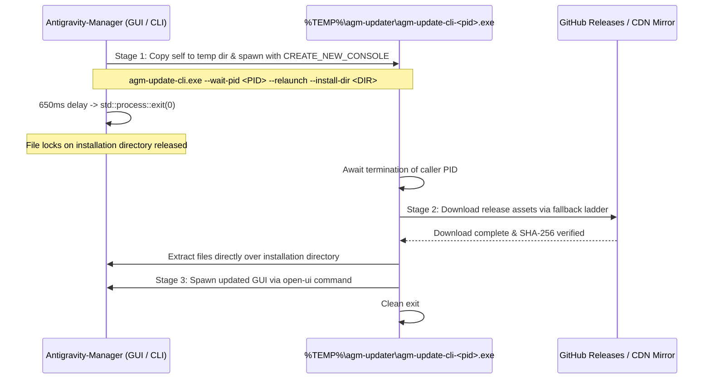

# AGM 3-Stage Self-Delegating CLI Updater Architecture

This skill provides comprehensive architectural guidance, process delegation steps, file-lock bypass rules, and download fallback strategies for the Application Updater subsystem in Antigravity-Manager.

---

## 1. Subsystem Architecture Overview

On Windows, running executable binaries and linked DLLs cannot be overwritten in-place due to OS-level file locking (`ERROR_ACCESS_DENIED`). Antigravity-Manager solves this by delegating the update process to an isolated, out-of-process CLI runner:

---

## 2. Key Files & Core Responsibilities

| File Path | Core Responsibilities |
|---|---|
| `src-tauri/src/modules/delegate_updater.rs` | Implementation of `prepare_isolated_update_cli`, `spawn_delegated_update_cli`, `run_cli_update`, and `open_ui`. |
| `src-tauri/src/modules/update_checker.rs` | Version checking against GitHub API / CDN, release asset discovery, download acceleration, and 650ms unconditional shutdown timer. |
| `src-tauri/src/modules/cli.rs` | CLI subcommand routing: intercepts `delegate-update`, `update`, and `open-ui`. |
| `src-tauri/src/main.rs` | Early process interception: executes delegated update subcommands before initializing the Tauri or WebView2 runtimes. |

---

## 3. The 3-Stage Pipeline Breakdown

### Stage 1: Preparation & Console Delegation (`prepare_isolated_update_cli`)
1. Creates an isolated temporary directory: `%TEMP%\agm-updater\`.
2. Copies the currently running `agm.exe` binary to `agm-update-cli-<pid>.exe` (or `%LOCALAPPDATA%\agm-cli\agm-update-cli.exe`).
3. Spawns the temp executable using Win32 `CREATE_NEW_CONSOLE` flags:
   - Eliminates `cmd.exe /c start` quote-mangling issues on paths containing spaces.
4. Passes parameters: `--wait-pid <current_pid> --relaunch --install-dir <canonical_install_dir>`.
5. The calling process initiates an unconditional shutdown within 650ms (`std::process::exit(0)`), guaranteeing that system tray event loops do not block termination.

### Stage 2: In-Place Package Extraction (`run_cli_update`)
1. The isolated updater continuously polls the caller PID until it fully terminates.
2. Initiates the download using the multi-version fallback ladder:
   - Probes up to 10 releases (CDN manifest -> GitHub Releases API -> embedded version tags).
   - Utilizes `aria2c` multi-connection acceleration if available, falling back smoothly to `reqwest`.
3. Verifies file checksums against `SHA256SUMS`.
4. Overwrites the main installation directory with new binaries and assets.

### Stage 3: Post-Update Launch (`open_ui`)
1. Spawns the newly installed `antigravity-manager.exe` using detached Win32 process flags.
2. The isolated updater exits cleanly and registers temporary file cleanup on next boot.

---

## 4. Architectural Invariants for Updater Maintenance

1. **Early Main Interception**: Updater subcommands (`delegate-update`, `update`, `open-ui`) **must never** initialize Tauri runtimes, graphical webviews, or audio backends. They must execute immediately in `main.rs`.
2. **Unconditional Exit**: When triggering an installer update from the GUI, never rely on standard window close events. Always schedule an explicit, bounded `std::process::exit(0)` after notifying the updater process.
3. **No Interactive Stdin**: All update commands dispatched by the delegator must supply `--yes` / `-y` to run fully unattended.
