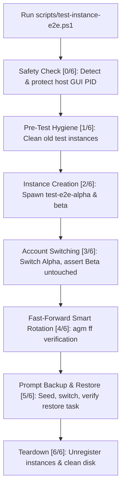

# AGM End-to-End Testing & Verification

Governs local multi-instance lifecycle testing, database token assertions, process isolation tests, and Zero-CI quarantine standards across Antigravity-Manager.

## Architectural Overview

Testing multi-instance IDE profiles, OAuth token injections, and process trees requires realistic simulation without disturbing the operator's live working environment or failing CI/CD runners.

## Core Test Suites

### 1. Comprehensive Multi-Instance E2E Suite (`scripts/test-instance-e2e.ps1`)
Executes an on-demand 6-stage lifecycle verification:
1. **Host Safety Check**: Discovers host IDE processes (`agm-alim`, `Antigravity.exe`) and records protected PIDs.
2. **Pre-Test Hygiene**: Removes residual test sandboxes (`test-e2e-alpha`, `test-e2e-beta`) via `agm instances rm --force`.
3. **Multi-Instance Provisioning**: Spawns two distinct isolated sandboxes with `--data-only` and binds different accounts. Validates 3 database paths per instance:
   - `User\globalStorage\state.vscdb`
   - `AppData\Roaming\Antigravity\User\globalStorage\state.vscdb`
   - `home\AppData\Roaming\Antigravity\User\globalStorage\state.vscdb`
   - Validates standalone token files and `app_storage.json`.
4. **Account Switching & Isolation**: Switches Instance A to a new account and verifies via `scripts/query_vscdb_email.py` that Instance A reflects the new email while Instance B remains 100% unchanged (zero cross-contamination).
5. **Fast-Forward Verification**: Invokes `agm ff` and verifies automatic rotation to the freshest candidate.
6. **Prompt Lifecycle & Resume Task Verification**: Seeds active prompts via `scripts/test_prompt_helper.py`, executes an account switch, and verifies prompt state transitions to `dispatched` and `.antigravity_resume_task.json` is generated.
7. **Clean Teardown**: Stops processes, unregisters instances, and purges sandbox directories.

### 2. Multi-Window Process Isolation (`scripts/test-instance-isolation.ps1`)
- Launches multiple Antigravity windows with distinct profiles.
- Inspects command lines via WMI/CIM, verifying that each window retains its own `--user-data-dir` and basic keyring arguments without process cross-talk.

### 3. Protobuf Database Token Querying (`scripts/query_vscdb_email.py`)
- Reads raw SQLite database `state.vscdb`.
- Extracts `antigravityUnifiedStateSync.oauthToken` blob.
- Decodes protobuf wire format without third-party dependencies, extracting authenticated email and token expiration for test assertions.

### 4. 5-Second Real-Time Heartbeat Verification (`scripts/prompt_heartbeat_runner.py`)
- Integrated into E2E Stage 5/6: launches the heartbeat daemon alongside simulated prompts.
- Confirms that `.antigravity_goal_prompt.log` records sequential ticks (`Iteration: 1`, `2`, ...).
- Verifies that the heartbeat halts prior to conscious PID killing, and cleanly resumes post-switch with incrementing iterations.

### 5. CDP Visual Snapshot Verification (`assets/screenshots/generate_instance_screenshot.py`)
- Connects to running instance via Chrome DevTools Protocol (CDP port 9222/9223) to capture high-fidelity window screenshots before and after account switching.
- Provides Pillow rendering fallback to generate synthetic UI verification cards when running in headless environments.

### 6. Active Prompt Helper (`scripts/test_prompt_helper.py`)
- Directly seeds `active_prompts` table in `repo_prompts.db` with sample multi-modal tasks, ensuring repeatable prompt resumption assertions without requiring manual IDE interaction.

## Key Invariants & Rules

1. **Zero-CI Quarantine Standard (Spec 72)**: Heavy local E2E tests must be marked `#[ignore = "local_only_e2e"]` and require explicit `RUN_TEMP_E2E=1` environment activation. They must NEVER execute during routine CI/CD pipelines.
2. **Host IDE Protection**: The active host IDE process must be detected and protected; automated tests must never terminate the operator's workspace.
3. **Triple Database Verification**: Assertions must verify all 3 SQLite databases (`User/globalStorage/state.vscdb`, `data/AppData/.../state.vscdb`, `home/AppData/.../state.vscdb`) and `app_storage.json`.
4. **Clean Teardown Guarantee**: Unless `-SkipCleanup` is explicitly passed, test sandboxes must be unregistered and deleted from disk upon test completion.

## Verification Checklist

- [ ] Host IDE process PIDs are identified and added to the protection list.
- [ ] Account switches update all 3 `state.vscdb` databases.
- [ ] Sibling instances exhibit zero cross-contamination.
- [ ] `.antigravity_resume_task.json` is generated with valid task content.
- [ ] Local tests remain skipped by default in CI (`cargo test`).
