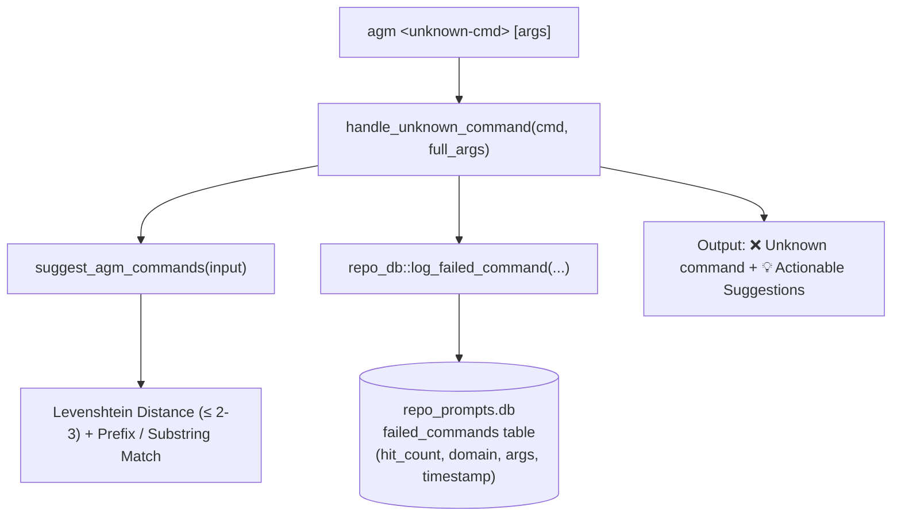

# AGM Failed Commands Telemetry & Self-Healing Command Suggester

Manages the command failure interception, audit logging, dynamic Levenshtein suggestion engine, and terminal hygiene utilities implemented in `src-tauri/src/bin/agm.rs` and `src-tauri/src/modules/repo_db.rs`.

---

## 1. Architectural Overview

Antigravity-Manager tracks CLI command execution telemetry directly in its split SQLite database (`repo_prompts.db`). When an operator or automated agent inputs an unrecognized command or typo, AGM intercepts the error, computes nearest-match suggestions via Levenshtein edit distance and prefix heuristics, logs the telemetry record to SQLite, and prints actionable suggestions to stdout.



---

## 2. SQLite Database Schema & Telemetry View

Located in `src-tauri/src/modules/repo_db.rs:208–238`:

### Table: `failed_commands`
| Column | Type | Constraints / Description |
|---|---|---|
| `id` | `INTEGER` | `PRIMARY KEY AUTOINCREMENT` |
| `command` | `TEXT` | Unrecognized command token (e.g. `clr`, `inst`, `sw`) |
| `full_args` | `TEXT` | Complete serialized argument string passed to CLI |
| `domain` | `TEXT` | Execution domain (defaults to `'root'`, e.g. `'ssh'`, `'instances'`) |
| `error_code` | `TEXT` | Telemetry classification (default `'E1001'`) |
| `message` | `TEXT` | User-facing error description |
| `suggestions` | `TEXT` | Semicolon or comma-delimited suggested valid commands |
| `hit_count` | `INTEGER` | Cumulative frequency count (increments on duplicate failures) |
| `working_dir` | `TEXT` | Active working directory where the failure occurred |
| `agm_version` | `TEXT` | AGM binary version at time of failure (e.g. `v4.106.0`) |
| `is_resolved` | `BOOLEAN` | `0` = pending investigation, `1` = resolved |
| `created_at` | `DATETIME` | Initial occurrence timestamp |
| `last_seen_at` | `DATETIME` | Most recent occurrence timestamp |

### Indexes & Views
- `CREATE INDEX idx_failed_commands_cmd ON failed_commands(command, domain);`
- `CREATE INDEX idx_failed_commands_hits ON failed_commands(hit_count DESC);`
- `CREATE VIEW failed_to_detect_commands AS SELECT * FROM failed_commands;`

---

## 3. Levenshtein Dynamic Suggester Engine

Implemented in `src-tauri/src/bin/agm.rs:8400–8460`:

### Matching Heuristics
1. **Exact Stem Match**: Matches stem without hyphens (e.g., `clearcache` $\to$ `clear-cache`).
2. **Prefix Match**: Matches standard command prefixes (e.g., `inst` $\to$ `instances`).
3. **Substring Match**: Locates root words inside input (e.g., `term` $\to$ `clear-terminal`).
4. **Levenshtein Distance**: Evaluates edit distance threshold $\le 2$ (or $\le 3$ for inputs $> 6$ characters) using `strsim_levenshtein`.

### User-Facing Output
```text
❌ Unknown command: 'agm clr'
  💡 It is not there, but here is a suggestion you can try:
    • agm clear-terminal
    • agm clear-cache
```

---

## 4. CLI Inspection & Audit Commands

| Command | Aliases | Description |
|---|---|---|
| `agm failed-commands [limit]` | `agm fc` | Displays tabular audit report of failed commands sorted by `hit_count DESC`. Defaults to 20 rows. Supports `--json` (`-j`). |
| `agm failed-commands count` | `agm fcc`, `agm fc count` | Outputs total distinct failed commands count and aggregate failure hits. |
| `agm failed-commands clear` | `agm fc clear` | Truncates all records via `DELETE FROM failed_commands`. |
| `agm clear-terminal` | `agm cls`, `agm clear` | Emits cross-platform ANSI escape sequences (`\x1B[2J\x1B[1;1H`) to clear the terminal screen. |

---

## 5. Rich Command Suggestions in Subsystem Handlers

In addition to unknown command handling, specific subsystems emit contextual next-step suggestions upon completion:
- **`agm ssh nodes`**:
  ```text
  💡 Try these commands next:
    • agm ssh deploy-keys [all]   - Deploy public keys across all nodes
    • agm ssh fix-auth <node>     - Test and repair auth on a specific node
  ```
- **`agm clean` / `agm prune`**:
  ```text
  💡 Try these commands next:
    • agm clear-terminal          - Clear terminal scrollback buffer
    • agm gitignore agm           - Clean and ignore task resumption files
  ```

---

## 6. Key Invariants

1. **Silent Telemetry Failure**: Telemetry database write errors must never abort CLI exit; errors are silently logged or ignored to protect terminal workflows.
2. **Hit Count Upsert**: Duplicate failed commands must update `hit_count = hit_count + 1`, `last_seen_at = CURRENT_TIMESTAMP`, and `working_dir` rather than duplicating rows.
3. **Machine-Readable Support**: `agm fc --json` must emit valid JSON matching `Vec<FailedCommandRecord>` to stdout.
