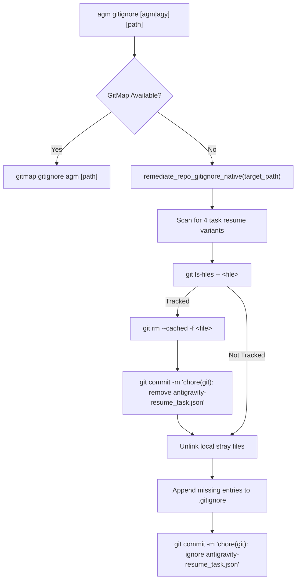

# AGM GitIgnore & Task Resumption Hygiene

Specialized skill for managing repository git tracking hygiene, removing sensitive/temporary task resumption files from version control, updating `.gitignore` rules, and coordinating with GitMap terminal tools. Implemented in `src-tauri/src/bin/agm.rs:8206–8372`.

---

## 1. Architectural Overview

During automated or manual account switching, Antigravity-Manager seeds temporary task resumption JSON files (such as `.antigravity_resume_task.json`) in workspace roots to ensure in-flight conversations and prompts are restored seamlessly. If accidentally staged or committed to Git, these files can leak workspace states or pollute version control history.

The `agm gitignore` command suite provides an automated, non-destructive remediation workflow:
1. Detects git tracking of task resumption file variants.
2. Removes tracked files from the git index (`git rm --cached`).
3. Commits the removal with an atomic, conventional commit message.
4. Purges local stray files from the workspace filesystem.
5. Injects ignore rules into `.gitignore` and commits the update.



---

## 2. Monitored Task Resumption File Variants

The engine tracks and remediates four historical and current filename patterns:
1. `antigravity-resume_task.json`
2. `.antigravity_resume_task.json`
3. `antigravity_resume_task.json`
4. `.antigravity-resume_task.json`

---

## 3. CLI Command Usage

| Command Syntax | Aliases | Description |
|---|---|---|
| `agm gitignore agm` | `agm gitignore agy`, `agm ignore agm` | Remediation targeting current working directory (`.`). |
| `agm gitignore agm <repo_path>` | `agm ignore <repo_path>` | Remediation targeting a specific repository path. |
| `agm gitignore` | `agm ignore` | Displays help and usage guidelines for gitignore management. |

### Execution Example
```text
$ agm gitignore agm
🔍 Inspecting git tracking for antigravity-resume_task.json variants...
  • Detected tracked file: .antigravity_resume_task.json
  ✔ Removed from git index (git rm --cached -f)
  ✔ Committed removal: chore(git): remove antigravity-resume_task.json from repository
  ✔ Purged local stray task file
  ✔ Added entries to .gitignore
  ✔ Committed .gitignore update: chore(git): ignore antigravity-resume_task.json in .gitignore
✅ Repository git hygiene verified clean.
```

---

## 4. Remediation Algorithm (`remediate_repo_gitignore_native`)

Located in `src-tauri/src/bin/agm.rs:8243–8372`:

1. **Working Directory Resolution**:
   - Resolves target path argument, defaulting to current working directory (`.`).
   - Verifies the directory contains a `.git` folder. If not, returns an error.
2. **Git Index Check**:
   - Executes `git ls-files -- <variant>`.
   - If output contains the file, proceeds to untrack.
3. **Index Untracking**:
   - Executes `git rm --cached -f --ignore-unmatch <variant>`.
   - Commits: `git commit -m "chore(git): remove antigravity-resume_task.json from repository"`.
4. **Local File Deletion**:
   - Checks `std::path::Path::exists()`; if present, deletes the file via `std::fs::remove_file()`.
5. **GitIgnore Synchronization**:
   - Reads existing `.gitignore` content.
   - If missing `antigravity-resume_task.json` or `.antigravity_resume_task.json`, appends:
     ```gitignore
     # Antigravity Task Resumption
     antigravity-resume_task.json
     .antigravity_resume_task.json
     antigravity_resume_task.json
     .antigravity-resume_task.json
     .antigravity_goal_prompt.log*
     ```
   - Stages and commits:
     - `git add .gitignore`
     - `git commit -m "chore(git): ignore antigravity-resume_task.json in .gitignore"`

---

## 5. Key Invariants

1. **GitMap Preference**: If `gitmap` CLI is discovered in PATH or standard system locations, AGM delegates to `gitmap gitignore agm` to ensure unified cluster-wide git hygiene.
2. **Non-Destructive Git History**: Untracking uses `--cached` to ensure working directory files are unlinked deliberately via controlled Rust file removal rather than git hard drops.
3. **Clean Commit Boundaries**: Untracking commits and ignore-addition commits are created as discrete, self-contained commits with conventional commit messages (`chore(git): ...`).
