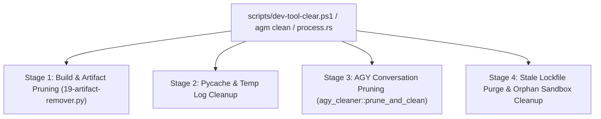

# AGM Process Lifecycle, Cleaner & Developer Hygiene

Governs process tree management, window restoration, cache pruning, and developer hygiene across Antigravity-Manager.

## Architectural Overview

The system maintains absolute process separation between host IDE instances, secondary sandboxed profiles, helper subprocesses, and background daemons.

## Core Subsystems

### 1. Conscious PID Matching (`src-tauri/src/modules/process.rs`)
- **Host IDE Safety Gate**: Never performs blanket process termination (`taskkill /f /im Antigravity.exe`).
- **Target Filtering (`find_pids_for_data_dir`)**:
  - Distinguishes root IDE windows from helper renderers, GPU processes, crashpad handlers, and language servers.
  - Matches command-line arguments against normalized `--user-data-dir` paths or cloned binary filenames (`Antigravity-<id>.exe`).
  - Default profile resolution isolates root default PIDs from any process descended from custom sandboxes.
- **Tree Termination**: Terminates entire process trees (`taskkill /F /T /PID <pid>`), followed by `sweep_orphan_language_servers()` and a 2500ms drain loop ensuring locks are released before writing credentials.
- **Active Window Focus**: Restores windows across platforms (Windows PowerShell COM `WScript.Shell.AppActivate` + Win32 `ShowWindow(SW_RESTORE)`, macOS AppleScript `osascript`, Linux `xdotool`).

### 2. Conversation Pruning & Undo Engine (`src-tauri/src/modules/agy_cleaner.rs`)
- **Safe Staging**: Moves candidate files to `%TEMP%\antigravity-cleaner-backup` with a JSON manifest (`TransactionManifest`) preserving original paths, timestamps, and sizes.
- **Retention Ceiling**: Respects `--keep/k <N>` (default: 10), keeping the N newest conversations and deleting older files to reclaim gigabytes of disk space.
- **Dry-Run Capability**: Computes projected savings (`PreflightReport`) before touching filesystem.
- **Undo Engine (`undo_pruning`)**: Reverses pruning operations by copying staged files back to their exact original locations.

### 3. Developer Hygiene Script (`scripts/dev-tool-clear.ps1`)
Runs a 4-step hygiene routine:
1. Purges Cargo target intermediate build artifacts (`target/debug/build`, `build-demo`, `target-demo`).
2. Purges Python `__pycache__` and temporary test outputs.
3. Invokes `agm clear k 10` across detected workspace directories.
4. Removes stale `lockfile`, `code.lock`, and `singleton*` files and cleans orphaned `test-*` / `tmp-*` sandboxes.

## Key Invariants & Rules

1. **Host PID Protection**: The active host IDE process running the developer's primary workspace must NEVER be killed during automated test runs or sandbox updates.
2. **"Kill First, Write Second"**: Always confirm target process termination via sysinfo before modifying `state.vscdb`, `storage.json`, or OAuth tokens.
3. **Lockfile Clearance**: Always sweep orphaned lockfiles before starting or cloning an instance.
4. **Zero Artifact Bloat**: Keep temporary test scripts and logs out of git commits.

## Verification Checklist

- [ ] `find_pids_for_data_dir` accurately isolates target instance PIDs.
- [ ] Language server orphans are swept after terminating instances.
- [ ] Stale lockfiles are purged before new launches.
- [ ] Pruned conversations can be rolled back using `undo_pruning`.
