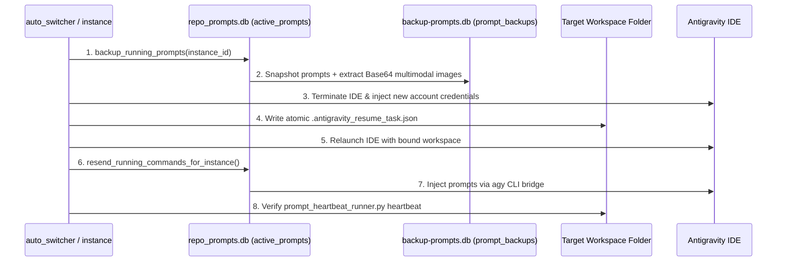

# AGM Prompt Lifecycle, Backup & Task Resumption

Governs active instruction prompt tracking, parallel SQLite backups, multimodal payload persistence, atomic workspace seeding, and post-switch task re-injection in Antigravity-Manager.

## Architectural Overview

During account switching or fast-forward rotations, running tasks must never be dropped or interrupted without resumption. Antigravity-Manager orchestrates a multi-tier backup and re-injection cycle:



## Core Subsystems

### 1. Active Prompt State Machine (`src-tauri/src/modules/repo_db.rs`)
Tracks prompts across 4 lifecycle states:
- `running`: Actively executing in an IDE window.
- `backed_up`: Snapshotted to database prior to IDE shutdown.
- `dispatched`: Sent to the newly launched instance for resumption.
- `completed`: Successfully finished execution.

### 2. Historical & Multimodal SQLite Vault (`src-tauri/src/modules/backup_prompts_db.rs`)
- Persists batches into `backup_batches` and `prompt_backups`.
- **Multimodal Payload Preservation (`extract_image_payload_or_path`)**: Identifies Base64 images and local image references, storing them in `images_payload` with `has_images: true`. Visual debugging context survives account rotations completely intact.
- **Deduplication Gate**: Checks for unrestored entries (`is_restored = 0`) before inserting to prevent infinite reinjection loops.
- **Retention**: Auto-prunes expired batches older than 24 hours.

### 3. Atomic Resume Task Seeding (`.antigravity_resume_task.json`)
Before launching an IDE instance post-switch:
- Writes `.antigravity_resume_task.json` directly into each bound workspace root.
- Payload includes `prompt_content`, `target_model`, `instance_id`, `has_images`, `timestamp`, and `is_reinjecting: true`.
- The IDE or developer bootstrap script picks up this task on launch.

### 4. Real-Time Heartbeat Logging (`scripts/prompt_heartbeat_runner.py`)
A dedicated Python daemon monitors task execution vitality and verifies zero-loss continuity during account rotations:
- **CLI Commands**:
  - `python scripts/prompt_heartbeat_runner.py start <prompt_id> <instance_id> <log_path> [interval=5.0]`: Spawns a detached background runner (`DETACHED_PROCESS` on Windows, background fork on Unix) and writes its PID to `<log_path>.pid`.
  - `python scripts/prompt_heartbeat_runner.py check <log_path>`: Verifies runner process liveness via OS tables (`tasklist` on Windows, `kill(pid, 0)` on Unix) and validates heartbeat freshness (`age_sec <= 10.0`).
  - `python scripts/prompt_heartbeat_runner.py stop <log_path>`: Gracefully terminates the runner and unlinks `<log_path>.pid`.
  - `python scripts/prompt_heartbeat_runner.py latest <log_path>`: Dumps the most recent heartbeat line and age in seconds.
- **Log Entry Standard (`.antigravity_goal_prompt.log`)**:
  ```text
  [2026-09-30 01:45:00 UTC] [PID: 12345] Instance: default | Prompt: prompt-uuid | Iteration: 42 | Status: RUNNING | Goal: Long-running task active
  ```
- **Lifecycle Integration**:
  - Automatically halted before conscious PID termination of an instance.
  - Automatically resumed post-switch, verifying that iteration counters advance continuously from before to after the rotation.

## Key Invariants & Rules

1. **Zero Prompt Loss Invariant**: An IDE instance must NEVER be closed until its active prompts are transitioned to `backed_up` in `repo_prompts.db` and committed to `backup-prompts.db`.
2. **Instance Isolation on Backup**: Backups must strictly filter by `instance_id`. Switching Instance A must not snapshot or disturb tasks running on Instance B.
3. **Multimodal Preservation**: Inlined image tokens (`data:image/...`) must be extracted and preserved across swaps.
4. **Clean Status Transition**: Once resent, prompts transition from `backed_up` to `dispatched` to avoid duplicate restarts.

## Verification Checklist

- [ ] `backup_running_prompts` transitions all `running` records to `backed_up`.
- [ ] Multimodal image payloads are preserved in `prompt_backups`.
- [ ] `.antigravity_resume_task.json` is generated with valid JSON in the workspace folder.
- [ ] Heartbeat runner resumes logging post-switch.
