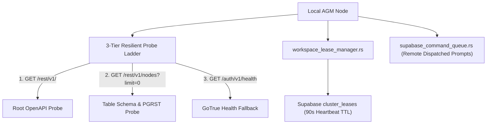

# AGM Supabase Cluster Synchronization & Distributed Leases

Governs multi-machine hierarchy management, distributed account locking, schema migrations, and connection probe diagnostics using Supabase PostgreSQL in Antigravity-Manager.

## Architectural Overview

Antigravity-Manager supports multi-node cluster deployments, using a shared Supabase backend to prevent account collisions across multiple physical or virtual machines.

## Core Subsystems

### 1. Universal URL Normalization (`normalize_supabase_url`)
Eliminates path concatenation errors (e.g. `https://ref.supabase.co/rest/v1/rest/v1/nodes`):
- Strips trailing slashes.
- Strips trailing `/rest/v1` or `/rest/v1/`.
- Applied automatically on input blur, form submission, and storage persistence.

### 2. 3-Tier Resilient Probe Ladder (`test_supabase_endpoint`)
Performs progressive diagnostic probes without throwing uncaught UI exceptions:
1. **Probe 1**: `GET /rest/v1/` (OpenAPI specification root).
2. **Probe 2**: `GET /rest/v1/nodes?limit=0` (PostgREST table endpoint; confirms API access even if OpenAPI docs are restricted, catching `PGRST204` / `PGRST205` schema reload states).
3. **Probe 3**: `GET /auth/v1/health` (GoTrue auth service probe verifying host availability).
- **Non-Fatal Envelopes**: Always returns `Ok(EndpointTestResult { is_success, message, status_code })`, providing inline toast/badge feedback instead of opening global error modals.

### 3. Distributed Workspace Leases (`workspace_lease_manager.rs`)
- Prevents two VMs from using the same Google OAuth account simultaneously.
- Leases record: `account_id`, `machine_id`, `leased_at`, `expires_at` (90-second TTL).
- Active workers maintain a 30-second heartbeat loop refreshing `expires_at`.
- Stale leases (>90s without heartbeat) are automatically reclaimed.

### 4. Remote Command Queue (`supabase_command_queue.rs`)
- Polls Supabase for tasks queued by external operators or mobile devices.
- Pulls instructions, executes them locally via `agm prompt` or `agy`, and writes back execution results and exit codes.

## Key Invariants & Rules

1. **Universal URL Normalization**: Every Supabase URL must be processed via `normalize_supabase_url()` before storage or request execution.
2. **Non-Fatal Error Handling**: Connection tests must return diagnostic envelopes rather than failing promises or triggering crash modals.
3. **Collision Shielding**: Never bind an account if `workspace_lease_manager::is_account_or_email_leased_by_other` evaluates to true.
4. **Lease Heartbeat Discipline**: Leases must be renewed every 30 seconds to maintain cluster lock validity.

## Verification Checklist

- [ ] URL normalization strips redundant `/rest/v1` suffixes.
- [ ] Connection test probe ladder handles restricted anon keys gracefully.
- [ ] Leased accounts are protected from cross-VM concurrent acquisition.
- [ ] Expired leases (>90s) are cleanly released.
