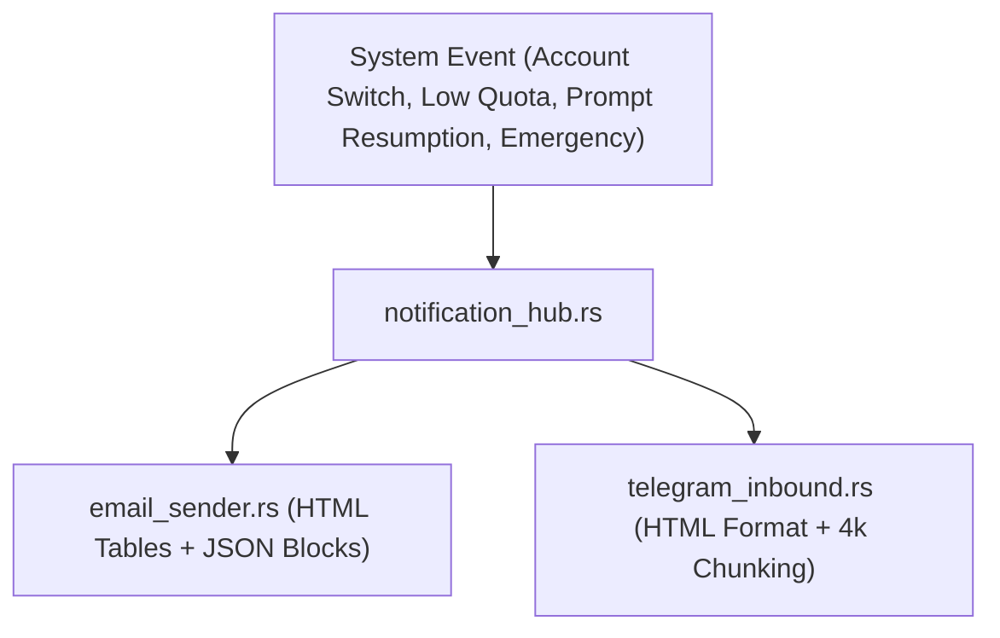

# AGM Telemetry & Multi-Channel Notification Hub

Governs cross-channel status reporting, alert routing, standardized email headers, and Telegram broadcasts across Antigravity-Manager.

## Architectural Overview

`notification_hub.rs` serves as the centralized dispatch bus, delivering synchronized events across Telegram bots and SMTP email recipients.



## Standardized Header & Subject Formats

### 1. Email Subject Normalization (`format_subject_with_telemetry`)
All outbound email subjects are normalized to a strict canonical prefix:
```
[AGM v<VERSION> | <VM_ALIAS> | <LOCAL_IP>] <Subject Description>
```
- Example: `[AGM v4.101.1 | Win-Dev-01 | 192.168.1.100] [Notice] Workspace Auto-Switched: user@gmail.com`
- Emergency Subject: `[AGM v<VERSION> | <VM_ALIAS> | <LOCAL_IP>] [EMERGENCY] Prompts Failed to Resume on <host> (<ip>)`
- Strips obsolete prefixes (`[Antigravity | ...]`, `[VM | IP]`) while preserving `Re:` tags.

### 2. Telegram Observe Report Header
```
🤖 <b>AGM v<VERSION> Status</b>

• <b>Machine:</b> <COMPUTERNAME / hostname>
• <b>Alias:</b> <Configured Node Alias>
• <b>IP:</b> <Local IPv4>
• <b>Build:</b> v<VERSION> (commit <short_sha>)
• <b>Active Account:</b> <email> (<N> total)
• <b>Quota / Tier:</b> <quota_summary> (switch threshold: <pct>%)
```

## Core Notification Flows

### 1. Account Switch Telemetry (`notify_account_switched_details`)
Dispatches whenever an account switch occurs (via auto-switcher, CLI `ff`, or UI).
- Emits:
  - `previous_email` (authentic previous account before mutation; never "default").
  - `selected_email` (newly bound candidate).
  - `credit_before_switch` (5h rolling & 7d weekly percentages).
  - `threshold_activated` (e.g. 15% or 98%).
  - `prompts_running` & `prompts_resent`.
  - Machine telemetry block.

### 2. Post-Switch Liveness Verification (`dispatch_post_switch_prompt_telemetry`)
Verifies prompt recovery after an IDE restart:
- If running prompts resume within expected window: Dispatches `[STATUS] Post-Switch Liveness Verified`.
- If prompt resumption fails: Dispatches `[EMERGENCY] Prompts Failed to Resume` to notify operators immediately.

### 3. Telegram Message Chunking Gate
- Messages exceeding 4,000 characters are automatically split along newline boundaries.
- Chunks include `(Part X/Y)` header indicators, preventing Telegram API 400 rejection errors.

## Key Invariants & Rules

1. **Authentic Previous State**: Never emit empty strings or `"default"` for `previous_email`. The previous account must be snapshotted prior to credential mutation.
2. **Subject Header Consistency**: Outbound emails must use the `[AGM v<VERSION> | <VM_ALIAS> | <LOCAL_IP>]` format.
3. **HTML Escaping**: Telegram messages must use `clean_for_telegram_html` to escape `<`, `>`, and `&`.
4. **Clean JSON Inlining**: JSON telemetry blocks in emails must remain clean and parseable.

## Verification Checklist

- [ ] Subject header matches `[AGM v<VERSION> | <VM_ALIAS> | <LOCAL_IP>]`.
- [ ] Telegram report parses valid HTML without tag corruption.
- [ ] Emergency alert fires when prompt resumption fails.
- [ ] Long Telegram messages are split cleanly under 4,000 characters.
