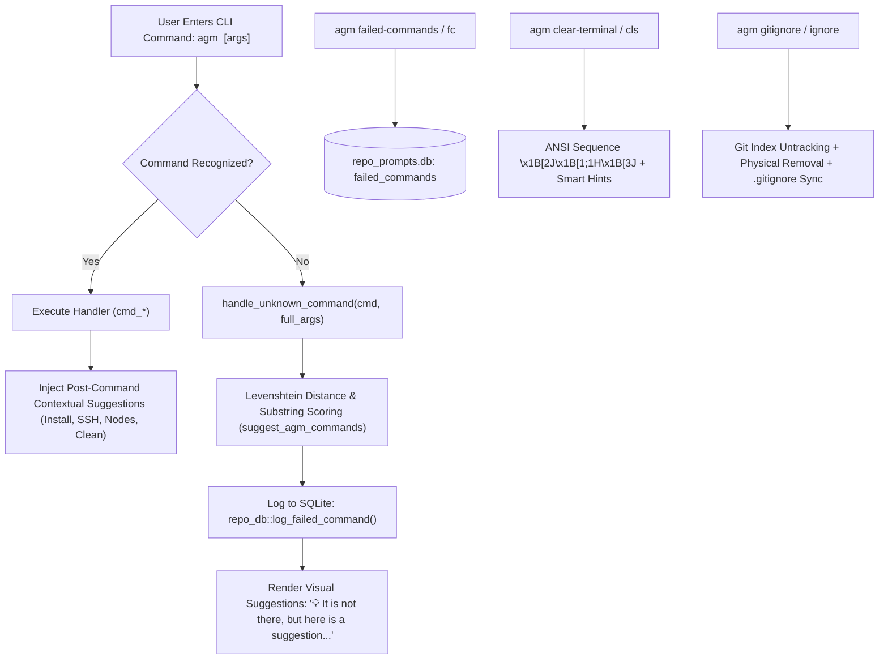

# AGM Terminal Diagnostics, Self-Healing Suggestions & Git Hygiene

Specialized operational guide for the **Terminal Diagnostics & Self-Healing Engine** implemented across [`src-tauri/src/bin/agm.rs`](src-tauri/src/bin/agm.rs) and [`src-tauri/src/modules/repo_db.rs`](src-tauri/src/modules/repo_db.rs).

Introduced in releases v4.105.0 and v4.106.0, this subsystem provides autonomous command-line self-healing, SQLite telemetry auditing for unrecognized commands, ANSI 3J terminal session clearing, contextual next-step optimization hints, and automated repository gitignore hygiene for transient orchestration payloads.

---

## 1. Subsystem Architecture Overview



---

## 2. Key Files & Core Responsibilities

| File Path | Core Responsibilities |
|---|---|
| `src-tauri/src/bin/agm.rs` | Unknown command interception (`handle_unknown_command`), Levenshtein distance algorithm (`strsim_levenshtein`), fuzzy ranking (`suggest_agm_commands`), terminal clearing (`cmd_clear_terminal`), failed commands CLI (`cmd_failed_commands`), gitignore remediation (`cmd_gitignore`, `remediate_repo_gitignore_native`), and rich post-command hint injection. |
| `src-tauri/src/modules/repo_db.rs` | SQLite persistence in `repo_prompts.db`: table `failed_commands`, view `failed_to_detect_commands`, indices `idx_failed_commands_cmd` & `idx_failed_commands_hits`, methods `log_failed_command`, `count_failed_commands`, `list_failed_commands`, and `clear_failed_commands`. |
| `src-tauri/src/modules/ssh_manager.rs` | Emits rich troubleshooting hints during SSH authentication failures, public key mismatches, or unreachable cluster nodes. |
| `02-spec/19-main-worker-service/` | Architecture specs and version changelog records for telemetry and command self-healing. |

---

## 3. Core Technical Mechanics

### 3.1 Self-Healing Fuzzy Suggestion Engine

When an invalid or mistyped subcommand is entered, `agm` does not simply fail with an unhelpful error. It executes a multi-tiered fuzzy ranking algorithm over all known subcommands:

```rust
fn suggest_agm_commands(input: &str) -> Vec<String>
```

#### Scoring Rules & Precedence:
1. **Exact Match (Score 0)**: Returns immediately with the matching command.
2. **Prefix Match (Score 1)**: If candidate starts with input, or input starts with candidate.
3. **Substring Inclusion (Score 2)**: If candidate contains input, or input contains candidate.
4. **Levenshtein Edit Distance (Score 10 + Distance)**:
   - Evaluated using a dynamic programming matrix in `strsim_levenshtein(a, b)`.
   - Admitted if $\text{distance} \le 2$, or if input length $> 4$ and $\text{distance} \le 3$.
5. **Sorting & Selection**:
   - Candidates are sorted primarily by score ascending, secondarily by command length ascending.
   - The top 4 ranked suggestions are returned.

#### User Presentation:
```text
❌ Unknown command: 'agm credtis'

  💡 It is not there, but here is a suggestion you can try:
    • agm credits
    • agm status

  Run 'agm help' for available commands.
  Run 'agm failed-commands' (or 'agm fc') to view failed command history & suggestions.
```

---

### 3.2 Failed Commands Telemetry & Audit Pipeline (`repo_prompts.db`)

Unrecognized command attempts are persistently logged into `repo_prompts.db` to assist developers and administrators in discovering missing aliases, usability bottlenecks, or typos:

#### SQLite Schema (`failed_commands`):
```sql
CREATE TABLE IF NOT EXISTS failed_commands (
    id INTEGER PRIMARY KEY AUTOINCREMENT,
    command TEXT NOT NULL DEFAULT '',
    full_args TEXT NOT NULL DEFAULT '',
    domain TEXT NOT NULL DEFAULT 'root',
    error_code TEXT NOT NULL DEFAULT 'E1001',
    message TEXT NOT NULL DEFAULT '',
    suggestions TEXT NOT NULL DEFAULT '',
    hit_count INTEGER NOT NULL DEFAULT 1,
    working_dir TEXT NOT NULL DEFAULT '',
    agm_version TEXT NOT NULL DEFAULT '',
    is_resolved INTEGER NOT NULL DEFAULT 0,
    created_at TEXT NOT NULL DEFAULT CURRENT_TIMESTAMP,
    last_seen_at TEXT NOT NULL DEFAULT CURRENT_TIMESTAMP
);

CREATE INDEX IF NOT EXISTS idx_failed_commands_cmd ON failed_commands(command, domain);
CREATE INDEX IF NOT EXISTS idx_failed_commands_hits ON failed_commands(hit_count DESC);
CREATE VIEW IF NOT EXISTS failed_to_detect_commands AS SELECT * FROM failed_commands;
```

#### Idempotent Deduplication:
- Queries `SELECT id, hit_count FROM failed_commands WHERE LOWER(command) = LOWER(?1) AND LOWER(domain) = LOWER(?2)`.
- If an entry exists: updates `hit_count = hit_count + 1`, refreshes `last_seen_at = CURRENT_TIMESTAMP`, updates `full_args`, `working_dir`, and sets `is_resolved = 0`.
- If new: inserts row with `hit_count = 1`.

---

### 3.3 Interactive Terminal Session Clearing (`agm clear-terminal`)

Clearing the terminal in AGM performs a deep 3-part ANSI reset and flushes the stdout buffer:

```rust
print!("\x1B[2J\x1B[1;1H\x1B[3J");
let _ = std::io::Write::flush(&mut std::io::stdout());
```

1. `\x1B[2J`: Clears visible screen.
2. `\x1B[1;1H`: Moves cursor to row 1, column 1.
3. `\x1B[3J`: Clears scrollback buffer (erases terminal history in modern terminal emulators).
4. **Contextual Suggestion Output**: Immediately provides operator guidance on next logical workflows (JSON inspection, failed command audit, SSH fleet check, cache cleaning).

---

### 3.4 Contextual Optimization Hints Matrix

Rich, actionable hints are appended to terminal output following key operations:

| Trigger Operation | Appended Optimization Hints |
|---|---|
| `agm install` | `agm version`, `agm doctor`, `agm ssh nodes`, `agm clear-terminal` |
| `agm ssh deploy-keys` | `agm ssh <alias>`, `agm ssh nodes`, `agm ssh exec all "uname -a"`, `gitmap ssh health`, `agm failed-commands` |
| `agm ssh fix-auth` / `auth` | `agm ssh <target>`, `agm ssh nodes`, `agm ssh exec <target> "whoami"`, `agm ssh deploy-keys` |
| `agm ssh nodes` | `agm ssh deploy-keys`, `agm ssh add-key`, `agm ssh copy-id`, `agm ssh exec all`, `agm ssh nodes export-json`, `agm clear-terminal` |
| `agm ssh` (Error / Non-Zero Exit) | `agm ssh deploy-keys <target>`, `agm ssh add-key`, `gitmap ssh health`, `agm doctor` |

---

### 3.5 Automated Gitignore Remediation & Transient Task Untracking (`agm gitignore`)

During account rotation and prompt recovery, AGM generates transient orchestration payloads (`.antigravity_resume_task.json`, `antigravity-resume_task.json`). If accidentally committed or tracked, they clutter git history and leak prompt states.

The `agm gitignore` command provides automated, self-healing remediation:

#### Execution Flow:
1. **GitMap Delegation**: If `gitmap` binary is discovered via `resolve_gitmap_bin()`, delegates execution to `gitmap gitignore agm [path]`.
2. **Native Rust Fallback (`remediate_repo_gitignore_native`)**:
   - Inspects target files: `["antigravity-resume_task.json", ".antigravity_resume_task.json", "antigravity_resume_task.json", ".antigravity-resume_task.json"]`.
   - Checks Git index: `git -C <target> ls-files -- <file>`.
   - Untracks tracked files: `git -C <target> rm --cached -f --ignore-unmatch -- <files>`.
   - Commits untracking: `git -C <target> commit -m "chore(git): remove antigravity-resume_task.json from repository"`.
   - Deletes physical file from working tree if present.
   - Inspects `.gitignore` and appends missing entries.
   - Commits `.gitignore` update: `git -C <target> add .gitignore && git -C <target> commit -m "chore(git): ignore antigravity-resume_task.json in .gitignore"`.

---

## 4. CLI Command Reference & Output Schemas

### Failed Commands Inspector
```bash
# Display top 20 failed commands with hits and suggestions
agm failed-commands
agm fc

# Display top 50 failed commands
agm fc 50

# Output as JSON
agm fc --json
agm fc -j

# Check count only
agm fc count
agm fc -c
agm fcc

# Clear failed commands history
agm fc clear
agm fc -y
```

#### Sample Table Output:
```text
================================================================================
  AGM Failed / Undetected Commands Inspector (Distinct: 3, Total Hits: 7)
================================================================================
  #    COMMAND                  HITS     DOMAIN     SUGGESTION
  ------------------------------------------------------------------------------
  1    credtis                  4        root       credits, status
  2    insatnces                2        root       instances
  3    shh                      1        root       ssh
================================================================================
  • Check count only: agm failed-commands count
  • Clear history:    agm failed-commands clear
```

### Terminal Screen Refresh
```bash
agm clear-terminal
agm clean-terminal
agm cls
agm clear
```

### Gitignore Remediation
```bash
# Remediate current repository
agm gitignore agm

# Remediate specific directory or repository
agm gitignore agm ./my-project
agm ignore ./my-project
```

---

## 5. Architectural Invariants

1. **Non-Blocking Telemetry Invariant**: Telemetry logging to `failed_commands` must NEVER prevent the terminal from failing fast. Database logging errors must be silently swallowed (`let _ = repo_db::log_failed_command(...)`).
2. **Top-4 Suggestion Ceiling**: To maintain clean terminal UX, `suggest_agm_commands` must strictly limit output to the top 4 candidate suggestions.
3. **Scrollback Buffer Clearance**: `cmd_clear_terminal` must emit ANSI `\x1B[3J` alongside `2J` and `1;1H` to ensure deep scrollback elimination across modern terminal emulators.
4. **Ephemeral Resumption Privacy**: Transient task resumption files (`.antigravity_resume_task.json`) must NEVER remain tracked in Git repositories. `agm gitignore` must ensure both removal from cache and entry in `.gitignore`.
5. **Graceful GitMap Delegation**: If `gitmap` is installed, gitignore operations should delegate to `gitmap gitignore agm`; if missing, the native Rust implementation must execute seamlessly without external dependencies.

---

## 6. Pre-Flight Verification Checklist

- [ ] Typing an unknown command (e.g. `agm foobar`) outputs top fuzzy suggestions and logs to `repo_prompts.db`.
- [ ] `agm fc` correctly renders distinct commands, hit counts, and suggestions in both ASCII table and `--json`.
- [ ] `agm fc count` returns accurate distinct and total hit counts.
- [ ] `agm fc clear` successfully purges the `failed_commands` table.
- [ ] `agm clear-terminal` flushes the screen buffer and prints contextual optimization suggestions.
- [ ] `agm gitignore agm` removes tracked `.antigravity_resume_task.json` files and updates `.gitignore` with clean commits.
