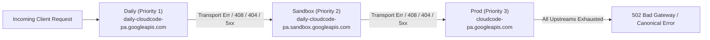

# AGM Upstream Fallback Ladder & Network Resilience

Governs upstream endpoint failover, client connection management (`rquest`), retry policies, and quota protection across the reverse proxy gateway (`src-tauri/src/proxy/`).

---

## 1. Upstream Fallback Ladder

---

## 2. Core Architectural Invariants

### 2.1 Invariant I1: Strict Fallback Trigger Conditions
Fallback is triggered **ONLY** on:
- Transport-level network errors (connection reset, DNS failure, broken pipe).
- HTTP request timeouts (`408 Request Timeout`).
- Endpoint unreachability (`404 Not Found` from upstream router).
- Server-side errors (`500 Internal Server Error`, `502 Bad Gateway`, `503 Service Unavailable`, `504 Gateway Timeout`).

Client-side payload errors (`400 Bad Request`, `401 Unauthorized`, `403 Forbidden`, `422 Unprocessable Entity`) **MUST NEVER trigger fallback**. They must be returned directly to the caller.

### 2.2 Invariant I2: Quota Protection & Circuit Breaking
- When an upstream endpoint returns definitive quota exhaustion (`429 Too Many Requests` with rate limit headers or quota error payload):
  1. The proxy records the exhaustion event in `quota_protection.rs` and `token_manager.rs`.
  2. The account is temporarily quarantined from the active rotation pool.
  3. An account switch signal is dispatched to `auto_switcher.rs`.
  4. Infinite retry loops on quota-exhausted accounts are strictly prohibited.

### 2.3 Invariant I3: Canonical Error Envelope
All upstream failures must be normalized into the unified Canonical IR error envelope (`AppErrorPayload` or OpenAI/Claude standard error schema depending on client protocol) before returning to downstream clients.

### 2.4 Invariant I4: Credential Redaction in Telemetry
`sanitize_error_for_log` must scrub OAuth access tokens, bearer tokens, API keys, and proxy credentials before writing error messages to log files or SQLite.

---

## 3. Key Implementation Files

- [`src-tauri/src/proxy/upstream/client.rs`](file:///d:/work/Antigravity-Manager/src-tauri/src/proxy/upstream/client.rs): Upstream HTTP client pool using `rquest` with TLS fingerprint impersonation.
- [`src-tauri/src/proxy/upstream/retry.rs`](file:///d:/work/Antigravity-Manager/src-tauri/src/proxy/upstream/retry.rs): Cascading fallback dispatcher and retry loop.
- [`src-tauri/src/proxy/mappers/error_classifier.rs`](file:///d:/work/Antigravity-Manager/src-tauri/src/proxy/mappers/error_classifier.rs): HTTP status and error classifier.
- [`src-tauri/src/proxy/token_manager.rs`](file:///d:/work/Antigravity-Manager/src-tauri/src/proxy/token_manager.rs): Account pool scheduler, health scoring, and single-flight request collapsing.
- [`src-tauri/src/proxy/tests/quota_protection.rs`](file:///d:/work/Antigravity-Manager/src-tauri/src/proxy/tests/quota_protection.rs): Quota protection and circuit breaker test suite.

---

## 4. Verification Checklist

When updating upstream clients, routing, or proxy adapters:
- [ ] Upstream client cascades Daily $\to$ Sandbox $\to$ Prod upon encountering transport errors or 5xx responses.
- [ ] Client 400 Bad Request errors return immediately without attempting fallback.
- [ ] Quota 429 errors trigger account quarantine and auto-switch notifications.
- [ ] All sensitive credentials are completely scrubbed from error logs.
- [ ] SSE streams bubble upstream disconnects gracefully to downstream clients without hanging indefinitely.
