# Master Execution Plan: Instance Restart Split Button, Distinct Sync Icons & Running Projects Deep Detection Fix

- **Task Identifier**: `135-instance-restart-button-sync-icons-and-running-projects-fix`
- **Scope**: Multi-tier backend process lifecycle, frontend UI segmented split capsules, semantic icon disambiguation, and deep running projects detection engine
- **Status**: Ready for Execution
- **Specification References**:
  - Architecture Spec: [`02-spec/21-app/135-instance-restart-button-sync-icons-and-running-projects-fix/01-architecture-spec.md`](file:///d:/work/Antigravity-Manager/02-spec/21-app/135-instance-restart-button-sync-icons-and-running-projects-fix/01-architecture-spec.md)
  - Component Spec: [`02-spec/21-app/135-instance-restart-button-sync-icons-and-running-projects-fix/02-component-spec.md`](file:///d:/work/Antigravity-Manager/02-spec/21-app/135-instance-restart-button-sync-icons-and-running-projects-fix/02-component-spec.md)
  - Root Cause Analysis: [`02-spec/21-app/135-instance-restart-button-sync-icons-and-running-projects-fix/03-root-cause-analysis.md`](file:///d:/work/Antigravity-Manager/02-spec/21-app/135-instance-restart-button-sync-icons-and-running-projects-fix/03-root-cause-analysis.md)

---

## 1. Executive Summary & User Requirements Verbatim

### 1.1 User Prompt Verbatim:
> "In the instance section, there should be a button to restart. That means it's going to close and restart on the current account. The same thing should actually happen with the switch button. Oh, switch button is selecting. Okay, keep it as it is. But yeah, there should be one more button, or the current play and the stop button, try to have a split. When it started, try to have a split, and here have another button, restart. And there are a couple of sync buttons, sync icons, feels like restart. Try to have a different sync icon, I believe, that would be making more sense. And also be respectful and try to understand the running projects using the conversation and prompts. It is still buggy. You have to take into account, understand the problems, and then come to the solution. Is it clear?"

### 1.2 Core Deliverables:
1. **Instance Restart on Current Account**:
   - Provide an atomic restart flow: stop instance, poll for process termination and lockfile clearance (<1,500ms), evict prompt tree cache, and relaunch the instance on its currently bound account.
2. **Segmented Split Capsule UI**:
   - In both Table view (`InstanceTable.tsx`) and Card view (`Instances.tsx`), render a contiguous segmented split capsule `[Stop (Square) | Restart (RotateCcw)]` (`rounded-l-[5px]`, shared border, subtle divider line) when running, and standard `Play` when stopped.
   - Maintain the Account Switch button as an independent configuration action (`setSwitchTargetInstance`).
3. **Sync Icons Disambiguation**:
   - Reserve `RotateCcw` exclusively for Restart operations.
   - Reassign circular sync icons to distinct domain icons: `FolderSync` for "Sync All", `Sparkles` for "Eval Quota", `Cpu` for "Sync PID & Quota", `KeyRound` for "Wipe Credentials".
4. **Deep Running Projects & Prompts Detection Engine**:
   - Resolve all 6 architectural defects identified in Research 01 & 02:
     - **Defect 1**: Eliminate sandbox home collisions in `gemini_dirs_for_instance`.
     - **Defect 2**: Resolve string mismatch in Gate 4 between decoded absolute workspace paths and repository names/IDs.
     - **Defect 3**: Eliminate double-tagging and false alive in `gemini_dirs_tagged` caused by global `is_antigravity_running(None)`.
     - **Defect 4**: Extend thinking model window from rigid 60s/120s to an adaptive 10-minute (600s) window with fractional timestamp parsing and strict idle supremacy.
     - **Defect 5**: Remove blind IDE process check in `is_any_prompt_actively_running` to unblock `email_watcher.rs`.
     - **Defect 6**: Enforce Cache Invalidation Contract for `prompt_tree_cache` across `close_instance`, `launch_instance`, `save_or_requeue_prompt`, and frontend `fetchRunningTasks({ force: true })`.

---

## 2. Key Research Synthesis (Research 01 & 02)

### Research 01: Process Lifecycle, Split Capsule & Semantic Icons
- **Backend Lifecycle**: `restart_instance` in `src-tauri/src/modules/instance.rs` encapsulates process termination, active PID exit polling, prompt tree cache eviction, and relaunch.
- **Frontend Split Capsule**: `InstanceTable.tsx` and `Instances.tsx` need contiguous segmented pill capsules (`[Square | RotateCcw]`) matching desktop design conventions (`rounded-l-[5px]`).
- **Action Label Mapping**: `getActionLabel` in `Instances.tsx` must explicitly map `'restart'` to `'Restarting...'`.
- **Anti-Confusion Invariant**: Rotating circular arrows (`RotateCw`, `RefreshCw`) mimic restart. Reassigning background sync actions to `FolderSync`, `Sparkles`, `Cpu`, and `KeyRound` eliminates visual confusion.

### Research 02: 6 Structural Failure Mechanisms in Running Detection
- **Defect 1 (Sandbox Home Collision)**: `gemini_dirs_for_instance` fell back to `dirs::home_dir()` when named instances failed to resolve, contaminating default profiles with secondary sandbox data.
- **Defect 2 (Gate 4 String Mismatch)**: Gate 4 compared decoded absolute path `clean_p` strictly against `clean_target` (`normalize_path_for_compare(project_id)`). When callers passed repository names or workspace hashes, naive equality failed.
- **Defect 3 (Global Process False Alive)**: `is_antigravity_running(None)` checked if *any* Antigravity process existed on the OS, falsely reporting stopped default instances as alive when secondary instances were active.
- **Defect 4 (Premature Thinking Cutoff)**: Models reasoning for 2–8 minutes were flipped to `IDLE` after 120s because timestamps did not update mid-generation, compounded by fractional timestamp parsing failures.
- **Defect 5 (Idle Sensor Blockage)**: Blind check in `is_any_prompt_actively_running` treated simply having the IDE open as an active prompt, permanently suppressing idle detection in `email_watcher.rs`.
- **Defect 6 (Cache Desynchronization)**: 5-second TTL cache in `prompt_tree_cache` served stale trees because `close_instance`, `launch_instance`, and `save_or_requeue_prompt` did not invalidate the cache, and frontend `fetchRunningTasks` passed `force: false`.

---

## 3. Phased Architecture & Execution Strategy

```mermaid
flowchart TD
    subgraph Phase1 ["Phase 1: Backend Lifecycle & Invalidation (instance.rs)"]
        P1A["Validate restart_instance Lifecycle & Polling"]
        P1B["Hook invalidate_prompt_tree_cache in close_instance"]
        P1C["Hook invalidate_prompt_tree_cache in launch_instance"]
    end

    subgraph Phase2 ["Phase 2: Frontend Split Capsule & Icons (Instances.tsx / InstanceTable.tsx)"]
        P2A["Contiguous Split Capsule [Stop | Restart] in Table"]
        P2B["Contiguous Split Capsule [Stop | Restart] in Cards"]
        P2C["Semantic Icon Replacements (FolderSync, Sparkles, KeyRound)"]
        P2D["Action Label 'Restarting...' Mapping"]
        P2E["fetchRunningTasks({ force: true }) Hookup"]
    end

    subgraph Phase3 ["Phase 3: Deep Running Projects Detection Fix (repo_db.rs / email_watcher.rs)"]
        P3A["Defect 1: Sandbox Home Isolation in gemini_dirs_for_instance"]
        P3B["Defect 2: Two-Tier Path & Basename Matching in Gate 4"]
        P3C["Defect 3: Specific PID Validation (eliminate is_antigravity_running(None))"]
        P3D["Defect 4: 10-Minute Thinking Window & Fractional Parser"]
        P3E["Defect 5: Unblock email_watcher.rs in is_any_prompt_actively_running"]
        P3F["Defect 6: Hook invalidate_prompt_tree_cache in save_or_requeue_prompt"]
        P3G["Startup Zombie Reset in purge_corrupted_running_projects"]
    end

    subgraph Phase4 ["Phase 4: Preflight Quality Gates & Release Ceremony"]
        P4A["Gate 1: cargo fmt -- --check"]
        P4B["Gate 2: cargo clippy --all-targets --all-features"]
        P4C["Gate 3: npm run build"]
        P4D["Naming Linter Verification (03-ai-scripts/08-naming-autofixer.py)"]
        P4E["Atomic Version Bump (npm run bump minor -> v4.155.0)"]
        P4F["Changelog & README Attribution strictly to @aukgit"]
    end

    Phase1 --> Phase2 --> Phase3 --> Phase4
```

---

## 4. Master Subtask Decomposition

### Subtask Directory:
1. **Subtask 01**: [`01-instance-restart-and-split-button.md`](file:///d:/work/Antigravity-Manager/.ai-memory/plans/subtasks/135-instance-restart-button-sync-icons-and-running-projects-fix/01-instance-restart-and-split-button.md)
   - Scope: Backend `restart_instance` validation, PID exit polling (<1,500ms), cache invalidation, frontend segmented split pill capsule `[Stop | Restart]` in Table and Card modes, action label mapping (`'Restarting...'`), and switch button selection decoupling.
2. **Subtask 02**: [`02-sync-icons-disambiguation.md`](file:///d:/work/Antigravity-Manager/.ai-memory/plans/subtasks/135-instance-restart-button-sync-icons-and-running-projects-fix/02-sync-icons-disambiguation.md)
   - Scope: Enforce the Anti-Confusion Invariant: replace confusing circular rotation icons (`RotateCw`, `RefreshCw`) with distinct domain icons (`FolderSync`, `Sparkles`, `Cpu`, `KeyRound`, `SlidersHorizontal`), strictly reserving `RotateCcw` exclusively for instance restart.
3. **Subtask 03**: [`03-running-projects-and-prompts-detection-deep-fix.md`](file:///d:/work/Antigravity-Manager/.ai-memory/plans/subtasks/135-instance-restart-button-sync-icons-and-running-projects-fix/03-running-projects-and-prompts-detection-deep-fix.md)
   - Scope: Deep detection engine refactoring in `repo_db.rs`, `instance.rs`, and `email_watcher.rs`:
     - Fix Defect 1: Sandbox home isolation without collision.
     - Fix Defect 2: Two-tier path and repository basename/ID matching in Gate 4.
     - Fix Defect 3: Specific per-instance PID verification replacing global `is_antigravity_running(None)`.
     - Fix Defect 4: Adaptive 10-minute thinking window with fractional timestamp parser and idle supremacy.
     - Fix Defect 5: Unblock `email_watcher.rs` by removing blind process checks from `is_any_prompt_actively_running`.
     - Fix Defect 6: Comprehensive Cache Invalidation Contract and startup zombie reset (`UPDATE running_projects SET is_running = 0`).
4. **Subtask 04**: [`04-preflight-and-verification.md`](file:///d:/work/Antigravity-Manager/.ai-memory/plans/subtasks/135-instance-restart-button-sync-icons-and-running-projects-fix/04-preflight-and-verification.md)
   - Scope: 3-tier preflight quality gates (`cargo fmt`, `cargo clippy`, `npm run build`), naming linter verification, atomic 14-location minor version bump (`npm run bump minor`), changelog and README synchronization adhering strictly to `@aukgit` attribution.

---

## 5. Risk Assessment & Safety Invariants

| Risk | Impact | Mitigation Strategy |
|---|---|---|
| Race condition during quick process restart | Instance fails to launch | Polling loop waits up to 1,500ms for PID exit and file lock release before calling `launch_instance`. |
| Unintended account switch during restart | Account mismatch | `restart_instance` preserves instance data directory and bound profile credentials without modification. |
| Thinking models falsely marked idle | UI flips to idle during active AI generation | Adaptive 10-minute (600s) window keeps reasoning models marked as running as long as idle flag is not set. |
| Stale projects reported running after crash | Operator confusion | Gate 0 checks OS process table via specific PID check; dead PID immediately forces `is_running = false`. |
| Cross-instance project bleed | Workspaces appear under wrong cards | Exact canonical matching in `isNodeOwnedByInstance` and strict sandbox isolation in `gemini_dirs_for_instance`. |
| Stale tree cache on lifecycle transitions | UI shows previous status for 5s | Cache Invalidation Contract: `invalidate_prompt_tree_cache` called on close, launch, restart, prompt save, and frontend `force: true`. |
| Idle telemetry alerts permanently silenced | Background notification failure | Blind IDE process check removed from `is_any_prompt_actively_running`, unblocking `email_watcher.rs`. |
