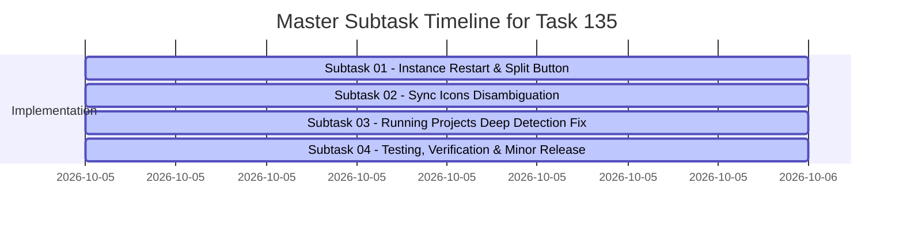

# Master Execution Plan: Instance Restart Split Button, Distinct Sync Icons & Running Projects Deep Detection Fix

- **Task Identifier**: `135-instance-restart-button-sync-icons-and-running-projects-fix`
- **Scope**: Multi-tier backend lifecycle, frontend UI segmented split capsules, semantic icon disambiguation, and deep running projects detection engine
- **Status**: Ready for Execution
- **Specification References**:
  - Architecture Spec: [`02-spec/21-app/135-instance-restart-button-sync-icons-and-running-projects-fix/01-architecture-spec.md`](file:///d:/work/Antigravity-Manager/02-spec/21-app/135-instance-restart-button-sync-icons-and-running-projects-fix/01-architecture-spec.md)
  - Component Spec: [`02-spec/21-app/135-instance-restart-button-sync-icons-and-running-projects-fix/02-component-spec.md`](file:///d:/work/Antigravity-Manager/02-spec/21-app/135-instance-restart-button-sync-icons-and-running-projects-fix/02-component-spec.md)
  - Root Cause Analysis: [`02-spec/21-app/135-instance-restart-button-sync-icons-and-running-projects-fix/03-root-cause-analysis.md`](file:///d:/work/Antigravity-Manager/02-spec/21-app/135-instance-restart-button-sync-icons-and-running-projects-fix/03-root-cause-analysis.md)

---

## 1. Executive Summary & User Requirements Verbatim

### User Prompt Verbatim:
> "In the instance section, there should be a button to restart. That means it's going to close and restart on the current account. The same thing should actually happen with the switch button. Oh, switch button is selecting. Okay, keep it as it is. But yeah, there should be one more button, or the current play and the stop button, try to have a split. When it started, try to have a split, and here have another button, restart. And there are a couple of sync buttons, sync icons, feels like restart. Try to have a different sync icon, I believe, that would be making more sense. And also be respectful and try to understand the running projects using the conversation and prompts. It is still buggy. You have to take into account, understand the problems, and then come to the solution. Is it clear?"

### Core Deliverables:
1. **Instance Restart on Current Account**:
   - Provide an atomic restart flow: stop instance, poll for process termination and lockfile clearance (<1,500ms), evict prompt tree cache, and relaunch the instance on its currently bound account.
2. **Segmented Split Capsule UI**:
   - In both Table view (`InstanceTable.tsx`) and Card view (`Instances.tsx`), render a contiguous segmented split capsule `[Stop (Square) | Restart (RotateCcw)]` when running, and standard `Play` when stopped.
   - Maintain the Account Switch button as an independent configuration action (`setSwitchTargetInstance`).
3. **Sync Icons Disambiguation**:
   - Reserve `RotateCcw` exclusively for Restart operations.
   - Reassign circular sync icons to distinct domain icons: `FolderSync` for "Sync All", `Sparkles` for "Eval Quota", `Cpu` for "Sync PID & Quota", `KeyRound` for "Wipe Credentials".
4. **Deep Running Projects & Prompts Detection**:
   - Fix process liveness gating (Gate 0: dead PID forces `is_running: false`).
   - Implement an adaptive 10-minute (600s) thinking window for reasoning models (o1/o3, Claude 3.7 Thinking, Gemini 2.5 Flash Thinking) instead of the premature 60s cutoff.
   - Implement a robust multi-format timestamp parser supporting ISO-8601 with fractional seconds.
   - Synchronize ghost 0-word untitled conversation filtering.
   - Enforce exact instance ID matching without suffix bleed.
   - Reset zombie `is_running = 1` database flags on startup.

---

## 2. Key Research Findings

### Research 01: Instance Process Lifecycle & Split Button Capsule
- **Backend Primitives**: `src-tauri/src/modules/instance.rs` contains `restart_instance(instance_id: &str)`. It gracefully terminates child processes, polls `find_pids_for_data_dir` for up to 1,500ms at 80ms intervals, flushes `prompt_tree_cache`, and calls `launch_instance(&resolved_id)`.
- **Tauri IPC & Service**: Exposes `commands::instance::restart_instance` registered in `src-tauri/src/lib.rs`, with frontend wrapper `restartInstance` in `src/services/instanceService.ts`.
- **UI Structure**:
  - `InstanceTable.tsx`: Renders action columns. When running, needs contiguous split pill capsule (`rounded-l-[5px]`, shared border, subtle divider `w-px h-3.5 bg-slate-300 dark:bg-slate-700/80`) hosting Stop (`Square`) and Restart (`RotateCcw`).
  - `Instances.tsx`: Renders card primary actions. Must render the split capsule in card view matching table view ergonomics.
  - `getActionLabel` in `Instances.tsx` must handle `'restart'` returning `'Restarting...'` instead of generic `'Processing...'`.
  - The switch button remains bound to `setSwitchTargetInstance` and renders `ArrowLeftRight`.

### Research 02: Sync Icons & Running Projects Detection Root Cause
- **Icon Collision Points**:
  - `Instances.tsx`: Toolbar "Sync All" uses `RotateCw`; "Eval Quota" uses `RotateCw`; card dropdown "Wipe Credentials" uses `RotateCcw`.
  - These circular arrows visually conflict with universal restart glyphs.
  - Solution: Reassign "Sync All" to `FolderSync`, "Eval Quota" to `Sparkles`, "Wipe Credentials" to `KeyRound`, "Sync PID & Quota" to `Cpu`.
- **Root Cause of Buggy Running Detection**:
  - **Dead Process False Positives**: SQLite `running_projects` stored `is_running = 1` even when the IDE crashed or was terminated externally.
  - **Rigid 60s TTL Premature Cutoff**: Gate 4 in `repo_db.rs` evaluated `now - conv_ts <= 60` or `now - conv_time <= 120`. When reasoning models generated thinking chains for 2-8 minutes without writing to SQLite, the project prematurely flipped to IDLE.
  - **Fractional Timestamp Parsing Failure**: `conversation_summaries.db` contains fractional seconds (`2026-10-05 06:49:18.492104` or `...123Z`). Naive string parsers failed, defaulting to 0 and dropping active status.
  - **Ghost Conversations**: Blank 0-word scratchpad sessions created upon IDE launch were counted as active.
  - **Loose Suffix Matching**: `instConfig.id.endsWith(node.instance_id)` in `Instances.tsx` caused cross-instance project bleed when instance IDs shared numeric endings.
  - **Zombie Database Flags**: Lingering `is_running = 1` rows persisted across restarts because `purge_corrupted_running_projects` only removed empty paths without resetting flags.

---

## 3. Phased Architecture & Execution Strategy

### Phase 1: Backend Lifecycle Verification & Robustness
- Audit and verify `restart_instance` in `src-tauri/src/modules/instance.rs`.
- Verify PID polling loop handles Windows, macOS, and Linux process teardown cleanly.
- Verify `prompt_tree_cache` invalidation clears serialized trees.
- Verify IPC command binding in `commands/instance.rs` and `lib.rs`.

### Phase 2: Frontend Segmented Split Button Capsule
- Implement the contiguous segmented split capsule `[Stop | Restart]` in `InstanceTable.tsx`.
- Implement the matching split capsule in `Instances.tsx` (card view).
- Ensure stopped instances render standalone `Play` button.
- Ensure `getActionLabel` maps `'restart'` to `'Restarting...'`.
- Preserve the independent Switch Account button (`ArrowLeftRight`).

### Phase 3: Semantic Sync Icons Disambiguation
- Audit all toolbar and dropdown action buttons across `Instances.tsx` and `InstanceTable.tsx`.
- Replace `RotateCw` on "Sync All" with `FolderSync`.
- Replace `RotateCw` on "Eval Quota" with `Sparkles`.
- Replace `RotateCcw` on "Wipe Credentials" with `KeyRound`.
- Confirm `Cpu` is used for "Sync PID & Quota".
- Reserve `RotateCcw` exclusively for Restart operations.

### Phase 4: Deep Running Projects Detection Engine
- **Gate 0 Verification**: Ensure `detect_running_projects` and `is_prompt_running_for_project` verify OS process liveness first. If dead, immediately report `is_running: false` and emit `INSTANCE_PROCESS_DEAD`.
- **Adaptive 10-Minute Thinking Window**: Update Gate 4 in `repo_db.rs` and `compute_project_conversation_tree` to use an adaptive 600s window for active reasoning sessions.
- **Robust Timestamp Parser**: Implement multi-format ISO-8601 parsing supporting fractional seconds and timezones.
- **Ghost Filter**: Ensure 0-word untitled conversations are discarded from running counters.
- **Strict Instance Scoping**: In `isNodeOwnedByInstance` (`Instances.tsx`), eliminate loose `endsWith` checks and enforce exact canonical ID matching.
- **Startup Purge**: In `purge_corrupted_running_projects`, execute `UPDATE running_projects SET is_running = 0` and clear `prompt_tree_cache`.

### Phase 5: Verification, Quality Gates & Zero-CI Standards
- Run targeted backend tests (`cargo test -p antigravity-manager --lib modules::repo_db`).
- Run code formatting check (`cargo fmt -- --check`).
- Run Clippy lint gate (`cargo clippy --all-targets --all-features`).
- Run frontend type check and build (`npm run build`).
- Verify Zero-CI quarantine standards.

---

## 4. Master Subtask Decomposition

### Subtask Directory:
1. **Subtask 01**: [`01-instance-restart-and-split-button.md`](file:///d:/work/Antigravity-Manager/.ai-memory/plans/subtasks/135-instance-restart-button-sync-icons-and-running-projects-fix/01-instance-restart-and-split-button.md)
   - Scope: Backend `restart_instance` validation, frontend split button capsule `[Stop | Restart]` in Table and Card modes, action label mapping (`'restarting...'`), switch button selection preservation.
2. **Subtask 02**: [`02-sync-icons-disambiguation.md`](file:///d:/work/Antigravity-Manager/.ai-memory/plans/subtasks/135-instance-restart-button-sync-icons-and-running-projects-fix/02-sync-icons-disambiguation.md)
   - Scope: Replace confusing circular arrows with distinct semantic icons (`FolderSync`, `Sparkles`, `ArrowLeftRight`, `KeyRound`, `Cpu`), reserving `RotateCcw` strictly for restart.
3. **Subtask 03**: `03-running-projects-deep-detection-fix.md`
   - Scope: Multi-tier detection engine refactoring in `repo_db.rs`, Gate 0 process liveness, adaptive 10-minute thinking window, robust ISO-8601 fractional timestamp parsing, ghost 0-word filter synchronization, exact instance scoping in `isNodeOwnedByInstance`, and startup zombie purge.
4. **Subtask 04**: `04-testing-verification-and-release.md`
   - Scope: Pre-flight checks (`cargo fmt`, `cargo clippy`, `npm run build`), end-to-end verification across verification gates VG-01 to VG-07, atomic version bump, changelog attribution to `@aukgit`, tag, and CI monitoring.

---

## 5. Risk Assessment & Safety Invariants

| Risk | Impact | Mitigation Strategy |
|---|---|---|
| Port/Socket collision during quick restart | Instance fails to launch | Polling loop waits up to 1,500ms for process termination and socket release before calling `launch_instance`. |
| Unintended account switch during restart | Account mismatch | `restart_instance` retains instance data directory and bound profile without touching credentials. |
| Thinking models falsely marked idle | UI shows stopped during active AI generation | 10-minute (600s) adaptive window prevents premature cutoffs for reasoning models like o1, o3, Claude 3.7, Gemini 2.5. |
| Stale projects reported running after crash | Operator confusion | Gate 0 checks OS process table via `sysinfo`; dead process immediately forces `is_running = false`. |
| Project node bleeding into multiple cards | False workspace attribution | Exact canonical matching in `isNodeOwnedByInstance`; unassigned nodes never default to named instances. |
