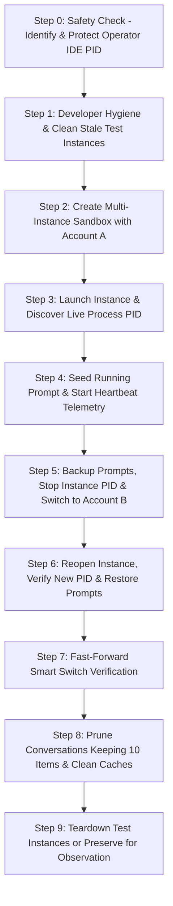

# AI Instruction: Antigravity Multi-Instance CLI Operations, Account Switching, Prompt Continuity & Hygiene Manual

> **Prompt Metadata:**
> - Version: 2.0.0
> - Target Environment: Windows PowerShell / Bash / Headless CLI
> - Target Binary: `agm` / `antigravity-manager` / `adm` / `.\run.ps1`
> - Execution Directive: **Use existing CLI commands and scripts. Do NOT write new code to implement test runners.**

---

## 🎯 High-Level Objective

You are an Autonomous AI Operator executing the end-to-end multi-instance lifecycle, account switching, prompt backup/restoration, conversation retention pruning, and developer tool cleanup for Antigravity-Manager (AGM).

Your task is to operate strictly via the **CLI command suite and utility scripts**. You must never touch or close the operator's primary running IDE instance, verify all operations through PID and folder path inspection, query SQLite `state.vscdb` credentials, and ensure zero cross-contamination.

---

## ⛔ Strict Constraints & Anti-Hallucination Invariants

1. **NO NEW CODE IMPLEMENTATION**: Do NOT write new application code or test runner implementations. Execute the workflow using the provided native CLI commands, helper scripts, and PowerShell one-liners.
2. **SAFETY INVARIANT — PROTECT CURRENT RUNNING IDE**:
   - Before executing any instance stop or switch, discover the operator's current running Antigravity IDE PID:
     ```powershell
     $defaultDataDir = "$env:APPDATA\Antigravity"
     $protectedPids = (Get-CimInstance Win32_Process | Where-Object { 
         $_.Name -match 'Antigravity' -and ($_.CommandLine -match [regex]::Escape($defaultDataDir) -or $_.CommandLine -notmatch '--user-data-dir')
     }).ProcessId
     ```
   - **NEVER** kill or terminate any process ID in `$protectedPids`.
3. **EVIDENCE-BASED VERIFICATION**: Every claim of instance creation, switch, or cleanup must be verified by CLI JSON output, SQLite query, or process PID discovery.
4. **NO PROMPT LOSS**: Before closing an instance IDE window, running and queued prompts must be snapshotted (`backup-running-prompts`). Upon relaunch, prompt continuity must be verified.
5. **RETENTION RESPECT**: Conversation pruning must default to keeping the latest 10 conversations (`--keep 10` or `k 10`), and **MUST NEVER** purge active running or queued prompts from active projects.

---

## 📖 Master CLI Command Reference Catalog

### 1. Multi-Instance Lifecycle Management

Command suite: `instances`, `instance`, `profile`, `ls`

#### A. List Registered Profiles
- **Command:** `agm instances list` (Aliases: `agm instances ls`, `agm ls`, `agm profile list`)
- **JSON Flag:** `agm instances list --json`
- **Output Fields:** `#` (sequence), `ID`, `NAME`, `STATUS` (`Running (PID: N)` or `Idle`), `BOUND EMAIL`, `DATA DIR`
- **Examples:**
  ```powershell
  # List all profiles in human-readable table
  agm instances list

  # List profiles as JSON for machine parsing
  agm instances list --json
  ```

#### B. Create Isolated Sandbox Instance
- **Command:** `agm instance create <name> [options]`
- **Aliases:** `agm instances create`, `agm create`, `agm cp`
- **Parameters & Options:**
  - `<name>`: Friendly name or identifier for the instance (e.g. `"Worker-Alpha"`).
  - `--account, -a <email|id>`: Bind specific account (email or account ID). If omitted, binds to the next available unbound account.
  - `--from, -f <source_id>`: Clone configuration, settings, and extensions from an existing instance profile (e.g. `default` or `#1`).
  - `--launch, -l`: Immediately launch the Antigravity IDE window after creation.
  - `--data-only, --do`: Create isolated data directory only without cloning the IDE executable binary.
  - `--json, -j`: Return created instance configuration in structured JSON.
- **Examples:**
  ```powershell
  # Create an instance bound to a specific email and launch immediately
  agm instance create "Worker-Alpha" -a "alex.dev@gmail.com" --launch

  # Create an instance cloning settings from default
  agm instance create "Worker-Beta" --from "default" -a "erfan.office@gmail.com"

  # Create a lightweight data-only instance
  agm instance create "Sandbox-01" --data-only --json
  ```

#### C. Launch Instance IDE Window
- **Command:** `agm instance launch <instance_id>`
- **Aliases:** `agm instance start`, `agm instance run`
- **Parameters:**
  - `<instance_id>`: Profile ID, name, or sequence index (`#1`, `#2`).
- **Examples:**
  ```powershell
  agm instance launch "Worker-Alpha"
  agm instance launch #2
  ```

#### D. Stop / Close Instance IDE Process
- **Command:** `agm instance stop <instance_id>`
- **Aliases:** `agm instance close`, `agm instance kill`
- **Parameters:**
  - `<instance_id>`: Profile ID, name, or sequence index (`#1`, `#2`).
  - *Safety:* Gracefully stops the Antigravity process specifically associated with the instance's unique `--user-data-dir`. Does NOT terminate the primary IDE.
- **Examples:**
  ```powershell
  agm instance stop "Worker-Alpha"
  agm instance stop #2
  ```

#### E. Delete Instance & Storage Teardown
- **Command:** `agm instance delete <instance_id> [--force]`
- **Aliases:** `agm instances rm`, `agm instance remove`
- **Parameters:**
  - `<instance_id>`: Profile ID, name, or sequence index (`#1`, `#2`).
  - `--force, -f`: Bypass confirmation prompts and forcefully wipe directories.
- **Examples:**
  ```powershell
  agm instance delete "Worker-Alpha" --force
  agm instances rm #2
  ```

#### F. Remove All Sandbox Test Instances
- **Command:** `agm instances rm-all [--force]`
- **Description:** Safely terminates and cleans up all non-default test sandbox instances while preserving the default instance.
- **Example:**
  ```powershell
  agm instances rm-all --force
  ```

#### G. Copy / Clone Instance Profile
- **Command:** `agm instance copy <source_id> <new_name>`
- **Aliases:** `agm instance clone`, `agm copy-profile`
- **Examples:**
  ```powershell
  agm instance copy "default" "Worker-Backup"
  ```

#### H. Assign Project Workspace to Instance
- **Command:** `agm instances assign <instance_id> <repo_paths...>`
- **Aliases:** `agm instances bind`
- **Examples:**
  ```powershell
  agm instances assign "Worker-Alpha" "D:/work/gitmap"
  ```

#### I. Observe Real Live PIDs & Directory Mapping
- **Command:** `agm instances observe <instance_id> [--json]`
- **Description:** Queries OS process table and returns verified active process IDs (`pids: [...]`), folder paths, and command lines.
- **Examples:**
  ```powershell
  agm instances observe "Worker-Alpha" --json
  ```

#### J. Built-in End-to-End Instance Verification Engine
- **Command:** `agm test-instance-flow [--json]`
- **Aliases:** `agm tif`, `agm test-instance`, `agm instance-flow`
- **Description:** Fully automated autonomous test workflow that clones an isolated instance from default, sets up running/queued prompts, launches IDE, verifies PID, backs up prompts, switches account, re-launches with new PID, restores prompts, verifies state, and cleans up.
- **Examples:**
  ```powershell
  agm test-instance-flow
  agm test-instance-flow --json
  ```

---

### 2. Account Switching & Fast-Forward Rotation

Command suite: `switch`, `switch-account`, `fast-forward`, `ff`

#### A. Manual Account Switching
- **Syntax Variations:**
  1. `agm switch <account> --instance <id>`
  2. `agm switch <instance> <account>`
  3. `agm instance switch <instance> <account>`
  4. `agm switch account <account>` (switches active profile)
  5. `agm switch <#seq>` (switches active profile to account index #seq)
- **Parameters & Options:**
  - `<account>`: Full email (`user@gmail.com`), email prefix (`user`), internal ID, or index (`#1`, `#2`).
  - `<instance>`: Target instance ID, name, or sequence index (`#1`, `#2`, or `default`).
  - `--instance, -i <id>`: Explicit target instance specifier.
  - `--json, -j`: Structured JSON response.
- **Execution Mechanism:**
  - Snapshots running prompts.
  - Gracefully stops target instance process.
  - Injects new credentials across all three `state.vscdb` paths (User storage, instance AppData, and home AppData) and `app_storage.json`.
  - Re-launches IDE window and restores prompts.
- **Examples:**
  ```powershell
  # Switch a specific instance to an account by email
  agm switch "alex.dev@gmail.com" --instance "Worker-Alpha"

  # Switch using positional arguments with JSON output
  agm switch "Worker-Alpha" "alex.dev@gmail.com" --json

  # Switch instance using sequence numbers
  agm instance switch #2 "shohagbazar004@gmail.com"

  # Switch active profile to account #3
  agm switch #3
  ```

#### B. Fast-Forward Smart Account Rotation
- **Command:** `agm ff [instance_id] [--json]`
- **Aliases:** `agm fast-forward`, `agm instance ff`, `agm instance rotate`
- **Description:** Automatically evaluates rolling 4-hour quota windows across registered accounts, selects the freshest account (highest remaining quota, longest refill runway), and rotates the target instance.
- **Examples:**
  ```powershell
  # Fast-forward rotate specific instance to healthiest account
  agm ff "Worker-Alpha" --json

  # Fast-forward rotate instance #2
  agm ff #2

  # Fast-forward active profile
  agm ff
  ```

#### C. Rotate All Running Instances
- **Command:** `agm instances all ff`
- **Description:** Fast-forwards quota-optimal accounts for every currently active running instance concurrently.
- **Example:**
  ```powershell
  agm instances all ff
  ```

#### D. Conditional Switching on Low Credits
- **Command:** `agm switch-if-low-credit [options]` (Aliases: `agm swlc`, `agm sfc`)
- **Query Low Credit State:** `agm is-low-credit-for-switch` (Alias: `agm ilc`)
- **Example:**
  ```powershell
  agm switch-if-low-credit --instance "Worker-Alpha"
  ```

---

### 3. Running Prompt Backup, Continuous Heartbeat & Restoration

Command suite: `backup-running-prompts`, `restore-running-prompts`, `resend-running-commands`, `which-prompts-running`, `query`

#### A. Prompt Backup CLI
- **Command:** `agm backup-running-prompts [--instance <instance_id>]`
- **Aliases:** `agm brp`, `agm backup-prompts`, `agm backup`
- **Description:** Takes an immediate snapshot of active and queued prompts in the instance workspace, writing metadata to SQLite and `.antigravity_resume_task.json`.
- **Examples:**
  ```powershell
  agm backup-running-prompts --instance "Worker-Alpha"
  agm backup-running-prompts
  ```

#### B. Prompt Restore CLI
- **Command:** `agm restore-running-prompts [--instance <instance_id>]`
- **Aliases:** `agm rrp`, `agm restore-prompts`, `agm restore`
- **Description:** Restores backed up prompts back into the active prompt queue.
- **Example:**
  ```powershell
  agm restore-running-prompts --instance "Worker-Alpha"
  ```

#### C. Resend Running Commands CLI
- **Command:** `agm resend-running-commands [--instance <instance_id>]`
- **Aliases:** `agm rrc`, `agm resend-running`, `agm resend`
- **Description:** Resends interrupted in-flight prompts to the target instance project workspace so tasks resume uninterrupted.
- **Example:**
  ```powershell
  agm resend-running-commands --instance "Worker-Alpha"
  ```

#### D. Query Prompts & Inspect Live State
- **Commands:**
  - `agm which-prompts-running` (Alias: `agm wpr`) — Shows exactly which prompts are active across instances.
  - `agm running-prompts` — Detailed list of active in-flight prompts.
  - `agm running-projects` — Lists all projects with active workers.
  - `agm query <search_term>` (Aliases: `agm search`, `agm find`) — Search cached SQLite prompts displaying >= 200 word previews.
  - `agm tree` — Hierarchy tree displaying instances, bound accounts, and queued prompts.
- **Examples:**
  ```powershell
  agm which-prompts-running
  agm running-prompts
  agm query "test inventory"
  agm tree
  ```

#### E. Continuous Prompt Heartbeat Telemetry Utility
- **Script Path:** `scripts/prompt_heartbeat_runner.py`
- **Actions:**
  - **Start:** `python scripts/prompt_heartbeat_runner.py start "<prompt_id>" "<instance_id>" "<log_path>" <interval_seconds>`
  - **Check Status:** `python scripts/prompt_heartbeat_runner.py check "<log_path>"`
  - **Stop:** `python scripts/prompt_heartbeat_runner.py stop "<log_path>"`
- **Examples:**
  ```powershell
  # Start a 5-second interval heartbeat runner
  python scripts/prompt_heartbeat_runner.py start "prompt-101" "Worker-Alpha" "D:/work/project/.antigravity_goal_prompt.log" 5

  # Check telemetry (returns: RUNNING=True, Iteration: N)
  python scripts/prompt_heartbeat_runner.py check "D:/work/project/.antigravity_goal_prompt.log"

  # Stop runner
  python scripts/prompt_heartbeat_runner.py stop "D:/work/project/.antigravity_goal_prompt.log"
  ```

#### F. SQLite Active Prompt Seeding & Inspection
- **Script Path:** `scripts/test_prompt_helper.py`
- **Actions:**
  - **Seed Prompt:** `python scripts/test_prompt_helper.py seed "<prompt_id>" "<instance_id>" "<workspace_dir>" "<prompt_text>"`
  - **Verify Status:** `python scripts/test_prompt_helper.py check "<prompt_id>"`
- **Examples:**
  ```powershell
  # Seed a prompt into SQLite active_prompts table
  python scripts/test_prompt_helper.py seed "prompt-101" "Worker-Alpha" "D:/work/project" "Run e2e verification"

  # Query status (returns: dispatched / backed_up / completed)
  python scripts/test_prompt_helper.py check "prompt-101"
  ```

---

### 4. Conversation Pruning & Cache Hygiene Suite

Command suite: `agy`, `cache-clear`, `clear`, `adm clear`

#### A. Prune Stale Conversations with Custom Retention
- **Command:** `agm agy cache-clear [options]`
- **Aliases:** `adm clear k <N>`, `agm cache-clear -k <N> -y`, `agm agy clear`, `agm prune`
- **Parameters & Options:**
  - `--keep <N>, -k <N>`: Number of latest conversations to retain intact (default: 10).
  - `-y, --yes`: Non-interactive bypass for headless execution.
  - `--preflight, --pre`: Dry-run preview showing projected disk space freed without touching files.
- **Shortcuts:**
  - `agm agy cache-clear-keep-one` (Alias: `agm agy ccko`) — keeps only the 1 latest conversation.
  - `agm agy cache-clear-keep-five` (Alias: `agm agy cckf`) — keeps only the 5 latest conversations.
- **Safety Policy:**
  - Pruned conversations are safely staged in OS temporary storage with an atomic transaction ID.
  - Running and queued prompts from active projects are strictly protected and never purged.
- **Examples:**
  ```powershell
  # Prune keeping default 10 conversations (non-interactive)
  agm agy cache-clear --keep 10 -y

  # Prune keeping 5 conversations
  agm agy cache-clear -k 5 -y

  # Shorthand alias via adm
  adm clear k 5

  # Run pre-flight dry-run check
  agm agy cache-clear --preflight
  ```

#### B. Revert / Undo Pruning Transaction
- **Command:** `agm agy undo [tx_id]`
- **Description:** Reverses the last (or specified) pruning transaction and restores conversations from staging storage.
- **Example:**
  ```powershell
  agm agy undo
  ```

---

### 5. Developer Hygiene & Build Clearing Suite

Script paths: `scripts/dev-tool-clear.ps1` & `03-ai-scripts/19-artifact-remover.py`

#### A. Full Cross-Platform Clean
- **Command:** `powershell -ExecutionPolicy Bypass -File scripts/dev-tool-clear.ps1 [options]`
- **What It Cleans:**
  1. Cargo and Rust build caches, incremental artifacts, target/demo directories (`build-demo`, `target-demo`, `src-tauri/target`).
  2. Temporary test files, OS temp artifacts, pycache (`__pycache__`, `*.pyc`).
  3. Prunes conversations across all candidate directories keeping top 10 (or user-specified `k <N>`).
- **Parameters & Options:**
  - `-CargoOnly`: Cleans only Cargo, Rust compiler caches, and build-demo folders.
  - `-CleanInstances`: Cleans registered test instances.
  - `-InstancesOnly`: Cleans instances only.
  - `-Arg1 k -Arg2 <N>` or `<N>`: Specify number of conversations to keep.
- **Examples:**
  ```powershell
  # Run full developer cleanup (Cargo + temp + pycache + prune 10 conversations)
  powershell -ExecutionPolicy Bypass -File scripts/dev-tool-clear.ps1

  # Clean Cargo / Rust compiler caches only
  powershell -ExecutionPolicy Bypass -File scripts/dev-tool-clear.ps1 -CargoOnly

  # Clean with custom retention of 5 conversations
  powershell -ExecutionPolicy Bypass -File scripts/dev-tool-clear.ps1 -Arg1 k -Arg2 5

  # Clean including test instances
  powershell -ExecutionPolicy Bypass -File scripts/dev-tool-clear.ps1 -CleanInstances
  ```

#### B. Direct Cargo & Cache Cleanup via AGM Native CLI
- **Commands:**
  - `agm clean` / `agm purge` — Clean temporary caches and logs.
  - `agm clear-cache` / `agm pr` — Clean cache.
  - `agm clear-terminal` — Reset terminal artifacts.
- **Examples:**
  ```powershell
  agm clean
  agm clear cache
  agm clear terminal
  ```

#### C. Python Direct Artifact Remover
- **Command:** `python 03-ai-scripts/19-artifact-remover.py --clean-cargo --clean-temp --clean-pycache --force`
- **Examples:**
  ```powershell
  python 03-ai-scripts/19-artifact-remover.py --clean-cargo --force
  python 03-ai-scripts/19-artifact-remover.py --clean-temp --clean-pycache --force
  ```

---

### 6. Auto-Profile Switcher Daemon Suite

Command suite: `auto-switch`, `auto`, `switcher`

#### A. Query Daemon Status
- **Command:** `agm auto-switch status [--json]`
- **Examples:**
  ```powershell
  agm auto-switch status
  agm auto-switch status --json
  ```

#### B. Enable, Disable, and Toggle Daemon
- **Commands:**
  - Enable: `agm auto-switch enable` (Aliases: `on`, `start`)
  - Disable: `agm auto-switch disable` (Aliases: `off`, `stop`)
  - Toggle: `agm auto-switch toggle`
- **Examples:**
  ```powershell
  agm auto-switch enable
  agm auto-switch disable
  agm auto-switch toggle
  ```

#### C. Configure Threshold, Interval, and Target Model
- **Threshold (percentage):** `agm auto-switch threshold <number>` (e.g. 20)
- **Polling Interval (seconds):** `agm auto-switch interval <seconds>` (e.g. 60)
- **Target Model:** `agm auto-switch model <model_name>` (e.g. gemini-2.5-pro)
- **Examples:**
  ```powershell
  agm auto-switch threshold 15
  agm auto-switch interval 300
  agm auto-switch model gemini-2.5-pro
  ```

#### D. Immediate Quota Check & Simulation
- **Trigger Immediate Evaluation:** `agm auto-switch run` (Aliases: `trigger`, `eval`, `rotate`)
- **Simulate Rotation:** `agm auto-switch test <percentage>`
- **Examples:**
  ```powershell
  agm auto-switch run
  agm auto-switch test 90
  ```

---

### 7. SSH Multi-Node & Cluster Remote Execution Suite

Command suite: `ssh`, `nodes`, `se`, `sj`

#### A. List Remote Cluster Nodes
- **Command:** `agm nodes` (Alias: `agm ssh nodes`)
- **Description:** Lists registered SSH worker nodes, machine IPs, status, and assigned tasks.
- **Example:**
  ```powershell
  agm nodes
  ```

#### B. Execute Remote Command via Git SSH
- **Command:** `agm se <node_name_or_ip> "<command>"`
- **Aliases:** `agm ssh exec <node> "<command>"`
- **Description:** Dispatches a remote command over SSH to the specified cluster node.
- **Examples:**
  ```powershell
  agm se worker-node-01 "git status"
  agm ssh exec 192.168.1.50 "gitmap sync"
  ```

---

### 8. Supabase Integration CLI Suite

Command suite: `supabase`, `supa`

#### A. PowerShell Setup & Sync One-Liners
- **Setup Script:** `powershell -ExecutionPolicy Bypass -File scripts/setup-supabase.ps1`
- **Alternate Script:** `powershell -ExecutionPolicy Bypass -File scripts/supabase-setup.ps1`
- **One-Liner Execution with Inline Credential Test:**
  ```powershell
  powershell -ExecutionPolicy Bypass -Command "& { . ./scripts/setup-supabase.ps1; Test-SupabaseConnection }"
  ```
- **CLI Sync Status:**
  ```powershell
  agm supabase
  agm supa status
  ```

---

### 9. Telegram Bot Daemon & Commands

Command suite: `telegram`

#### A. Bot Daemon Scripts
- **Start Telegram Daemon:** `powershell -ExecutionPolicy Bypass -File scripts/telegram-agent-daemon.ps1`
- **Setup Bot Credentials:** `powershell -ExecutionPolicy Bypass -File scripts/setup-telegram-bot.ps1`
- **CLI Verification:** `agm telegram status`

#### B. Telegram Remote Bot Commands
- `/status` — View running instances, bound accounts, and live quota telemetry.
- `/switch <instance> <email>` — Trigger account switch for an instance remotely.
- `/prune [k]` — Trigger conversation pruning keeping `k` items.
- `/update` — Run AGM update and refresh status.
- `/nodes` — View remote SSH nodes.

---

### 10. Verification, Process & Database Inspection Commands

#### A. Query Account Email Directly from SQLite `state.vscdb`
- **Command:** `python scripts/query_vscdb_email.py "<path_to_state.vscdb>"`
- **Target Paths inside Instance Directory:**
  1. `<instance_dir>\User\globalStorage\state.vscdb`
  2. `<instance_dir>\AppData\Roaming\Antigravity\User\globalStorage\state.vscdb`
  3. `<instance_parent>\home\AppData\Roaming\Antigravity\User\globalStorage\state.vscdb`
- **Example:**
  ```powershell
  python scripts/query_vscdb_email.py "D:/instances/Worker-Alpha/User/globalStorage/state.vscdb"
  ```

#### B. Query Verified Live PID and Command Line
- **Command:**
  ```powershell
  Get-CimInstance Win32_Process | Where-Object { $_.ProcessId -eq <PID> } | Select-Object ProcessId, Name, CommandLine
  ```

#### C. Generate Verification Screenshot with Date/Time & PID
- **Command:**
  ```powershell
  python assets/screenshots/generate_instance_screenshot.py `
      --email "<email>" `
      --username "<display_name>" `
      --instance "<instance_id>" `
      --pid "<real_pid>" `
      --folder "<instance_dir>" `
      --stage "<stage_name>" `
      --datetime "$([DateTimeOffset]::UtcNow.ToString('yyyy-MM-dd HH:mm:ss UTC'))" `
      --out "assets/screenshots/<filename>.png"
  ```

---

### 11. Pre-Flight, Version Bump & Release Gates

#### A. Rust Pre-Flight Checks
```powershell
cd src-tauri
cargo fmt -- --check
cargo clippy --all-targets --all-features
cd ..
```

#### B. Frontend Build Check
```powershell
npm run build
```

#### C. Atomic Version Bump (When Release Commanded)
```powershell
# Bump minor release
npm run bump minor

# Bump preview / beta release
npm run bump beta
```

#### D. Atomic Git Commit & Push
```powershell
git add -A
git commit -m "chore(release): bump version"
git push origin <branch>
```

---

## 🚀 End-to-End Operational Workflow (Execution Steps)

Follow these exact steps when performing an end-to-end verification run:



### Step 0: Identify Protected Process IDs
```powershell
$defaultDataDir = "$env:APPDATA\Antigravity"
$mainProcs = Get-CimInstance Win32_Process -ErrorAction SilentlyContinue | Where-Object { 
    $_.Name -match 'Antigravity' -and ($_.CommandLine -match [regex]::Escape($defaultDataDir) -or $_.CommandLine -notmatch '--user-data-dir')
}
$protectedPids = @($mainProcs.ProcessId) | Where-Object { $_ } | Select-Object -Unique
Write-Host "Protected Operator IDE PIDs: $($protectedPids -join ', ')"
```

### Step 1: Pre-Test Hygiene & Developer Tool Cleaning
```powershell
# Clean build caches, temp files, and ensure 10 conversations kept
powershell -ExecutionPolicy Bypass -File scripts/dev-tool-clear.ps1 -Arg1 k -Arg2 10

# Remove any stale test instances
$list = (agm instances list --json | ConvertFrom-Json)
foreach ($inst in ($list | Where-Object { $_.config.id -like "test-*" })) {
    agm instances rm $inst.config.id --force
}
```

### Step 2: Create Isolated Instance Cloned from Default
```powershell
# Instance Alpha with Account A
$instA = (agm instance create "test-worker-alpha" --from "default" -a "account_a@gmail.com" --json | ConvertFrom-Json)

# Verify database isolation in new instance
python scripts/query_vscdb_email.py "$($instA.data_dir)/User/globalStorage/state.vscdb"
```

### Step 3: Launch Instance A & Verify PID
```powershell
agm instance launch $instA.id
Start-Sleep -Seconds 3

# Discover PID via AGM CLI observe
$obs = (agm instances observe $instA.id --json | ConvertFrom-Json)
$realPid = $obs.pids[0]

# Ensure it is NOT a protected PID
if ($protectedPids -contains $realPid) { throw "SAFETY ERROR: Touched operator IDE!" }
Write-Host "Verified Live PID for Instance A: $realPid"
```

### Step 4: Seed Running Prompt & Start Heartbeat
```powershell
$promptId = "test-prompt-$((Get-Date).Ticks)"
$wsDir = "D:/work/Antigravity-Manager/build-demo/test-ws"
New-Item -ItemType Directory -Path $wsDir -Force | Out-Null

python scripts/test_prompt_helper.py seed $promptId $instA.id $wsDir "Verify E2E continuous switch"
python scripts/prompt_heartbeat_runner.py start $promptId $instA.id "$wsDir/.antigravity_goal_prompt.log" 5
```

### Step 5: Backup Prompts, Close Instance & Switch Account
```powershell
# Backup running prompts before stopping
agm backup-running-prompts --instance $instA.id

# Stop prompt heartbeat and stop instance IDE
python scripts/prompt_heartbeat_runner.py stop "$wsDir/.antigravity_goal_prompt.log"
agm instance stop $instA.id

# Switch credentials to Account Switch
agm switch $instA.id "account_switch@gmail.com" --json

# Verify database updated
python scripts/query_vscdb_email.py "$($instA.data_dir)/User/globalStorage/state.vscdb"
```

### Step 6: Relaunch, Verify New PID & Restore Prompt
```powershell
agm instance launch $instA.id
Start-Sleep -Seconds 3

$obsNew = (agm instances observe $instA.id --json | ConvertFrom-Json)
$newPid = $obsNew.pids[0]
Write-Host "New Post-Switch PID: $newPid"

# Check prompt status in SQLite and resume telemetry
agm which-prompts-running
python scripts/test_prompt_helper.py check $promptId
python scripts/prompt_heartbeat_runner.py start $promptId $instA.id "$wsDir/.antigravity_goal_prompt.log" 5
```

### Step 7: Fast-Forward Smart Switch
```powershell
# Trigger fast-forward rotation to next healthiest account
agm ff $instA.id --json

# Verify new account email is active in state.vscdb
python scripts/query_vscdb_email.py "$($instA.data_dir)/User/globalStorage/state.vscdb"
```

### Step 8: Clean Cache & Prune Conversations (Keeping 10)
```powershell
# Prune conversations keeping top 10 intact
agm agy cache-clear --keep 10 -y

# Clean Cargo, Rust, and build demo caches
powershell -ExecutionPolicy Bypass -File scripts/dev-tool-clear.ps1 -CargoOnly
```

### Step 9: Teardown or Preserve Instance
```powershell
# If cleaning up:
agm instance stop $instA.id
agm instance delete $instA.id --force

# If preserving for operator inspection:
Write-Host "Instance $($instA.id) preserved alive at PID $newPid in $($instA.data_dir)."
```

---

## 📊 Summary Reference Card

| Operational Area | Primary Command | Key Flags / Parameters | Default Behavior |
| :--- | :--- | :--- | :--- |
| **List Profiles** | `agm instances list` | `--json, -j` | Displays sequence, ID, name, status, PID, email, directory |
| **Create Profile** | `agm instance create <name>` | `-a <email>`, `--from <src>`, `--launch`, `--data-only`, `--json` | Creates isolated sandbox folder & config |
| **Launch Profile** | `agm instance launch <id>` | `<id>`, `#seq`, `<name>` | Spawns Antigravity IDE with isolated `--user-data-dir` |
| **Stop Profile** | `agm instance stop <id>` | `<id>`, `#seq`, `<name>` | Safely terminates specific instance PID only |
| **Delete Profile** | `agm instance delete <id>` | `--force, -f` | Deletes directory and removes profile registry entry |
| **Remove All Sandboxes** | `agm instances rm-all` | `--force, -f` | Removes all non-default sandbox instances |
| **Switch Account** | `agm switch <id> <email>` | `--instance <id>`, `--json` | Injects credentials to `state.vscdb`, backs up prompts |
| **Fast-Forward** | `agm ff [id]` | `[id]`, `--json` | Rotates profile to freshest rolling quota account |
| **Rotate All Profiles** | `agm instances all ff` | N/A | Fast-forwards accounts for all running instances |
| **Backup Prompts** | `agm backup-running-prompts` | `--instance <id>` | Snapshots running & queued prompts to resume file |
| **Restore Prompts** | `agm restore-running-prompts`| `--instance <id>` | Restores backed up prompts back to active queue |
| **Resend Commands** | `agm resend-running-commands`| `--instance <id>` | Re-pushes in-flight commands to project workspaces |
| **Query Prompts** | `agm which-prompts-running` | N/A | Displays active prompts and project telemetry |
| **Prune History** | `agm agy cache-clear` | `--keep <N>, -k <N>`, `-y`, `--preflight` | Prunes old conversations (keeps 10), protects active |
| **Undo Prune** | `agm agy undo` | `[tx_id]` | Reverts pruning from temporary staging storage |
| **Clean Dev Tools** | `scripts/dev-tool-clear.ps1` | `-CargoOnly`, `-CleanInstances`, `k <N>` | Purges Cargo caches, temp files, demo build folders |
| **Auto-Switch** | `agm auto-switch <action>` | `status`, `enable`, `disable`, `threshold`, `interval`, `run` | Background quota monitor & automatic profile switcher |
| **SSH Cluster** | `agm nodes` / `agm se <node>`| `<node> "<command>"` | List nodes and execute commands via Git SSH |
| **Supabase Setup** | `scripts/setup-supabase.ps1` | One-liner PowerShell | Verifies & provisions Supabase backend connection |
| **Telegram Daemon**| `scripts/telegram-agent-daemon.ps1` | Background daemon | Remote control via Telegram (`/status`, `/switch`, `/prune`) |
| **E2E Flow Engine** | `agm test-instance-flow` | `--json` | Autonomous end-to-end verification engine |
