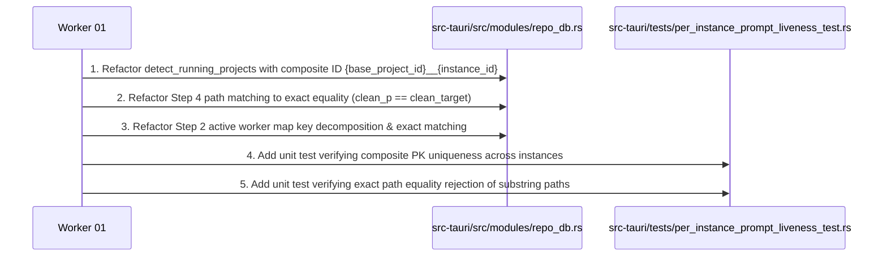

# Subtask 01 — Core Detection, Composite PK Isolation & Strict Path Matching Specification & Plan

## 1. Executive Summary & Objective

This subtask provides the concrete implementation plan for resolving the core database primary key collision and path matching defects that cause cross-instance prompt liveness state bleeding between the `default` profile and cloned secondary profiles (such as `default-copy-8159` / `8159`).

### Key Goals:
1. **Composite Primary Key Architecture in `running_projects`**:
   Replace `{repo_name}-{workspace_hash}` with `{base_project_id}__{instance_id}` in `src-tauri/src/modules/repo_db.rs`.
2. **Strict Normalized Path Equality**:
   Eliminate bidirectional `.contains()` substring checks in Step 4 of `is_prompt_running_for_project`. Enforce strict normalized path equality: `clean_p == clean_target`.
3. **Worker Key Normalization**:
   Split active worker map keys into `(worker_inst, worker_path)` and enforce strict normalized path matching.

---

## 2. Technical Analysis & Concrete Code Changes

### 2.1 Composite Primary Key in `running_projects` Table

#### File: `src-tauri/src/modules/repo_db.rs`
#### Location: `detect_running_projects(instance_id: &str)` (around lines 515–586)

**Previous Flawed Logic**:
```rust
let project_id = format!(
    "{}-{}",
    repo_name.to_lowercase(),
    entry.file_name().to_string_lossy()
);
```
Because cloned profiles share identical workspace folder hashes, scanning `default-copy-8159` overwrote `instance_id` and `is_running` of the `default` instance's row in SQLite.

**Enforced Refactoring**:
```rust
let base_project_id = format!(
    "{}-{}",
    repo_name.to_lowercase(),
    entry.file_name().to_string_lossy()
);
let composite_id = format!("{}__{}", base_project_id, target_id);

projects.push(RunningProject {
    id: composite_id,
    instance_id: target_id.to_string(),
    repo_name,
    repo_path: raw_path,
    workspace_storage_path: Some(ws_folder.to_string_lossy().to_string()),
    is_running: is_project_active,
    last_detected_at: now,
});
```

When writing to SQLite:
```rust
conn.execute(
    "INSERT INTO running_projects 
     (id, instance_id, repo_name, repo_path, workspace_storage_path, is_running, last_detected_at, updated_at)
     VALUES (?1, ?2, ?3, ?4, ?5, ?6, ?7, ?8)
     ON CONFLICT(id) DO UPDATE SET
        instance_id = excluded.instance_id,
        repo_name = excluded.repo_name,
        repo_path = excluded.repo_path,
        workspace_storage_path = excluded.workspace_storage_path,
        is_running = excluded.is_running,
        last_detected_at = excluded.last_detected_at,
        updated_at = excluded.updated_at",
    params![
        &p.id,
        &p.instance_id,
        &p.repo_name,
        &p.repo_path,
        &p.workspace_storage_path,
        running_int,
        p.last_detected_at,
        now,
    ],
)?;
```

### 2.2 Strict Path Equality in `is_prompt_running_for_project` (Step 4)

#### File: `src-tauri/src/modules/repo_db.rs`
#### Location: `is_prompt_running_for_project(project_id: &str, instance_id: &str)` (around lines 1715–1735)

**Previous Flawed Logic**:
```rust
let clean_p = normalize_path_for_compare(&decode_uri_to_path(&u));
let has_target = !clean_target.is_empty();
let matches_path = clean_p == clean_target
    || clean_p.contains(&clean_target)
    || clean_target.contains(&clean_p);
```

**Enforced Refactoring**:
```rust
let clean_p = normalize_path_for_compare(&decode_uri_to_path(&u));
let has_target = !clean_target.is_empty();
let matches_path = clean_p == clean_target;
let is_target_matched = has_target && matches_path;

if is_target_matched {
    crate::modules::logger::log_instance_prompt_audit(
        instance_id,
        project_id,
        &clean_p,
        true,
        true,
        1,
        "CONVERSATION_SUMMARY_ACTIVE_TURN",
    );
    return true;
}
```

### 2.3 Active Worker Key Normalization (Step 2)

#### File: `src-tauri/src/modules/repo_db.rs`
#### Location: `is_prompt_running_for_project(project_id: &str, instance_id: &str)` (around lines 1580–1620)

**Previous Flawed Logic**:
```rust
let expected_prefix = format!("{}:", norm_inst);
// ...
let has_prefix = key.starts_with(&expected_prefix);
let is_default_match = norm_inst == "default" && !key.contains(':');
let matches_inst = norm_inst == "all" || has_prefix || is_default_match;
let matches_proj = key.contains(project_id);
```

**Enforced Refactoring**:
```rust
if let Ok(mut workers) = get_active_agy_workers().lock() {
    let mut dead_keys = Vec::new();
    let mut found_running_worker = false;
    let target_clean_path = normalize_path_for_compare(project_id);

    for (key, &pid) in workers.iter() {
        let (worker_inst, worker_path) = if let Some((inst_part, path_part)) = key.split_once(':') {
            (inst_part, path_part)
        } else {
            ("default", key.as_str())
        };

        let matches_inst = norm_inst == "all"
            || worker_inst == norm_inst
            || (norm_inst == "default" && (worker_inst == "default" || worker_inst == "__default__" || worker_inst.is_empty()));

        let matches_proj = if !target_clean_path.is_empty() {
            normalize_path_for_compare(worker_path) == target_clean_path
        } else {
            false
        };

        if matches_inst && matches_proj {
            let mut sys = sysinfo::System::new();
            let target_pid = sysinfo::Pid::from_u32(pid);
            sys.refresh_processes_specifics(
                sysinfo::ProcessesToUpdate::Some(&[target_pid]),
                sysinfo::ProcessRefreshKind::new().with_exe(sysinfo::UpdateKind::OnlyIfNotSet),
            );
            let is_alive = sys.process(target_pid).is_some();
            if is_alive {
                found_running_worker = true;
                break;
            } else {
                dead_keys.push(key.clone());
            }
        }
    }
    for k in dead_keys {
        workers.remove(&k);
    }
    if found_running_worker {
        crate::modules::logger::log_instance_prompt_audit(
            instance_id,
            project_id,
            project_id,
            true,
            true,
            1,
            "ACTIVE_WORKER_MATCHED",
        );
        return true;
    }
}
```

---

## 3. Step-by-Step Execution Plan



### Detailed Steps:
1. **Composite PK in `detect_running_projects`**:
   - Construct `base_project_id` from lowercase repo name and workspace storage folder hash.
   - Construct composite primary key `composite_id = format!("{}__{}", base_project_id, target_id)`.
   - Update `RunningProject` creation and `INSERT INTO running_projects` statements.
2. **Strict Path Equality in Step 4**:
   - Replace `clean_p == clean_target || clean_p.contains(&clean_target) || clean_target.contains(&clean_p)` with `clean_p == clean_target`.
   - Ensure both paths pass through `normalize_path_for_compare`.
3. **Active Worker Key Matching in Step 2**:
   - Split key on `:` into `(worker_inst, worker_path)`.
   - Normalize `worker_path` and compare strictly with normalized `project_id`.
4. **Verification**:
   - Run `cargo fmt -- --check` and `cargo clippy --all-targets --all-features`.
   - Execute targeted tests to ensure no regressions.

---

## 4. Verification Checkpoints & Acceptance Criteria

- [ ] `running_projects.id` uses composite format `{base_project_id}__{instance_id}`.
- [ ] Scanning profile A does not overwrite or mutate records belonging to profile B in `running_projects`.
- [ ] Substring repository paths (e.g. `/work/repo-docs` vs `/work/repo`) do NOT match.
- [ ] Active workers are matched strictly by instance and exact normalized workspace path.
- [ ] Rust code satisfies formatting and clippy gates.
