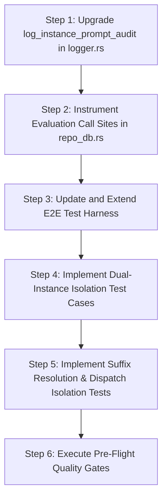

# Subtask Plan 03: Structured Audit Logging & End-to-End Isolation Tests

> **Document:** `03-audit-logging-and-e2e-tests.md`  
> **Task ID:** `121-cross-instance-prompt-running-audit-and-fix`  
> **Status:** APPROVED & AUTHORITATIVE  
> **Domain:** Telemetry Logging, Integration Testing, Process Verification  
> **Author:** Spec Author 02  
> **Date:** October 2026  

---

## 1. Objective & Scope

This subtask defines the exact implementation and verification plan for:
1. **Structured Telemetry Upgrade**: Upgrading `log_instance_prompt_audit` in `src-tauri/src/modules/logger.rs` to capture full diagnostic context (instance ID, resolved name, project name, repo path, DB path evaluated, process PID, criteria evaluated, `is_running`, rationale).
2. **Detection Call Site Instrumentation**: Updating every liveness evaluation site in `src-tauri/src/modules/repo_db.rs` to invoke the upgraded logger.
3. **End-to-End Integration Test Suite**: Extending `src-tauri/tests/per_instance_prompt_liveness_test.rs` to rigorously test:
   - Default profile running `Antigravity-Manager` only (`SpecBuilder` and `coding-guidelines` idle).
   - Instance 8159 running `coding-guidelines` only (`SpecBuilder` and `Antigravity-Manager` idle).
   - Dead instance process gating (`INSTANCE_PROCESS_DEAD`).
   - Suffix matching instance alias resolution (`8159` -> `default-copy-8159`).
   - Queue dispatch isolation eliminating cross-instance prompt re-injection on shared paths.

---

## 2. Step-by-Step Implementation Sequence



---

### Step 1: Upgrade `log_instance_prompt_audit` in `src-tauri/src/modules/logger.rs`

#### 1.1 Specification & Signature
Replace the existing 7-argument logger with the comprehensive 9-argument diagnostic logger:

```rust
/// Emit structured audit log for instance prompt and project liveness evaluation
pub fn log_instance_prompt_audit(
    instance_id: &str,
    resolved_name: &str,
    project_name: &str,
    repo_path: &str,
    db_path_evaluated: &str,
    process_pid: Option<u32>,
    criteria_evaluated: &str,
    is_running: bool,
    rationale: &str,
) {
    let pid_str = process_pid
        .map(|p| p.to_string())
        .unwrap_or_else(|| "none".to_string());

    info!(
        "[InstancePromptAudit] instance_id='{}' resolved_name='{}' project='{}' repo_path='{}' db_path='{}' pid={} criteria='{}' is_running={} rationale='{}'",
        instance_id,
        resolved_name,
        project_name,
        repo_path,
        db_path_evaluated,
        pid_str,
        criteria_evaluated,
        is_running,
        rationale
    );
}
```

#### 1.2 Verification Criteria
- Compiles with zero warnings in `cargo check`.
- Correctly formats `Option<u32>` PID as numeric or `"none"`.

---

### Step 2: Instrument Evaluation Call Sites in `src-tauri/src/modules/repo_db.rs`

#### 2.1 Call Site 1: `detect_running_projects`
When scanning filesystem `workspaceStorage`:
```rust
let pid_opt = instance_pids.first().copied();
crate::modules::logger::log_instance_prompt_audit(
    target_id,
    &instance.name,
    &repo_name,
    &raw_path,
    &ws_folder.to_string_lossy(),
    pid_opt,
    "WorkspaceStorageScan + ProcessLiveness",
    is_project_active,
    if is_project_active {
        "ACTIVE_IN_FLIGHT_TASKS"
    } else if !is_instance_active {
        "INSTANCE_PROCESS_DEAD"
    } else {
        "IDLE_NO_ACTIVE_TASKS"
    },
);
```

#### 2.2 Call Site 2: `is_prompt_running_for_project` (Gate 0: Host Process Dead)
```rust
if !has_active_process {
    crate::modules::logger::log_instance_prompt_audit(
        norm_inst,
        resolved_name.as_deref().unwrap_or(norm_inst),
        project_id,
        project_id,
        "process_table",
        None,
        "Gate0:HostProcessLiveness",
        false,
        "INSTANCE_PROCESS_DEAD",
    );
    return false;
}
```

#### 2.3 Call Site 3: `is_prompt_running_for_project` (Gate 1: Memory Prompts)
```rust
crate::modules::logger::log_instance_prompt_audit(
    norm_inst,
    resolved_name.as_deref().unwrap_or(norm_inst),
    project_id,
    &p.repo_path,
    "memory_prompts_map",
    host_pid,
    "Gate1:MemoryPromptsMap",
    true,
    "ACTIVE_PROMPT_MEMORY",
);
```

#### 2.4 Call Site 4: `is_prompt_running_for_project` (Gate 2: AGY Worker Matched)
```rust
crate::modules::logger::log_instance_prompt_audit(
    norm_inst,
    resolved_name.as_deref().unwrap_or(norm_inst),
    project_id,
    clean_worker_path,
    "active_agy_workers_map",
    Some(pid),
    "Gate2:ActiveAgyWorkers",
    true,
    "ACTIVE_WORKER_MATCHED",
);
```

#### 2.5 Call Site 5: `is_prompt_running_for_project` (Gate 3: `active_prompts` SQLite)
```rust
crate::modules::logger::log_instance_prompt_audit(
    norm_inst,
    resolved_name.as_deref().unwrap_or(norm_inst),
    project_id,
    project_id,
    "active_prompts_table",
    host_pid,
    "Gate3:ActivePromptsSQLite",
    true,
    "ACTIVE_PROMPT_DB_RUNNING",
);
```

#### 2.6 Call Site 6: `is_prompt_running_for_project` (Gate 4: Conversation Summaries Active Turn)
```rust
crate::modules::logger::log_instance_prompt_audit(
    norm_inst,
    resolved_name.as_deref().unwrap_or(norm_inst),
    project_id,
    &clean_p,
    &summaries_db.to_string_lossy(),
    host_pid,
    "Gate4:ConversationSummariesLiveTurn",
    true,
    "CONVERSATION_SUMMARY_ACTIVE_TURN",
);
```

#### 2.7 Call Site 7: `is_prompt_running_for_project` (Fallback Idle)
```rust
crate::modules::logger::log_instance_prompt_audit(
    norm_inst,
    resolved_name.as_deref().unwrap_or(norm_inst),
    project_id,
    project_id,
    "all_evaluated_databases",
    host_pid,
    "Gate0-4:AllEvaluationsCompleted",
    false,
    "IDLE_NO_ACTIVE_TASKS",
);
```

---

### Step 3: Implement Dual-Instance Isolation E2E Tests

File: `src-tauri/tests/per_instance_prompt_liveness_test.rs`

#### 3.1 Test 1: Default Profile Running `Antigravity-Manager` Only
- **Name**: `test_e2e_default_profile_running_antigravity_manager_only`
- **Harness Setup**:
  1. Temporary directory created with `tempfile::tempdir()`.
  2. Setup default instance folder structure with 3 projects:
     - `/work/Antigravity-Manager`
     - `/work/SpecBuilder`
     - `/work/coding-guidelines`
  3. `conversation_summaries.db` contains:
     - `Antigravity-Manager`: `status = "RUNNING"`, `not_fully_idle = 1`, `last_modified_time = NOW - 10s`.
     - `SpecBuilder`: `status = "RUNNING"`, `not_fully_idle = 0`, `last_modified_time = NOW - 10s` (stale turn).
     - `coding-guidelines`: `status = "IDLE"`, `not_fully_idle = 0`, `last_modified_time = NOW - 100s`.
  4. Instance OS process state: `is_alive = true`.
- **Assertions**:
  - `evaluate_project("/work/Antigravity-Manager", "default").is_running == true`
  - `evaluate_project("/work/SpecBuilder", "default").is_running == false`
  - `evaluate_project("/work/coding-guidelines", "default").is_running == false`
  - Running projects count on Default: `1`.

#### 3.2 Test 2: Instance 8159 Running `coding-guidelines` Only
- **Name**: `test_e2e_instance_8159_running_coding_guidelines_only`
- **Harness Setup**:
  1. Setup cloned instance `default-copy-8159` folder structure with identical 3 projects:
     - `/work/Antigravity-Manager`
     - `/work/SpecBuilder`
     - `/work/coding-guidelines`
  2. Cloned `conversation_summaries.db` contains:
     - `coding-guidelines`: `status = "RUNNING"`, `not_fully_idle = 1`, `last_modified_time = NOW - 10s`.
     - `Antigravity-Manager`: `status = "RUNNING"`, `not_fully_idle = 0`, `last_modified_time = NOW - 10s` (historical clone artifact).
     - `SpecBuilder`: `status = "IDLE"`, `not_fully_idle = 0`.
  3. Instance 8159 OS process state: `is_alive = true`.
- **Assertions**:
  - `evaluate_project("/work/coding-guidelines", "default-copy-8159").is_running == true`
  - `evaluate_project("/work/Antigravity-Manager", "default-copy-8159").is_running == false` (**Zero bleed from default!**)
  - `evaluate_project("/work/SpecBuilder", "default-copy-8159").is_running == false`
  - Running projects count on 8159: `1`.

#### 3.3 Test 3: Dead Host Process Gating (`INSTANCE_PROCESS_DEAD`)
- **Name**: `test_e2e_stopped_instance_process_dead_forces_all_idle`
- **Harness Setup**:
  - Instance process state: `is_alive = false`.
  - Database contains `status = "RUNNING"`, `not_fully_idle = 1`.
- **Assertions**:
  - `is_running == false` for all projects.
  - Evaluation rationale contains `"INSTANCE_PROCESS_DEAD"`.

---

### Step 4: Suffix Resolution & Dispatch Isolation Tests

#### 4.1 Test 4: Suffix Matching for Instance Identifiers
- **Name**: `test_e2e_suffix_matching_for_cloned_instances`
- **Assertions**:
  - `resolve_instance_id("8159") == Ok("default-copy-8159")`
  - `resolve_instance_id("-8159") == Ok("default-copy-8159")`
  - `resolve_instance_id("inst-8159") == Ok("default-copy-8159")`

#### 4.2 Test 5: Queue Dispatch Instance Scoping Isolation
- **Name**: `test_e2e_prompt_queue_dispatch_strict_instance_scoping`
- **Harness Setup**:
  - Insert queued prompt into test database:
    `id: "prompt-1", instance_id: "default-copy-8159", repo_path: "/work/coding-guidelines", status: "queued"`.
- **Execution**:
  - Run `check_and_dispatch_enqueued_prompts(Some("default"))`.
- **Assertions**:
  - Dispatched count for `default` is strictly `0`.
  - Prompt remains in `"queued"` status.
  - Run `check_and_dispatch_enqueued_prompts(Some("default-copy-8159"))`: Dispatched count is `1`, status transitions to `"dispatched"`.

---

## 3. Pre-Flight Validation Matrix

| Command | Working Directory | Success Criteria |
|---|---|---|
| `cargo fmt -- --check` | `src-tauri` | Zero formatting diffs |
| `cargo clippy --all-targets --all-features` | `src-tauri` | Zero clippy warnings or errors |
| `cargo test --test per_instance_prompt_liveness_test` | `src-tauri` | 100% test pass rate across all isolation scenarios |
| `npm run build` | Workspace root | Zero TypeScript / bundling errors |
