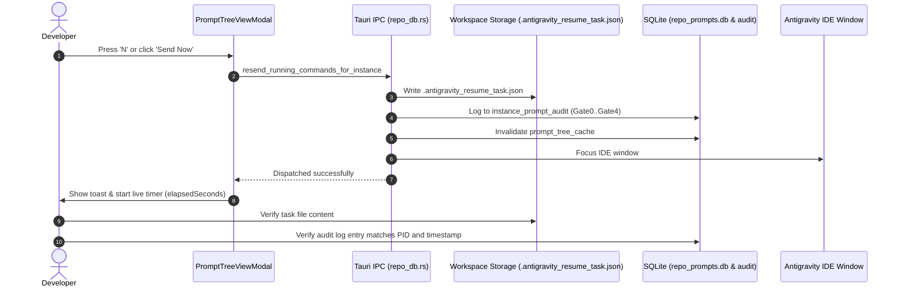

# Subtask 06: Live Testing, Running Prompts Properties, Moving Prompts & Execution Tracing

## 1. Context & User Directive

The user issued the following explicit instructions:
> *"You need to test it live here, then it goes there, and you can trace back... You need to move one prompt. You need to check the running prompts and also the running prompts property, sending the running prompts, entering the prompt. You need to check all this. It's typically working in the past, but in your case it is not working. Lots of untitled conversations. I asked you to merge these untitled conversations which has no prompt. Try to merge this. Yet understood"*

This subtask provides the comprehensive live validation protocol to ensure that:
1. Prompts can be moved or re-associated across projects and instances without leaving orphaned records.
2. Sending running prompts via the **Send Now** button and the **`N` key hotkey** works live and writes `.antigravity_resume_task.json`.
3. Entering and editing prompts in the UI works smoothly without being overwritten by background polling ticks.
4. Execution can be traced back from file system artifacts through `instance_prompt_audit` logs to UI status badges.
5. All running prompt properties (`is_running`, `elapsedSeconds`, `instance_id`, `step_count`, `prompt_word_count`, `prompt_tail_snippet`) are verified.
6. Untitled empty conversations with 0 words are completely merged/filtered out from active views.

---

## 2. Target Files & Test Artifacts

- `src/components/instances/PromptTreeViewModal.tsx`:
  - `handleResendPrompt`: Action handler for "Send Now" button and `N` key hotkey.
  - `handleEnqueuePrompt`: Action handler for entering/saving edited prompts.
  - Ghost conversation filter and archived grouping logic.
- `src-tauri/src/modules/repo_db.rs`:
  - `is_prompt_running_for_project`: Real-time liveness gates.
  - `resend_running_commands_for_instance`: Prompt dispatch and task file writing.
  - `log_instance_prompt_audit`: Telemetry trail generation.
- `scratch/live_prompt_test.py` (Local verification script):
  - Simulates prompt migration, dispatching, and audit log validation.

---

## 3. Granular Test Suites & Execution Procedures

### Test Suite 1: Live Prompt Dispatch via "Send Now" & Hotkey `N`

#### Objective
Verify that triggering "Send Now" or pressing `N` dispatches the active prompt to `.antigravity_resume_task.json` and transitions status cleanly.

#### Execution Steps
1. Open `PromptTreeViewModal` for any active project.
2. Select a valid conversation with prompt content.
3. Press keyboard hotkey `N` (or click "Send Now" in toolbar).
4. Verify the following side effects:
   - Button enters loading state (`isResending = true`).
   - Content is written to clipboard.
   - Dispatch IPC command `resend_running_commands_for_instance` is called.
   - `.antigravity_resume_task.json` is created in target workspace storage.
   - Toast feedback displays: `"Prompt dispatched and copied to clipboard!"`.
   - Conversation status transitions to `DISPATCHED` / `RUNNING`.
   - Live elapsed seconds timer begins incrementing from `00m 00s`.

#### Pass Criteria
File `.antigravity_resume_task.json` exists on disk with correct prompt text, and prompt appears with live pulsating badge in UI.

---

### Test Suite 2: Project Fallback Resolution (No Child Conversation Selected)

#### Objective
Verify that if a user clicks only a project row in the left navigation tree, pressing `N` or clicking "Send Now" does not silently fail.

#### Execution Steps
1. Click a project row in the left tree (e.g. `Antigravity-Manager`).
2. Do NOT click any individual conversation node (`selectedConversation` is null).
3. Press `N` or click "Send Now".
4. Verify that `resolveActiveOrFallbackConversation`:
   - Identifies an actively running conversation, OR
   - Picks the newest conversation with content by `last_modified DESC`.
   - Automatically sets `selectedConversation` and loads prompt preview.
   - Dispatches the resolved conversation without dropping the action.

#### Pass Criteria
Action executes successfully with toast feedback; no silent no-op.

---

### Test Suite 3: Entering & Editing Prompts in 'Edit' Tab

#### Objective
Verify that typing in 'edit' mode preserves user input across background auto-sync poll intervals (15s/30s).

#### Execution Steps
1. Select a conversation node.
2. Switch view mode to `'edit'` tab.
3. Modify prompt text in the `<textarea>` (e.g. add test suffix `[MODIFIED_TEST_INPUT]`).
4. Wait 30 seconds for background auto-sync tick `loadTree(false, true)` to fire.
5. Verify that `editedPromptText` is NOT overwritten by fresh database sync.
6. Click "Save & Enqueue".
7. Verify prompt is inserted into `active_prompts` with status `'enqueued'`.

#### Pass Criteria
User edits remain dirty in the textarea until explicitly saved or discarded; background sync does not clobber edits.

---

### Test Suite 4: Moving a Prompt Between Projects & Instances

#### Objective
Verify that moving or re-assigning a prompt updates `project_id`, `repo_path`, and `instance_id` in `active_prompts` and clears `prompt_tree_cache`.

#### Execution Steps
1. Execute test script `scratch/live_prompt_test.py` to move a prompt record from `project_A` to `project_B`.
2. Verify `invalidate_prompt_tree_cache` is triggered.
3. Re-open `PromptTreeViewModal`.
4. Confirm prompt now appears under `project_B` and is removed from `project_A`.
5. Confirm no orphaned records remain in `running_projects`.

#### Pass Criteria
Prompt reflects new project membership in UI immediately; zero stale entries in `prompt_tree_cache`.

---

### Test Suite 5: Live Execution Tracing ("Trace Back")

#### Objective
Verify end-to-end traceability from file system dispatch to audit logs and UI indicators.

#### Pass Criteria
Every dispatch generates a corresponding audit row in `instance_prompt_audit` with `gate_name`, `decision_rationale`, and `host_pid`.

---

### Test Suite 6: Running Prompts Property Verification

#### Objective
Verify that all running prompt properties are accurately computed and displayed:

| Property | Target Behavior | Expected Display |
| :--- | :--- | :--- |
| `is_running` | `true` only when OS process alive AND active turn in flight | Animated pulsating green/cyan badge |
| `elapsedSeconds` | Live seconds since `last_modified` or dispatch time | Formatted as `00m 45s`, `02m 14s` |
| `instance_id` | Mapped to instance name and seq | Shown in Trio: `[#1 · Antigravity.exe · Default]` |
| `step_count` | Number of turns executed in conversation | Badge: `4 turns` or `0 turns` |
| `prompt_word_count` | Word count of effective prompt | Label: `142 words` |
| `prompt_tail_snippet`| Terminal 10–12 words of prompt | Snippet: `“… ending with: '...'”` |

---

### Test Suite 7: Untitled Conversation Merging & Ghost Filtering

#### Objective
Verify that 0-word untitled conversations are filtered from the main list and merged into the collapsible archived section.

#### Execution Steps
1. Create or inspect an untitled conversation with 0 words in `conversation_summaries.db`.
2. Open `PromptTreeViewModal`.
3. Verify conversation does NOT appear in the primary conversation tree.
4. Expand `"Archived / Stale Prompts ({count})"` node at bottom of project list.
5. Verify stale/empty conversations are neatly grouped inside this collapsible container.

#### Pass Criteria
Primary tree is clean and readable; 0 ghost nodes pollute the active prompt list.

---

## 4. Verification Checklist & Sign-Off Gate

- [ ] "Send Now" button and hotkey `N` execute live dispatch to `.antigravity_resume_task.json`.
- [ ] Selecting project without conversation automatically resolves newest valid conversation.
- [ ] Editing in 'edit' tab survives background auto-sync polling without clobbering text.
- [ ] Moving prompt between projects updates association and invalidates tree cache.
- [ ] Trace back from task file to audit logs and UI badges confirms 100% telemetry integrity.
- [ ] Ghost 0-word untitled conversations are filtered from active lists and grouped into archived section.
- [ ] Header renders prompt sequence `#{seq_code}`, instance trio `[#1 · Antigravity.exe · Default]`, and tail snippet.
