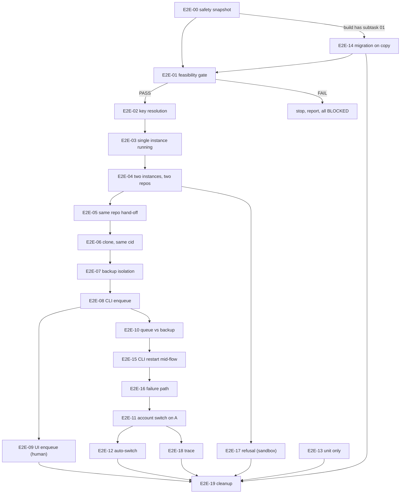

# Subtask 04: E2E multi-instance test catalog

Status: pending

| Field | Value |
|---|---|
| Parent plan | `.ai-memory/plans/140-per-instance-prompt-attribution-backup-queue.md` |
| Spec (full case text, SQL, expected results) | `02-spec/21-app/140-per-instance-prompt-attribution-backup-queue/02-component-and-e2e-spec.md` sections 4 to 7 |
| Architecture spec (AC-01 to AC-32, B01 to B33) | `02-spec/21-app/140-per-instance-prompt-attribution-backup-queue/01-architecture-spec.md` |
| Runbook | `.ai-memory/plans/subtasks/140-per-instance-prompt-attribution-backup-queue/05-e2e-runbook-and-evidence-capture.md` |
| Depends on | subtasks 01, 02, 03 for every case flagged "after"; nothing for cases flagged "today" |

## Goal

Prove, on this Windows machine with two or three test instances, that every prompt (running, backed up, queued, resumed) stays with the instance where it was typed, through capture, backup, queue, switch, auto-switch, and restore, without touching the default instance or the protected sandboxes.

## Flags

- today: safe on today's build, result final.
- today-baseline: safe today; today's result documents the bug; final verdict after the named subtasks.
- sandbox-baseline: today only inside sandbox mode (`ABV_DATA_DIR` pointed at a sanitized copy, spec section 4.8).
- after-NN: live only when subtask NN has shipped.
- unit-only: never live.

## Checklist (one line per case)

- [ ] E2E-00 Safety snapshot. AC-32. today.
- [ ] E2E-01 Feasibility gate: Antigravity honors the per-instance profile. AC-01. today. Stop the whole run if it fails.
- [ ] E2E-02 Canonical key resolution (default aliases, unknown id, ambiguous suffix). AC-02, AC-03, AC-04. today-baseline; final after-01 and after-03.
- [ ] E2E-03 Running detection, single instance, idle versus running, first-row rule, stopped instance. AC-19, AC-20. today-baseline; final after-02 (after-03 for `wpr -i`).
- [ ] E2E-04 Running detection, two instances, different repos (grouping, exact filter, composite ids, tree). AC-21, AC-22, AC-27, AC-31, AC-06. today-baseline; final after-01, after-02, after-03.
- [ ] E2E-05 Two instances, same repo (resume hand-off collision). AC-11, AC-12, AC-13. today-baseline; final after-01 and after-03.
- [ ] E2E-06 Same conversation id in two instances via clone. AC-06, AC-07. today-baseline; final after-01. Live part BLOCKED when the clone does not copy conversations; the integration test then carries AC-07.
- [ ] E2E-07 Backup isolation and idempotence, no steal (distinct text and shared text). AC-09, AC-10. today-baseline when gate G-LEGACY passes; final after-01 and after-02.
- [ ] E2E-08 Enqueue via CLI to one instance, dispatch only there. AC-28, AC-14, AC-15. after-03 (with after-01 columns); sandbox-baseline today.
- [ ] E2E-09 Enqueue via UI uses the same function and row shape. AC-29. after-03 and a running GUI build with subtask 03; needs a human or a UI automation tool; verified by SQL afterwards.
- [ ] E2E-10 Queue versus backup separation. AC-14, AC-16. after-02 and after-03; sandbox-baseline today.
- [ ] E2E-11 Instance account switch on A: backup, close only A, relaunch, restore the same conversation, B untouched. AC-17, AC-18, AC-32, AC-12, AC-25. after-02 and after-03.
- [ ] E2E-12 Auto-switch, cross instance (scoped `agm instances ff <A>` live plus integration tests). AC-23, AC-24. after-02.
- [ ] E2E-13 Default instance paths. AC-23, AC-25, AC-02. unit-only (never switch default).
- [ ] E2E-14 Legacy empty instance_id rows migration on a copy. AC-05, AC-08. after-01 in sandbox mode only (runs right after E2E-00 on a fixed build); today read-only counts.
- [ ] E2E-15 Restart AGM CLI mid-flow, no duplicate resend. AC-16, AC-17. after-02 and after-03.
- [ ] E2E-16 Failure path: spawn fails, row not marked dispatched. AC-15. after-02 and after-03; sandbox-baseline today.
- [ ] E2E-17 Refusal: action commands without -i when two instances run. AC-26. after-03, sandbox mode only.
- [ ] E2E-18 Trace command shows the identity chain. AC-30. after-03.
- [ ] E2E-19 Cleanup: delete only this run's instances; protected PIDs unchanged. AC-32. today; always last, also after an abort.

## Coverage

The AC by E2E coverage matrix is section 6 of `02-spec/21-app/140-per-instance-prompt-attribution-backup-queue/02-component-and-e2e-spec.md`. All 32 acceptance criteria are covered at least once. The unit and integration tests that cover paths which must not run live are listed in section 7 of the same spec.

## Ordering and dependencies

Rules:

1. E2E-00 runs first and its snapshot is re-checked before and after every case. A changed protected PID aborts the run; only E2E-19 step 1 (stop this run's instances) runs after an abort.
2. E2E-01 is a hard gate. If it fails, nothing else is trusted.
3. E2E-03 to E2E-07 build the state later cases need (A and B running, conversations with known ids, backed-up rows). Run them in order.
4. E2E-08 provides the CLI row shape that E2E-09 compares with the UI row.
5. E2E-15 and E2E-16 run before E2E-11 so the switch starts from a clean queue for A.
6. E2E-11 must pass before E2E-18, because the trace needs a prompt that went through capture, backup, and restore.
7. E2E-14 runs in sandbox mode and needs no test instance. With a build that contains subtask 01 it must run right after E2E-00 and before E2E-01, because the first live command of a fixed build migrates the live databases for real; the migration has to be proven on a copy first. On today's build it is only a read-only count and can run any time. E2E-17 runs in sandbox mode after E2E-04 (it needs A and B running).
8. E2E-13 is independent and runs with the unit tests.
9. E2E-19 always runs last.

## Done when

- Every case has an evidence file and a report line (PASS, FAIL, BLOCKED, or BASELINE for today-baseline runs on an unfixed build).
- After subtasks 01 to 03 ship, every case is PASS or has a BLOCKED reason that names a missing human or UI tool, never a missing fix.
- The protected PIDs from E2E-00 are unchanged at the end.
