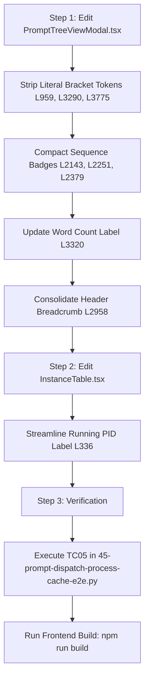

# Subtask 03: UI Bracket & Tag Compaction, Sequence Badges & Action Bar Compaction

- **Subtask ID**: `151-03`
- **Parent Task**: `151-smart-instance-process-cache-and-prompt-dispatch-fix`
- **Specification Reference**: `02-spec/21-app/151-smart-instance-process-cache-and-prompt-dispatch-fix/02-component-and-ui-spec.md`
- **Target Files**:
  - `src/components/instances/PromptTreeViewModal.tsx`
  - `src/components/instances/InstanceTable.tsx`
- **Maintainer / Attribution**: Strictly `@aukgit` (`(Thanks to @aukgit)`)
- **Status**: `[READY_FOR_EXECUTION]`

---

## 1. Objective & Scope

Execute surgical frontend modifications to eliminate bracket clutter, compact sequence badges, clean button word count labels, and streamline instance row status badges:
1. **Bracket Token Stripping (`PromptTreeViewModal.tsx`)**:
   - Replace literal bracket strings `... [Collapse Full Text]`, `... [Expand Full Text]`, and `... [Collapse]` with clean inline typographic links (`· Collapse` and `... Expand full text`).
2. **Sequence Badge Compaction (`PromptTreeViewModal.tsx`)**:
   - Streamline conversation nodes from `C001 · 8159abcd` to clean `C001`.
   - Move GitMap short commit SHA (`8159abcd`) to the native `title` tooltip.
   - Streamline project group nodes from `P001 · #1` to clean `P001`.
3. **Action Button Word Count Polish (`PromptTreeViewModal.tsx`)**:
   - Replace `Show All ({n}w)` with `Show All ({n} words)`.
4. **Header Row 1 Identity Breadcrumb Consolidation (`PromptTreeViewModal.tsx`)**:
   - Consolidate identity elements into a clean `#C001 · Profile Name` breadcrumb.
5. **Instance Table Status & PID Streamlining (`InstanceTable.tsx`)**:
   - Modernize status cell from `Running ({pid})` to `Running · {pid}`.

---

## 2. Technical Context & Affected Code Blocks

### 2.1 File: `src/components/instances/PromptTreeViewModal.tsx`

#### Call Site 1: Helper truncation toggle (Line ~959)
- **Current code**:
  ```tsx
  {showAllWords ? '... [Collapse]' : '... [Expand Full Text]'}
  ```
- **Replacement**:
  ```tsx
  {showAllWords ? ' · Collapse' : ' ... Expand full text'}
  ```

#### Call Site 2: Main prompt body truncation toggle (Line ~3290)
- **Current code**:
  ```tsx
  {showAllWords ? '... [Collapse Full Text]' : '... [Expand Full Text]'}
  ```
- **Replacement**:
  ```tsx
  {showAllWords ? ' · Collapse' : ' ... Expand full text'}
  ```

#### Call Site 3: Word count action button label (Line ~3320)
- **Current code**:
  ```tsx
  <span>Show All ({totalWords || activeWordCount}w)</span>
  ```
- **Replacement**:
  ```tsx
  <span>Show All ({totalWords || activeWordCount} words)</span>
  ```

#### Call Site 4: Secondary preview body truncation toggle (Line ~3775)
- **Current code**:
  ```tsx
  {showAllWords ? '... [Collapse Full Text]' : '... [Expand Full Text]'}
  ```
- **Replacement**:
  ```tsx
  {showAllWords ? ' · Collapse' : ' ... Expand full text'}
  ```

#### Call Site 5: Conversation sequence badge formatting (Line ~2143 & ~2251)
- **Current code**:
  ```tsx
  {formatDualBadge(conv.seq_code, 'C001', conv.gitmap_seq_code, conv.short_id || conv.conversation_id.slice(0, 8))}
  ```
- **Problem**: When `conv.seq_code` is `C001` and `conv.short_id` is `8159abcd`, `formatDualBadge` produces `C001 · 8159abcd`, crowding out the conversation title.
- **Replacement**:
  Pass `conv.seq_code` as primary and move `short_id` to the element `title` attribute:
  ```tsx
  <span
      className="text-[9px] font-mono px-1.5 py-0.5 rounded-[4px] shrink-0 font-medium whitespace-nowrap bg-slate-200/90 dark:bg-[#15334d] text-slate-600 dark:text-cyan-300 border border-slate-300/30 dark:border-cyan-500/10"
      title={conv.short_id ? `GitMap SHA: ${conv.short_id}` : undefined}
  >
      {conv.seq_code || 'C001'}
  </span>
  ```

#### Call Site 6: Project group sequence badge formatting (Line ~2379)
- **Current code**:
  ```tsx
  {formatDualBadge(project.seq_code, 'P001', project.gitmap_seq_code, `#${project.seq_id || 1}`)}
  ```
- **Problem**: Produces redundant `P001 · #1`.
- **Replacement**:
  ```tsx
  <span
      className="text-[9px] font-mono px-1.5 py-0.5 rounded-[4px] shrink-0 font-medium whitespace-nowrap bg-slate-200 dark:bg-[#15334d] text-slate-600 dark:text-cyan-400 border border-slate-300/40 dark:border-cyan-500/20"
      title={project.gitmap_seq_code || (project.seq_id ? `Project #${project.seq_id}` : undefined)}
  >
      {project.seq_code || 'P001'}
  </span>
  ```

#### Call Site 7: Header Row 1 Identity Breadcrumb (Lines ~2958–2962)
- **Current code**:
  ```tsx
  <span className="text-[10px] font-mono text-slate-400 dark:text-slate-500 truncate" title={`Instance #${instanceSeqNum} · ${instanceExeName} (${instanceNameDisplay})`}>
      #{instanceSeqNum} · {instanceNameDisplay}
  </span>
  ```
- **Refinement**:
  Format cleanly as a consolidated dark-glass breadcrumb with sequence and profile context:
  ```tsx
  <span className="text-[10px] font-mono text-slate-400 dark:text-slate-500 truncate" title={`Instance #${instanceSeqNum} · ${instanceExeName} (${instanceNameDisplay})`}>
      #{selectedConversation.seq_code || `C${String(instanceSeqNum).padStart(3, '0')}`} · {instanceNameDisplay}
  </span>
  ```

---

### 2.2 File: `src/components/instances/InstanceTable.tsx`

#### Call Site: Status & PID cell (Line ~336)
- **Current code**:
  ```tsx
  Running{inst.pid ? ` (${inst.pid})` : ''}
  ```
- **Replacement**:
  ```tsx
  Running{inst.pid ? ` · ${inst.pid}` : ''}
  ```
- **Rationale**: Replaces parentheses with a clean dot separator `Running · {pid}`, aligning with project-wide typography conventions.

---

## 3. Step-by-Step Execution Plan



### Step 1: Apply Changes to `PromptTreeViewModal.tsx`
1. Locate lines 959, 3290, and 3775. Replace `'... [Collapse]'` and `'... [Collapse Full Text]'` with `' · Collapse'`.
2. Replace `'... [Expand Full Text]'` with `' ... Expand full text'`.
3. Locate line 3320. Replace `<span>Show All ({totalWords || activeWordCount}w)</span>` with `<span>Show All ({totalWords || activeWordCount} words)</span>`.
4. Locate conversation badge renderings at lines 2143 and 2251. Avoid concatenating `${rawAgm} · ${rawGm}` when `rawGm` is a raw SHA hash; render `conv.seq_code || 'C001'` directly with `conv.short_id` in `title`.
5. Locate project badge rendering at line 2379. Render `project.seq_code || 'P001'` directly with GitMap ID in `title`.
6. Modernize the breadcrumb at line 2960.

### Step 2: Apply Changes to `InstanceTable.tsx`
1. Locate line 336 in `src/components/instances/InstanceTable.tsx`.
2. Replace `Running{inst.pid ? ` (${inst.pid})` : ''}` with `Running{inst.pid ? ` · ${inst.pid}` : ''}`.

### Step 3: Verification & Quality Gate
1. Run TC05 check in `03-ai-scripts/45-prompt-dispatch-process-cache-e2e.py` to ensure all UI compaction assertions pass.
2. Run `npm run build` to confirm zero TypeScript compilation errors or JSX syntax issues.

---

## 4. Acceptance Criteria & Quality Checklist

- [ ] Zero instances of literal bracket strings `[Collapse` or `[Expand Full Text]` remain in `PromptTreeViewModal.tsx`.
- [ ] Conversation tree nodes render clean sequence codes (`C001`) without SHA hashes cluttering the badge pill.
- [ ] Project group tree nodes render clean sequence codes (`P001`) without duplicate `#1` suffix in the pill.
- [ ] Word count expand button reads `Show All (${count} words)` without truncated `w` abbreviation.
- [ ] Header Row 1 displays `#C001 · Profile Name` breadcrumb.
- [ ] `InstanceTable.tsx` displays `Running · {pid}` without parentheses.
- [ ] `npm run build` passes with zero typecheck or bundling errors.
