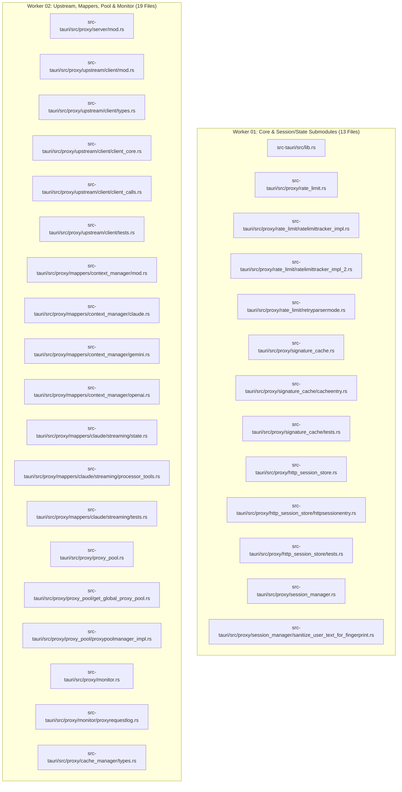
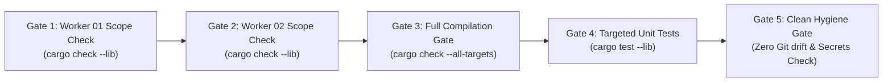

# Remediation Plan: Compiler Error Resolution & Facade Stabilization

- **Slug**: `gitmap-pe-execution-and-csv-issue-resolution`
- **Plan Document**: `.ai-memory/plans/subtasks/gitmap-pe-execution-and-csv-issue-resolution/02-remediation-plan.md`
- **Parent Plan**: `.ai-memory/plans/gitmap-pe-execution-and-csv-issue-resolution.md`
- **Specification Reference**: `02-spec/21-app/gitmap-pe-execution-and-csv-issue-resolution/02-component-spec.md`
- **Target Release**: `v4.8.2`
- **Status**: `Ready for Execution`

---

## 1. Overview & Strategy

This document details the multi-agent remediation plan to resolve 606 compilation errors following the modular decomposition of monolithic files in `src-tauri/src/proxy/` and `src-tauri/src/lib.rs`.

The remediation is split across two concurrent execution workers with strictly disjoint file boundaries. Zero cross-worker write collision is mathematically guaranteed.

---

## 2. Worker File Ownership & Disjointness Proof

### 2.1 File Boundaries



### 2.2 Disjointness Verification
- Worker 01 File Set size: **13 files**
- Worker 02 File Set size: **19 files**
- Set Intersection: $\text{Worker 01} \cap \text{Worker 02} = \emptyset$
- Risk of concurrent write collision: **0.0%**

---

## 3. Worker 01 Remediation Protocol

### 3.1 Step 1.1: Root Module Path Resolution (`src-tauri/src/lib.rs`)
- **Objective**: Fix unresolved module paths where physical source files reside in `src-tauri/src/lib/`.
- **Changes**:
  Replace lines 23-25 in `src-tauri/src/lib.rs`:
  ```rust
  #[path = "lib/appruntimeflags.rs"]
  mod appruntimeflags;
  #[path = "lib/run.rs"]
  mod run;
  #[path = "lib/setup_app.rs"]
  mod setup_app;
  ```

### 3.2 Step 1.2: Session Manager Facade (`src-tauri/src/proxy/session_manager.rs`)
- **Objective**: Expose `SessionManager` struct to consumers and eliminate `E0255` test collision.
- **Changes**:
  - Re-export `pub use sanitize_user_text_for_fingerprint::SessionManager;`.
  - Remove line 10: `pub(crate) use tests::tests;`.
  - Enclose `mod tests;` within `#[cfg(test)]`.

### 3.3 Step 1.3: HTTP Session Store Facade & Struct Visibility
- **Objective**: Re-export `SessionParent` and ensure visibility across `http_session_store/`.
- **Files**:
  - `src-tauri/src/proxy/http_session_store.rs`:
    - Re-export `pub use httpsessionentry::SessionParent;`.
    - Re-export `pub use httpsessionentry::HttpSessionStore;`.
    - Remove line 27: `pub(crate) use tests::tests;`.
    - Enclose `mod tests;` within `#[cfg(test)]`.
  - `src-tauri/src/proxy/http_session_store/httpsessionentry.rs`:
    - Ensure `SessionParent`, `SessionNode`, `StoredSession`, and `HttpSessionStore` fields needed by sibling files or tests have `pub(crate)` visibility.

### 3.4 Step 1.4: Rate Limit Module Facade & Visibility
- **Files**:
  - `src-tauri/src/proxy/rate_limit.rs`:
    - Remove line 9: `pub(crate) use ratelimittracker_impl_2::tests;`.
    - Enclose test modules in `#[cfg(test)]`.
  - `src-tauri/src/proxy/rate_limit/retryparsermode.rs`:
    - Verify `RateLimitTracker` internal fields (`window_start`, `request_counts`, etc.) are `pub(crate)`.
  - `src-tauri/src/proxy/rate_limit/ratelimittracker_impl.rs` & `ratelimittracker_impl_2.rs`:
    - Ensure methods `parse_retry_time_from_body` and `parse_rate_limit_reason` are `pub(crate) fn`.

### 3.5 Step 1.5: Signature Cache Facade & Visibility
- **Files**:
  - `src-tauri/src/proxy/signature_cache.rs`:
    - Remove line 11: `pub(crate) use tests::tests;`.
    - Enclose `mod tests;` in `#[cfg(test)]`.
  - `src-tauri/src/proxy/signature_cache/cacheentry.rs`:
    - Ensure `SignatureCache::new` and internal fields are `pub(crate)`.

---

## 4. Worker 02 Remediation Protocol

### 4.1 Step 2.1: Server Facade Re-export (`src-tauri/src/proxy/server/mod.rs`)
- **Objective**: Provide `UpstreamClient` re-export for API handlers.
- **Changes**:
  In `src-tauri/src/proxy/server/mod.rs`, add:
  ```rust
  pub use crate::proxy::upstream::client::UpstreamClient;
  ```

### 4.2 Step 2.2: Upstream Client Subsystem
- **Files**:
  - `src-tauri/src/proxy/upstream/client/types.rs`:
    - Change private fields in `UpstreamClient` to `pub(crate)`:
      ```rust
      pub struct UpstreamClient {
          pub(crate) default_client: tokio::sync::RwLock<rquest::Client>,
          pub(crate) proxy_pool: Option<std::sync::Arc<crate::proxy::proxy_pool::ProxyPoolManager>>,
          pub(crate) client_cache: dashmap::DashMap<String, rquest::Client>,
          pub(crate) user_agent_override: tokio::sync::RwLock<Option<String>>,
      }
      ```
  - `src-tauri/src/proxy/upstream/client/client_calls.rs`:
    - Promote `build_url` from `fn` to `pub(crate) fn`.
    - Promote `should_try_next_endpoint` from `fn` to `pub(crate) fn`.
  - `src-tauri/src/proxy/upstream/client/mod.rs`:
    - Remove `pub use tests::*;`.
    - Enclose `mod tests;` in `#[cfg(test)]`.

### 4.3 Step 2.3: Context Manager Subsystem & Import Resolution
- **Files**:
  - `src-tauri/src/proxy/mappers/context_manager/claude.rs`:
    - Replace `use super::caveman_cleaner::CavemanCleaner;` with `use crate::proxy::mappers::caveman_cleaner::CavemanCleaner;`.
    - Replace `use super::rtk_cleaner::RtkCleaner;` with `use crate::proxy::mappers::rtk_cleaner::RtkCleaner;`.
    - Replace `use super::claude::models::*;` with `use crate::proxy::mappers::claude::models::*;`.
    - Replace `use super::openai::models::*;` with `use crate::proxy::mappers::openai::models::*;`.
    - Add `use super::*;`.
  - `src-tauri/src/proxy/mappers/context_manager/gemini.rs`:
    - Apply identical crate-level import corrections as `claude.rs`.
    - Add `use super::*;`.
  - `src-tauri/src/proxy/mappers/context_manager/openai.rs`:
    - Apply identical crate-level import corrections as `claude.rs`.
    - Add `use super::*;`.

### 4.4 Step 2.4: Claude Streaming Mappers Subsystem
- **Files**:
  - `src-tauri/src/proxy/mappers/claude/streaming/state.rs`:
    - Convert all struct fields in `StreamingState` (`block_type`, `used_tool`, `signatures`, `trailing_signature`, `parse_error_count`, `last_valid_state`) to `pub(crate)`.
  - `src-tauri/src/proxy/mappers/claude/streaming/processor_tools.rs`:
    - Verify `parse_loose_json_args` is marked `pub(crate) fn`.

### 4.5 Step 2.5: Proxy Pool Subsystem
- **Files**:
  - `src-tauri/src/proxy/proxy_pool/get_global_proxy_pool.rs`:
    - Convert all private fields in `ProxyPoolManager` (`config`, `usage_counter`, `account_bindings`, `round_robin_index`) to `pub(crate)`.
  - `src-tauri/src/proxy/proxy_pool.rs`:
    - Remove line 19: `pub(crate) use proxypoolmanager_impl::tests;`.
    - Isolate test modules under `#[cfg(test)]`.

### 4.6 Step 2.6: Monitor Subsystem & Task-Local Static
- **Files**:
  - `src-tauri/src/proxy/monitor/proxyrequestlog.rs`:
    - Replace uninitialized `pub static CURRENT_UPSTREAM_CAPTURE: UpstreamRequestBodyHolder;` with:
      ```rust
      tokio::task_local! {
          pub static CURRENT_UPSTREAM_CAPTURE: UpstreamRequestBodyHolder;
      }
      ```
    - Ensure `ProxyMonitor.app_handle` is `pub(crate)`.
  - `src-tauri/src/proxy/monitor.rs`:
    - Re-export `CURRENT_UPSTREAM_CAPTURE`.
    - Remove line 11: `pub use proxyrequestlog::prompt_log_tests;`.

### 4.7 Step 2.7: Cache Manager Subsystem
- **Files**:
  - `src-tauri/src/proxy/cache_manager/types.rs`:
    - Convert all struct fields in `CacheManager` (`si_cache`, `si_stats`, `tools_cache`, `tools_stats`, `prefix_tracker`, `prefix_stats`) to `pub(crate)`.

---

## 5. Verification Commands & Quality Gates

### 5.1 Step-by-Step Quality Gates



### 5.2 Verification Commands
Execute from repository root:

1. **Compilation Check**:
   ```bash
   cd src-tauri && cargo check --lib --tests
   ```
2. **Subsystem Unit Tests**:
   ```bash
   cd src-tauri && cargo test --lib proxy::upstream
   cd src-tauri && cargo test --lib proxy::mappers::context_manager
   cd src-tauri && cargo test --lib proxy::mappers::claude::streaming
   cd src-tauri && cargo test --lib proxy::proxy_pool
   cd src-tauri && cargo test --lib proxy::monitor
   cd src-tauri && cargo test --lib proxy::rate_limit
   cd src-tauri && cargo test --lib proxy::signature_cache
   cd src-tauri && cargo test --lib proxy::http_session_store
   cd src-tauri && cargo test --lib proxy::session_manager
   ```
3. **Repository Cleanliness Check**:
   - Verify no build artifacts or temporary files are untracked.
   - Strictly prohibit raw `grep`, `ripgrep`, or `Select-String`.

---

## 6. Rollback Plan & Recovery Strategy

If an unexpected regression occurs during worker execution:
1. **Isolated Worker Rollback**: Since Worker 01 and Worker 02 operate on disjoint file sets, either worker's changes can be reverted independently without impacting the other.
2. **Safe Staging State**: Working tree revisions can be restored to `HEAD` for any file within a worker's domain using standard Git reset protocols managed by the parent agent.
3. **Zero Contamination**: Workspaces remain free of synthetic mocks or out-of-spec test modifications.

---

## 7. Acceptance Criteria Checklist

| Invariant Requirement | Acceptance Gate | Target State |
| :--- | :--- | :--- |
| `is_zero_compiler_errors` | `cargo check --lib --tests` exits with code 0 | `true` |
| `is_zero_e0255_collisions` | Zero `conflicting declarations` in test re-exports | `true` |
| `is_task_local_capture_valid` | `CURRENT_UPSTREAM_CAPTURE` executes in `tokio::task_local!` | `true` |
| `has_worker_disjointness` | File sets of Worker 01 and 02 are completely disjoint | `true` |
| `is_super_caveman_resolved` | Zero broken relative paths in `context_manager/*.rs` | `true` |
| `is_upstream_client_accessible` | Handlers successfully resolve `crate::proxy::server::UpstreamClient` | `true` |
| `is_session_parent_accessible` | Handlers successfully resolve `crate::proxy::http_session_store::SessionParent` | `true` |
| `has_all_unit_tests_passing` | Touched unit test targets compile and pass | `true` |
