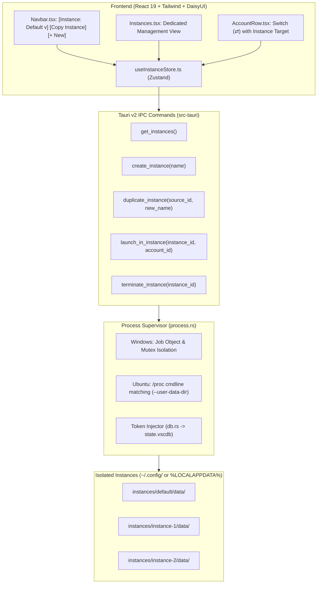

# Master Plan: Multi-Instance Antigravity Orchestration & Ubuntu Parallelism

> **Plan File:** `.lovable/plans/pending/14-multi-instance-orchestration-and-ubuntu-parallelism.md`
> **Status:** Pending Review
> **Author:** Antigravity Architect
> **Scope:** Multi-instance lifecycle, Navbar dropdown, dedicated Instances Tab, Ubuntu parallel process isolation, and per-account dispatching.

---

## 1. Problem Definition & Objectives

### Current State
In the current Antigravity-Manager (`v4.8.0`), clicking the switch account button (`⇄`) in `AccountRow.tsx` executes `process::close_antigravity()`, which sends `SIGTERM`/`SIGKILL` to all Antigravity processes on the computer, overwrites the single global `%APPDATA%\Antigravity\User\globalStorage\state.vscdb`, and restarts a single window. Only one account can be active at any time.

### Desired State
1. **Multiple Concurrent Instances:** Users can create and run multiple Antigravity instances (`Default`, `Instance 1`, `Instance 2`, etc.) simultaneously.
2. **Top Navigation Instance Selector & Copy Button:** An instance selector dropdown and a duplicate/copy button on the top navigation bar allow quick selection and cloning of instances.
3. **Dedicated Instances Tab:** A full management view to inspect running instances, PIDs, bound accounts, disk paths, and launch/stop controls.
4. **Account Dispatching:** The switch button (`⇄`) can open the account in the currently selected instance or dispatch into a new cloned instance.
5. **Full Ubuntu / Linux Support:** Must run seamlessly on Ubuntu with parallel process execution, selective PID termination (no `killall`), `--password-store="basic"`, and AppImage environment sanitization.

---

## 2. Architectural Blueprint

---

## 3. Custom Task Constraints & Rules

1. **Rule 1 (Selective PID Termination):** On both Windows and Ubuntu, closing or restarting an instance MUST match the specific instance's `--user-data-dir` argument. NEVER use `killall`, `pkill`, or terminate sibling instances.
2. **Rule 2 (Linux Keyring Bypass):** On Linux/Ubuntu, all instance launches MUST include `--password-store="basic"` to prevent GNOME Keyring credential collisions.
3. **Rule 3 (AppImage Sanitization):** Always call `clean_appimage_env()` before spawning child processes on Linux.
4. **Rule 4 (Boolean Integrity):** Use positive implicit checks (`if is_running { ... }`).
5. **Rule 5 (Relative Paths):** All paths, citations, and documentation strictly relative to repository root.

---

## 4. Subtask Decomposition

| Subtask | Scope & Key Deliverables | File Location |
| :--- | :--- | :--- |
| **Subtask 01** | Backend Instance Supervisor, Rust models, instance persistence (`instances.json`), and Ubuntu selective process termination | [.lovable/plans/subtasks/14-multi-instance/01-backend-instance-supervisor.md](../subtasks/14-multi-instance/01-backend-instance-supervisor.md) |
| **Subtask 02** | Frontend Zustand store, Navbar instance dropdown/copy controls, and dedicated `Instances.tsx` tab | [.lovable/plans/subtasks/14-multi-instance/02-frontend-instance-store-and-tabs.md](../subtasks/14-multi-instance/02-frontend-instance-store-and-tabs.md) |
| **Subtask 03** | `AccountRow.tsx` instance dispatch integration and cross-platform (Windows & Ubuntu) verification | [.lovable/plans/subtasks/14-multi-instance/03-account-dispatch-and-verification.md](../subtasks/14-multi-instance/03-account-dispatch-and-verification.md) |

---

## 5. Verification & Acceptance Criteria

- [ ] `AC-INS-001`: Creating an instance generates an isolated directory with `data/` and `extensions/`.
- [ ] `AC-INS-002`: Duplicating an instance clones configuration and extensions into a new directory.
- [ ] `AC-INS-003`: Launching Instance 1 with Account A and Instance 2 with Account B opens two concurrent Antigravity windows with distinct PIDs.
- [ ] `AC-INS-004`: On Ubuntu, closing Instance 1 terminates only its specific PID without affecting Instance 2.
- [ ] `AC-INS-005`: The Navbar dropdown accurately reflects the active target instance and live running status.
