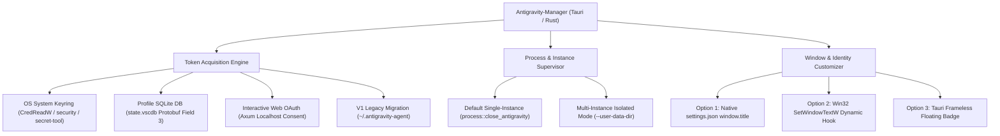

# Antigravity Architecture & AI Instruction Guides

> Master index and reference map for Antigravity-Manager runtime architecture, token extraction pipelines, multi-instance orchestration, and window customization.

## Directory Structure

This directory contains authoritative technical specifications, implementation blueprints, and Mermaid sequence diagrams designed for AI agents and human engineers to understand and extend Antigravity-Manager:

| Document | Scope & Focus | Target Audience |
| :--- | :--- | :--- |
| [02-refresh-token-capture-architecture.md](02-refresh-token-capture-architecture.md) | 4 token discovery pathways, SQLite protobuf extraction, OS keyring protocols, and OAuth exchange | AI Agents, Backend Developers |
| [03-multi-instance-profile-isolation.md](03-multi-instance-profile-isolation.md) | Multi-instance Antigravity execution, `--user-data-dir` partitioning, and keyring conflict resolution | AI Agents, Systems Architects |
| [04-window-username-overlay-guide.md](04-window-username-overlay-guide.md) | Displaying active account/username on Antigravity window titlebar via native settings, Win32 hooks, and overlays | AI Agents, UI/Frontend Engineers |
| [05-portable-folder-copy-multi-user-guide.md](05-portable-folder-copy-multi-user-guide.md) | Practical guide to copying Antigravity folders, portable mode (`data/`), and running independent instances | Developers, Power Users, AI Agents |
| [06-multi-instance-manager-and-ui-specification.md](06-multi-instance-manager-and-ui-specification.md) | Architecture for multi-instance dropdown, instance tab, instance duplication, and per-account dispatch | Frontend & Backend Engineers |
| [07-ubuntu-linux-parallel-instance-architecture.md](07-ubuntu-linux-parallel-instance-architecture.md) | Linux/Ubuntu parallel multi-instance execution, selective process termination, and AppImage sanitization | DevOps, Systems Engineers |

---

## Architecture Blueprint Overview

---

## Core Technical Invariants

1. **Token Hierarchy:** OS Keyring is queried first for modern CLI/IDE (`gemini:antigravity`). If empty, candidate profile databases (`state.vscdb`) are queried via Base64-encoded Protobuf deserialization.
2. **Profile Isolation:** Antigravity (VS Code / Electron fork) strictly isolates state when supplied with distinct `--user-data-dir` and `--extensions-dir` directories.
3. **Identity Display:** Window title customization can be accomplished natively without binary patching by writing `"window.title"` to the profile's `settings.json` before launching.

---

## Related Documentation

- Application Spec Index: [02-spec/21-app/01-index.md](../02-spec/21-app/01-index.md)
- Storage & Persistence Spec: [02-spec/21-app/04-modules-storage-and-persistence.md](../02-spec/21-app/04-modules-storage-and-persistence.md)
- Process Management Source: [src-tauri/src/modules/process.rs](../src-tauri/src/modules/process.rs)
- Migration Source: [src-tauri/src/modules/migration.rs](../src-tauri/src/modules/migration.rs)
- Keyring Integration Source: [src-tauri/src/modules/integration.rs](../src-tauri/src/modules/integration.rs)
