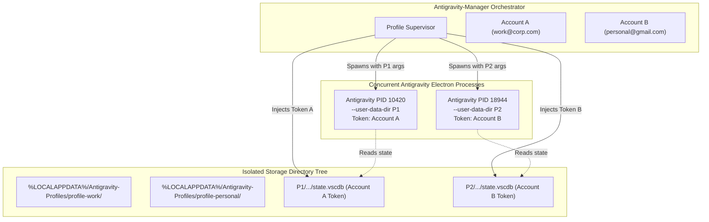
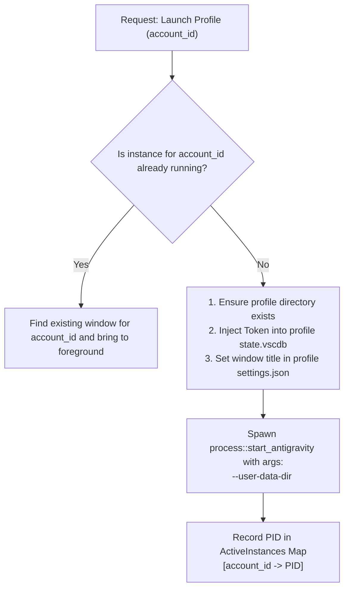

# Multi-Instance Antigravity & Profile Isolation Blueprint

> Feasibility analysis, technical mechanics, and implementation blueprint for running multiple concurrent Antigravity instances with distinct profiles.

---

## 1. Executive Summary & Feasibility

**Question:** *Can we run multiple instances of Antigravity with different profiles at the same time?*

**Verdict: YES, completely feasible.**

Antigravity is built on top of the VS Code / Electron desktop platform. While the default Antigravity-Manager configuration operates in single-instance mode (terminating previous processes before switching accounts), the underlying architecture natively supports simultaneous, isolated multi-instance execution.

---

## 2. Why the Default Setup Runs Single-Instance

In the existing codebase (`src-tauri/src/modules/process.rs` and `integration.rs`), three constraints enforce single-instance behavior:

1. **Shared SQLite File Locks:** Both Antigravity and Antigravity-Manager target the default `%APPDATA%\Antigravity\User\globalStorage\state.vscdb`. Writing to this file while an instance is running triggers database lock contention.
2. **Electron Single-Instance Lock:** Electron activates a cross-process named pipe/mutex (`antigravity-main`) on startup. Launching a second executable without custom profile arguments simply forwards window focus to the existing process.
3. **Global OS Keyring Target:** The OS credential manager entry (`gemini:antigravity`) provides only one global slot per OS user account.

---

## 3. The Multi-Instance Architecture Blueprint

To run multiple concurrent instances with isolated profiles and tokens, Antigravity must be launched with profile sandboxing:



---

## 4. Step-by-Step Implementation Mechanics

### Step 1: Partitioned User Data Directories

For each registered account in Antigravity-Manager, provision an isolated data folder:

- **Windows:** `%LOCALAPPDATA%\Antigravity-Manager\profiles\<account_id>\`
- **macOS:** `~/Library/Application Support/Antigravity-Manager/profiles/<account_id>/`
- **Linux:** `~/.config/antigravity-manager/profiles/<account_id>/`

### Step 2: Direct SQLite Token Injection

Instead of modifying the shared host OS keyring, inject the account's OAuth credentials directly into the profile's dedicated database:

1. Target path: `<profile_dir>/User/globalStorage/state.vscdb`.
2. Ensure directory tree exists (`fs::create_dir_all`).
3. Call `inject_token()` (`src-tauri/src/modules/db.rs`) with the profile-specific `db_path`.
4. Result: Instance A boots immediately authenticated as Account A; Instance B boots as Account B.

### Step 3: CLI Spawning Arguments

Launch each Antigravity instance with isolated CLI flags via `src-tauri/src/modules/process.rs`:

```bash
antigravity.exe \
  --user-data-dir "C:\Users\<user>\AppData\Local\Antigravity-Manager\profiles\acc_01\data" \
  --extensions-dir "C:\Users\<user>\AppData\Local\Antigravity-Manager\profiles\acc_01\extensions" \
  --password-store="basic" \
  --new-window
```

| Flag | Purpose |
| :--- | :--- |
| `--user-data-dir <path>` | Diverts SQLite, localStorage, session cookies, and workspace state into an isolated folder. Bypasses the single-instance mutex. |
| `--extensions-dir <path>` | Allows sharing or isolating installed extensions per profile. |
| `--password-store="basic"` | Forces Chromium/Electron to isolate credentials in local profile storage rather than colliding on the host OS credential manager. |
| `--new-window` | Prevents the second process from attaching to an existing main process. |

---

## 5. Supervisor Logic Adjustments in Manager

To support this in Antigravity-Manager, update `src-tauri/src/modules/process.rs`:



### Safety Guard
Modify `close_antigravity()`: when launching Profile B, do **not** kill all Antigravity processes. Only terminate the process matching the specific `account_id` if a restart is requested for that specific profile.

---

## 6. Verification Checklist

1. [ ] Launch Profile A (`user1@domain.com`) with `--user-data-dir <dirA>`.
2. [ ] Launch Profile B (`user2@domain.com`) with `--user-data-dir <dirB>`.
3. [ ] Verify both windows run simultaneously in Windows Task Manager with independent PIDs.
4. [ ] Send AI prompts in both windows; confirm quotas decrement from the respective distinct accounts.
