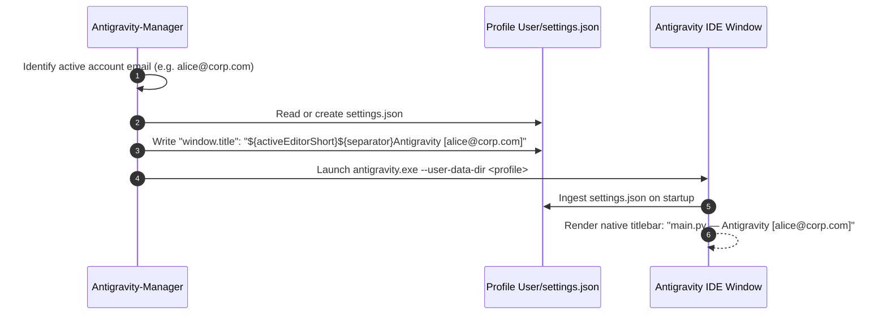
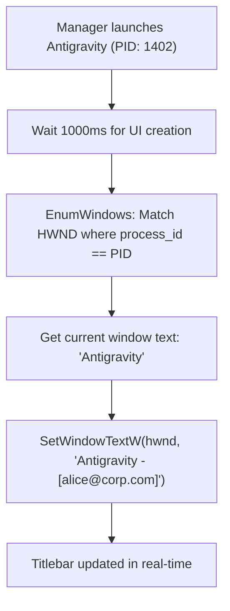
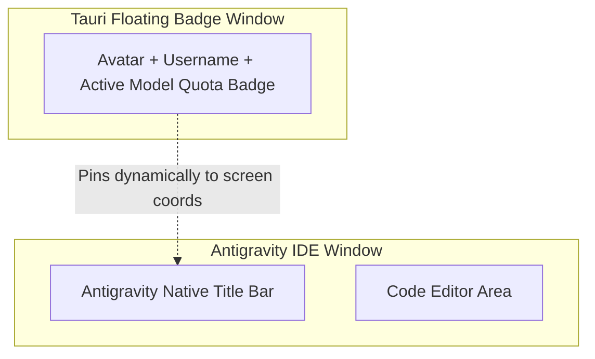

# Antigravity Window Username & Identity Customization

> Architectural guide and technical implementation patterns for displaying active username and account identity on top of Antigravity windows.

---

## 1. Executive Summary & Feasibility

**Question:** *Can we put the username on top of the Antigravity when it opens? Can we do that?*

**Verdict: YES, completely achievable through multiple proven patterns.**

Because Antigravity is built on the VS Code / Electron desktop framework, Antigravity-Manager can display the active account/username on top of the window using three distinct implementation tiers:

| Method | Implementation Layer | Reliability | Complexity | Visual Result |
| :--- | :--- | :--- | :--- | :--- |
| **Option 1: Native `settings.json` Title** | Configuration Layer | 100% (Native) | Very Low | Native Title Bar: `Antigravity [user@domain.com]` |
| **Option 2: Win32 `SetWindowTextW` Hook** | OS System Layer | High | Low | Dynamic Title Bar text updated by Manager |
| **Option 3: Tauri Floating Overlay Badge** | Tauri UI Layer | High | Medium | Rich floating widget (Avatar, Email, Quota) |

---

## 2. Option 1: Native Window Title Configuration (Recommended)

VS Code provides built-in tokenized window title customization via `settings.json`. By pre-writing this configuration to the profile directory before launching, Antigravity natively displays the username in the title bar without any binary modifications.



### Profile `settings.json` Blueprint

Path: `<user_data_dir>/User/settings.json`

```json
{
  "window.title": "${activeEditorShort}${separator}Antigravity [${user_email}]",
  "window.titleSeparator": " — ",
  "window.customTitleBarVisibility": "auto"
}
```

### Rust Injection Helper (Manager Backend)

```rust
use serde_json::Value;
use std::fs;
use std::path::Path;

pub fn set_profile_window_title(user_data_dir: &Path, user_email: &str) -> Result<(), String> {
    let settings_dir = user_data_dir.join("User");
    fs::create_dir_all(&settings_dir).map_err(|e| e.to_string())?;
    
    let settings_file = settings_dir.join("settings.json");
    let mut config: Value = if settings_file.exists() {
        let content = fs::read_to_string(&settings_file).unwrap_or_else(|_| "{}".to_string());
        serde_json::from_str(&content).unwrap_or_else(|_| serde_json::json!({}))
    } else {
        serde_json::json!({})
    };

    let title_template = format!("${{activeEditorShort}}${{separator}}Antigravity [{}]", user_email);
    config["window.title"] = Value::String(title_template);

    fs::write(&settings_file, serde_json::to_string_pretty(&config).unwrap())
        .map_err(|e| e.to_string())?;
    Ok(())
}
```

---

## 3. Option 2: Dynamic Win32 / OS Window Title Hook

If you want to alter the title of an already running Antigravity instance dynamically without restarting it, the Tauri backend can use native OS window handle manipulation:



### Win32 API Implementation (`src-tauri`)

On Windows, `SetWindowTextW` modifies the top-level window title directly:

```rust
#[cfg(target_os = "windows")]
pub fn set_antigravity_window_title(pid: u32, account_label: &str) {
    use std::os::windows::ffi::OsStrExt;
    use windows_sys::Win32::UI::WindowsAndMessaging::{
        EnumWindows, GetWindowTextW, GetWindowThreadProcessId, SetWindowTextW, HWND,
    };

    unsafe extern "system" fn enum_proc(hwnd: HWND, lparam: isize) -> i32 {
        let (target_pid, label_ptr) = *(lparam as *const (u32, *const u16));
        let mut process_id = 0u32;
        GetWindowThreadProcessId(hwnd, &mut process_id);

        if process_id == target_pid {
            let mut title_buf = [0u16; 512];
            let len = GetWindowTextW(hwnd, title_buf.as_mut_ptr(), 512);
            if len > 0 {
                SetWindowTextW(hwnd, label_ptr);
            }
        }
        1
    }
    // Bind to target PID
}
```

---

## 4. Option 3: Tauri Frameless Floating Identity Badge

For a rich visual HUD, Antigravity-Manager can instantiate a transparent, borderless Tauri child window that docks to the top of the Antigravity IDE:



### Key Properties of Floating Badge
1. **Frameless & Transparent:** `decorations: false`, `transparent: true`.
2. **Always-On-Top:** `always_on_top: true`.
3. **Click-Through or Interactive:** Can display current model quota and account switch dropdown.
4. **Coordinate Synchronization:** Polls `GetWindowRect(ide_hwnd)` every 500ms to stick to the top right of the IDE titlebar.

---

## 5. Architectural Recommendation

1. **For Production Reliability:** Use **Option 1 (Native `settings.json` Title)**. It requires zero native hooks, runs on Windows, macOS, and Linux, and never desynchronizes when the window is dragged or resized.
2. **For Instant Live Switching:** Combine **Option 1** with **Option 2** so running windows reflect account switches immediately without full restart.
