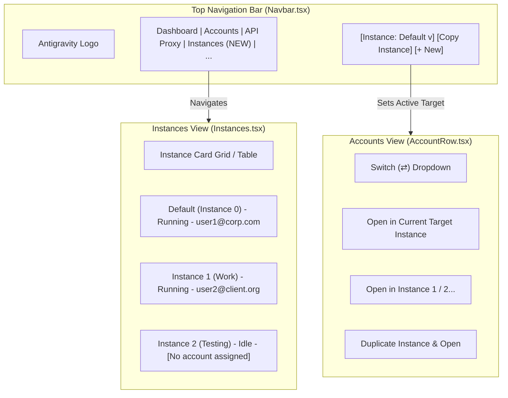
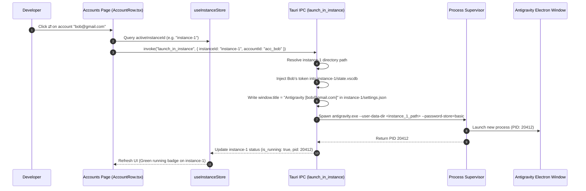

# Multi-Instance Manager & UI Workflow Specification

> Architectural specification for the multi-instance Antigravity management system, top-level instance controls, instance duplication, and per-account dispatching.

---

## 1. Problem Statement & Evolution

Currently, clicking the switch button (`⇄`) in `AccountRow.tsx` triggers `process::close_antigravity()`, which:
1. Terminates all running Antigravity processes across the entire machine.
2. Overwrites the single default database (`%APPDATA%\Antigravity\User\globalStorage\state.vscdb`).
3. Restarts a single instance.

This prevents developers from running multiple accounts concurrently. The new system introduces **First-Class Multi-Instance Orchestration**:
- Instances can be created, duplicated/copied, and launched simultaneously.
- An instance selector dropdown on the top navigation bar selects the active target instance.
- A dedicated **Instances Tab** provides full lifecycle management (create, duplicate, rename, clear, delete, bind account).
- The account switch button (`⇄`) allows switching inside the active instance or dispatching directly into a specific instance.

---

## 2. Target UI Architecture & User Experience



### 2.1 Top Navigation Bar Instance Selector

In `src/components/navbar/Navbar.tsx`, an instance control cluster is placed in the header:
1. **Instance Selector Dropdown:**
   - Shows currently selected target instance: `Default (Instance 0)`, `Instance 1`, `Instance 2`, etc.
   - Shows live execution pill: Green dot if the instance is currently running, grey if idle.
2. **Duplicate/Copy Instance Button (`Copy` Icon):**
   - Creates a new instance cloned from the active instance (copies settings and installed extensions).
3. **Quick Open/Focus Button:**
   - Launches or brings the selected instance to the foreground.

### 2.2 Dedicated "Instances" Tab (`src/pages/Instances.tsx`)

A dedicated tab mounted in the top navigation bar provides comprehensive instance control:
- **Instance Summary Cards:**
  - Instance Name & Identifier (`default`, `instance-1`, `instance-2`).
  - Active Bound Account (Email, Avatar, Pro/Ultra Quota badges).
  - Process State: `Running (PID: 14208)` vs `Idle`.
  - Storage Footprint: Directory path and disk usage size.
  - Port / Local Proxy Binding (if custom proxy port configured).
- **Actions per Instance:**
  - `Launch / Focus Window`: Starts the instance with its bound account.
  - `Terminate Process`: Gracefully closes *only* this specific instance.
  - `Clone / Duplicate`: Creates a copy with a new ID and directory.
  - `Reset Session / Wipe Token`: Clears authentication without deleting extensions.
  - `Delete Instance`: Removes profile directory and deregisters from manager.

---

## 3. Data Models & State Contracts

### Rust Backend Model (`src-tauri/src/models.rs`)

```rust
use serde::{Deserialize, Serialize};

#[derive(Debug, Clone, Serialize, Deserialize)]
pub struct AntigravityInstance {
    pub id: String,                    // e.g. "default", "inst_1726384910"
    pub name: String,                  // e.g. "Default", "Work Profile", "Client X"
    pub is_default: bool,              // true for the primary instance
    pub profile_path: String,          // Absolute path to user-data-dir
    pub assigned_account_id: Option<String>, // Bound account ID
    pub is_running: bool,              // Live process state
    pub pid: Option<u32>,              // OS Process ID if running
    pub last_launched_at: Option<i64>, // Epoch timestamp
    pub custom_args: Vec<String>,      // Optional extra flags
}
```

### TypeScript Zustand Store (`src/store/useInstanceStore.ts`)

```typescript
export interface InstanceStore {
    instances: AntigravityInstance[];
    activeInstanceId: string;
    isLoading: boolean;
    fetchInstances: () => Promise<void>;
    setActiveInstance: (id: string) => void;
    createInstance: (name: string) => Promise<string>;
    duplicateInstance: (sourceId: string, newName: string) => Promise<string>;
    deleteInstance: (id: string) => Promise<void>;
    launchInstance: (id: string, accountId?: string) => Promise<void>;
    terminateInstance: (id: string) => Promise<void>;
}
```

---

## 4. Account Switching & Launch Workflow



---

## 5. Directory Storage Standards

To prevent clutter and ensure cross-platform predictability, instance data is structured as follows:

- **Windows:** `%LOCALAPPDATA%\Antigravity-Manager\instances\<instance_id>\data\`
- **Linux / Ubuntu:** `~/.config/antigravity-manager/instances/<instance_id>/data/`
- **macOS:** `~/Library/Application Support/antigravity-manager/instances/<instance_id>/data/`

Inside each instance folder:
- `data/User/globalStorage/state.vscdb`: Isolated authentication & session DB.
- `data/User/settings.json`: Isolated settings and custom window title.
- `extensions/`: Isolated or symlinked extensions folder.
