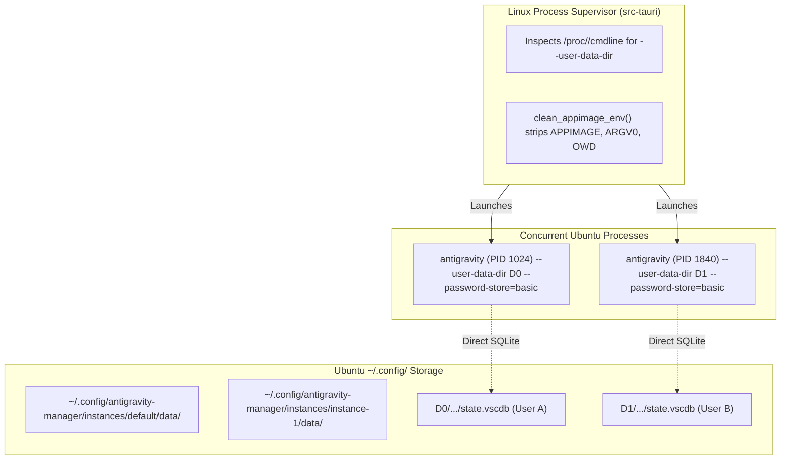

# 07. Ubuntu / Linux Parallel Instance Architecture

## Architecture & Linux Process Constraints

Running multiple concurrent Electron/Chromium instances on Linux (Ubuntu 22.04+ with Wayland and X11) requires addressing key operating system and container constraints.

### 1. Selective Process Filtering & Termination via `/proc/<pid>/cmdline`
- **The Problem**: Running `killall antigravity` or killing by process name kills all running instances simultaneously.
- **The Solution**:
  - Scan running processes. On Linux, inspect `/proc/<pid>/cmdline` to match the exact `--user-data-dir <instance_dir>` argument.
  - To stop an instance, send `kill -15 <pid>` specifically to the target instance PID and its direct children. Sibling instances running other profiles are never touched.

### 2. AppImage Environment Variable Sanitization
- **The Problem**: When running inside an AppImage, child processes inherit `APPIMAGE`, `ARGV0`, and `OWD`. If Antigravity is spawned, it may attempt to remount the parent container or execute within the wrong squashfs context.
- **The Solution**:
  - In `clean_appimage_env()`, strip `APPIMAGE`, `ARGV0`, `OWD`, `APPDIR`, and reset `LD_LIBRARY_PATH` / `PATH` prior to spawning child processes.

### 3. GNOME Keyring Bypass (`--password-store="basic"`)
- **The Problem**: GNOME Keyring / Secret Service stores credentials with a single key `service: gemini, username: antigravity`. If multiple instances read from GNOME Keyring, they collide on the same credentials.
- **The Solution**:
  - Launch Antigravity with `--password-store="basic"`. This instructs Chromium/Electron to isolate encryption keys inside each instance's local profile directory (`state.vscdb`), guaranteeing complete credential isolation.

### 4. Terminal CLI Multi-Profile Commands
- Support terminal invocation:
  - `antigravity-manager --create-profile <name>`
  - `antigravity-manager --list-profiles`
  - `antigravity-manager --copy-profile <source_id> <target_name>`
  - `antigravity-manager --delete-profile <id>`
  - `antigravity-manager --run-profile <id>`
