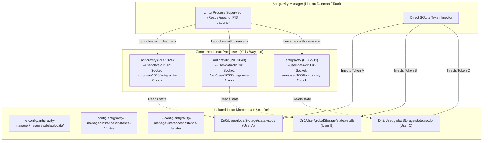

# Ubuntu & Linux Parallel Multi-Instance Architecture

> Authoritative engineering guide for running multiple concurrent, isolated Antigravity instances on Ubuntu and Debian-based Linux distributions.

---

## 1. Executive Summary & Linux Challenges

Running multiple instances of an Electron-based application on Linux introduces specific operating system constraints that do not exist on Windows:

| Area | Default Behavior on Linux | Failure Mode | Multi-Instance Solution |
| :--- | :--- | :--- | :--- |
| **Process Control** | `kill -15` / `killall antigravity` | Terminates all running instances across the desktop | Target PIDs by matching `--user-data-dir` in `/proc/<pid>/cmdline` |
| **Credential Keyring** | GNOME Keyring / `secret-tool` (`service: gemini`) | Single global key slot; instances overwrite each other's credentials | Pass `--password-store="basic"` to isolate tokens in profile SQLite DB |
| **AppImage Runtime** | Exports `APPIMAGE`, `ARGV0`, `OWD` | Child process spawns back into the parent AppImage mount point | Call `clean_appimage_env()` before spawning external child processes |
| **Single-Instance Mutex** | Named Unix domain socket in `/run/user/<uid>/` | Second launch activates window 1 instead of launching window 2 | Distinct `--user-data-dir` creates unique socket endpoints |

---

## 2. Linux Multi-Instance Architecture Diagram



---

## 3. Ubuntu Process Lifecycle & Selective Termination

### 3.1 Identifying Instance PIDs on Linux

In `src-tauri/src/modules/process.rs`, when running on Linux, the supervisor inspects the command line arguments of each process using `sysinfo::Process::cmd()`:

```rust
#[cfg(target_os = "linux")]
pub fn get_instance_pid(instance_dir: &std::path::Path) -> Option<u32> {
    let mut system = sysinfo::System::new();
    system.refresh_processes(sysinfo::ProcessesToUpdate::All);
    let target_needle = instance_dir.to_string_lossy();

    for (pid, process) in system.processes() {
        let cmd = process.cmd();
        let cmd_str = cmd.iter().map(|a| a.to_string_lossy()).collect::<Vec<_>>().join(" ");
        
        // Match only main processes that contain the specific instance directory argument
        if cmd_str.contains(&*target_needle) && !cmd_str.contains("--type=") {
            return Some(pid.as_u32());
        }
    }
    None
}
```

### 3.2 Selective Graceful Shutdown (`SIGTERM` -> `SIGKILL`)

When closing `instance-1`, the manager must **never** execute `killall antigravity`. It executes targeted signaling:
1. `kill -15 <pid>` (`SIGTERM`) sent exclusively to the matched PID.
2. Poll for exit up to 3 seconds.
3. If still running after timeout, send `kill -9 <pid>` (`SIGKILL`).
4. Other instances (e.g. `default`, `instance-2`) remain completely unaffected.

---

## 4. AppImage Environment Sanitization

If Antigravity is installed as an AppImage on Ubuntu, Electron inherits mount environment variables. Before spawning child instances, `clean_appimage_env` (already in `src-tauri/src/modules/process.rs:750`) must be called:

```rust
#[cfg(target_os = "linux")]
pub fn clean_appimage_env(cmd: &mut std::process::Command) {
    cmd.env_remove("APPIMAGE");
    cmd.env_remove("APPDIR");
    cmd.env_remove("ARGV0");
    cmd.env_remove("OWD");
}
```

This prevents the second instance from attempting to remount the existing AppImage runtime or redirecting into the existing process loop.

---

## 5. Linux Secret Service / Keyring Bypass

On Ubuntu desktop (GNOME/Ubuntu Desktop), Antigravity defaults to querying the FreeDesktop Secret Service via `libsecret` or `secret-tool` for service `gemini`.

Because GNOME Keyring only stores one password per `(service, username)` tuple:
1. Instance A writes `token_A` to `service: gemini, user: antigravity`.
2. Instance B writes `token_B` to the same slot, overwriting Instance A.

### Solution: `--password-store="basic"`
By appending `--password-store="basic"` to the launch arguments on Linux:
- Electron switches from GNOME Keyring to local profile encryption.
- Credentials are stored directly in `<instance_dir>/data/User/globalStorage/state.vscdb`.
- Multiple Ubuntu instances run simultaneously with independent authentication states.

---

## 6. Linux Launch Command Reference

When launching an instance on Ubuntu, the generated execution command is:

```bash
/usr/bin/antigravity \
  --user-data-dir="$HOME/.config/antigravity-manager/instances/instance-1/data" \
  --extensions-dir="$HOME/.config/antigravity-manager/instances/instance-1/extensions" \
  --password-store="basic" \
  --new-window
```

For Wayland environments (Ubuntu 22.04+ default), add:
```bash
  --enable-features=UseOzonePlatform --ozone-platform=wayland
```
This ensures hardware-accelerated rendering and window titles work smoothly across all concurrent instances.
