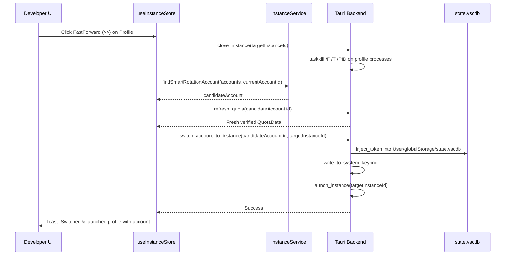

# Instance Smart Rotation & Account Switch Specification

## 1. Overview & Business Problem

When managing multiple Antigravity IDE profiles (such as `Default`, `Default Copy`, etc.), developers frequently need to rotate an active profile to an idle, high-capacity account without disrupting unrelated instances.

Previously, the FastForward (`>>`) action was ambiguously treated as a duplicate profile launch. The user specification explicitly defines the lifecycle for the FastForward button on an instance profile:

1. **Process Teardown by Location:** Gracefully terminate and force-kill all processes belonging to that specific instance profile directory/location (using tree-kill so renderer, extension host, and child processes never linger).
2. **Smart Candidate Account Scoring:** Scan the account registry to select the optimal account using a multi-factor ranking algorithm:
   - **Recency Filter (4-Hour Inactivity):** Accounts with zero usage in the past 4 hours (`last_used` > 4h ago or never used) receive highest priority.
   - **Refill Runway (Most Room):** Accounts with the longest runway until quota refill (e.g. 6 to 7 days until weekly refill) receive top scoring.
   - **Quota Headroom:** Accounts with the highest available quota percentage (100% remaining across Gemini and Claude models).
   - **Health & Eligibility:** Must be enabled, not forbidden, and not blocked by validation challenges.
   - **Active Exclusion:** The account currently bound to this target profile is excluded if alternative eligible accounts exist.
3. **Live Quota Refresh & Verification:** Perform a live quota refresh against Google servers on the selected candidate to confirm credentials are valid, unrevoked, and have verified quota.
4. **Isolated SQLite Token Injection & Launch:** Directly inject authentication tokens into `{data_dir}/User/globalStorage/state.vscdb` and update the system keyring, bind the account to the profile, and relaunch the instance.

## 2. Process Teardown Architecture

### A. Process Identification
To guarantee that only the specific profile's processes are terminated:
- Cross-reference running processes against the target profile's `data_dir`.
- Check command-line arguments for `--user-data-dir` containing normalized `clean_target` path.
- Check process executable path against custom `executable_path` (e.g. `Antigravity-{instance_id}.exe`).
- For the `Default` profile, check processes lacking explicit `--user-data-dir` parameters.

### B. Tree-Kill Process Termination
On Windows:
```cmd
taskkill /F /T /PID {pid}
```
The `/T` flag terminates the root process and all child processes (renderers, language servers, terminal hosts).
On Unix/Linux/macOS:
```bash
kill -15 {pid}
```
followed by SIGKILL after timeout.

### C. Teardown Synchronization
Wait synchronously for process exit before initiating SQLite database modification to prevent database lock conflicts (`SQLITE_BUSY`) or write stomping.

## 3. Candidate Account Scoring Algorithm

The candidate scoring function `findSmartRotationAccount(accounts, currentAccountId)` evaluates all registered accounts:

```text
Score = BaseScore + RecencyScore + RunwayScore + HeadroomScore + TierScore
```

### A. Eligibility Filter
An account is eligible if and only if:
- `!account.disabled`
- `!account.quota?.is_forbidden`
- `!account.validation_blocked`
- If more than 1 eligible account exists, `account.id !== currentAccountId`.

### B. Factor 1: 4-Hour Inactivity Bonus (Recency)
- If `!account.last_used || account.last_used === 0`: +100,000 points.
- If `(nowSec - account.last_used) >= 14400` (4 hours): +100,000 points + up to 20,000 points proportional to idle duration.
- If used within the last 4 hours: 0 points (or penalized).

### C. Factor 2: Refill Runway (Most Room)
- Calculate remaining time until quota reset from `reset_time` across models or weekly quota bucket.
- Days until refill `daysUntilReset = Math.floor(diffMs / 86,400,000)`.
- If `daysUntilReset >= 6` (e.g. 6 to 7 days): +50,000 points.
- Proportional bonus: `daysUntilReset * 8,000` points.

### D. Factor 3: Quota Headroom
- Evaluate remaining percentage across Gemini Pro, Gemini Flash, and Claude models.
- Average remaining percentage: `avgPercentage * 200` points (up to 20,000 points for 100% available).

### E. Factor 4: Subscription Tier Bonus
- Ultra tier: +3,000 points.
- Pro tier: +2,000 points.
- Free tier: 0 points.

## 4. Execution Workflow



## 5. UI Integration & User Experience

- **Navbar Active Profile Bar:** The FastForward button executes smart rotation on the active profile.
- **Profile Selector Dropdown:** Each profile row features the FastForward button to smart-rotate that specific profile.
- **Instances Management Page:** Each profile card includes the FastForward button with clear tooltip explaining the process teardown and candidate selection.
- **Feedback:** Displays informative toast indicating target account email, refill runway, and profile name.
