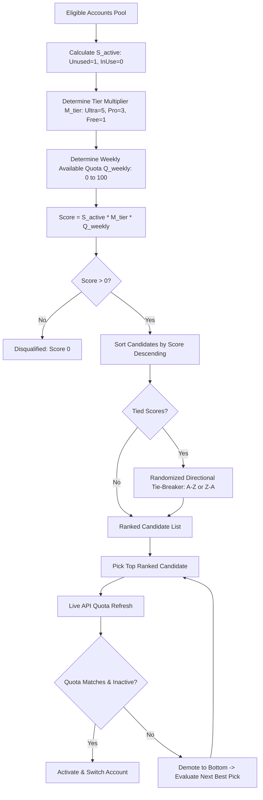

# Spec: Multiplicative Profile Candidate Scoring & Pre-Activation Verification

## Status: Approved
## Scope: Frontend (`src/services/instanceService.ts`, `src/stores/useInstanceStore.ts`) & Backend (`src-tauri/src/modules/auto_switcher.rs`)

---

## 1. Architectural Overview & Context

When switching Antigravity IDE instance profiles or performing auto-failover on quota depletion, the system must select an optimal candidate account from the user's registered Google accounts.

The previous additive model used static large point offsets (+100,000 pts for 4-hour idle recency, +50,000 for runway), which made it difficult to reason about real account utility and could inadvertently select accounts that were already bound to other running processes or had low quota headroom.

The **Multiplicative Candidate Scoring Algorithm** replaces arbitrary point additions with a deterministic multiplicative formula:

$$\text{FinalScore} = S_{\text{active}} \times M_{\text{tier}} \times Q_{\text{weekly}}$$



---

## 2. Visual Specification Reference


---

## 3. Mathematical Formula & Scoring Elements

### 3.1 Active / Used Factor ($S_{\text{active}}$)

- **Definition**: Indicates whether the account is currently bound to an active or running Antigravity instance.
- **Values**:
  - $S_{\text{active}} = 1$: Account is free, inactive, and not currently bound to any running workspace.
  - $S_{\text{active}} = 0$: Account is already in active use or locked by a running instance.
- **Mathematical Property**: Because multiplication by zero annihilates the entire composite score, any active account receives an unconditional score of $0$ without needing manual threshold checks.

### 3.2 Tier Multiplier ($M_{\text{tier}}$)

- **Definition**: Reflects the token limit capacity and service level of the Google Workspace / Gemini subscription tier.
- **Values**:
  - Ultra subscription: $M_{\text{tier}} = 5$
  - Pro subscription: $M_{\text{tier}} = 3$
  - Standard / Free tier: $M_{\text{tier}} = 1$

### 3.3 Weekly Available Quota Credits ($Q_{\text{weekly}}$)

- **Definition**: The percentage of remaining available quota credits for the current weekly period.
- **Calculation**:
  - If weekly available quota is 90%, $Q_{\text{weekly}} = 90$.
  - If weekly available quota is 50%, $Q_{\text{weekly}} = 50$.
  - If weekly available quota is 10%, $Q_{\text{weekly}} = 10$.
  - If weekly available quota is 0%, $Q_{\text{weekly}} = 0$.
- **Source**: Parsed from account quota models, prioritizing primary models (Gemini 3.8 Flash, Claude Sonnet 4.6).

### 3.4 Example Calculations

| Account Email | Active Status | Tier | Weekly Quota % | Calculation | Final Score | Rank |
| :--- | :---: | :---: | :---: | :---: | :---: | :---: |
| `alice@corp.com` | Unused ($1$) | Ultra ($5$) | $90\%$ ($90$) | $1 \times 5 \times 90$ | **450** | **#1 (Winner)** |
| `bob@corp.com` | Unused ($1$) | Pro ($3$) | $80\%$ ($80$) | $1 \times 3 \times 80$ | **240** | **#2** |
| `charlie@corp.com`| Unused ($1$) | Free ($1$) | $95\%$ ($95$) | $1 \times 1 \times 95$ | **95** | **#3** |
| `dave@corp.com` | Unused ($1$) | Pro ($3$) | $10\%$ ($10$) | $1 \times 3 \times 10$ | **30** | **#4** |
| `eve@corp.com` | In Use ($0$) | Ultra ($5$) | $100\%$ ($100$) | $0 \times 5 \times 100$ | **0** | **Disqualified** |

---

## 4. Tie-Breaking Mechanism

When two or more candidates achieve the identical score (e.g. two unused Pro accounts both having 80% quota = 240 pts):
1. The selector flips a pseudo-random coin ($50\%$ probability).
2. If heads ($< 0.5$), sort emails in **Ascending (A $\rightarrow$ Z)** order.
3. If tails ($\ge 0.5$), sort emails in **Descending (Z $\rightarrow$ A)** order.
4. This ensures that load is evenly distributed and the same account is not repeatedly depleted.

---

## 5. Pre-Activation Live Quota Verification & Demotion Loop

Selecting an account based on cached quota data carries the risk that credits were consumed by another CLI tool or session. Therefore:

1. **Step 1 — Candidate Selection**: Select the highest-ranked candidate account.
2. **Step 2 — Live Refresh**: Perform an asynchronous network call to fetch fresh quota metadata (`refreshQuota(accountId)`).
3. **Step 3 — Score Verification**:
   - Recompute $\text{Score}_{\text{fresh}}$ with the newly retrieved quota percentage.
   - Check if account has become active or if fresh weekly quota percentage dropped significantly ($> 15\%$ drift or depleted $< 10\%$).
4. **Step 4 — Decision**:
   - **Match & Valid**: Activate the account, inject credentials into `state.vscdb`, update keyring, and launch instance.
   - **Mismatch or Depleted**: Demote the candidate to the bottom of the candidate pool with score $0$ (or recalculated score), log an audit event, and evaluate the next best pick.

---

## 6. Input & Output Data Contracts

### 6.1 Input Data Contract
```typescript
interface SmartRotationInput {
    accounts: Account[];
    currentAccountId?: string;
    targetInstanceId?: string;
    activeInUseAccountIds: string[];
}
```

### 6.2 Output Data Contract
```typescript
interface MultiplicativeCandidateResult {
    account: Account;
    score: number;
    activeFactor: number; // 0 or 1
    tierMultiplier: number; // 1, 3, or 5
    weeklyQuotaPercent: number; // 0 - 100
    isVerified: boolean;
}
```

---

## 7. Domain Constraints & Custom Rules

1. **Rule 1 — Mathematical Annihilation**: Never use fallback offsets for active accounts. If an account is currently running in any instance, $S_{\text{active}} = 0$.
2. **Rule 2 — Implicit Boolean Conventions**: Boolean conditions in TypeScript and Rust must be implicit (`if (isActive)` / `if is_active`). Explicit true checks (`== true`) are strictly forbidden.
3. **Rule 3 — Strict Relative Git Paths**: Zero absolute paths or `file:///` URIs in any spec or code.
4. **Rule 4 — Banned Models**: Gemini 3.0 Flash and 3.1 Flash are explicitly excluded from quota calculations.
5. **Rule 5 — Non-Destructive Demotion**: Demoting a candidate during the pre-activation verification loop must not delete or alter the user's account configuration; it simply excludes it from the current rotation attempt.
