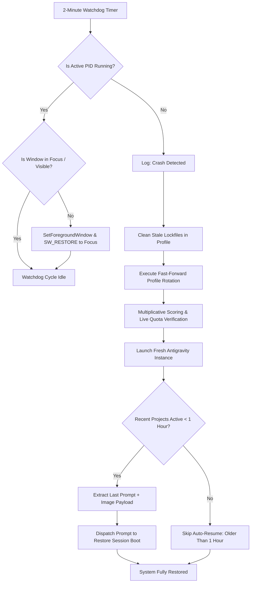

# Spec: IDE Crash Detection, PID Window Focus & Recent Prompt Auto-Resume

## Status: Approved
## Scope: Frontend (`src/services/instanceService.ts`, `src/stores/useInstanceStore.ts`, `src/components/settings/AutoSwitcherSettings.tsx`) & Backend (`src-tauri/src/modules/process.rs`, `src-tauri/src/modules/auto_switcher.rs`, `src-tauri/src/modules/repo_db.rs`, `src-tauri/src/commands/instance.rs`)

---

## 1. Architectural Overview & Context

When the Antigravity IDE crashes, freezes, or loses window focus, developers can be left with a blank or unresponsive desktop where Antigravity is not visible or has quietly terminated in the background:


This specification establishes an autonomous 2-minute watchdog daemon that:
1. Continuously tracks the active instance's PID.
2. Brings the IDE window into foreground focus if it is running but unfocused or minimized.
3. Automatically triggers the **Fast-Forward Profile Rotation** if the IDE process has terminated or crashed.
4. Inspects the SQLite Repo DB (`prompts.db`) to identify projects and prompts executed within the last hour (< 60 minutes).
5. Automatically redispatches the last prompt and image payload to restore the developer's boot process.



---

## 2. Visual Specification Reference

- Screenshot: `assets/screenshots/ide-crash-recovery-auto-resume-01.png`
- Captured state: IDE window crashed/hidden; Windows taskbar shows icon with no foreground window rendered.

---

## 3. Core Domain Requirements

### 3.1 2-Minute Crash & Focus Watchdog
- The background watcher executes every 120 seconds.
- Inspects the active instance configuration from the SQLite registry.
- If PID is alive:
  - On Windows, uses Win32 `SetForegroundWindow` and `ShowWindow(SW_SHOW / SW_RESTORE)` if requested.
- If PID is absent or process terminated:
  - Cleans stale lockfiles (`clean_antigravity_lockfiles`).
  - Automatically triggers the fast-forward profile rotation.

### 3.2 Fast-Forward Recovery Selection
- Evaluates candidate accounts using the multiplicative formula:
  $$\text{Score} = S_{\text{active}} \times M_{\text{tier}} \times Q_{\text{weekly}}$$
- Runs live pre-activation quota verification (`refreshQuota`).
- Injects verified credentials into `state.vscdb`.
- Launches the IDE instance with `--new-window` and detached process flags.

### 3.3 Recent Prompt & Project Auto-Resume (< 1 Hour Threshold)
- Query `prompts.db` for running projects and prompts associated with the instance.
- **Recency Condition**:
  - `(now_sec - last_detected_at) < 3600` (strictly less than 1 hour).
  - Prompts from $> 1$ hour ago, 2 hours, 5 hours, or 1 day ago are strictly skipped to avoid re-triggering stale or obsolete work.
- **Payload Extraction**:
  - Extracts prompt content and attached image URI / base64 payload.
- **Dispatch**:
  - Automatically writes or dispatches to the workspace prompt queue to spin up the boot process immediately upon relaunch.

---

## 4. Input & Output Contracts

### 4.1 Watchdog Config Contract
```typescript
export interface CrashRecoveryConfig {
    enabled: boolean;
    check_interval_seconds: number; // default: 120 (2 minutes)
    auto_focus_window: boolean;
    auto_resume_prompts: boolean;
    prompt_recency_threshold_seconds: number; // default: 3600 (1 hour)
}
```

### 4.2 Auto-Resume Output Contract
```typescript
export interface AutoResumeResult {
    instance_id: string;
    account_email: string;
    resumed_project_count: number;
    skipped_project_count: number;
    resumed_prompts: Array<{
        project_id: string;
        repo_path: string;
        prompt_preview: string;
        has_image: boolean;
    }>;
}
```

---

## 5. Domain Constraints & Custom Rules

1. **Rule 1 — Recency Hard Cutoff**: Never auto-resume prompts older than 1 hour (3600 seconds). Projects older than 1 hour must remain quiescent.
2. **Rule 2 — Implicit Booleans**: All conditional checks in TypeScript and Rust must be implicit (`if is_running` / `if (isRunning)`). Explicit true checks (`== true`) are strictly forbidden.
3. **Rule 3 — Strict Relative Git Paths**: Zero absolute paths or `file:///` URIs inside codebase documents or specifications.
4. **Rule 4 — Non-Blocking Watchdog**: Crash detection and focus recovery must never block the Axum proxy or Tauri event loop.
5. **Rule 5 — Windows Manifest Embed**: Test binaries on Windows must embed `windows-test.manifest` to resolve `0xc0000139` entrypoint compatibility with Common-Controls 6.0.
