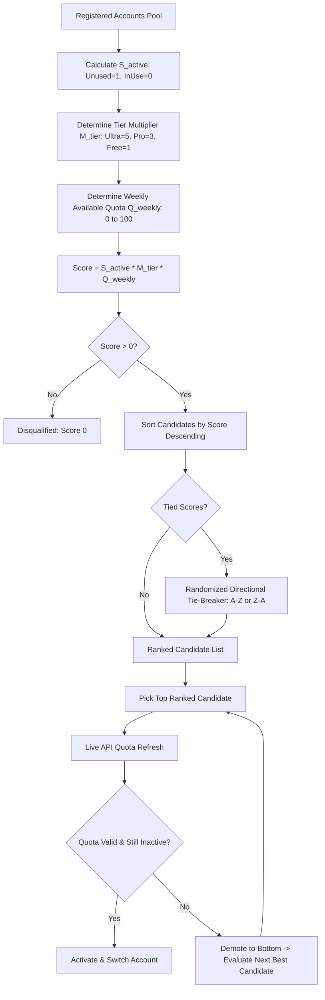

# Spec: Smart Profile Multiplicative Candidate Scoring Algorithm & Failover Verification

## Status: Approved & Active
## Scope: Multi-Instance Account Rotation, Auto-Switcher, Fast-Forward Account Selection
## Implementations:
- Frontend: `src/services/instanceService.ts`, `src/stores/useInstanceStore.ts`
- Backend: `src-tauri/src/modules/auto_switcher.rs`, `src-tauri/src/modules/instance_manager.rs`

---

## 1. Executive Summary

In Antigravity-Manager, when switching workspace profiles, recovering from IDE crashes, or triggering fast-forward account rotation upon quota exhaustion, the system must deterministically select an optimal candidate account from the user's pool of registered accounts.

The previous additive model relied on large arbitrary point offsets (+100,000 pts for 4-hour idle recency, +50,000 for runway), which caused edge-case misallocations and account starvation.

The **Multiplicative Candidate Scoring Algorithm** replaces arbitrary point additions with a bounded, zero-annihilating multiplicative formula:

$$\text{FinalScore} = S_{\text{active}} \times M_{\text{tier}} \times Q_{\text{weekly}}$$

---

## 2. Mathematical Definition & Scoring Components

### 2.1 Active / Used Factor ($S_{\text{active}}$)
- **Definition**: Indicates whether the account is currently bound to any running or active Antigravity IDE process.
- **Values**:
  - $S_{\text{active}} = 1$: Account is currently unused, free, and available for selection.
  - $S_{\text{active}} = 0$: Account is already in active use, bound to a workspace, or locked.
- **Mathematical Annihilation**: Multiplication by zero unconditionally drops active accounts to $0$ points without requiring separate filter stages.

### 2.2 Tier Multiplier ($M_{\text{tier}}$)
- **Definition**: Reflects the token limit headroom, priority tier, and model access limits of the Google Workspace / Gemini subscription.
- **Values**:
  - Ultra tier: $M_{\text{tier}} = 5$
  - Pro tier: $M_{\text{tier}} = 3$
  - Free / Standard tier: $M_{\text{tier}} = 1$

### 2.3 Weekly Available Quota Credits ($Q_{\text{weekly}}$)
- **Definition**: The percentage of remaining available quota credits for the current weekly evaluation period.
- **Values**: Integer or floating-point value from $0$ to $100$.
  - Account with $90\%$ available weekly quota: $Q_{\text{weekly}} = 90$.
  - Account with $50\%$ available weekly quota: $Q_{\text{weekly}} = 50$.
  - Account with $10\%$ available weekly quota: $Q_{\text{weekly}} = 10$.
  - Account with $0\%$ available weekly quota: $Q_{\text{weekly}} = 0$.

### 2.4 Representative Scoring Matrix

| Account | Status | Tier | Weekly Quota | Calculation | Final Score | Rank |
| :--- | :---: | :---: | :---: | :---: | :---: | :---: |
| `dev-ultra@corp.com` | Unused ($1$) | Ultra ($5$) | $90\%$ ($90$) | $1 \times 5 \times 90$ | **450** | **#1 (Selected)** |
| `dev-pro@corp.com` | Unused ($1$) | Pro ($3$) | $80\%$ ($80$) | $1 \times 3 \times 80$ | **240** | **#2** |
| `dev-free@gmail.com` | Unused ($1$) | Free ($1$) | $95\%$ ($95$) | $1 \times 1 \times 95$ | **95** | **#3** |
| `backup-pro@corp.com` | Unused ($1$) | Pro ($3$) | $10\%$ ($10$) | $1 \times 3 \times 10$ | **30** | **#4** |
| `active-ultra@corp.com` | In Use ($0$) | Ultra ($5$) | $100\%$ ($100$) | $0 \times 5 \times 100$ | **0** | **Disqualified** |

---

## 3. Pseudo-Random Directional Tie-Breaking Mechanism

When two or more candidate accounts yield identical scores (e.g. two unused Pro accounts each having 80% available quota yielding 240 pts):
1. The selector generates a pseudo-random boolean (coin flip, $p = 0.5$).
2. If heads ($< 0.5$): Candidates are sorted in **Ascending (A $\rightarrow$ Z)** order by email address.
3. If tails ($\ge 0.5$): Candidates are sorted in **Descending (Z $\rightarrow$ A)** order by email address.
4. **Benefit**: Eliminates alphabetical bias and ensures balanced wear across identical quota pools.

---

## 4. Pre-Activation Live Quota Verification & Demotion Loop

Before the selected top candidate is bound to an active IDE instance:
1. The selector queries the live Google Gemini API quota endpoint.
2. If the live query reveals that quota was consumed by an external tool (e.g. weekly remaining $< 5\%$), or if the account was claimed concurrently:
   - The candidate's score is immediately demoted to $0$.
   - The candidate is moved to the bottom of the evaluation pool.
   - The selector moves to the next highest-scoring candidate without interrupting the workflow.
