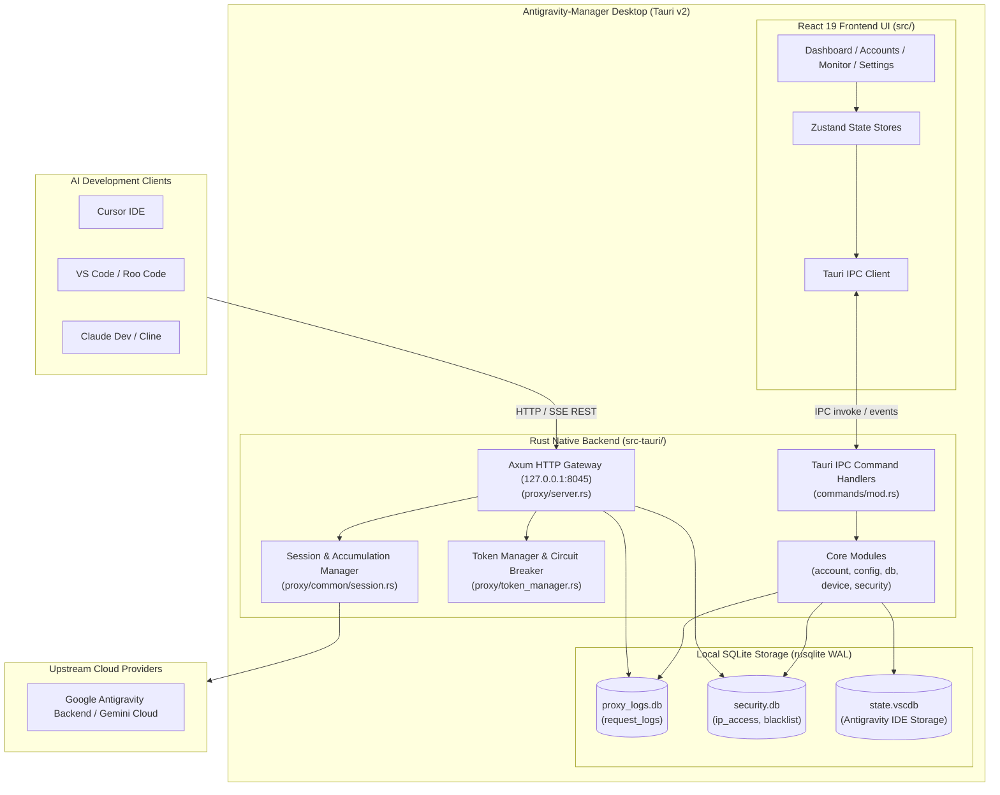

# Application Architecture, Component Topography, and System Specification

> **Specification Master Index:** `02-spec/21-app/01-index.md`
> **Application:** Antigravity-Manager (`lbjlaq/Antigravity-Manager`)
> **Version:** `4.7.0`
> **Reverse-Engineered:** 2026-09-10
> **Architectural Health Score:** **8.8 / 10**

---

## 1. Application Overview & Core Capabilities

**Antigravity-Manager** is a high-performance cross-platform desktop application and local reverse proxy gateway designed to orchestrate, balance, and monitor AI agent workflows connected to Google DeepMind's Antigravity platform.

### Core Capabilities
1. **Multi-Protocol Reverse Proxy:** Accepts OpenAI (`/v1/chat/completions`), Anthropic Claude (`/v1/messages`), and Google Gemini (`/v1beta/models/*`) requests, dynamically translating them into upstream Antigravity RPC calls.
2. **Account Quota Multiplexing & Rotation:** Balances high-frequency AI coding requests across an arbitrary pool of Google accounts, preventing 5-hour window or weekly quota depletion.
3. **Session ID Scoping & 1M Token Guard:** Overcomes upstream server-side token accumulation limits by fingerprinting conversation sessions and automatically incrementing generation counters upon reaching upstream ceilings.
4. **Resilient Circuit Breaking & Rate Limiting:** Intercepts HTTP 429 and temporary 503 errors, extracts `Retry-After` intervals, locks zero-quota accounts, and gracefully fails over to standby credentials.
5. **Real-Time Traffic Inspection:** High-speed SQLite-backed request logging with full-text payload search, token usage breakdowns, and SSE stream tracing.
6. **Device Hardware Fingerprinting:** Manages virtual hardware IDs (MAC, machine GUID) to avoid account linkage and ban cascading.

---

## 2. System Topography & Data Flow

---

## 3. Technology Stack Matrix

| Subsystem | Technology / Library | Version | Role in Architecture |
|---|---|:---:|---|
| **Desktop Shell** | Tauri (`tauri`, `tauri-build`) | `2.2.5` | Native window management, system tray, IPC bridge |
| **Backend Runtime** | Rust / Tokio | `1.x` | Asynchronous multi-threaded runtime |
| **HTTP Engine** | Axum / Hyper / Tower | `0.7 / 1.x` | High-throughput local REST & SSE streaming server |
| **HTTP Client** | Reqwest / Rquest | `0.12 / 5.1` | Upstream connection pooling with TLS & proxy support |
| **Database** | Rusqlite (Bundled SQLite 3) | `0.32` | Local WAL-mode persistent logging and security rules |
| **Logging / Trace** | Tracing (`tracing-subscriber`) | `0.3` | Structured asynchronous application logging |
| **Frontend Runtime** | React / React DOM | `19.1.0` | UI component rendering engine |
| **Routing** | React Router DOM | `7.10` | Client-side page navigation |
| **Build Toolchain** | Vite (`@vitejs/plugin-react`) | `7.0.4` | Ultra-fast frontend bundling and HMR |
| **Language** | TypeScript | `5.8.3` | Frontend type safety |
| **State Store** | Zustand | `5.0.9` | Decoupled reactive global state management |
| **Styling** | TailwindCSS / DaisyUI | `3.4 / 5.5` | Responsive atomic styling system |
| **UI Components** | Ant Design (`antd`) / Lucide | `5.24 / 0.56` | Desktop UI widgets, tables, modals, and iconography |
| **Visualizations** | Recharts | `3.5.1` | Real-time token consumption and quota charts |
| **Localization** | i18next / react-i18next | `25.7 / 16.5` | Multi-language translation engine (EN / ZH) |

---

## 4. Architectural Health Score: 8.8 / 10

### Health Evaluation Breakdown
- **Modularity & Separation of Concerns (9.2 / 10):** Excellent decoupling between the Axum reverse proxy engine, protocol mappers, Tauri command layer, and React frontend.
- **Concurrency & Resource Management (9.0 / 10):** Effective use of Tokio tasks, atomic Arc/RwLock state management, and SQLite WAL mode with 5-second busy timeouts to prevent lock starvation.
- **Error Handling & Fault Tolerance (8.8 / 10):** Upstream errors (429, 503, 400 token accumulation) are intercepted and translated into actionable downstream responses with `Retry-After` headers and automatic session generation increments.
- **Type Safety & Data Integrity (9.0 / 10):** Comprehensive Rust structs (`serde`) and TypeScript interfaces across the IPC boundary.
- **Security Posture (7.8 / 10):** Solid localhost binding and parameterized SQL queries, offset by embedded Google OAuth client secrets and optional proxy API key authentication (detailed in `02-security-and-risks.md`).

---

## 5. Generated Specification Directory Index

The complete reverse-engineered architecture is documented across the following modular specifications:

| Specification Document | Focus Area | Key Architectural Contracts |
|---|---|---|
| [02-security-and-risks.md](02-security-and-risks.md) | Security Audit & Risk Assessment | Hardcoded secrets, CORS posture, credential encryption, and risk tiers |
| [03-proxy-engine-and-protocols.md](03-proxy-engine-and-protocols.md) | Proxy Engine & Protocols | Protocol translation (OpenAI, Claude, Gemini), SSE streaming, and 1M token guard |
| [04-modules-storage-and-persistence.md](04-modules-storage-and-persistence.md) | Backend Modules & Database | Rusqlite WAL schemas, account pool rotation, OAuth lifecycle, and device profiles |
| [05-frontend-ui-and-state-management.md](05-frontend-ui-and-state-management.md) | Frontend UI & Design System | React 19 architecture, Tailwind components, Zustand stores, and Recharts |
| [06-api-contracts-and-ipc-registry.md](06-api-contracts-and-ipc-registry.md) | API Contracts & IPC Registry | Complete Tauri IPC command tables, HTTP gateway routes, and payload shapes |

---

## 6. Verification & Conformance Criteria

- **AC-APP-001 (IPC Conformance):** All frontend service calls in `src/services/` map directly to declared backend commands in `src-tauri/src/commands/mod.rs`.
- **AC-APP-002 (Proxy Conformance):** Endpoints `/v1/chat/completions`, `/v1/messages`, and `/v1beta/models/*` return valid OpenAI/Anthropic/Gemini compliant responses or structured error envelopes.
- **AC-APP-003 (Storage Conformance):** Database connections must always execute with `PRAGMA journal_mode = WAL` and `PRAGMA busy_timeout = 5000`.
