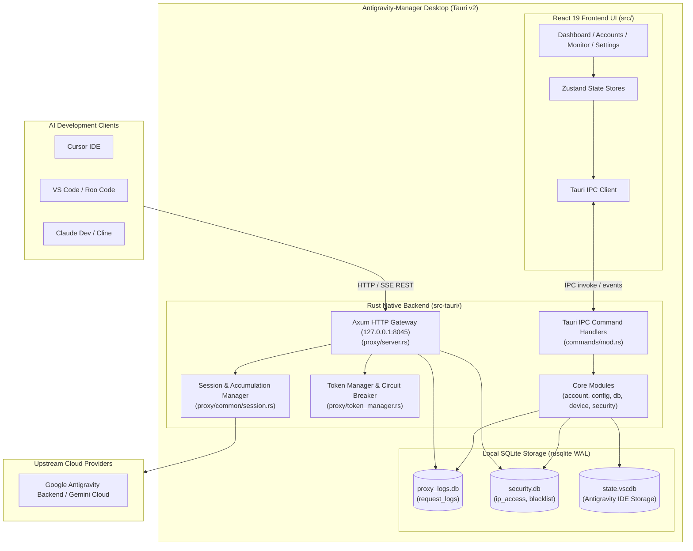

# Application Architecture, Component Topography, and System Specification

> **Specification Master Index:** `02-spec/21-app/01-index.md`
> **Application:** Antigravity-Manager (`lbjlaq/Antigravity-Manager`)
> **Version:** `4.7.0`
> **Reverse-Engineered:** 2026-09-10
> **Architectural Health Score:** **8.8 / 10**

---

## 1. Application Overview & Core Capabilities

**Antigravity-Manager** is a high-performance cross-platform desktop application and local reverse proxy gateway designed to orchestrate, balance, and monitor AI agent workflows connected to Google DeepMind's Antigravity platform.

### Core Capabilities
1. **Multi-Protocol Reverse Proxy:** Accepts OpenAI (`/v1/chat/completions`), Anthropic Claude (`/v1/messages`), and Google Gemini (`/v1beta/models/*`) requests, dynamically translating them into upstream Antigravity RPC calls.
2. **Account Quota Multiplexing & Rotation:** Balances high-frequency AI coding requests across an arbitrary pool of Google accounts, preventing 5-hour window or weekly quota depletion.
3. **Session ID Scoping & 1M Token Guard:** Overcomes upstream server-side token accumulation limits by fingerprinting conversation sessions and automatically incrementing generation counters upon reaching upstream ceilings.
4. **Resilient Circuit Breaking & Rate Limiting:** Intercepts HTTP 429 and temporary 503 errors, extracts `Retry-After` intervals, locks zero-quota accounts, and gracefully fails over to standby credentials.
5. **Real-Time Traffic Inspection:** High-speed SQLite-backed request logging with full-text payload search, token usage breakdowns, and SSE stream tracing.
6. **Device Hardware Fingerprinting:** Manages virtual hardware IDs (MAC, machine GUID) to avoid account linkage and ban cascading.

---

## 2. System Topography & Data Flow

---

## 3. Technology Stack Matrix

| Subsystem | Technology / Library | Version | Role in Architecture |
|---|---|:---:|---|
| **Desktop Shell** | Tauri (`tauri`, `tauri-build`) | `2.2.5` | Native window management, system tray, IPC bridge |
| **Backend Runtime** | Rust / Tokio | `1.x` | Asynchronous multi-threaded runtime |
| **HTTP Engine** | Axum / Hyper / Tower | `0.7 / 1.x` | High-throughput local REST & SSE streaming server |
| **HTTP Client** | Reqwest / Rquest | `0.12 / 5.1` | Upstream connection pooling with TLS & proxy support |
| **Database** | Rusqlite (Bundled SQLite 3) | `0.32` | Local WAL-mode persistent logging and security rules |
| **Logging / Trace** | Tracing (`tracing-subscriber`) | `0.3` | Structured asynchronous application logging |
| **Frontend Runtime** | React / React DOM | `19.1.0` | UI component rendering engine |
| **Routing** | React Router DOM | `7.10` | Client-side page navigation |
| **Build Toolchain** | Vite (`@vitejs/plugin-react`) | `7.0.4` | Ultra-fast frontend bundling and HMR |
| **Language** | TypeScript | `5.8.3` | Frontend type safety |
| **State Store** | Zustand | `5.0.9` | Decoupled reactive global state management |
| **Styling** | TailwindCSS / DaisyUI | `3.4 / 5.5` | Responsive atomic styling system |
| **UI Components** | Ant Design (`antd`) / Lucide | `5.24 / 0.56` | Desktop UI widgets, tables, modals, and iconography |
| **Visualizations** | Recharts | `3.5.1` | Real-time token consumption and quota charts |
| **Localization** | i18next / react-i18next | `25.7 / 16.5` | Multi-language translation engine (EN / ZH) |

---

## 4. Architectural Health Score: 8.8 / 10

### Health Evaluation Breakdown
- **Modularity & Separation of Concerns (9.2 / 10):** Excellent decoupling between the Axum reverse proxy engine, protocol mappers, Tauri command layer, and React frontend.
- **Concurrency & Resource Management (9.0 / 10):** Effective use of Tokio tasks, atomic Arc/RwLock state management, and SQLite WAL mode with 5-second busy timeouts to prevent lock starvation.
- **Error Handling & Fault Tolerance (8.8 / 10):** Upstream errors (429, 503, 400 token accumulation) are intercepted and translated into actionable downstream responses with `Retry-After` headers and automatic session generation increments.
- **Type Safety & Data Integrity (9.0 / 10):** Comprehensive Rust structs (`serde`) and TypeScript interfaces across the IPC boundary.
- **Security Posture (7.8 / 10):** Solid localhost binding and predominantly parameterized SQL queries (with dynamic SQL formatting identified in `security_db.rs`), offset by embedded Google OAuth client secrets and optional proxy API key authentication (detailed in `02-security-and-risks.md`).

---

## 5. Generated Specification Directory Index

The complete reverse-engineered architecture is documented across the following modular specifications:

| Specification Document | Focus Area | Key Architectural Contracts |
|---|---|---|
| [02-security-and-risks.md](02-security-and-risks.md) | Security Audit & Risk Assessment | Hardcoded secrets, CORS posture, credential encryption, and risk tiers |
| [03-proxy-engine-and-protocols.md](03-proxy-engine-and-protocols.md) | Proxy Engine & Protocols | Protocol translation (OpenAI, Claude, Gemini), SSE streaming, and 1M token guard |
| [04-modules-storage-and-persistence.md](04-modules-storage-and-persistence.md) | Backend Modules & Database | Rusqlite WAL schemas, account pool rotation, OAuth lifecycle, and device profiles |
| [05-frontend-ui-and-state-management.md](05-frontend-ui-and-state-management.md) | Frontend UI & Design System | React 19 architecture, Tailwind components, Zustand stores, and Recharts |
| [06-api-contracts-and-ipc-registry.md](06-api-contracts-and-ipc-registry.md) | API Contracts & IPC Registry | Complete Tauri IPC command tables, HTTP gateway routes, and payload shapes |
| [07-testing-and-verification.md](07-testing-and-verification.md) | Testing & Fixture Specs | Automated test suites, sample wire fixtures, and CI execution targets |
| [08-refresh-token-capture-architecture.md](08-refresh-token-capture-architecture.md) | Token Capture & Discovery | 4 discovery pathways, SQLite protobuf extraction, OS keyring protocols, OAuth exchange |
| [09-multi-instance-profile-isolation.md](09-multi-instance-profile-isolation.md) | Multi-Instance Architecture | Process isolation, `--user-data-dir` partitioning, `--password-store=basic` keyring bypass |
| [10-window-username-overlay-guide.md](10-window-username-overlay-guide.md) | Window & Identity Customization | Displaying active account/username on IDE window titlebar via native settings and Win32 hooks |
| [11-portable-folder-copy-multi-user-guide.md](11-portable-folder-copy-multi-user-guide.md) | Portable Folder Copy & Multi-User | Copying Antigravity directories, portable mode (`data/`), independent instances |
| [12-multi-instance-manager-and-ui-specification.md](12-multi-instance-manager-and-ui-specification.md) | Multi-Instance UI Specification | Top navbar instance selector, `/instances` page, instance duplication, per-account dispatch |
| [13-ubuntu-linux-parallel-instance-architecture.md](13-ubuntu-linux-parallel-instance-architecture.md) | Ubuntu & Linux Parallelism | Linux multi-window execution, selective PID tree termination, AppImage environment sanitization |
| [14-automated-quota-polling-profile-switching-and-task-resumption.md](14-automated-quota-polling-profile-switching-and-task-resumption.md) | Auto Quota Polling & Task Recovery | Tokio polling daemon (15s–600s), low-quota threshold (<10%), best profile selection, task snapshot recovery |
| [15-account-rotation-api-endpoint.md](15-account-rotation-api-endpoint.md) | Account Rotation API & Split Repo DB | HTTP endpoints (/api/accounts/rotate), split repo database, running prompts backup & direct dispatch |
| [16-email-dispatch-mailbox-remote-management-and-split-security-db.md](16-email-dispatch-mailbox-remote-management-and-split-security-db.md) | Email Dispatch & Remote Control | Split database passwords vault, OpenSSH RSA identity, mailbox pool failover, and bidirectional remote control |
| [17-email-intelligence-acknowledgment-and-universal-import-export.md](17-email-intelligence-acknowledgment-and-universal-import-export.md) | Email Intelligence & Universal Import/Export | Inbound fuzzy typo resolution, immediate acknowledgment receipts, and universal settings import/export with reversible multi-pass Base64 obfuscation |
| [18-smart-multi-factor-scoring-pre-activation-refresh-and-ui-telemetry.md](18-smart-multi-factor-scoring-pre-activation-refresh-and-ui-telemetry.md) | Smart Multi-Factor Scoring & UI Telemetry | Multi-factor account scoring ($S_{\text{active}} \times M_{\text{tier}} \times Q_{\text{weekly}}$), randomized tie-breaking, pre-activation refresh verification loop, window controls ACL bridge, and XPath event tracking |

---

## 6. Normative Coding Guideline Bindings

All development, maintenance, and refactoring across the Antigravity-Manager codebase are bound to the following normative engineering standards and coding guidelines:

| # | Topic | Authority Specification | Key Enforced Standards |
|---|---|---|---|
| 1 | Canonical size tier | [`02-canonical-size-tier.md`](../02-coding-guidelines/02-canonical-size-tier.md) | Standard file line limits ($\le 300$ lines), micro-task isolation boundaries ($\le 100$ lines) |
| 2 | Boolean naming prefixes | [`02-naming-prefixes.md`](../02-coding-guidelines/01-cross-language/02-boolean-principles/02-naming-prefixes.md) | Mandatory `is_`, `has_`, `can_`, `should_` prefixes for all boolean variables, flags, and fields |
| 3 | Boolean guards + extraction | [`03-guards-and-extraction.md`](../02-coding-guidelines/01-cross-language/02-boolean-principles/03-guards-and-extraction.md) | Guard clauses with early returns for preconditions; compound condition extraction to booleans |
| 4 | Boolean params + conditions | [`04-parameters-and-conditions.md`](../02-coding-guidelines/01-cross-language/02-boolean-principles/04-parameters-and-conditions.md) | Implicit boolean evaluation; ban on explicit true comparisons and mixed-polarity `if` conditions |
| 5 | Boolean quick reference | [`05-quick-reference.md`](../02-coding-guidelines/01-cross-language/02-boolean-principles/05-quick-reference.md) | Standard reference matrix for positive boolean semantics and affirmative expression structure |
| 6 | Boolean exemptions + API | [`06-exemptions-and-api.md`](../02-coding-guidelines/01-cross-language/02-boolean-principles/06-exemptions-and-api.md) | Serialization and external SDK interop boundaries; internal mapping of wire boolean contracts |
| 7 | Boolean flag methods | [`24-boolean-flag-methods.md`](../02-coding-guidelines/01-cross-language/24-boolean-flag-methods.md) | Total ban on boolean flag parameters; split functions into semantic single-purpose procedures |
| 8 | No negatives | [`12-no-negatives.md`](../02-coding-guidelines/01-cross-language/12-no-negatives.md) | Positive naming conventions; ban on double-negative identifiers and negative boolean prefixes |
| 9 | Braces + nesting | [`02-braces-and-nesting.md`](../02-coding-guidelines/01-cross-language/04-code-style/02-braces-and-nesting.md) | Mandatory braces for control flow statements; limit nesting depth to maximum 1 indentation level |
| 10 | Conditions + extraction (style) | [`03-conditions-and-extraction.md`](../02-coding-guidelines/01-cross-language/04-code-style/03-conditions-and-extraction.md) | Extraction of complex inline conditional logic into self-documenting descriptive constants |
| 11 | Blank lines + spacing | [`04-blank-lines-and-spacing.md`](../02-coding-guidelines/01-cross-language/04-code-style/04-blank-lines-and-spacing.md) | Blank line preceding return statements in multi-line blocks; ban on consecutive empty lines |
| 12 | Function + type size | [`05-function-and-type-size.md`](../02-coding-guidelines/01-cross-language/04-code-style/05-function-and-type-size.md) | Compact single-responsibility functions ($\le 25$ lines); modular struct and type definitions |
| 13 | Multi-line formatting | [`06-multi-line-formatting.md`](../02-coding-guidelines/01-cross-language/04-code-style/06-multi-line-formatting.md) | Deterministic parameter wrapping, trailing commas in multiline structs, clean indent alignment |
| 14 | Code-style checklist | [`08-checklist.md`](../02-coding-guidelines/01-cross-language/04-code-style/08-checklist.md) | Pre-commit validation checklist covering braces, nesting, blank lines, and identifier naming |
| 15 | Nesting resolution | [`20-nesting-resolution-patterns.md`](../02-coding-guidelines/01-cross-language/20-nesting-resolution-patterns.md) | Inversion pattern, guard returns, table lookups, and sub-procedure decomposition techniques |
| 16 | Cyclomatic complexity | [`06-cyclomatic-complexity.md`](../02-coding-guidelines/01-cross-language/06-cyclomatic-complexity.md) | Strict ceiling on function cyclomatic complexity ($\le 10$); decompose nested branching logic |
| 17 | Code mutation avoidance | [`18-code-mutation-avoidance.md`](../02-coding-guidelines/01-cross-language/18-code-mutation-avoidance.md) | Immutable data transformations; construct-once objects; thread-safe atomic state transitions |
| 18 | Strict typing | [`13-strict-typing.md`](../02-coding-guidelines/01-cross-language/13-strict-typing.md) | Total ban on `any` in TypeScript; exhaustive pattern matching; strong type safety in Rust |
| 19 | Null-pointer safety | [`19-null-pointer-safety.md`](../02-coding-guidelines/01-cross-language/19-null-pointer-safety.md) | Safe optional unwrapping; explicit `Option<T>` matching in Rust; optional chaining in TypeScript |
| 20 | Key naming PascalCase | [`11-key-naming-pascalcase.md`](../02-coding-guidelines/01-cross-language/11-key-naming-pascalcase.md) | Standard PascalCase dictionary/DTO serialization keys across cross-language message boundaries |
| 21 | Test naming + structure | [`14-test-naming-and-structure.md`](../02-coding-guidelines/01-cross-language/14-test-naming-and-structure.md) | AAA structure (Arrange-Act-Assert); semantic test naming `should_behavior_when_condition` |
| 22 | File/folder naming | [`06-rust-csharp.md`](../02-coding-guidelines/08-file-folder-naming/06-rust-csharp.md) | Strictly lowercase repository filenames; kebab-case folders; snake_case Rust source files |
| 23 | Language rules (Rust / TS) | [`05-rust/`](../02-coding-guidelines/05-rust/01-index.md) & [`02-typescript/`](../02-coding-guidelines/02-typescript/01-index.md) | Native Tokio async idioms, Tauri IPC command contracts, React 19 Zustand store architectures |
| 24 | Error architecture | [`01-index.md`](../03-error-manage/01-index.md) | Structured error envelopes; domain error enums; prohibition of silent panics or swallowed errors |
| 25 | Error code registry | [`01-index.md`](../03-error-manage/03-error-code-registry/01-index.md) | Centralized error code taxonomy; machine-readable payload error codes across reverse proxy |
| 26 | Database conventions | [`01-index.md`](../04-database-conventions/01-index.md) | Parameterized queries; WAL journal mode; explicit 5000ms busy timeouts; foreign key integrity |
| 27 | CI pipeline + guards | [`02-ci-pipeline.md`](../12-cicd-pipeline-workflows/02-ci-pipeline.md) | Mandatory pre-flight linters, automated test suites, quality gates, and zero-bypass enforcement |
| — | Global Agent Directives | [`agents.md`](../../agents.md) | Strict lowercase filenames, relative git paths mandate, implicit boolean evaluation, no mixed polarity |

---

## 7. Verification & Conformance Criteria

- **AC-APP-001 (IPC Conformance):** All frontend service calls in `src/services/` map directly to declared backend commands in `src-tauri/src/commands/mod.rs`.
- **AC-APP-002 (Proxy Conformance):** Endpoints `/v1/chat/completions`, `/v1/messages`, and `/v1beta/models/*` return valid OpenAI/Anthropic/Gemini compliant responses or structured error envelopes.
- **AC-APP-003 (Storage Conformance):** Database connections must always execute with `PRAGMA journal_mode = WAL`, `PRAGMA busy_timeout = 5000`, `PRAGMA synchronous = NORMAL`, and `PRAGMA foreign_keys = ON`.
- **AC-APP-004 (Guideline Conformance):** All codebase modifications must conform to normative bindings in Section 6, with zero CI/CD lint violations.
