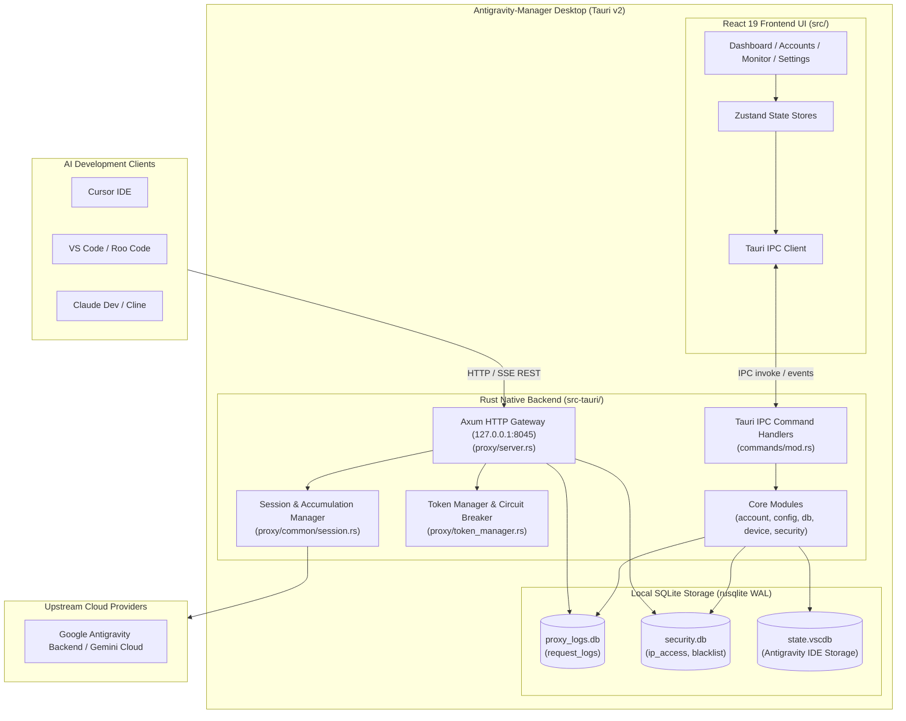

# Application Architecture, Component Topography, and System Specification

> **Specification Master Index:** `02-spec/21-app/01-index.md`
> **Application:** Antigravity-Manager (`lbjlaq/Antigravity-Manager`)
> **Version:** `4.7.0`
> **Reverse-Engineered:** 2026-09-10
> **Architectural Health Score:** **8.8 / 10**

---

## 1. Application Overview & Core Capabilities

**Antigravity-Manager** is a high-performance cross-platform desktop application and local reverse proxy gateway designed to orchestrate, balance, and monitor AI agent workflows connected to Google DeepMind's Antigravity platform.

### Core Capabilities
1. **Multi-Protocol Reverse Proxy:** Accepts OpenAI (`/v1/chat/completions`), Anthropic Claude (`/v1/messages`), and Google Gemini (`/v1beta/models/*`) requests, dynamically translating them into upstream Antigravity RPC calls.
2. **Account Quota Multiplexing & Rotation:** Balances high-frequency AI coding requests across an arbitrary pool of Google accounts, preventing 5-hour window or weekly quota depletion.
3. **Session ID Scoping & 1M Token Guard:** Overcomes upstream server-side token accumulation limits by fingerprinting conversation sessions and automatically incrementing generation counters upon reaching upstream ceilings.
4. **Resilient Circuit Breaking & Rate Limiting:** Intercepts HTTP 429 and temporary 503 errors, extracts `Retry-After` intervals, locks zero-quota accounts, and gracefully fails over to standby credentials.
5. **Real-Time Traffic Inspection:** High-speed SQLite-backed request logging with full-text payload search, token usage breakdowns, and SSE stream tracing.
6. **Device Hardware Fingerprinting:** Manages virtual hardware IDs (MAC, machine GUID) to avoid account linkage and ban cascading.

---

## 2. System Topography & Data Flow

```mermaid
flowchart TB
    subgraph ExternalClients ["AI Development Clients"]
        Cursor["Cursor IDE"]
        VSCode["VS Code / Roo Code"]
        ClaudeDev["Claude Dev / Cline"]
    end

    subgraph DesktopApp ["Antigravity-Manager Desktop (Tauri v2)"]
        subgraph Frontend ["React 19 Frontend UI (src/)"]
            UI["Dashboard / Accounts / Monitor / Settings"]
            Stores["Zustand State Stores"]
            IPCClient["Tauri IPC Client"]
            UI --> Stores --> IPCClient
        end

        subgraph BackendCore ["Rust Native Backend (src-tauri/)"]
            IPCHandlers["Tauri IPC Command Handlers\n(commands/mod.rs)"]
            ProxyServer["Axum HTTP Gateway (127.0.0.1:8045)\n(proxy/server.rs)"]
            SessionManager["Session & Accumulation Manager\n(proxy/common/session.rs)"]
            TokenManager["Token Manager & Circuit Breaker\n(proxy/token_manager.rs)"]
            Modules["Core Modules\n(account, config, db, device, security)"]
        end

        subgraph Persistence ["Local SQLite Storage (rusqlite WAL)"]
            ProxyDB[("proxy_logs.db\n(request_logs)")]
            SecurityDB[("security.db\n(ip_access, blacklist)")]
            IDEDB[("state.vscdb\n(Antigravity IDE Storage)")]
        end
    end

    subgraph UpstreamCloud ["Upstream Cloud Providers"]
        AntigravityBackend["Google Antigravity Backend / Gemini Cloud"]
    end

    ExternalClients -->|HTTP / SSE REST| ProxyServer
    ProxyServer --> SessionManager --> UpstreamCloud
    ProxyServer --> TokenManager
    ProxyServer --> ProxyDB
    ProxyServer --> SecurityDB
    IPCClient <-->|IPC invoke / events| IPCHandlers
    IPCHandlers --> Modules
    Modules --> IDEDB
    Modules --> ProxyDB
    Modules --> SecurityDB
```

---

## 3. Technology Stack Matrix

| Subsystem | Technology / Library | Version | Role in Architecture |
|---|---|:---:|---|
| **Desktop Shell** | Tauri (`tauri`, `tauri-build`) | `2.2.5` | Native window management, system tray, IPC bridge |
| **Backend Runtime** | Rust / Tokio | `1.x` | Asynchronous multi-threaded runtime |
| **HTTP Engine** | Axum / Hyper / Tower | `0.7 / 1.x` | High-throughput local REST & SSE streaming server |
| **HTTP Client** | Reqwest / Rquest | `0.12 / 5.1` | Upstream connection pooling with TLS & proxy support |
| **Database** | Rusqlite (Bundled SQLite 3) | `0.32` | Local WAL-mode persistent logging and security rules |
| **Logging / Trace** | Tracing (`tracing-subscriber`) | `0.3` | Structured asynchronous application logging |
| **Frontend Runtime** | React / React DOM | `19.1.0` | UI component rendering engine |
| **Routing** | React Router DOM | `7.10` | Client-side page navigation |
| **Build Toolchain** | Vite (`@vitejs/plugin-react`) | `7.0.4` | Ultra-fast frontend bundling and HMR |
| **Language** | TypeScript | `5.8.3` | Frontend type safety |
| **State Store** | Zustand | `5.0.9` | Decoupled reactive global state management |
| **Styling** | TailwindCSS / DaisyUI | `3.4 / 5.5` | Responsive atomic styling system |
| **UI Components** | Ant Design (`antd`) / Lucide | `5.24 / 0.56` | Desktop UI widgets, tables, modals, and iconography |
| **Visualizations** | Recharts | `3.5.1` | Real-time token consumption and quota charts |
| **Localization** | i18next / react-i18next | `25.7 / 16.5` | Multi-language translation engine (EN / ZH) |

---

## 4. Architectural Health Score: 8.8 / 10

### Health Evaluation Breakdown
- **Modularity & Separation of Concerns (9.2 / 10):** Excellent decoupling between the Axum reverse proxy engine, protocol mappers, Tauri command layer, and React frontend.
- **Concurrency & Resource Management (9.0 / 10):** Effective use of Tokio tasks, atomic Arc/RwLock state management, and SQLite WAL mode with 5-second busy timeouts to prevent lock starvation.
- **Error Handling & Fault Tolerance (8.8 / 10):** Upstream errors (429, 503, 400 token accumulation) are intercepted and translated into actionable downstream responses with `Retry-After` headers and automatic session generation increments.
- **Type Safety & Data Integrity (9.0 / 10):** Comprehensive Rust structs (`serde`) and TypeScript interfaces across the IPC boundary.
- **Security Posture (7.8 / 10):** Solid localhost binding and predominantly parameterized SQL queries (with dynamic SQL formatting identified in `security_db.rs`), offset by embedded Google OAuth client secrets and optional proxy API key authentication (detailed in `02-security-and-risks.md`).

---

## 5. Generated Specification Directory Index

The complete reverse-engineered architecture is documented across the following modular specifications:

| Specification Document | Focus Area | Key Architectural Contracts |
|---|---|---|
| [02-security-and-risks.md](02-security-and-risks.md) | Security Audit & Risk Assessment | Hardcoded secrets, CORS posture, credential encryption, and risk tiers |
| [03-proxy-engine-and-protocols.md](03-proxy-engine-and-protocols.md) | Proxy Engine & Protocols | Protocol translation (OpenAI, Claude, Gemini), SSE streaming, and 1M token guard |
| [04-modules-storage-and-persistence.md](04-modules-storage-and-persistence.md) | Backend Modules & Database | Rusqlite WAL schemas, account pool rotation, OAuth lifecycle, and device profiles |
| [05-frontend-ui-and-state-management.md](05-frontend-ui-and-state-management.md) | Frontend UI & Design System | React 19 architecture, Tailwind components, Zustand stores, and Recharts |
| [06-api-contracts-and-ipc-registry.md](06-api-contracts-and-ipc-registry.md) | API Contracts & IPC Registry | Complete Tauri IPC command tables, HTTP gateway routes, and payload shapes |
| [07-testing-and-verification.md](07-testing-and-verification.md) | Testing & Fixture Specs | Automated test suites, sample wire fixtures, and CI execution targets |
| [08-refresh-token-capture-architecture.md](08-refresh-token-capture-architecture.md) | Token Capture & Discovery | 4 discovery pathways, SQLite protobuf extraction, OS keyring protocols, OAuth exchange |
| [09-multi-instance-profile-isolation.md](09-multi-instance-profile-isolation.md) | Multi-Instance Architecture | Process isolation, `--user-data-dir` partitioning, `--password-store=basic` keyring bypass |
| [10-window-username-overlay-guide.md](10-window-username-overlay-guide.md) | Window & Identity Customization | Displaying active account/username on IDE window titlebar via native settings and Win32 hooks |
| [11-portable-folder-copy-multi-user-guide.md](11-portable-folder-copy-multi-user-guide.md) | Portable Folder Copy & Multi-User | Copying Antigravity directories, portable mode (`data/`), independent instances |
| [12-multi-instance-manager-and-ui-specification.md](12-multi-instance-manager-and-ui-specification.md) | Multi-Instance UI Specification | Top navbar instance selector, `/instances` page, instance duplication, per-account dispatch |
| [13-ubuntu-linux-parallel-instance-architecture.md](13-ubuntu-linux-parallel-instance-architecture.md) | Ubuntu & Linux Parallelism | Linux multi-window execution, selective PID tree termination, AppImage environment sanitization |
| [14-automated-quota-polling-profile-switching-and-task-resumption.md](14-automated-quota-polling-profile-switching-and-task-resumption.md) | Auto Quota Polling & Task Recovery | Tokio polling daemon (15s–600s), low-quota threshold (<10%), best profile selection, task snapshot recovery |
| [15-account-rotation-api-endpoint.md](15-account-rotation-api-endpoint.md) | Account Rotation API & Split Repo DB | HTTP endpoints (/api/accounts/rotate), split repo database, running prompts backup & direct dispatch |
| [16-email-dispatch-mailbox-remote-management-and-split-security-db.md](16-email-dispatch-mailbox-remote-management-and-split-security-db.md) | Email Dispatch & Remote Control | Split database passwords vault, OpenSSH RSA identity, mailbox pool failover, and bidirectional remote control |
| [17-email-intelligence-acknowledgment-and-universal-import-export.md](17-email-intelligence-acknowledgment-and-universal-import-export.md) | Email Intelligence & Universal Import/Export | Inbound fuzzy typo resolution, immediate acknowledgment receipts, and universal settings import/export with reversible multi-pass Base64 obfuscation |
| [18-smart-multi-factor-scoring-pre-activation-refresh-and-ui-telemetry.md](18-smart-multi-factor-scoring-pre-activation-refresh-and-ui-telemetry.md) | Smart Multi-Factor Scoring & UI Telemetry | Multi-factor account scoring ($S_{\text{active}} \times M_{\text{tier}} \times Q_{\text{weekly}}$), randomized tie-breaking, pre-activation refresh verification loop, window controls ACL bridge, and XPath event tracking |
| [19-inbound-email-remote-control-and-agm-cli.md](19-inbound-email-remote-control-and-agm-cli.md) | Inbound Email Remote Control & AGM Native Terminal CLI | Universal pipe-delimited email command grammar, 2-phase plaintext ACK/Result receipts, 10s sliding debounce stack, sender ACL, and native `agm` terminal CLI |
| [20-agm-cli-expanded-commands.md](20-agm-cli-expanded-commands.md) | AGM CLI Expanded Commands Suite | Extended CLI command suite (doctor, accounts, switch, prompts, proxy, sync, pull, clean, logs) mirroring GitMap |
| [21-pr4-upstream-sync-merge-and-architecture-protection.md](21-pr4-upstream-sync-merge-and-architecture-protection.md) | PR #4 Upstream Sync & Architecture Protection | Assimilating upstream features, preserving superior build/versioning/branding, and English translation |
| [22-ui-fluidity-email-remote-instance-fleet-fixes.md](22-ui-fluidity-email-remote-instance-fleet-fixes.md) | UI Fluidity & Email Remote Instance Fleet Fixes | UI fluidity, auto-dismiss banners, zero-delay account refresh, and remote instance fleet |
| [23-comprehensive-ui-quota-installer-and-settings-restoration.md](23-comprehensive-ui-quota-installer-and-settings-restoration.md) | Comprehensive UI, Quota & Settings Restoration | Quota 5-hour calculation fix, debounce protection, clean shortcut branding, and installer separation |
| [24-instance-duplicate-default-selector-and-security-ip-fixes.md](24-instance-duplicate-default-selector-and-security-ip-fixes.md) | Instance Duplicate, Default Selector & Security Fixes | Restore clone/duplicate buttons, single navbar button (Fast-Forward), configurable shortcut (Ctrl+Shift+F), and Security IP null fixes |
| [25-instance-delete-auto-switcher-navbar-and-plaintext-email-fixes.md](25-instance-delete-auto-switcher-navbar-and-plaintext-email-fixes.md) | Instance Delete, Auto-Switcher 300s/15%/12%, Navbar Consolidation & Plaintext Email Engine | Resilient instance deletion, PID/cmdline matching to stop open/close loop, 300s/60s/40s adaptive polling, Gemini 3.8 Flash High default, focus-stealing removal, and subject-driven plaintext email engine |
| [45-two-bar-installer-and-dwm-blank-ui-fix.md](45-two-bar-installer-and-dwm-blank-ui-fix.md) | Two-Bar Installer & DWM Blank UI Fix | GitHub release two-bar layout (Latest vs Pinned), installer history version recovery without drift, and Win32/WebView2 DWM blank UI elimination |
| [54-startup-auto-switch-and-rich-telemetry-broadcast.md](54-startup-auto-switch-and-rich-telemetry-broadcast.md) | Startup Auto-Switch Immediate Activation & Quota Telemetry | Startup quota check, dual-window balances (4H and weekly), JSON in-use self-broadcast |
| [55-idle-sensor-fix-and-gitmap-parity.md](55-idle-sensor-fix-and-gitmap-parity.md) | Idle Sensor Activity Determination, GitMap Telemetry & Typography | Anti-false-idle process sensing, GitMap metadata parity, commands/projects tables, 18px typography |
| [56-smart-switch-live-refresh-and-cluster-lease.md](56-smart-switch-live-refresh-and-cluster-lease.md) | Smart Switch Live Refresh, Strict 100% Quota Gate & Cluster Leases | Strict 100% 4H quota gate, disabled account filtering, pre-switch live verification, Supabase/Email distributed leases |
| [57-telegram-fleet-nodes-and-prompt-injection.md](57-telegram-fleet-nodes-and-prompt-injection.md) | Telegram Bot VM Cluster Fleet Nodes, Scoped Prompts & Chunking | Cluster nodes topology, scoped prompts inspection, remote prompt injection, 4000-char message chunking |
| [58-telegram-gitmap-fleet-commands-and-prompt-orchestrator.md](58-telegram-gitmap-fleet-commands-and-prompt-orchestrator.md) | Telegram & AGM GitMap AGY Parity, VM Fleet Orchestration & Remote Prompt Routing | Telegram remote commands parity, fleet status queries, and multi-VM prompt orchestration |
| [59-auto-switch-button-delegation-and-ide-alive.md](59-auto-switch-button-delegation-and-ide-alive.md) | Auto-Switch Button Delegation, Hot-Switch IDE Preservation & Tool Liveness | Manual switch button delegation to auto-switch engine, zero downtime profile swap |
| [60-supabase-connection-probe-and-url-normalization.md](60-supabase-connection-probe-and-url-normalization.md) | Supabase Connection Probe, URL Normalization & Resilient Diagnostics | Supabase URL parsing, HTTPS schema enforcement, and connection retry diagnostics |
| [62-windows-runner-build-acceleration-and-fast-forward.md](62-windows-runner-build-acceleration-and-fast-forward.md) | Windows Runner Build Acceleration & Fast-Forward Toolchain Optimization | Turbocharged Windows CI/CD builds, NASM toolchain optimization, and release gating |
| [63-fast-forward-prompt-backup.md](63-fast-forward-prompt-backup.md) | Fast-Forward Prompt Backup, Post-Switch Re-Injection & 12% Quota Threshold | Parallel prompt serialization, automatic restore on profile rotation, and 12% quota gate |
| [64-account-switch-e2e-prompt-backup-verification.md](64-account-switch-e2e-prompt-backup-verification.md) | Account Switch E2E Verification, Parallel Prompt Backup, Multi-VM Collision Prevention & 15% Threshold Release | Account switch end-to-end verification, collision prevention across VM fleet, and 15% threshold release |
| [65-update-all-json-cli-ui-help-prompt-verification.md](65-update-all-json-cli-ui-help-prompt-verification.md) | Update-All JSON & Fleet Sync, CLI/UI Help Polish, and Live Prompt Backup/Restore Verification | Machine-to-machine JSON contracts, help menu overhaul, and live prompt backup verification |
| [66-account-switch-98pct-simulation-e2e-and-instance-verification.md](66-account-switch-98pct-simulation-e2e-and-instance-verification.md) | Account Switch 98% Simulation E2E, Running Prompts Parallel Backup/Restore, Multi-VM Collision Shielding & Sandbox Lifecycle Verification | 98% threshold account switch simulation, non-invasive token consumption, pre-switch refresh verification |
| [67-gitmap-sug-overhaul-and-repo-secrets-consolidation.md](67-gitmap-sug-overhaul-and-repo-secrets-consolidation.md) | GitMap SUG Overhaul, Real-Time Web UI, Multi-Target PE & Repo Secrets Consolidation | Space-tolerant CLI, direct paths, help interception, AutoClearOnShutdown, web UI, multi-target PE, and repo-secrets cleanup |
| [68-account-switch-98pct-e2e-parallel-prompt-backup-and-instance-verification.md](68-account-switch-98pct-e2e-parallel-prompt-backup-and-instance-verification.md) | Account Switch 98% Simulation E2E, Parallel Prompt Backup/Restore, Multi-VM Collision Shielding & Sandbox Lifecycle Verification | 98% threshold account switch simulation, pre-switch refresh verification, collision avoidance via Supabase/Email leases, parallel prompt backup to SQLite, Fast-Forward delegation, and sandbox instance lifecycle |
| [69-smart-switch-quota-probe-json-email-telegram-projects-and-installer-fix.md](69-smart-switch-quota-probe-json-email-telegram-projects-and-installer-fix.md) | Smart Switch Quota Probe, Pure JSON Email Telemetry, Telegram Fleet Project Deduplication & Installer Resilience | Mandatory Google API candidate refresh, strict 100% quota gate (<100% is 0%), pure JSON email (zero HTML/CSS), normalized fields, Telegram deduplicated projects, fleet routing, and install.ps1 clean run |
| [02-gitmap-agm-tree-instance-swap-spec.md](02-gitmap-agm-tree-instance-swap-spec.md) | GitMap AGY Parity, Dual Bracketed Tree View (`[AGM:P001 \| GM:#1]`), Instance/Node Prompting & Multi-Instance Swap Isolation | Multi-instance Project -> Conversation -> 200-Word Prompt Tree View, dual AGM & GitMap Sequence IDs, `--instance` / `--node` prompt injection, multi-project workspace binding (`assign_project_to_instance`), and OS Keyring / `current_account_id` swap isolation |
| [71-status-telemetry-ui-and-email-header-overhaul.md](71-status-telemetry-ui-and-email-header-overhaul.md) | Status Telemetry UI & Email Header Overhaul | Header versioning, Windows machine name & alias, clean running/idle status, unquoted white text prompts, running elapsed time, auto-switch threshold, and expand command |
| [telegram-bot-setup-guide.md](telegram-bot-setup-guide.md) | Telegram Bot Setup & Automated PowerShell Guide | Guide and automated script for Telegram Bot creation, chat ID extraction, credential validation, and alert testing |

---

## 6. Normative Coding Guideline Bindings

All development, maintenance, and refactoring across the Antigravity-Manager codebase are bound to the following normative engineering standards and coding guidelines:

| # | Topic | Authority Specification | Key Enforced Standards |
|---|---|---|---|
| 1 | Canonical size tier | [`02-canonical-size-tier.md`](../02-coding-guidelines/02-canonical-size-tier.md) | Standard file line limits ($\le 300$ lines), micro-task isolation boundaries ($\le 100$ lines) |
| 2 | Boolean naming prefixes | [`02-naming-prefixes.md`](../02-coding-guidelines/01-cross-language/02-boolean-principles/02-naming-prefixes.md) | Mandatory `is_`, `has_`, `can_`, `should_` prefixes for all boolean variables, flags, and fields |
| 3 | Boolean guards + extraction | [`03-guards-and-extraction.md`](../02-coding-guidelines/01-cross-language/02-boolean-principles/03-guards-and-extraction.md) | Guard clauses with early returns for preconditions; compound condition extraction to booleans |
| 4 | Boolean params + conditions | [`04-parameters-and-conditions.md`](../02-coding-guidelines/01-cross-language/02-boolean-principles/04-parameters-and-conditions.md) | Implicit boolean evaluation; ban on explicit true comparisons and mixed-polarity `if` conditions |
| 5 | Boolean quick reference | [`05-quick-reference.md`](../02-coding-guidelines/01-cross-language/02-boolean-principles/05-quick-reference.md) | Standard reference matrix for positive boolean semantics and affirmative expression structure |
| 6 | Boolean exemptions + API | [`06-exemptions-and-api.md`](../02-coding-guidelines/01-cross-language/02-boolean-principles/06-exemptions-and-api.md) | Serialization and external SDK interop boundaries; internal mapping of wire boolean contracts |
| 7 | Boolean flag methods | [`24-boolean-flag-methods.md`](../02-coding-guidelines/01-cross-language/24-boolean-flag-methods.md) | Total ban on boolean flag parameters; split functions into semantic single-purpose procedures |
| 8 | No negatives | [`12-no-negatives.md`](../02-coding-guidelines/01-cross-language/12-no-negatives.md) | Positive naming conventions; ban on double-negative identifiers and negative boolean prefixes |
| 9 | Braces + nesting | [`02-braces-and-nesting.md`](../02-coding-guidelines/01-cross-language/04-code-style/02-braces-and-nesting.md) | Mandatory braces for control flow statements; limit nesting depth to maximum 1 indentation level |
| 10 | Conditions + extraction (style) | [`03-conditions-and-extraction.md`](../02-coding-guidelines/01-cross-language/04-code-style/03-conditions-and-extraction.md) | Extraction of complex inline conditional logic into self-documenting descriptive constants |
| 11 | Blank lines + spacing | [`04-blank-lines-and-spacing.md`](../02-coding-guidelines/01-cross-language/04-code-style/04-blank-lines-and-spacing.md) | Blank line preceding return statements in multi-line blocks; ban on consecutive empty lines |
| 12 | Function + type size | [`05-function-and-type-size.md`](../02-coding-guidelines/01-cross-language/04-code-style/05-function-and-type-size.md) | Compact single-responsibility functions ($\le 25$ lines); modular struct and type definitions |
| 13 | Multi-line formatting | [`06-multi-line-formatting.md`](../02-coding-guidelines/01-cross-language/04-code-style/06-multi-line-formatting.md) | Deterministic parameter wrapping, trailing commas in multiline structs, clean indent alignment |
| 14 | Code-style checklist | [`08-checklist.md`](../02-coding-guidelines/01-cross-language/04-code-style/08-checklist.md) | Pre-commit validation checklist covering braces, nesting, blank lines, and identifier naming |
| 15 | Nesting resolution | [`20-nesting-resolution-patterns.md`](../02-coding-guidelines/01-cross-language/20-nesting-resolution-patterns.md) | Inversion pattern, guard returns, table lookups, and sub-procedure decomposition techniques |
| 16 | Cyclomatic complexity | [`06-cyclomatic-complexity.md`](../02-coding-guidelines/01-cross-language/06-cyclomatic-complexity.md) | Strict ceiling on function cyclomatic complexity ($\le 10$); decompose nested branching logic |
| 17 | Code mutation avoidance | [`18-code-mutation-avoidance.md`](../02-coding-guidelines/01-cross-language/18-code-mutation-avoidance.md) | Immutable data transformations; construct-once objects; thread-safe atomic state transitions |
| 18 | Strict typing | [`13-strict-typing.md`](../02-coding-guidelines/01-cross-language/13-strict-typing.md) | Total ban on `any` in TypeScript; exhaustive pattern matching; strong type safety in Rust |
| 19 | Null-pointer safety | [`19-null-pointer-safety.md`](../02-coding-guidelines/01-cross-language/19-null-pointer-safety.md) | Safe optional unwrapping; explicit `Option<T>` matching in Rust; optional chaining in TypeScript |
| 20 | Key naming PascalCase | [`11-key-naming-pascalcase.md`](../02-coding-guidelines/01-cross-language/11-key-naming-pascalcase.md) | Standard PascalCase dictionary/DTO serialization keys across cross-language message boundaries |
| 21 | Test naming + structure | [`14-test-naming-and-structure.md`](../02-coding-guidelines/01-cross-language/14-test-naming-and-structure.md) | AAA structure (Arrange-Act-Assert); semantic test naming `should_behavior_when_condition` |
| 22 | File/folder naming | [`06-rust-csharp.md`](../02-coding-guidelines/08-file-folder-naming/06-rust-csharp.md) | Strictly lowercase repository filenames; kebab-case folders; snake_case Rust source files |
| 23 | Language rules (Rust / TS) | [`05-rust/`](../02-coding-guidelines/05-rust/01-index.md) & [`02-typescript/`](../02-coding-guidelines/02-typescript/01-index.md) | Native Tokio async idioms, Tauri IPC command contracts, React 19 Zustand store architectures |
| 24 | Error architecture | [`01-index.md`](../03-error-manage/01-index.md) | Structured error envelopes; domain error enums; prohibition of silent panics or swallowed errors |
| 25 | Error code registry | [`01-index.md`](../03-error-manage/03-error-code-registry/01-index.md) | Centralized error code taxonomy; machine-readable payload error codes across reverse proxy |
| 26 | Database conventions | [`01-index.md`](../04-database-conventions/01-index.md) | Parameterized queries; WAL journal mode; explicit 5000ms busy timeouts; foreign key integrity |
| 27 | CI pipeline + guards | [`02-ci-pipeline.md`](../12-cicd-pipeline-workflows/02-ci-pipeline.md) | Mandatory pre-flight linters, automated test suites, quality gates, and zero-bypass enforcement |
| — | Global Agent Directives | [`agents.md`](../../agents.md) | Strict lowercase filenames, relative git paths mandate, implicit boolean evaluation, no mixed polarity |

---

## 7. Verification & Conformance Criteria

- **AC-APP-001 (IPC Conformance):** All frontend service calls in `src/services/` map directly to declared backend commands in `src-tauri/src/commands/mod.rs`.
- **AC-APP-002 (Proxy Conformance):** Endpoints `/v1/chat/completions`, `/v1/messages`, and `/v1beta/models/*` return valid OpenAI/Anthropic/Gemini compliant responses or structured error envelopes.
- **AC-APP-003 (Storage Conformance):** Database connections must always execute with `PRAGMA journal_mode = WAL`, `PRAGMA busy_timeout = 5000`, `PRAGMA synchronous = NORMAL`, and `PRAGMA foreign_keys = ON`.
- **AC-APP-004 (Guideline Conformance):** All codebase modifications must conform to normative bindings in Section 6, with zero CI/CD lint violations.
- **AC-APP-022 (UI Fluidity & Fleet Invariants):** Implemented in [`22-ui-fluidity-email-remote-instance-fleet-fixes.md`](./22-ui-fluidity-email-remote-instance-fleet-fixes.md).
- **AC-APP-023 (Comprehensive UI, Quota & Settings Restoration):** Implemented in [`23-comprehensive-ui-quota-installer-and-settings-restoration.md`](./23-comprehensive-ui-quota-installer-and-settings-restoration.md).
- **AC-APP-024 (Instance Duplicate, Default Selector & Security Fixes):** Implemented in [`24-instance-duplicate-default-selector-and-security-ip-fixes.md`](./24-instance-duplicate-default-selector-and-security-ip-fixes.md).
- **AC-APP-025 (Instance Delete, Auto-Switcher 300s/15%/12%, Navbar & Plaintext Email):** Implemented in [`25-instance-delete-auto-switcher-navbar-and-plaintext-email-fixes.md`](./25-instance-delete-auto-switcher-navbar-and-plaintext-email-fixes.md).
- **AC-APP-043 (Email Threaded Replies, Auto-Switcher Verification, Machine Training REST API, and Settings UI/UX):** Implemented in [`43-email-autoswitch-training-settings-overhaul.md`](./43-email-autoswitch-training-settings-overhaul.md).
- **AC-APP-044 (Settings Hamburger UI, Machine Training REST API & E2E Verification):** Implemented in [`44-settings-hamburger-ui-and-system-e2e-verification.md`](./44-settings-hamburger-ui-and-system-e2e-verification.md).
- **AC-APP-045 (Two-Bar Release Installation & DWM Blank UI Elimination):** Implemented in [`45-two-bar-installer-and-dwm-blank-ui-fix.md`](./45-two-bar-installer-and-dwm-blank-ui-fix.md).
- **AC-APP-046 (CLI Expansion, Auto-Switch If Low Credit & Email Multi-VM Telemetry):** Implemented in [`46-cli-expansion-auto-switch-and-email-telemetry.md`](./46-cli-expansion-auto-switch-and-email-telemetry.md).
- **AC-APP-047 (Email Prompt Telemetry & Low-Credit Switch Query):** Implemented in [`47-email-prompt-telemetry-and-low-credit-switch-query.md`](./47-email-prompt-telemetry-and-low-credit-switch-query.md).
- **AC-APP-048 (Comprehensive CLI Verification & Auto-Switcher Invariants):** Implemented in [`48-comprehensive-cli-and-autoswitch-verification.md`](./48-comprehensive-cli-and-autoswitch-verification.md).
-**AC-APP-049 (CLI & Auto-Switcher Deep Verification & Execution Audit):** Implemented in [`49-cli-and-autoswitch-deep-verification-and-execution-audit.md`](./49-cli-and-autoswitch-deep-verification-and-execution-audit.md).
- **AC-APP-050 (Running Prompts Backup Restore & Green Watchers):** Implemented in [`50-running-prompts-backup-restore-and-green-watchers.md`](./50-running-prompts-backup-restore-and-green-watchers.md).
- **AC-APP-051 (Auto-Switch Prompt Backup, Resumption & De-Duplication):** Implemented in [`51-auto-switch-prompt-backup-resumption-and-deduplication.md`](./51-auto-switch-prompt-backup-resumption-and-deduplication.md).
- **AC-APP-052 (Idle Notification Logic Fix & AGM GitMap Parity):** Implemented in [`52-idle-notification-and-agm-parity.md`](./52-idle-notification-and-agm-parity.md).
- **AC-APP-053 (Telegram Bot Auto-Connect, Chat ID Discovery & Remote Command Suite):** Implemented in [`53-telegram-bot-auto-connect-and-remote-commands.md`](./53-telegram-bot-auto-connect-and-remote-commands.md).
- **AC-APP-054 (Startup Auto-Switch & Rich Telemetry Broadcast):** Implemented in [`54-startup-auto-switch-and-rich-telemetry-broadcast.md`](./54-startup-auto-switch-and-rich-telemetry-broadcast.md).
- **AC-APP-055 (Idle Sensor Fix & GitMap Parity):** Implemented in [`55-idle-sensor-fix-and-gitmap-parity.md`](./55-idle-sensor-fix-and-gitmap-parity.md).
- **AC-APP-056 (Smart Switch Live Refresh, Strict 100% Quota Gate & Multi-Channel Cluster Leasing):** Implemented in [`56-smart-switch-live-refresh-and-cluster-lease.md`](./56-smart-switch-live-refresh-and-cluster-lease.md).
- **AC-APP-057 (Telegram Bot VM Cluster Fleet Nodes, Scoped Prompts & Long-Message Chunking):** Implemented in [`57-telegram-fleet-nodes-and-prompt-injection.md`](./57-telegram-fleet-nodes-and-prompt-injection.md).
- **AC-APP-058 (Telegram & AGM GitMap AGY Parity, VM Fleet Orchestration & Remote Prompt Routing):** Implemented in [`58-telegram-gitmap-fleet-commands-and-prompt-orchestrator.md`](./58-telegram-gitmap-fleet-commands-and-prompt-orchestrator.md).
- **AC-APP-059 (Auto-Switch Button Delegation, Hot-Switch IDE Preservation & Tool Liveness):** Implemented in [`59-auto-switch-button-delegation-and-ide-alive.md`](./59-auto-switch-button-delegation-and-ide-alive.md).
- **AC-APP-060 (Supabase Connection Probe, URL Normalization & Resilient Diagnostics):** Implemented in [`60-supabase-connection-probe-and-url-normalization.md`](./60-supabase-connection-probe-and-url-normalization.md).
- **AC-APP-062 (Windows Runner Build Acceleration & Fast-Forward Toolchain Optimization):** Implemented in [`62-windows-runner-build-acceleration-and-fast-forward.md`](./62-windows-runner-build-acceleration-and-fast-forward.md).
- **AC-APP-063 (Fast-Forward Prompt Backup, Post-Switch Re-Injection & 12% Quota Threshold):** Implemented in [`63-fast-forward-prompt-backup.md`](./63-fast-forward-prompt-backup.md).
- **AC-APP-064 (Account Switch E2E Verification, Parallel Prompt Backup, Multi-VM Collision Prevention & 15% Threshold Release):** Implemented in [`64-account-switch-e2e-prompt-backup-verification.md`](./64-account-switch-e2e-prompt-backup-verification.md).
- **AC-APP-065 (Update-All JSON & Fleet Sync, CLI/UI Help Polish, and Live Prompt Backup/Restore Verification):** Implemented in [`65-update-all-json-cli-ui-help-prompt-verification.md`](./65-update-all-json-cli-ui-help-prompt-verification.md).
- **AC-APP-066 (Account Switch 98% Simulation E2E, Running Prompts Parallel Backup/Restore, Multi-VM Collision Shielding & Sandbox Lifecycle Verification):** Implemented in [`66-account-switch-98pct-simulation-e2e-and-instance-verification.md`](./66-account-switch-98pct-simulation-e2e-and-instance-verification.md).
- **AC-APP-067 (GitMap SUG Overhaul, Real-Time Web UI, Multi-Target PE & Repo Secrets Consolidation):** Implemented in [`67-gitmap-sug-overhaul-and-repo-secrets-consolidation.md`](./67-gitmap-sug-overhaul-and-repo-secrets-consolidation.md).
- **AC-APP-068 (Account Switch 98% Simulation E2E, Parallel Prompt Backup/Restore, Multi-VM Collision Shielding & Sandbox Lifecycle Verification):** Implemented in [`68-account-switch-98pct-e2e-parallel-prompt-backup-and-instance-verification.md`](./68-account-switch-98pct-e2e-parallel-prompt-backup-and-instance-verification.md).
- **AC-APP-069 (Smart Switch Quota Probe, Pure JSON Email Telemetry, Telegram Projects Deduplication & Installer Resilience):** Implemented in [`69-smart-switch-quota-probe-json-email-telegram-projects-and-installer-fix.md`](./69-smart-switch-quota-probe-json-email-telegram-projects-and-installer-fix.md).
- **AC-APP-071 (Status Telemetry UI, Windows Host & Alias, Plain White Text Prompts, Elapsed Runtime & Email Header Overhaul):** Implemented in [`71-status-telemetry-ui-and-email-header-overhaul.md`](./71-status-telemetry-ui-and-email-header-overhaul.md).

