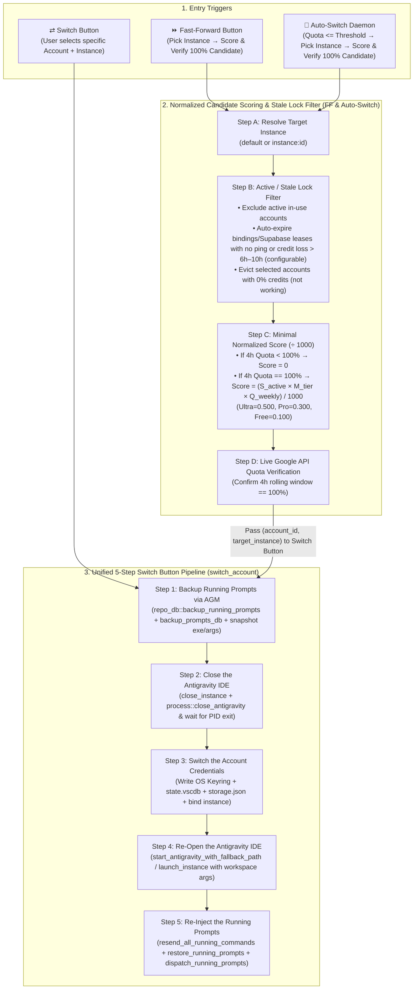

# 01 — Unified Account Switch, Fast-Forward, and Auto-Switch Architecture Specification

## 1. Verbatim User Requirements & Engineering Mandate

> "Good. So I am seeing the diagram that you have crafted for the switch and pass forward. Okay. So instance, first you pick the instance. Okay, all right. Then you do the algorithm to find who has the high score. Why you do plus 1,000, I don't understand. Probably I ask you to divide by 100 or 1,000. Why you are doing a plus 1,000, I don't know. So to have a minimal number, why we should have big number, right? I don't understand. Okay, anyone who has less than 100% quota, that would be zero. So in future, when we have the super base, then if something is already selected right now and not unchanged, that would be selected and have no credits, then it will be considered as not working. So when we include the super base, one thing we have to consider that even though we are selected on this machine or instance by another machine, let's say if a long time is passed, let's say five, six hours, and let's say it's not activated, then it would actually be marked as inactive automatically. If there is no ping or no credit loss, let's say for six hours or ten hours, configurable, if an account is bound to an instance or another machine, and nothing happened for 6 to 10 hours, it should be automatically considered inactive so it can be used.
>
> Then you do backup running prompt using AGM. Look at the mistake you made here! Where is the close? Before you switch the account, don't you have to close the Antigravity first? Where is the close logic? Did you see the close logic? Even inside the switch you don't have the close! You have to close the Antigravity IDE first, then switch the account, and then run the Antigravity IDE, and then inject the prompt! You are missing one logic: closing the Antigravity! Why do you not close the Antigravity? Without closing Antigravity, how are you going to switch the account? How are you going to reopen the Antigravity?
>
> Why don't you just use the Switch button?! Because the Switch button already has the mechanism to switch:
> 1. Backup running prompts using AGM
> 2. Close the Antigravity IDE
> 3. Switch the account
> 4. Re-open the Antigravity IDE
> 5. Re-inject the running prompts!
> Why are you writing the logic again for Fast-Forward and Auto-Switch? Why don't you just pick the account and pass that account to the Switch button?!"

---

## 2. Unified Architecture & 5-Step Switch Pipeline Diagram

Both **Fast-Forward (`⏩`)** and **Auto-Switch (`🔄`)** act purely as **Candidate Selection Engines** that pick the target instance and highest-scoring `100%` quota account, and then delegate directly to the **Switch Button (`⇄`) Pipeline**, which executes the mandatory **5-Step Switch Lifecycle** in strict sequence:

---

## 3. Normalized Candidate Scoring Specification (`÷ 1000`, No `+ 1000` Inflation)

1. **Strict `< 100%` Quota Zeroing**:
   - Any candidate account whose 4-hour/5-hour rolling window quota is `< 100%` receives a score of **`0` (`0.0`)**.
2. **Minimal Normalized Score (`÷ 1000`)**:
   - Instead of adding `+ 1000` or `+ 100000` bonuses, the multiplicative score is divided by `1000`:
     $$\text{Score} = \begin{cases} 0 & \text{if } Q_{4\text{h}} < 100\% \text{ or } S_{\text{active}} = 0 \\ \dfrac{S_{\text{active}} \times M_{\text{tier}} \times Q_{\text{weekly}}}{1000} & \text{if } Q_{4\text{h}} = 100\% \text{ and } S_{\text{active}} = 1 \end{cases}$$
   - Where:
     - $S_{\text{active}} \in \{0, 1\}$ (`1` if available or stale-expired; `0` if actively in use).
     - $M_{\text{tier}} \in \{5, 3, 1\}$ (`Ultra = 5`, `Pro = 3`, `Free = 1`).
     - $Q_{\text{weekly}} \in [0, 100]$ (7-day remaining quota percentage).
   - Resulting normalized score range is **`0.000` to `0.500`** (e.g. `0.5` for Ultra at 100% weekly, `0.3` for Pro at 100% weekly, `0.1` for Free at 100% weekly, `0` for `< 100%` 4h quota).

---

## 4. Stale / Inactive Binding & Supabase Lease Expiration (`6h`–`10h` Configurable)

1. **Configuration Field**:
   - `AutoProfileSwitcherConfig.stale_binding_timeout_hours: u32` (default: `6`, configurable e.g. `6` to `10` hours).
2. **Automatic Inactive Release**:
   - If an account is bound to a local instance or remote Supabase node (`workspace_leases` / cross-VM broadcast), and `now - last_activity > stale_binding_timeout_hours * 3600` seconds with no active local process, no ping, and no credit loss, the binding is automatically treated as **inactive** and removed from the exclusion list so the account can be selected.
3. **Zero-Credit Eviction**:
   - If an account currently selected on an instance has `0%` credits (`<= threshold`), it is considered **not working / exhausted** and rotated away.
