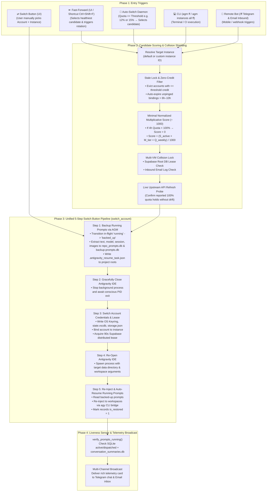

# 01 — Consolidated Canonical Specification: Unified Account Switch, Fast-Forward, and Parallel Prompt Backuping

> **/goal** Provide the definitive, consolidated single-source-of-truth specification for all AI agents and engineers on Account Switching, Fast-Forward (`ff`), Auto-Switching, and the Two-Phase Parallel Prompt Backuping & Restoration Pipeline.
> **/learn** Previously, requirements were fragmented across Specs 01, 39, 63, 64, 66, 68, 69, and 72. This document consolidates all rules, mathematical scoring models, database schemas, IDE process lifecycles, collision shielding mechanisms, and telemetry broadcasts into a unified, zero-ambiguity architectural standard.

**Version:** 2.0.0 (Consolidated Canonical)  
**Last Updated:** 2026-09-29  
**Status:** Canonical & Binding  
**Applies To:** Antigravity-Manager Desktop, AGM CLI (`agm`), GitMap Fleet CLI, Telegram Inbound, Email Inbound, Auto-Switcher Daemon

---

## 1. System Vision & Core Invariants

Antigravity-Manager acts as an intelligent supervisor over Antigravity agentic workflows across local workspaces and multi-instance sandboxes. When an account nears quota limits or rotation is triggered:
1. **Zero Prompt Loss Guarantee**: No prompt, conversational session, in-flight agent thought, queued task, or attached image payload may EVER be lost, dropped, or orphaned during account rotation.
2. **Unified Pipeline Mandate**: Fast-Forward (`⏩`), Auto-Switcher (`🔄`), CLI (`agm ff`), Telegram (`/ff`), and Email (`fast-forward:`) DO NOT implement independent rotation logic. They act strictly as **Candidate Selection Engines** that identify the target instance and highest-scoring `100%` quota account, then delegate directly to the **Unified 5-Step Switch Lifecycle**.
3. **Collision Shielding**: No two virtual machines (VMs) or nodes in the fleet may select or claim the same Google account simultaneously. Cross-VM coordination is enforced via Supabase Root DB distributed leases and Inbound Email collision locks.

---

## 2. Unified 5-Step Switch Lifecycle Architecture



---

## 3. Candidate Scoring & Invariant Rules

### 3.1. Strict 100% 4-Hour Rolling Quota Zeroing
- Any account whose 4-hour/5-hour rolling window quota is `< 100%` is assigned a score of **`0` (`0.0`)**.
- Only accounts with fully replenished **`100%` 4-hour quota** are eligible for automatic fast-forward promotion.

### 3.2. Minimal Normalized Multiplicative Scoring ($\div 1000$)
To prevent arbitrary bonus inflation, scores are normalized into a clean, floating-point range ($0.000$ to $0.500$):
$$\text{Score} = \begin{cases} 0.0 & \text{if } Q_{4\text{h}} < 100\% \text{ or } S_{\text{active}} = 0 \\ \dfrac{S_{\text{active}} \times M_{\text{tier}} \times Q_{\text{weekly}}}{1000} & \text{if } Q_{4\text{h}} = 100\% \text{ and } S_{\text{active}} = 1 \end{cases}$$

- $S_{\text{active}} \in \{0, 1\}$: `1` if account is available or stale-expired; `0` if actively bound/locked.
- $M_{\text{tier}} \in \{5, 3, 1\}$: Subscription multiplier (`Ultra = 5`, `Pro = 3`, `Free = 1`).
- $Q_{\text{weekly}} \in [0, 100]$: Remaining weekly quota percentage (runway).
- **Resulting Scores**:
  - Ultra with 100% weekly: $\frac{1 \times 5 \times 100}{1000} = \mathbf{0.500}$
  - Pro with 100% weekly: $\frac{1 \times 3 \times 100}{1000} = \mathbf{0.300}$
  - Free with 100% weekly: $\frac{1 \times 1 \times 100}{1000} = \mathbf{0.100}$
  - Any account with $< 100\%$ 4h quota: $\mathbf{0.000}$

### 3.3. Stale Lock Eviction & Configurable Expiration
- Configured via `auto_profile_switcher.stale_binding_timeout_hours` (default: `6`, range `6`–`10` hours).
- If an account has been bound to a VM node without process activity, credit loss, or heartbeats for $> 6$ hours, its binding lock is automatically cleared.
- An active account dropping to $\le 12\%$ (production default) is classified as exhausted and immediately evicted in favor of the highest-scoring candidate.

---

## 4. The Prompt Backuping ("Snapshotting") Subsystem

The backuping engine operates concurrently across memory, two dedicated SQLite databases, and workspace disk manifests:

### 4.1. The Dual Split SQLite Databases
1. **Live State Database: `repo_prompts.db`**
   - Tables: `running_projects`, `active_prompts`, `agm_project_sequences`.
   - Tracks live states: `running` $\rightarrow$ `backed_up` $\rightarrow$ `dispatched` $\rightarrow$ `completed`.
   - Clears memory cache [`reset_dispatched_prompts_cache()`](file:///d:/work/Antigravity-Manager/src-tauri/src/modules/repo_db.rs#L29-L33) upon backup to guarantee unblocked post-switch re-dispatch.
2. **Archival Batch Database: `backup-prompts.db`**
   - Tables: `backup_batches`, `prompt_backups`, `green_projects`.
   - Tracks versioned batches with a default 1-day retention policy (`retention_days: 1`).
   - Automatically prunes restored records older than 24 hours (`86400s`) via [`auto_cleanup_expired`](file:///d:/work/Antigravity-Manager/src-tauri/src/modules/backup_prompts_db.rs#L184-L206).

### 4.2. Multi-Layer Discovery Pipeline
- **Layer 1 (Core Antigravity Engine)**: Scans `~/.gemini/antigravity`, active conversation summaries, and trajectory logs for in-flight sessions.
- **Layer 2 (Workspace Storage)**: Scans IDE storage (`workspaceStorage/<hash>/state.vscdb`) for uncommitted chat queries.
- **Layer 3 (Repo Manifest)**: Writes and synchronizes `.antigravity_resume_task.json` inside each project root containing prompt text, session ID, target model, image paths, and `auto_boot: true`.

### 4.3. Multimodal Image & Attachment Preservation
- Prompts containing embedded Base64 data URIs (`data:image/...`) or local image paths are parsed via [`extract_image_payload_or_path`](file:///d:/work/Antigravity-Manager/src-tauri/src/modules/repo_db.rs#L335-L350).
- Flagged with `has_images: true`, and the binary payload or path list is serialized directly with the record so visual context is not lost during account switching.

### 4.4. Friendly Project Name Resolution
- Raw workspace hashes, system drives, and UUIDs are sanitized via [`resolve_friendly_project_name`](file:///d:/work/Antigravity-Manager/src-tauri/src/modules/backup_prompts_db.rs#L54-L77) into clean, human-readable repository basenames (e.g. `Antigravity-Manager`).

---

## 5. Post-Switch Re-injection, Auto-Resume & Liveness Sensor

1. **Re-injection Execution**:
   - Immediately following credential swap, [`resend_running_commands_for_instance`](file:///d:/work/Antigravity-Manager/src-tauri/src/modules/repo_db.rs#L1795-L1910) queries all prompts in `'backed_up'` state.
   - Re-injects prompts to active workspaces via the background `agy` CLI bridge.
   - Marks prompt status in `repo_prompts.db` as `'dispatched'` and in `backup-prompts.db` as `is_restored = 1`.
2. **Liveness Verification Sensor**:
   - Invokes [`verify_prompts_running()`](file:///d:/work/Antigravity-Manager/src-tauri/src/modules/repo_db.rs#L893-L943):
     1. Verifies that SQLite records show recent dispatch activity ($< 5\text{ min}$).
     2. Verifies that `conversation_summaries.db` confirms `not_fully_idle != 0` or active worker tasks.
     3. Confirms process table activity before broadcasting success.

---

## 6. Multi-Channel Telemetry Format

Switch telemetry is broadcast to Telegram and Email using the following standardized schema:
```text
[AGM vX.Y.Z | Node-Alias | IP] AGM SMART FAST-FORWARD SWITCH REPORT
------------------------------------------------------------------
Status:            SUCCESS (Zero Prompt Loss)
Reason:            Quota dropped <= 12.0% (Critical Auto-Switch)
Previous Profile:  user-a@gmail.com (4h: 11.8%, Weekly: 42.0%)
Selected Profile:  user-b@gmail.com (4h: 100.0%, Weekly: 98.4%)
Predicted Next:    user-c@gmail.com (4h: 100.0%, Weekly: 91.2%)
Preserved Projects:[Antigravity-Manager, Project-Beta]
Prompts Backed Up: 2
Prompts Re-Sent:   2
Liveness Sensor:   CONFIRMED RUNNING (PostgREST & agy active)
Supabase Lease:    Held (ep-root-lovable-01, 90s TTL)
```

---

## 7. CLI & Interface Parity Reference

| Operation | CLI Command | UI Component | Description |
| :--- | :--- | :--- | :--- |
| **Fast-Forward Switch** | `agm ff [inst] [--json]` | Navbar `⇄` Button / `Ctrl+Shift+F` | Executes candidate evaluation, pre-switch backup, switch, and re-injection |
| **Multi-Instance FF** | `agm instances all ff` | Instances Grid "FF All" | Sequentially fast-forwards all running sandboxes |
| **Prompt Backup** | `agm backup [-f <file.db>]` | Accounts "Backup" Action | Snapshots active running prompts into split SQLite DB |
| **Prompt Restore** | `agm restore [--keep]` | Accounts "Restore" Action | Restores and re-injects backed-up prompts |
| **List Backups** | `agm backup ls [--json]` | Settings Backup Manager | Displays recorded batches and prompt counts |
| **Focus Active Account**| UI Only | Accounts Toolbar `Focus` Button | Scrolls directly to the active/current account in view |
| **Remote Fast-Forward** | Telegram `/ff` / Email `fast-forward:` | Mobile Telegram Bot | Remote trigger with rich status card delivery |

---

## 8. Verification & Test Gate Isolation

- Local verification tests must be placed in `src-tauri/tests/local_instance_switch_e2e.rs` and marked with `#[ignore = "local-only e2e test"]`.
- Tests are executed on-demand via:
  ```powershell
  cargo test --test local_instance_switch_e2e -- --ignored --nocapture
  ```
- Routine CI/CD pipelines run without spawning heavy desktop IDE windows or manipulating host keyrings.
