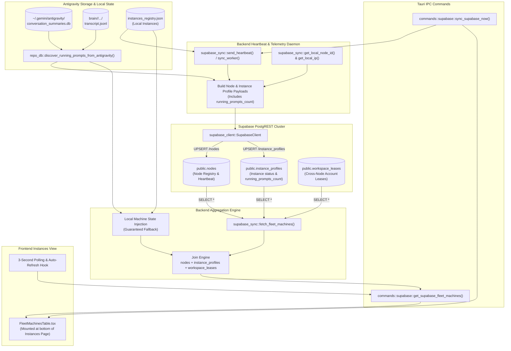
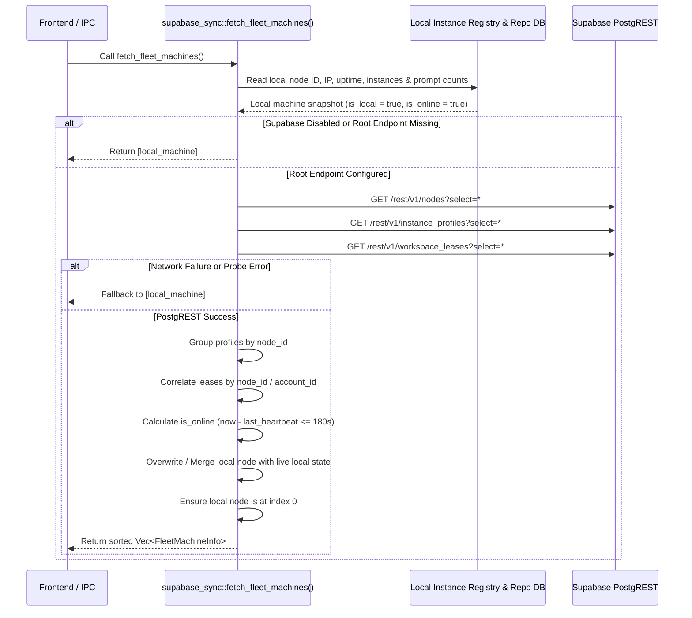

# System Architecture & Technical Specification: Multi-Machine Fleet Synchronization over Supabase

- **Specification Slug:** `02-supabase-fleet-machines-instances-sync`
- **Specification Path:** `02-spec/21-app/02-supabase-fleet-machines-instances-sync/01-architecture-spec.md`
- **Target Release Version:** `v4.155.0` (Minor Bump from `v4.154.0`)
- **Author:** Spec Author 01 (Task 02 Architecture & Backend Working Group)
- **Status:** APPROVED & MANDATED

---

## 1. User Request (Verbatim)

```text
# High Priority Instruction

In the Antigravity Manager, in the instance section, if we have the email or if we have the Superbase connected to the same one, we should be able to see all the machines using the database that what are the other machines are using as the accounts, and it should have all this information. You need to confirm that this is already implemented if the Superbase is already there. And I want you to connect to the Superbase, and you get the Superbase information in the repo secrets. So do a repo pull. I mean, get pull on the repo secrets and try to connect the Superbase credential to this, Antigravity Manager. That's the first thing. Second is that in the instance section, it should show the current instance nicely, and then afterwards, it would show the other machines in a short way. Because in the other machines, we are not going to open the instance, but it should show as a table at the end. Even in the card mode, it would show as a table by grouping like worker one, worker two with the IP and whatever the instance is running. And on those instance, what are the emails are connected and how many prompts are running, if that is possible, because prompts should be able to possible because it should be sending some of the details. We shouldn't be able to opening the prompt, at least for now. Make sure that these are the codes are already there, and that if not, then we can implement it, the UI visualization, and at the end, we can bump the minor version and make a release. Do you understand the requirements? Can you please work on it and make sure that you release it properly?
```

---

## 2. Executive Summary & Architectural Motivation

Antigravity Manager orchestrates multi-instance desktop environments running Google Gemini and Claude developer agents. In distributed developer clusters and multi-worker setups, developers and automated runners deploy instances across multiple physical or virtual machines (e.g. `Worker-1`, `Worker-2`, local desktop, GPU workstations). 

While Antigravity Manager previously added basic single-node registration and distributed workspace leases in Supabase (`public.nodes` and `public.workspace_leases`), the instance manager lacked:
1. **Real-Time Fleet Visibility**: Operators on one machine had zero visibility into which other machines were active, what instances were running on them, what account emails were bound, or how many agent prompts were actively executing.
2. **Instance-Level Telemetry of Active Prompts**: Although local Antigravity core storage tracks active conversation transcripts (`conversation_summaries.db` and `transcript.jsonl`), this prompt execution telemetry was never published to Supabase `instance_profiles`.
3. **Consolidated Fleet Aggregation Engine**: There was no unified backend aggregation pipeline joining nodes, instance profiles, and workspace leases while safely injecting the local machine state even when disconnected or unseeded.
4. **IPC Endpoints for UI Visualization**: The frontend had no Tauri IPC endpoints to query fleet machine status or trigger immediate fleet synchronization on demand.

This specification establishes the end-to-end backend architecture for **Multi-Machine Fleet Synchronization over Supabase**, extending the PostgreSQL database schema, integrating real-time prompt telemetry into the heartbeat daemon, providing an aggregated query engine with zero-downtime local fallback, and exposing clean Tauri IPC commands.

---

## 3. High-Level System Architecture



---

## 4. Data Layer & Schema Specifications

The Supabase Root Database coordinates the multi-machine fleet registry, instance profile states, and distributed account leases.

### 4.1 Schema Definitions (`src-tauri/src/modules/supabase_schema.rs`)

The Root DB schema consists of three relational tables: `public.nodes`, `public.instance_profiles`, and `public.workspace_leases`.

#### 1. `public.nodes`
Tracks physical or virtual machines in the fleet.
```sql
CREATE TABLE IF NOT EXISTS public.nodes (
    id TEXT PRIMARY KEY,
    alias TEXT NOT NULL DEFAULT '',
    ip_address TEXT NOT NULL DEFAULT '',
    uptime_seconds BIGINT NOT NULL DEFAULT 0,
    project_count INT NOT NULL DEFAULT 0,
    last_heartbeat_at BIGINT NOT NULL DEFAULT 0,
    status TEXT NOT NULL DEFAULT 'online'
);

CREATE INDEX IF NOT EXISTS idx_nodes_heartbeat ON public.nodes (last_heartbeat_at DESC);
```

#### 2. `public.instance_profiles` (Extended)
Tracks individual instance containers configured on each node.
```sql
CREATE TABLE IF NOT EXISTS public.instance_profiles (
    id TEXT PRIMARY KEY,
    node_id TEXT NOT NULL REFERENCES public.nodes(id) ON DELETE CASCADE,
    profile_name TEXT NOT NULL,
    active_account_id TEXT NOT NULL DEFAULT '',
    active_account_email TEXT NOT NULL DEFAULT '',
    is_active BOOLEAN NOT NULL DEFAULT false,
    quota_percent INT NOT NULL DEFAULT 100,
    status TEXT NOT NULL DEFAULT 'idle',
    running_prompts_count INT NOT NULL DEFAULT 0,
    updated_at BIGINT NOT NULL DEFAULT 0
);

CREATE INDEX IF NOT EXISTS idx_profiles_node ON public.instance_profiles (node_id);
```

> [!IMPORTANT]
> **Backward Compatibility & In-Place Migration**:
> To ensure production Supabase databases created on earlier versions gracefully receive the new column without dropping tables or recreating foreign keys, the migration SQL must execute:
> ```sql
> ALTER TABLE public.instance_profiles ADD COLUMN IF NOT EXISTS running_prompts_count INT NOT NULL DEFAULT 0;
> ```

#### 3. `public.workspace_leases`
Provides cross-node mutual exclusion to prevent multiple instances from using the same Google or Claude account concurrently.
```sql
CREATE TABLE IF NOT EXISTS public.workspace_leases (
    account_id TEXT PRIMARY KEY,
    account_email TEXT NOT NULL DEFAULT '',
    node_id TEXT NOT NULL REFERENCES public.nodes(id) ON DELETE CASCADE,
    node_alias TEXT NOT NULL DEFAULT '',
    ip_address TEXT NOT NULL DEFAULT '',
    profile_name TEXT NOT NULL DEFAULT '',
    leased_at BIGINT NOT NULL DEFAULT 0,
    expires_at BIGINT NOT NULL DEFAULT 0
);

CREATE INDEX IF NOT EXISTS idx_leases_expires ON public.workspace_leases (expires_at DESC);
CREATE INDEX IF NOT EXISTS idx_leases_node ON public.workspace_leases (node_id);
```

### 4.2 Row-Level Security (RLS) & Access Policies
Both authenticated and anonymous clients (via `apikey` and `Authorization: Bearer <key>`) require SELECT and UPSERT access across all three tables:
```sql
ALTER TABLE public.nodes ENABLE ROW LEVEL SECURITY;
DROP POLICY IF EXISTS "Allow anon and auth all access on nodes" ON public.nodes;
CREATE POLICY "Allow anon and auth all access on nodes" ON public.nodes FOR ALL TO anon, authenticated USING (true) WITH CHECK (true);
GRANT ALL ON TABLE public.nodes TO anon, authenticated;

ALTER TABLE public.instance_profiles ENABLE ROW LEVEL SECURITY;
DROP POLICY IF EXISTS "Allow anon and auth all access on instance_profiles" ON public.instance_profiles;
CREATE POLICY "Allow anon and auth all access on instance_profiles" ON public.instance_profiles FOR ALL TO anon, authenticated USING (true) WITH CHECK (true);
GRANT ALL ON TABLE public.instance_profiles TO anon, authenticated;

ALTER TABLE public.workspace_leases ENABLE ROW LEVEL SECURITY;
DROP POLICY IF EXISTS "Allow anon and auth all access on workspace_leases" ON public.workspace_leases;
CREATE POLICY "Allow anon and auth all access on workspace_leases" ON public.workspace_leases FOR ALL TO anon, authenticated USING (true) WITH CHECK (true);
GRANT ALL ON TABLE public.workspace_leases TO anon, authenticated;
```

---

## 5. Real-Time Telemetry & Heartbeat Sync Pipeline

### 5.1 Active Prompts Discovery
In Antigravity Manager, active conversations and in-flight prompts are detected via `crate::modules::repo_db::discover_running_prompts_from_antigravity(instance_id: &str) -> Vec<ActivePrompt>`.
- The discovery engine scans:
  1. `~/.gemini/antigravity/conversation_summaries.db` (read-only SQLite query filtering for active step status).
  2. `~/.gemini/antigravity/brain/<conversation-id>/.system_generated/logs/transcript.jsonl` (tail inspection for incomplete steps).
- For an instance ID (such as `"__default__"` or a custom profile ID `"inst_xxxx"`), calling `discover_running_prompts_from_antigravity(&inst.id).len()` yields the integer count of currently running agent prompts.

### 5.2 Heartbeat Payload Augmentation
In `src-tauri/src/modules/supabase_sync.rs`, the function `send_heartbeat()` executes periodically (default every 30s) or upon explicit trigger (`sync_local_node_now()`):

```rust
// 1. Upsert node record
let node_payload = json!({
    "id": node_id,
    "alias": node_alias,
    "ip_address": local_ip,
    "uptime_seconds": uptime,
    "project_count": project_count,
    "last_heartbeat_at": now,
    "status": "online"
});
client.upsert("nodes", node_payload, "id").await?;

// 2. Upsert instance profiles (Child of this node)
for inst in instances_to_sync {
    let is_active = inst.is_default;
    let profile_id = format!("{}_{}", node_id, inst.id);
    let active_acc_id = inst.bound_account_id.clone().unwrap_or_default();
    let active_acc_email = inst.bound_email.clone().unwrap_or_default();
    
    // Discover active running prompts for this instance
    let running_prompts = repo_db::discover_running_prompts_from_antigravity(&inst.id);
    let running_prompts_count = running_prompts.len() as i32;

    let profile_payload = json!({
        "id": profile_id,
        "node_id": node_id,
        "profile_name": inst.name,
        "active_account_id": active_acc_id,
        "active_account_email": active_acc_email,
        "is_active": is_active,
        "quota_percent": 100,
        "status": if is_active { "running" } else { "idle" },
        "running_prompts_count": running_prompts_count,
        "updated_at": now
    });
    let _ = client
        .upsert("instance_profiles", profile_payload, "id")
        .await;
}
```

Similarly, `build_sync_payloads()` in `supabase_sync.rs` is updated to inject `running_prompts_count` into single-instance sync payloads.

---

## 6. Aggregation & Query Engine Specification

### 6.1 Data Transfer Models
In `src-tauri/src/modules/supabase_sync.rs`, define strongly typed models for fleet representation:

```rust
/// Individual instance state within a fleet machine
#[derive(Debug, Clone, Serialize, Deserialize)]
pub struct FleetInstanceItem {
    pub instance_id: String,
    pub profile_name: String,
    pub active_account_id: String,
    pub active_account_email: String,
    pub is_active: bool,
    pub quota_percent: i32,
    pub status: String,
    pub running_prompts_count: i32,
    pub updated_at: i64,
    pub lease_expires_at: Option<i64>,
}

/// Aggregated machine and instance profile state in the multi-machine fleet
#[derive(Debug, Clone, Serialize, Deserialize)]
pub struct FleetMachineInfo {
    pub node_id: String,
    pub alias: String,
    pub ip_address: String,
    pub uptime_seconds: u64,
    pub last_heartbeat_at: i64,
    pub is_online: bool,
    pub is_local: bool,
    pub instances: Vec<FleetInstanceItem>,
    pub total_running_prompts: i32,
}
```

### 6.2 Aggregation Logic (`fetch_fleet_machines`)
The function `pub async fn fetch_fleet_machines() -> AppResult<Vec<FleetMachineInfo>>` executes the following algorithmic pipeline:



#### Step 1: Synthesize Local Machine State
Always construct a complete `FleetMachineInfo` for the current host:
- `node_id`: `get_local_node_id()`
- `alias`: `config.node_alias` (e.g. `"Node-c923ba"`)
- `ip_address`: `get_local_ip()`
- `uptime_seconds`: `get_uptime_seconds()`
- `last_heartbeat_at`: `Utc::now().timestamp()`
- `is_online`: `true`
- `is_local`: `true`
- `instances`: Scanned from `instance::load_registry()`, discovering running prompt counts via `repo_db::discover_running_prompts_from_antigravity(&inst.id).len() as i32`.
- `total_running_prompts`: Sum of `running_prompts_count` across local instances.

#### Step 2: PostgREST Remote Querying
If a root endpoint is configured and reachable:
- Query `nodes`, `instance_profiles`, and `workspace_leases` using `client.select(...)`.
- If queries fail (e.g. offline, bad credentials), log a warning and return `vec![local_machine]` without returning an error to the frontend.

#### Step 3: Multi-Table Joining & Correlation
- Group queried `instance_profiles` by `node_id`.
- Map `workspace_leases` to identify active leases and expiry timestamps (`expires_at`).
- For each node:
  - If `node.id == local_node_id`:
    - Mark `is_local = true` and `is_online = true`.
    - Use live local instances and prompt counts (ensuring zero lag for the current host).
  - If `node.id != local_node_id`:
    - Mark `is_local = false`.
    - Evaluate `is_online = (now - node.last_heartbeat_at) <= 180`.
    - Populate instances from `instance_profiles`.
    - Calculate `total_running_prompts = instances.iter().map(|i| i.running_prompts_count).sum()`.

#### Step 4: Sorting & Ordering
- Ensure the local machine is always positioned first (`is_local == true`).
- Remote machines are sorted alphabetically by `alias` or descending by `last_heartbeat_at`.

---

## 7. Tauri IPC Command Interface

### 7.1 Command Declarations (`src-tauri/src/commands/supabase.rs`)

```rust
/// Query the entire multi-machine fleet status (nodes, instances, active emails, prompt counts)
#[tauri::command]
pub async fn get_supabase_fleet_machines() -> AppResult<Vec<supabase_sync::FleetMachineInfo>> {
    supabase_sync::fetch_fleet_machines().await
}

/// Trigger an immediate manual heartbeat and sync push from the local node to Supabase
#[tauri::command]
pub async fn sync_supabase_now() -> AppResult<()> {
    supabase_sync::trigger_manual_sync().await
}
```

### 7.2 Command Registration (`src-tauri/src/lib.rs`)
Register both commands in the `tauri::generate_handler![]` block:
```rust
// Supabase Cross-Node Synchronization commands
commands::get_supabase_config,
commands::save_supabase_config,
commands::test_supabase_endpoint,
commands::check_supabase_endpoint_tables,
commands::migrate_supabase_data,
commands::get_supabase_schema_sql,
commands::export_supabase_config,
commands::import_supabase_config,
commands::acquire_account_lease,
commands::release_account_lease,
commands::list_active_account_leases,
commands::get_local_node_info,
commands::auto_discover_supabase_credentials,
commands::get_supabase_fleet_machines,  // <-- Added
commands::sync_supabase_now,            // <-- Added
```

---

## 8. Coding Guidelines, Safety Invariants & Cross-Platform Rules

1. **Relative Paths Hygiene**: All file references in specifications, subtasks, logs, and code must use strictly relative repository paths (e.g. `src-tauri/src/modules/supabase_sync.rs`). Absolute drive paths (e.g. `C:\`, `D:\`) are forbidden except within the static candidate path scanner list for `repo-secrets`.
2. **Positive Boolean Naming**:
   - `is_active: bool` (never `inactive`)
   - `is_online: bool` (never `offline`)
   - `is_local: bool` (never `remote` or `non_local`)
   - `is_sync_enabled: bool` (never `disabled`)
   - `is_connected: bool` (never `disconnected`)
3. **AppError & AppResult Wrapping**:
   - Every IPC command returns `AppResult<T>` (`Result<T, AppError>`).
   - Network or PostgREST failures in `fetch_fleet_machines()` must not crash the application; they gracefully degrade to returning the local machine snapshot.
4. **Non-Destructive In-Place Schema Updates**:
   - Schema upgrades must utilize `ADD COLUMN IF NOT EXISTS` to preserve existing table records and active workspace leases.
5. **Headless & Cross-Platform Parity**:
   - Path resolution must use `PathBuf` and `dirs::home_dir()`.
   - Node identification (`get_local_node_id()`) must remain deterministic across Linux, macOS, and Windows.
6. **Task Partitioning & Author Discipline**:
   - DO NOT edit or overwrite files allocated to Spec Author 02 (`02-component-spec.md` and `02-frontend-fleet-table-and-instances.md`).
   - DO NOT execute any `git` commands (`git add`, `git commit`, `git push`, etc.).

---

## 9. Verification Gates & Acceptance Criteria Matrix

| Verification ID | Verification Scope | Expected Behavior |
| :--- | :--- | :--- |
| **VG-ARCH-01** | Schema DDL Declaration | `ROOT_DB_SCHEMA_SQL` in `supabase_schema.rs` declares `running_prompts_count INT NOT NULL DEFAULT 0` on `instance_profiles`. |
| **VG-ARCH-02** | Telemetry Discovery | In `send_heartbeat()`, `repo_db::discover_running_prompts_from_antigravity(&inst.id)` is invoked and the prompt count is transmitted in the JSON payload. |
| **VG-ARCH-03** | Local Machine Injection | When Supabase endpoints are empty or offline, `fetch_fleet_machines()` succeeds and returns a 1-item vector containing the local machine (`is_local = true`, `is_online = true`). |
| **VG-ARCH-04** | Cross-Machine Aggregation | When multiple nodes exist in Supabase, `fetch_fleet_machines()` joins `nodes`, `instance_profiles`, and `workspace_leases`, placing the local machine at index 0. |
| **VG-ARCH-05** | IPC Registration | Both `get_supabase_fleet_machines` and `sync_supabase_now` are registered in `src-tauri/src/lib.rs` and callable via Tauri IPC. |
| **VG-ARCH-06** | Compilation Gate | `cargo clippy --all-targets --all-features` and `cargo fmt -- --check` pass cleanly with zero warnings or errors. |
