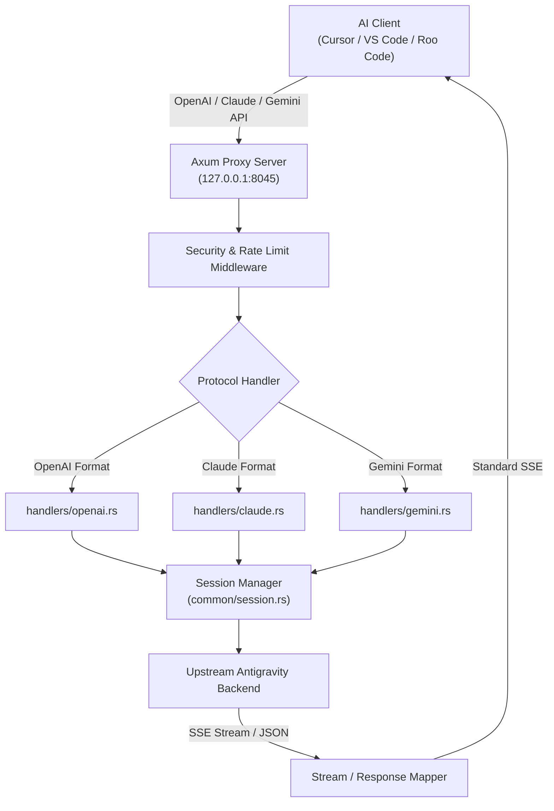

# Reverse Proxy Engine, Protocol Mappers, and Session Management

> **Specification:** `02-spec/21-app/03-proxy-engine-and-protocols.md`
> **Status:** Production-Ready
> **Source Files:** `src-tauri/src/proxy/server.rs`, `src-tauri/src/proxy/handlers/`, `src-tauri/src/proxy/mappers/`, `src-tauri/src/proxy/common/session.rs`, `src-tauri/src/proxy/rate_limit.rs`, `src-tauri/src/proxy/token_manager.rs`, `src-tauri/src/proxy/upstream/retry.rs`, `src-tauri/src/models/config.rs`

---

## 1. Overview & Architectural Role

The Reverse Proxy Engine is the core subsystem of Antigravity-Manager. It provides an enterprise-grade, high-throughput AI API gateway running locally on the user's workstation.

### Primary Responsibilities
1. **Multi-Protocol Translation:** Accepts standard OpenAI, Anthropic Claude, and Google Gemini REST API requests from development tools (Cursor, VS Code, Roo Code, Claude Dev, etc.) and translates them into upstream Antigravity/Gemini backend requests.
2. **Account Pool Rotation & Load Balancing:** Multiplexes requests across configured user accounts, balancing quota utilization across 5-hour rolling windows and weekly quota buckets.
3. **Session Fingerprinting & Token Accumulation Defense:** Prevents upstream 1M token accumulation exhaustion by scoping server-side sessions to individual conversations using FNV-1a 64-bit integer hashes.
4. **Resilient Rate Limiting & Circuit Breaking:** Automatically captures 429 and temporary 503 responses, extracts retry intervals, emits `Retry-After` headers, and switches accounts transparently.



---

## 2. Server Pipeline & Lifecycle (`src-tauri/src/proxy/server.rs`)

### 2.1 Networking & Binding
- **Default Listener:** Binds to `127.0.0.1:8045` (configurable via `host` and `port` settings).
- **Concurrency Framework:** Hyper 1.0 engine on Tokio multi-threaded asynchronous runtime (`TokioIo` + `hyper::server::conn::http1`).
- **Graceful Shutdown:** Controlled via `tokio::sync::oneshot` channels triggered from UI or process exit hooks.
- **Headless Static Asset Hosting:** If environment variable `ABV_DIST_PATH` is specified (e.g. Docker deployments), serves the compiled React Single-Page Application via `tower_http::services::ServeDir`.

### 2.2 Global Middleware Stack
1. **Service Status Gate:** Rejects requests with 503 if the proxy service is in `Stopped` or `Paused` state.
2. **CORS Layer:** Permissive CORS handling via `tower_http::cors::CorsLayer` allowing all origins, methods, and headers for local IDE connectivity.
3. **Request Body Limit:** Dynamically configured buffer threshold (`DefaultBodyLimit::max`) supporting multi-megabyte payloads for large context windows and multimodal image attachments.
4. **Security Filter:** Validates optional master API key, client IP against blacklist/whitelist, and logs connection metrics to SQLite.

---

## 3. Protocol Handlers & Transformation Mappers

### 3.1 OpenAI Handler (`src-tauri/src/proxy/handlers/openai.rs` & `src-tauri/src/proxy/server.rs`)
- **Mounted Endpoints:**
  - `POST /v1/chat/completions` (streaming & non-streaming chat completions)
  - `POST /v1/completions` (legacy text completions)
  - `POST /v1/responses` (Codex CLI completions with WebSocket upgrade support via `GET /v1/responses`)
  - `POST /responses` (direct root alias for Codex completions)
  - `POST /responses/compact` (compact completion payload)
  - `GET /v1/models` (model catalog synthesis)
  - `POST /v1/images/generations` (Imagen text-to-image integration)
  - `POST /v1/images/edits` (image editing integration)
  - `POST /v1/audio/transcriptions` (Whisper/audio transcription via `handlers/audio.rs`)
- **Unmounted / Excluded Endpoints:** `POST /v1/embeddings` is deliberately not mounted; upstream Antigravity does not expose a compatible embedding endpoint, returning HTTP 404.
- **Retry Loop with Jitter:** Encapsulates requests in an exponential backoff loop. If an upstream account returns rate limits or session token exhaustion, it dynamically increments generation counters and retries with sibling accounts.
- **Model Aliasing:** Automatically translates arbitrary client model strings (e.g. `gpt-4o`, `claude-3-5-sonnet`, `gemini-2.5-pro`) to matching Antigravity backend model endpoints via configurable mappings.

### 3.2 Anthropic Claude Handler (`src-tauri/src/proxy/handlers/claude.rs`)
- **Supported Endpoints:**
  - `POST /v1/messages` (SSE streaming & JSON responses)
  - `POST /v1/messages/count_tokens` (token counting endpoint)
  - `GET /v1/models/claude` (Anthropic model list)
- **Tool Use & Function Calling Stitching:** Reconstructs Anthropic `tool_use` and `tool_result` content blocks into Antigravity internal protobuf/JSON function call schemas.
- **Prompt Caching Support:** Detects and respects Claude `cache_control` breakpoints, maintaining server-side cache hits where possible.

### 3.3 Google Gemini Handler (`src-tauri/src/proxy/handlers/gemini.rs`)
- **Supported Endpoints:**
  - `POST /v1beta/models/*:generateContent`
  - `POST /v1beta/models/*:streamGenerateContent`
- **Native Wrapper Translation:** Translates native Google AI Studio request shapes (`contents`, `generationConfig`, `safetySettings`) to Antigravity internal RPC formats.

---

## 4. Session ID Scoping & 1M Token Accumulation Guard (`src-tauri/src/proxy/common/session.rs`)

### 4.1 Root Cause of Upstream 400 Failure
Upstream Google Antigravity servers accumulate conversation input history server-side per `sessionId`. A session that drives extended tool loops can push accumulated input past 1,048,576 tokens. After this threshold, every subsequent request with that `sessionId` fails with:
```text
HTTP 400: The input token count exceeds the maximum number of tokens allowed 1048576
```

### 4.2 Signed 64-Bit FNV-1a Integer Hashing Architecture
Upstream Antigravity APIs strictly require `sessionId` to be a stringified signed 64-bit integer, matching the official client behavior of emitting large negative integers. Supplying arbitrary alphanumeric strings (e.g. `acc123-fp456-g0`) triggers upstream HTTP 400 `Invalid Session ID` errors.

#### Exact Algorithm Implementation
The proxy derives stable, upstream-compliant session identifiers using 64-bit FNV-1a signed integer hashing (`src-tauri/src/proxy/common/session.rs:L6-L13`, `L59-L64`):

```rust
/// From account ID string to a stable negative signed integer session ID
/// Implements FNV-1a hash which matches official client behavior of sending
/// a large negative integer for `sessionId`.
pub fn derive_session_id(account_id: &str) -> String {
    let mut hash: i64 = -3750763034362895579_i64; // FNV offset basis
    for byte in account_id.bytes() {
        hash = hash.wrapping_mul(1099511628211_i64); // FNV prime
        hash ^= byte as i64;
    }
    hash.to_string()
}

/// Derive upstream sessionId for (account, conversation fingerprint, generation).
/// Stable within one generation (preserving server-side prompt cache hits),
/// but distinct across conversations and after an eviction bump.
pub fn derive_session_scoped(account_id: &str, fingerprint: &str, generation: u64) -> String {
    if fingerprint.is_empty() && generation == 0 {
        return derive_session_id(account_id);
    }
    derive_session_id(&format!("{}|{}|{}", account_id, fingerprint, generation))
}
```

#### Session Eviction & Generation Counter
1. **Conversation Fingerprinting:** Hashes the initial user message content or explicit client conversation headers into a stable `fingerprint`.
2. **Monotonic Generation Counter:** `SESSION_BUMPS` (`LazyLock<Mutex<HashMap<String, u64>>>`) tracks an in-memory generation counter keyed by `format!("{}::{}", account_id, fingerprint)`.
3. **Transparent Recovery:** When an HTTP 400 token overflow (`1048576`) error occurs, `bump_session(account_id, fingerprint)` increments the generation counter and derives a fresh signed 64-bit integer session ID, transparently bypassing upstream accumulation limits while preserving context for the client.

---

## 5. Rate Limiting, Circuit Breakers & Token Management

### 5.1 Dynamic Backoff, Buffers & `Retry-After` Handling
- **Default Backoff Vector:** Configured in `CircuitBreakerConfig` (`src-tauri/src/models/config.rs:159`):
  `backoff_steps = [60, 300, 1800, 7200]` (seconds: 1m, 5m, 30m, 2h).
- **Retry Delay Parsing & Sources (`src-tauri/src/proxy/upstream/retry.rs`):**
  - **Structured Delay Buffer (+200ms):** When extracted from structured JSON (`google.rpc.RetryInfo.retryDelay`) or `Retry-After` header delta-seconds, the proxy computes `actual_wait_ms = raw_ms + 200` to prevent early retry race conditions.
  - **Response Text Delay Buffer (+1000ms):** When extracted via regex (`RE_TEXT_DELAY_PATTERNS`) from freeform response strings (e.g. `"quota will reset after 3s"`), the proxy adds a `+1000ms` safety buffer to account for clock drift.
  - **Maximum Cap:** Non-grace delays are capped at `30_000ms` (30s) before falling back to account rotation.
- **Grace Retry Window (`src-tauri/src/proxy/handlers/common.rs`):**
  - If parsed delay is short ($\le 2000\text{ ms}$), the proxy executes `RetryStrategy::GraceRetry(Duration::from_millis(delay_ms + 100))` with a `+100ms` buffer.
  - **Account Affinity:** Grace retry reuses the identical account without rotating to another pool credential, minimizing unnecessary pool switching for transient sub-second spikes.
  - **Hard Quota Exclusion:** Hard quota errors (`resource_exhausted`, `quota_exhausted`, `exceeded your current quota`, `insufficient_quota`) bypass Grace Retry immediately, rotating accounts with a 50ms delay.

### 5.2 Circuit Breaker & Zero-Quota Lock (`src-tauri/src/proxy/rate_limit.rs`, `src-tauri/src/proxy/token_manager.rs`)
- **`lock_on_zero_quota` Toggle:** Controlled via configuration (`lock_on_zero_quota: bool`).
- **Zero-Quota Threshold (`remaining_fraction <= 0.001`):** When an account's 5-hour rolling bucket or weekly quota drops to or below `0.001` ($\le 0.1\%$) and a `reset_time` is available:
  - The circuit breaker locks the account via `set_lockout_until_iso_with_cap(account_id, reset_time, RateLimitReason::QuotaExhausted, None)`.
  - The account is omitted from round-robin scheduling until its reported reset timestamp expires.
- **Automatic Recovery:** Accounts automatically unlock when the `lockout_until` timestamp expires or when background quota polling detects refreshed capacity.
- **Preferred Account Affinity:** Callers can bind sessions to preferred accounts via IPC or request headers, falling back to rotation only during hard lockouts.

---

## 6. Verification & Acceptance Criteria

### AC-PRX-001: Signed 64-Bit FNV-1a Integer Session ID Derivation
- **Executable Test:** `tests::test_session_fnv1a_hashing_vectors`
- **Given:** An `account_id` string, `fingerprint` string, and `generation` integer counter.
- **When:** `derive_session_scoped(account_id, fingerprint, generation)` is invoked.
- **Then:** The returned session identifier is an integer string formatted from a signed 64-bit integer (`i64`), initialized from FNV offset basis `-3750763034362895579_i64` and multiplied by prime `1099511628211_i64`, preventing upstream Google Antigravity HTTP 400 session rejection.

### AC-PRX-002: Axum Mounted Protocol Routes & Endpoint Dispatch
- **Executable Test:** `tests::test_axum_mounted_endpoints`
- **Given:** A running Axum proxy server listening on `127.0.0.1:8045`.
- **When:** HTTP client requests are dispatched to mounted endpoints (`/v1/chat/completions`, `/v1/completions`, `/v1/responses`, `/responses`, `/responses/compact`, `/v1/images/generations`, `/v1/images/edits`, `/v1/audio/transcriptions`, `/v1/messages`, `/v1beta/models/*`).
- **Then:** The router dispatches each request to its respective protocol handler; requests to unmounted routes (including `POST /v1/embeddings`) return HTTP 404 Not Found.

### AC-PRX-003: Circuit Breaker Backoff Vector & Zero-Quota Lockout
- **Executable Test:** `tests::test_circuit_breaker_backoff_vector`
- **Given:** Upstream HTTP 429 rate limit responses or accounts with remaining quota fraction $\le 0.001$.
- **When:** Rate limit evaluation and circuit breaker scheduling are executed.
- **Then:** The circuit breaker applies backoff steps `[60, 300, 1800, 7200]` seconds, adds structured delay buffers (+200ms) or text delay buffers (+1000ms, max 30s), executes `GraceRetry` (+100ms) for delays $\le 2000\text{ ms}$ with account affinity, and locks zero-quota accounts until reset timestamp.

### AC-PRX-004: SSE Wire Protocol Fixture & Stream Transformation
- **Executable Test:** `tests::test_sse_wire_fixture_transformation`
- **Given:** Streaming requests dispatched to `/v1/chat/completions` or `/v1/messages`.
- **When:** Upstream SSE chunks and tool call responses are translated by protocol mappers.
- **Then:** Output streams emit valid Server-Sent Events matching protocol wire fixtures (OpenAI `chat.completion.chunk` or Claude stream events) terminating with `data: [DONE]`, stripping internal thought tags and invalid tokens.
