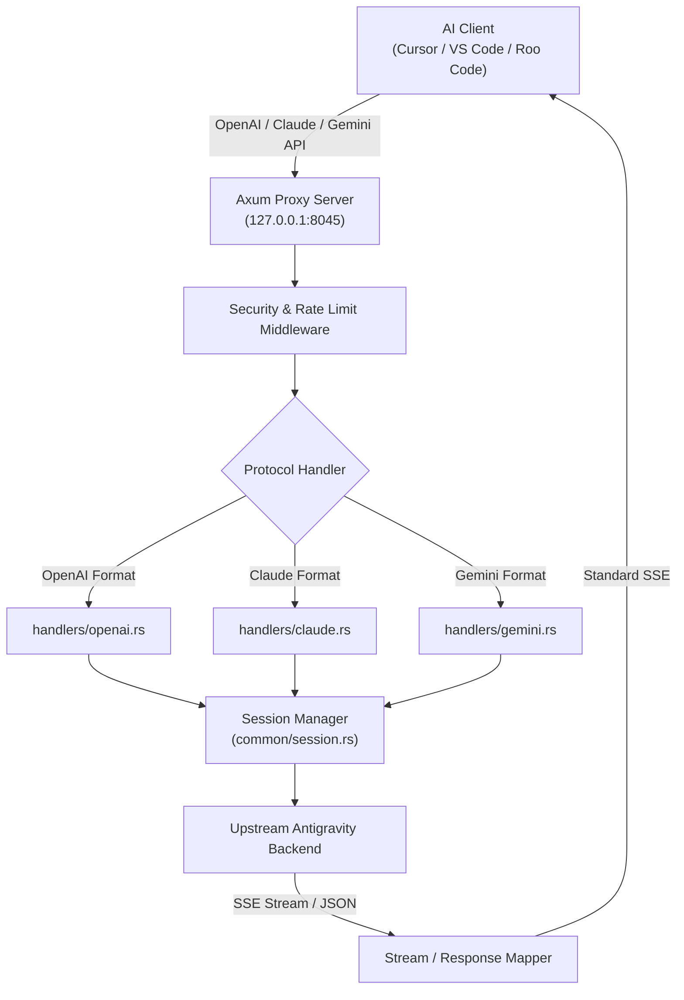

# Reverse Proxy Engine, Protocol Mappers, and Session Management

> **Specification:** `02-spec/21-app/03-proxy-engine-and-protocols.md`
> **Status:** Production-Ready
> **Source Files:** `src-tauri/src/proxy/server.rs`, `src-tauri/src/proxy/handlers/`, `src-tauri/src/proxy/mappers/`, `src-tauri/src/proxy/common/session.rs`, `src-tauri/src/proxy/rate_limit.rs`, `src-tauri/src/proxy/token_manager.rs`

---

## 1. Overview & Architectural Role

The Reverse Proxy Engine is the core subsystem of Antigravity-Manager. It provides an enterprise-grade, high-throughput AI API gateway running locally on the user's workstation.

### Primary Responsibilities
1. **Multi-Protocol Translation:** Accepts standard OpenAI, Anthropic Claude, and Google Gemini REST API requests from development tools (Cursor, VS Code, Roo Code, Claude Dev, etc.) and translates them into upstream Antigravity/Gemini backend requests.
2. **Account Pool Rotation & Load Balancing:** Multiplexes requests across configured user accounts, balancing quota utilization across 5-hour rolling windows and weekly quota buckets.
3. **Session Fingerprinting & Token Accumulation Defense:** Prevents upstream 1M token accumulation exhaustion by scoping server-side sessions to individual conversations.
4. **Resilient Rate Limiting & Circuit Breaking:** Automatically captures 429 and temporary 503 responses, extracts retry intervals, emits `Retry-After` headers, and switches accounts transparently.



---

## 2. Server Pipeline & Lifecycle (`src-tauri/src/proxy/server.rs`)

### 2.1 Networking & Binding
- **Default Listener:** Binds to `127.0.0.1:8045` (configurable via `host` and `port` settings).
- **Concurrency Framework:** Hyper 1.0 engine on Tokio multi-threaded asynchronous runtime (`TokioIo` + `hyper::server::conn::http1`).
- **Graceful Shutdown:** Controlled via `tokio::sync::oneshot` channels triggered from UI or process exit hooks.
- **Headless Static Asset Hosting:** If environment variable `ABV_DIST_PATH` is specified (e.g. Docker deployments), serves the compiled React Single-Page Application via `tower_http::services::ServeDir`.

### 2.2 Global Middleware Stack
1. **Service Status Gate:** Rejects requests with 503 if the proxy service is in `Stopped` or `Paused` state.
2. **CORS Layer:** Permissive CORS handling via `tower_http::cors::CorsLayer` allowing all origins, methods, and headers for local IDE connectivity.
3. **Request Body Limit:** Dynamically configured buffer threshold (`DefaultBodyLimit::max`) supporting multi-megabyte payloads for large context windows and multimodal image attachments.
4. **Security Filter:** Validates optional master API key, client IP against blacklist/whitelist, and logs connection metrics to SQLite.

---

## 3. Protocol Handlers & Transformation Mappers

### 3.1 OpenAI Handler (`src-tauri/src/proxy/handlers/openai.rs`)
- **Supported Endpoints:**
  - `POST /v1/chat/completions` (streaming & non-streaming)
  - `GET /v1/models` (model catalog synthesis)
  - `POST /v1/embeddings` (vector generation)
  - `POST /v1/images/generations` (Imagen integration)
- **Retry Loop with Jitter:** Encapsulates requests in an exponential backoff loop. If an upstream account returns rate limits or session token exhaustion, it dynamically increments generation counters and retries with sibling accounts.
- **Model Aliasing:** Automatically translates arbitrary client model strings (e.g. `gpt-4o`, `claude-3-5-sonnet`, `gemini-2.5-pro`) to matching Antigravity backend model endpoints via configurable mappings.

### 3.2 Anthropic Claude Handler (`src-tauri/src/proxy/handlers/claude.rs`)
- **Supported Endpoints:**
  - `POST /v1/messages` (SSE streaming & JSON responses)
- **Tool Use & Function Calling Stitching:** Reconstructs Anthropic `tool_use` and `tool_result` content blocks into Antigravity internal protobuf/JSON function call schemas.
- **Prompt Caching Support:** Detects and respects Claude `cache_control` breakpoints, maintaining server-side cache hits where possible.

### 3.3 Google Gemini Handler (`src-tauri/src/proxy/handlers/gemini.rs`)
- **Supported Endpoints:**
  - `POST /v1beta/models/*:generateContent`
  - `POST /v1beta/models/*:streamGenerateContent`
- **Native Wrapper Translation:** Translates native Google AI Studio request shapes (`contents`, `generationConfig`, `safetySettings`) to Antigravity internal RPC formats.

---

## 4. Session ID Scoping & 1M Token Accumulation Guard (`src-tauri/src/proxy/common/session.rs`)

### 4.1 Root Cause of Upstream 400 Failure
Previously, the upstream `sessionId` was derived solely from the account email via FNV-1a hashing. Consequently, all conversations conducted by a single account shared a single server-side session. Because Antigravity accumulates conversation history server-side per `sessionId`, prolonged tool-loop sessions exceeded 1,048,576 tokens, causing the upstream server to reject all subsequent requests for that account with:
```text
HTTP 400: The input token count exceeds the maximum number of tokens allowed 1048576
```

### 4.2 Solution Architecture
1. **Conversation Fingerprinting:** Hashes the first user message content or explicit client conversation header to establish a stable `conversation_hash`.
2. **Generation Counter:** Maintains an in-memory generation counter `generation` per `(account_id, conversation_hash)`.
3. **Session ID Construction:**
   ```rust
   // sessionId blends account identifier, conversation fingerprint, and generation counter
   let session_id = format!("{}-{}-g{}", account_hash, conversation_fingerprint, generation);
   ```
4. **Transparent Upstream Eviction:** Upon intercepting a 400 error indicating input token count exceeding 1048576, the proxy automatically increments the `generation` counter for that conversation and retries immediately with a clean upstream session.

---

## 5. Rate Limiting, Circuit Breakers & Token Management

### 5.1 Dynamic Backoff & `Retry-After` Header Exposure
- Intercepts upstream HTTP 429 and temporary 503 errors.
- Parses `Retry-After` header values (in seconds or HTTP dates) and injects them into downstream responses (`handlers/common.rs`).
- Dynamic lockout caps retry durations to configured maximum backoff steps instead of fixed 300s lockouts.

### 5.2 Circuit Breaker & Zero-Quota Lock (`src-tauri/src/proxy/rate_limit.rs`)
- **`lock_on_zero_quota` Toggle:** When an account's 5-hour rolling bucket or weekly quota reaches 0%, the circuit breaker locks the account from scheduling until its reported `reset_time`.
- **Automatic Recovery:** Accounts automatically unlock when their reset timestamp expires or when live quota refreshes detect capacity recovery.
- **Preferred Account Affinity:** Callers can lock specific sessions to preferred accounts via IPC or request headers, falling back to rotation only during hard lockouts.
