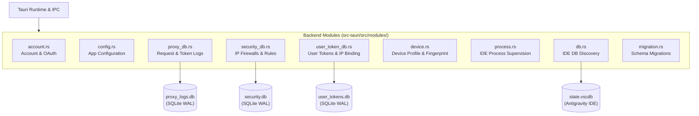

# Backend Modules, Storage Architecture, and Persistence

> **Specification:** `02-spec/21-app/04-modules-storage-and-persistence.md`
> **Status:** Production-Ready
> **Source Files:** `src-tauri/src/modules/`, `src-tauri/src/models/`, `src-tauri/src/error.rs`

---

## 1. Overview & Module Topology

The backend subsystem is structured into modular domain packages within `src-tauri/src/modules/`. Each module encapsulates business logic, operating system abstractions, process supervision, or database persistence behind clean Rust APIs.



---

## 2. SQLite Database Architecture (`rusqlite`)

The application avoids monolithic database locks by partitioning storage into dedicated SQLite database files managed through `rusqlite` with bundled SQLite 3:

### 2.1 Engine Pragmas & Concurrency Tuning
Every SQLite connection initializes with high-concurrency settings:
- **Journal Mode:** `PRAGMA journal_mode = WAL;` (Write-Ahead Logging permits concurrent readers without locking writers).
- **Busy Timeout:** `PRAGMA busy_timeout = 5000;` (Prevents immediate `SQLITE_BUSY` errors during concurrent bursts).
- **Synchronous Mode:** `PRAGMA synchronous = NORMAL;` (Safe with WAL while minimizing filesystem I/O wait).

### 2.2 Proxy Request Telemetry Schema (`proxy_logs.db` — `src-tauri/src/modules/proxy_db.rs`)

Tracks all inbound reverse proxy telemetry, model usage, token accounting, and payload streams:

```sql
CREATE TABLE IF NOT EXISTS request_logs (
    id TEXT PRIMARY KEY,
    timestamp INTEGER NOT NULL,
    method TEXT NOT NULL DEFAULT 'POST',
    url TEXT NOT NULL DEFAULT '',
    status INTEGER NOT NULL,
    duration INTEGER NOT NULL DEFAULT 0,
    account_email TEXT NOT NULL DEFAULT '',
    mapped_model TEXT NOT NULL DEFAULT '',
    protocol TEXT NOT NULL DEFAULT '',
    input_tokens INTEGER NOT NULL DEFAULT 0,
    output_tokens INTEGER NOT NULL DEFAULT 0,
    cached_tokens INTEGER NOT NULL DEFAULT 0,
    total_tokens INTEGER NOT NULL DEFAULT 0,
    client_ip TEXT NOT NULL DEFAULT '',
    username TEXT NOT NULL DEFAULT '',
    request_body TEXT,
    response_body TEXT,
    error_message TEXT
);

CREATE INDEX IF NOT EXISTS idx_timestamp ON request_logs (timestamp DESC);
CREATE INDEX IF NOT EXISTS idx_status ON request_logs (status);
```

### 2.3 Security & Firewall Database (`security.db` — `src-tauri/src/modules/security_db.rs`)

Maintains client IP access history, dynamic rate limits, CIDR firewall rules, and access control:

```sql
-- Client IP access history and firewall telemetry
CREATE TABLE IF NOT EXISTS ip_access_logs (
    id TEXT PRIMARY KEY,
    client_ip TEXT NOT NULL,
    timestamp INTEGER NOT NULL,
    method TEXT,
    path TEXT,
    user_agent TEXT,
    status INTEGER,
    duration INTEGER,
    api_key_hash TEXT,
    blocked INTEGER DEFAULT 0,
    block_reason TEXT,
    username TEXT
);

-- IP blacklist with pattern matching and expiration
CREATE TABLE IF NOT EXISTS ip_blacklist (
    id TEXT PRIMARY KEY,
    ip_pattern TEXT NOT NULL UNIQUE,
    reason TEXT,
    created_at INTEGER NOT NULL,
    expires_at INTEGER,
    created_by TEXT DEFAULT 'manual',
    hit_count INTEGER DEFAULT 0
);

-- IP whitelist for firewall bypass
CREATE TABLE IF NOT EXISTS ip_whitelist (
    id TEXT PRIMARY KEY,
    ip_pattern TEXT NOT NULL UNIQUE,
    description TEXT,
    created_at INTEGER NOT NULL
);

-- Production indexes
CREATE INDEX IF NOT EXISTS idx_ip_access_ip ON ip_access_logs (client_ip);
CREATE INDEX IF NOT EXISTS idx_ip_access_timestamp ON ip_access_logs (timestamp DESC);
CREATE INDEX IF NOT EXISTS idx_ip_access_blocked ON ip_access_logs (blocked);
CREATE INDEX IF NOT EXISTS idx_blacklist_pattern ON ip_blacklist (ip_pattern);
```

### 2.4 User Token & Multi-Tenant Database (`user_tokens.db` — `src-tauri/src/modules/user_token_db.rs`)

Supports multi-tenant token allocation, IP binding limits, curfew timeframes, and token balance accounting when deployed as a team gateway:

```sql
-- Multi-user API token management
CREATE TABLE IF NOT EXISTS user_tokens (
    id TEXT PRIMARY KEY,
    token TEXT UNIQUE NOT NULL,
    username TEXT NOT NULL,
    description TEXT,
    enabled BOOLEAN NOT NULL DEFAULT 1,
    expires_type TEXT NOT NULL,
    expires_at INTEGER,
    max_ips INTEGER NOT NULL DEFAULT 0,
    created_at INTEGER NOT NULL,
    updated_at INTEGER NOT NULL,
    last_used_at INTEGER,
    total_requests INTEGER NOT NULL DEFAULT 0,
    total_tokens_used INTEGER NOT NULL DEFAULT 0,
    curfew_start TEXT,
    curfew_end TEXT
);

-- Per-token client IP bindings and access limits
CREATE TABLE IF NOT EXISTS token_ip_bindings (
    id TEXT PRIMARY KEY,
    token_id TEXT NOT NULL,
    ip_address TEXT NOT NULL,
    first_seen_at INTEGER NOT NULL,
    last_seen_at INTEGER NOT NULL,
    request_count INTEGER NOT NULL DEFAULT 0,
    user_agent TEXT,
    FOREIGN KEY(token_id) REFERENCES user_tokens(id) ON DELETE CASCADE,
    UNIQUE(token_id, ip_address)
);

-- Per-token request usage logs and token breakdown
CREATE TABLE IF NOT EXISTS token_usage_logs (
    id TEXT PRIMARY KEY,
    token_id TEXT NOT NULL,
    ip_address TEXT,
    model TEXT,
    input_tokens INTEGER,
    output_tokens INTEGER,
    request_time INTEGER NOT NULL,
    status INTEGER,
    FOREIGN KEY(token_id) REFERENCES user_tokens(id) ON DELETE CASCADE
);

-- Production indexes
CREATE INDEX IF NOT EXISTS idx_token_usage_logs_token_id ON token_usage_logs(token_id);
CREATE INDEX IF NOT EXISTS idx_token_usage_logs_request_time ON token_usage_logs(request_time);
```

---

## 3. Account Management & Credential Lifecycle (`modules/account.rs`)

### 3.1 Data Model
- **`Account` Struct:** Contains `id`, `email`, `name`, `refresh_token`, `access_token`, `expires_at`, `quota`, `is_active`, `rate_limit_reset_time`.
- **OAuth Integration:**
  - `start_oauth_login`: Launches OAuth PKCE loopback listener.
  - `complete_oauth_login`: Exchanges authorization code for OAuth tokens and fetches user profile.
  - **Auto-Refresh:** Periodically validates `expires_at` and rotates OAuth tokens using Google OAuth token endpoints before upstream expiration.

### 3.2 Antigravity IDE Database Sync (`modules/db.rs`)
- Auto-detects local installations of Antigravity IDE, VS Code, and Cursor.
- Reads `state.vscdb` from `%APPDATA%/Antigravity/User/globalStorage/state.vscdb` (or macOS/Linux equivalents).
- Extracts active session tokens and imports existing authenticated accounts into the proxy pool with zero manual credential entry.

---

## 4. Device Fingerprinting & Spoofing (`modules/device.rs`)

To isolate accounts from upstream anti-abuse triggers, the system supports virtual device profiles:
- **Attributes:** Machine GUID (`machine_id`), MAC address, OS release version, architecture, and user-agent.
- **Profile Binding:** Accounts can be bound to distinct virtual hardware profiles.
- **Backup & Rollback:** Original system device identifiers are backed up before modifying IDE storage files, allowing 1-click restoration (`restore_original_device`).

---

## 5. Process Supervision & Diagnostics (`modules/process.rs`)

- Monitors running Antigravity IDE processes (`antigravity.exe` / `antigravity`).
- Extracts runtime CLI arguments, target working directories, and user-data directories using cross-platform process queries (`sysinfo`).
- Facilitates cache purging (`clear_antigravity_cache`) and environment repairs.

---

## 6. Verification & Acceptance Criteria

### AC-MOD-001: SQLite WAL & Concurrency Pragmas Initialization
- **Given:** Any backend SQLite connection instantiated via `connect_db` in `proxy_db.rs`, `security_db.rs`, or `user_token_db.rs`.
- **When:** SQLite database initialization or connection handshake is executed.
- **Then:** Connections configure `journal_mode = WAL`, `busy_timeout = 5000` (ms), and `synchronous = NORMAL` to ensure non-blocking read concurrency and prevent `SQLITE_BUSY` contention during parallel proxy requests.

### AC-MOD-002: Request Logs Schema & Migration Integrity
- **Given:** The `proxy_logs.db` database initialized by `modules/proxy_db.rs`.
- **When:** Inbound proxy requests are logged via `save_log`.
- **Then:** Records persist with the complete 18-column schema including token accounting (`input_tokens`, `output_tokens`, `cached_tokens`, `total_tokens`), identity metadata (`account_email`, `username`, `client_ip`), route protocol metadata (`mapped_model`, `protocol`), and payload telemetry, indexed via `idx_timestamp` (DESC) and `idx_status`.

### AC-MOD-003: Security Firewall & Multi-Tenant Token Isolation
- **Given:** Inbound client IP traffic and multi-user token requests intercepted by the proxy.
- **When:** Firewall evaluation and token authorization occur.
- **Then:** IP access events are logged to `ip_access_logs` with index coverage (`idx_ip_access_ip`, `idx_ip_access_timestamp`, `idx_ip_access_blocked`), CIDR/pattern matching evaluates against `ip_blacklist` (`idx_blacklist_pattern`) and `ip_whitelist`, and user tokens enforce quota, expiration, curfew, and per-token IP bindings with cascading referential integrity.

