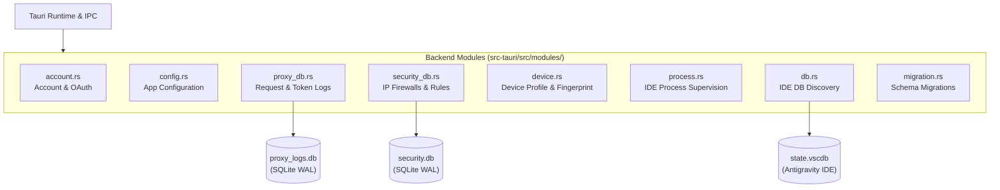

# Backend Modules, Storage Architecture, and Persistence

> **Specification:** `02-spec/21-app/04-modules-storage-and-persistence.md`
> **Status:** Production-Ready
> **Source Files:** `src-tauri/src/modules/`, `src-tauri/src/models/`, `src-tauri/src/error.rs`

---

## 1. Overview & Module Topology

The backend subsystem is structured into modular domain packages within `src-tauri/src/modules/`. Each module encapsulates business logic, operating system abstractions, process supervision, or database persistence behind clean Rust APIs.



---

## 2. SQLite Database Architecture (`rusqlite`)

The application avoids monolithic database locks by partitioning storage into dedicated SQLite database files managed through `rusqlite` with bundled SQLite 3:

### 2.1 Engine Pragmas & Concurrency Tuning
Every SQLite connection initializes with high-concurrency settings:
- **Journal Mode:** `PRAGMA journal_mode = WAL;` (Write-Ahead Logging permits concurrent readers without locking writers).
- **Busy Timeout:** `PRAGMA busy_timeout = 5000;` (Prevents immediate `SQLITE_BUSY` errors during concurrent bursts).
- **Synchronous Mode:** `PRAGMA synchronous = NORMAL;` (Safe with WAL while minimizing filesystem I/O wait).

### 2.2 Database Schemas

#### 1. Proxy Request Logs (`proxy_logs.db` - `modules/proxy_db.rs`)
Tracks all inbound proxy traffic with token usage and timings:
```sql
CREATE TABLE IF NOT EXISTS request_logs (
    id TEXT PRIMARY KEY,
    timestamp INTEGER NOT NULL,
    method TEXT NOT NULL,
    url TEXT NOT NULL,
    status INTEGER NOT NULL,
    duration INTEGER NOT NULL,
    model TEXT,
    error TEXT,
    request_body TEXT,
    response_body TEXT,
    input_tokens INTEGER DEFAULT 0,
    output_tokens INTEGER DEFAULT 0,
    cached_tokens INTEGER DEFAULT 0,
    account_name TEXT,
    provider TEXT
);
CREATE INDEX IF NOT EXISTS idx_request_logs_timestamp ON request_logs(timestamp);
CREATE INDEX IF NOT EXISTS idx_request_logs_model ON request_logs(model);
CREATE INDEX IF NOT EXISTS idx_request_logs_status ON request_logs(status);
```

#### 2. Security Database (`security.db` - `modules/security_db.rs`)
Maintains client IP access history, rate limits, and firewall filters:
```sql
CREATE TABLE IF NOT EXISTS ip_access_logs (
    id TEXT PRIMARY KEY,
    client_ip TEXT NOT NULL,
    timestamp INTEGER NOT NULL,
    method TEXT,
    path TEXT,
    user_agent TEXT,
    status INTEGER,
    duration INTEGER,
    api_key_hash TEXT,
    blocked INTEGER NOT NULL DEFAULT 0,
    block_reason TEXT,
    username TEXT
);

CREATE TABLE IF NOT EXISTS ip_blacklist (
    id TEXT PRIMARY KEY,
    ip_pattern TEXT NOT NULL UNIQUE,
    reason TEXT,
    created_at INTEGER NOT NULL,
    expires_at INTEGER,
    created_by TEXT,
    hit_count INTEGER NOT NULL DEFAULT 0
);

CREATE TABLE IF NOT EXISTS ip_whitelist (
    id TEXT PRIMARY KEY,
    ip_pattern TEXT NOT NULL UNIQUE,
    description TEXT,
    created_at INTEGER NOT NULL
);
```

#### 3. User Token Database (`user_token_db.rs`)
Supports multi-user token allocation and balance deduction when deployed as a shared or team gateway.

---

## 3. Account Management & Credential Lifecycle (`modules/account.rs`)

### 3.1 Data Model
- **`Account` Struct:** Contains `id`, `email`, `name`, `refresh_token`, `access_token`, `expires_at`, `quota`, `is_active`, `rate_limit_reset_time`.
- **OAuth Integration:**
  - `start_oauth_login`: Launches OAuth PKCE loopback listener.
  - `complete_oauth_login`: Exchanges authorization code for OAuth tokens and fetches user profile.
  - **Auto-Refresh:** Periodically validates `expires_at` and rotates OAuth tokens using Google OAuth token endpoints before upstream expiration.

### 3.2 Antigravity IDE Database Sync (`modules/db.rs`)
- Auto-detects local installations of Antigravity IDE, VS Code, and Cursor.
- Reads `state.vscdb` from `%APPDATA%/Antigravity/User/globalStorage/state.vscdb` (or macOS/Linux equivalents).
- Extracts active session tokens and imports existing authenticated accounts into the proxy pool with zero manual credential entry.

---

## 4. Device Fingerprinting & Spoofing (`modules/device.rs`)

To isolate accounts from upstream anti-abuse triggers, the system supports virtual device profiles:
- **Attributes:** Machine GUID (`machine_id`), MAC address, OS release version, architecture, and user-agent.
- **Profile Binding:** Accounts can be bound to distinct virtual hardware profiles.
- **Backup & Rollback:** Original system device identifiers are backed up before modifying IDE storage files, allowing 1-click restoration (`restore_original_device`).

---

## 5. Process Supervision & Diagnostics (`modules/process.rs`)

- Monitors running Antigravity IDE processes (`antigravity.exe` / `antigravity`).
- Extracts runtime CLI arguments, target working directories, and user-data directories using cross-platform process queries (`sysinfo`).
- Facilitates cache purging (`clear_antigravity_cache`) and environment repairs.
