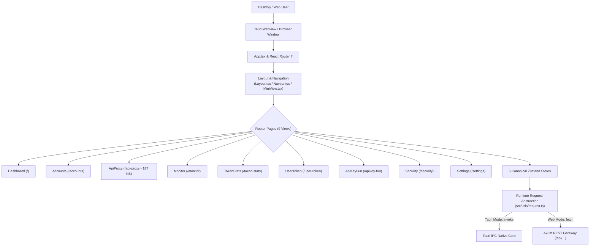

# Frontend UI Architecture, Design System, and State Management

> **Specification:** `02-spec/21-app/05-frontend-ui-and-state-management.md`
> **Status:** Production-Ready
> **Source Files:** `src/App.tsx`, `src/components/`, `src/stores/`, `src/pages/`, `src/services/`, `src/types/`, `src/utils/request.ts`, `src/i18n.ts`

---

## 1. Frontend Overview & Tech Stack

The user interface of Antigravity-Manager is built as a reactive, desktop-optimized Single-Page Application (SPA) loaded inside the Tauri Webview container (WebKit on macOS/Linux, WebView2 on Windows) or rendered directly in modern desktop browsers via a local HTTP administration server.

### Technology Matrix
- **Core Framework:** React 19 (`react`, `react-dom`) with React Router 7 (`react-router`, `react-router-dom`)
- **Build System:** Vite 7 with `@vitejs/plugin-react` and TypeScript 5.8
- **Styling System:** TailwindCSS 3.4, DaisyUI 5, `@tailwindcss/container-queries`, Emotion, and Ant Design 5 components
- **State Management:** Zustand 5 (`zustand`) across 5 dedicated stores
- **Data Visualization:** Recharts 3.5 for token utilization timelines and model usage graphs
- **Drag-and-Drop:** `@dnd-kit/core` and `@dnd-kit/sortable` for account priority ordering
- **Internationalization:** `i18next` and `react-i18next` supporting English, Simplified Chinese, and Arabic (RTL)



---

## 2. Component Hierarchy & Navigation

### 2.1 Layout Architecture (`src/components/layout/`)
- **`Layout.tsx`:** Primary application shell providing a fixed top window drag region (`h-9`, `z-index: 9999`, `data-tauri-drag-region`), `BackgroundTaskRunner`, `ToastContainer`, sticky `Navbar`, and `<Outlet />` for page routing.
- **`MiniView.tsx`:** Specialized compact floating widget mode for unobtrusive desktop monitoring. Displays proxy running status, active account badge, and live token throughput with compact controls.

### 2.2 Top Navigation Hierarchy (`src/components/navbar/`)
Navigation is managed exclusively through the sticky top navigation bar (`Navbar.tsx`, `pt-9`, `z-50`), completely avoiding sidebars:
- **`Navbar.tsx`:** Root navigation bar holding window drag regions, layout containers, theme transition handlers (View Transition API with Linux fallback), and language state synchronization.
- **`NavLogo.tsx`:** Application branding logo, status indicator, and version badge wrapped in container query `@container/logo`.
- **`NavMenu.tsx`:** Top navigation item links prioritized by workflow frequency:
  - *High Priority:* Dashboard (`/`), Accounts (`/accounts`), Proxy (`/api-proxy`), Relay Station (`/apikey-fun`), Settings (`/settings`).
  - *Medium Priority:* Call Records (`/monitor`).
  - *Low Priority:* Token Stats (`/token-stats`), User Tokens (`/user-token`), Security (`/security`).
- **`NavDropdowns.tsx`:** Responsive collapse dropdown menus that absorb lower-priority navigation items on narrower desktop viewports.
- **`NavSettings.tsx`:** Control actions for theme toggle (`light` / `dark`), language dropdown selector, and debug console activation.

### 2.3 Router Pages (`src/App.tsx` & `src/pages/`)
The application defines 9 top-level routes declared in `src/App.tsx`:
1. **Dashboard (`src/pages/Dashboard.tsx` - `/`):** Real-time proxy status, uptime, token usage timelines (Recharts), and quota summary gauges.
2. **Accounts (`src/pages/Accounts.tsx` - `/accounts`):** Card and table account views, `@dnd-kit` drag-and-drop rotation ordering, OAuth initiation, and device profile bindings.
3. **API Proxy (`src/pages/ApiProxy.tsx` - `/api-proxy`):** Comprehensive proxy management console (187 KB). Manages extensive local page state for upstream model routing rules, custom presets, scheduling configuration, sticky session bindings, circuit breaker parameters, Cloudflare tunnels, and direct proxy service controls.
4. **Monitor (`src/pages/Monitor.tsx` - `/monitor`):** Paginated HTTP request log viewer, SSE stream inspector, status code filtering, and payload search.
5. **Token Stats (`src/pages/TokenStats.tsx` - `/token-stats`):** Hourly, daily, and weekly token consumption analytics, model trend graphs, and per-account usage distributions.
6. **User Tokens (`src/pages/UserToken.tsx` - `/user-token`):** Multi-tenant downstream API token generation, IP binding limits, expiration management, and token revocation.
7. **Relay Station (`src/pages/ApiKeyFun.tsx` - `/apikey-fun`):** Upstream transit configuration, external key aggregator integration, and routing overrides.
8. **Security (`src/pages/Security.tsx` - `/security`):** Real-time IP connection monitor, CIDR blacklist/whitelist management, and master API key generation.
9. **Settings (`src/pages/Settings.tsx` - `/settings`):** Network interface bindings, port settings, autostart configuration, cache purging, and update channels.

---

## 3. State Management Architecture

### 3.1 The 5 Canonical Zustand Stores (`src/stores/`)
Global reactive state is partitioned strictly across 5 stores (there is no `useProxyStore`):
1. **`useAccountStore` (`src/stores/useAccountStore.ts`):**
   - *State:* `accounts: Account[]`, `currentAccount: Account | null`, `loading: boolean`, `error: string | null`.
   - *Actions:* `fetchAccounts`, `fetchCurrentAccount`, `addAccount`, `deleteAccount`, `deleteAccounts`, `switchAccount`, `refreshQuota`, `refreshAllQuotas`, `reorderAccounts`, `startOAuthLogin`, `completeOAuthLogin`, `cancelOAuthLogin`, `importV1Accounts`, `importFromDb`, `importFromCustomDb`, `syncAccountFromDb`, `toggleProxyStatus`, `warmUpAccounts`, `warmUpAccount`, `updateAccountLabel`.
2. **`useConfigStore` (`src/stores/useConfigStore.ts`):**
   - *State:* `config: AppConfig | null`, `loading: boolean`, `error: string | null`, `showAllQuotas: boolean`.
   - *Actions:* `loadConfig`, `saveConfig`, `updateTheme`, `updateLanguage`, `toggleShowAllQuotas`, `toggleMenuItem`, `isMenuItemHidden`.
3. **`useViewStore` (`src/stores/useViewStore.ts`):**
   - *State:* `isMiniView: boolean`.
   - *Actions:* `setMiniView(isMini: boolean)`, `toggleMiniView()`.
4. **`useNetworkMonitorStore` (`src/stores/networkMonitorStore.ts`):**
   - *State:* `requests: NetworkRequest[]` (in-memory ring buffer of last 100 requests), `isOpen: boolean`, `isRecording: boolean`.
   - *Actions:* `addRequest`, `updateRequest`, `clearRequests`, `setIsOpen`, `toggleRecording`.
5. **`useDebugConsole` (`src/stores/useDebugConsole.ts`):**
   - *State:* `isOpen: boolean`, `isEnabled: boolean`, `logs: LogEntry[]` (capped at 5000), `filter: LogLevel[]`, `searchTerm: string`, `autoScroll: boolean`.
   - *Actions:* `open`, `close`, `toggle`, `enable`, `disable`, `loadLogs`, `clearLogs`, `addLog`, `setFilter`, `setSearchTerm`, `setAutoScroll`, `startListening`, `stopListening`, `startPolling`, `stopPolling`, `checkEnabled`.

### 3.2 Page-Level State Encapsulation: `ApiProxy.tsx`
Due to rich operational parameters, `src/pages/ApiProxy.tsx` encapsulates 187 KB of component-local state using React `useState` hooks rather than polluting global stores:
- **Proxy Engine State:** `status: ProxyStatus` (running, port, base_url, active_accounts), `loading`, `copied`.
- **Model Routing & Presets:** `selectedProtocol`, `selectedModelId`, `zaiAvailableModels`, `customPresets`, `selectedPreset`, inline model mapping editor states (`editingKey`, `editingValue`).
- **Security & Tokens:** API key editing toggles (`isEditingApiKey`, `draftApiKey`), admin password dialogs (`isEditingAdminPassword`, `draftAdminPassword`).
- **Operational Modals:** Reset confirmation, key regeneration, rate-limit clearance, and session binding eviction dialogs.
- **Account Affinity:** `preferredAccountId`, `availableAccounts` for fixed single-account routing.
- **Tunneling:** Cloudflare tunnel daemon installation, status, and domain configuration.

---

## 4. Dual-Mode Runtime Architecture (`src/utils/request.ts`)

The frontend operates transparently in both desktop native and web browser environments through `src/utils/request.ts`:

1. **Environment Detection:**
   - Evaluates `window.__TAURI_INTERNALS__` or `window.__TAURI__` to detect native Tauri runtime.
2. **Native Tauri Dispatch:**
   - Dynamically imports `@tauri-apps/api/core` and invokes native backend handlers:
     ```typescript
     const { invoke } = await import('@tauri-apps/api/core');
     return await invoke<T>(cmd, args);
     ```
3. **Web HTTP REST Fallback:**
   - Translates command names via `COMMAND_MAPPING` into corresponding REST endpoints (`/api/...`).
   - Resolves route parameter substitutions (e.g., `:accountId`, `:versionId`, `:logId`).
   - Injects admin authorization headers (`Authorization: Bearer <key>`, `x-api-key: <key>`) from `sessionStorage`.
   - Handles HTTP query string construction for GET/DELETE and JSON request bodies for POST/PATCH.
   - Dispatches debounced `abv-unauthorized` events on 401 responses to prompt authentication.

### 4.1 Runtime Capability Matrix

| Runtime Mode | Endpoints / Commands | Supported Domains & Capabilities | Desktop Exclusivity & Fallback |
|---|---|---|---|
| **Web HTTP Mode** | 127 Endpoints via Axum REST Bridge | Accounts, Device Fingerprints, Quota sweeps, OAuth URL/client management, DB migration/import, Proxy controls, Proxy request logs/filters, Model routing & presets, Sticky session scheduling, Proxy pool bindings, Token statistics/analytics, CLI/OpenCode/Droid sync configuration, Security IP access logs, Blacklist/Whitelist firewall rules, Cloudflared tunnel status/control, Multi-tenant User Tokens. | Unsupported host-only desktop operations return 404/501 or prompt the user with Web fallback notifications. |
| **Desktop Native Mode** | 153 Commands (127 Web + 26 Tauri Desktop-Only) | All 127 Web endpoints plus 26 Tauri-exclusive desktop commands: OS/window management (`show_main_window`, `set_window_theme`, `open_data_folder`, `open_device_folder`, `get_antigravity_path`, `get_antigravity_cli_path`, `get_antigravity_args`, `save_text_file`, `read_text_file`), OS autostart (`toggle_auto_launch`, `is_auto_launch_enabled`), native package upgrades (`check_homebrew_installation`, `check_appimage_installation`, `brew_upgrade_cask`), binary patching (`patch_agy_binary`), local loopback OAuth callback listener (`start_oauth_login`, `complete_oauth_login`, `cancel_oauth_login`, `submit_oauth_code`), and host diagnostics (`greet`, `get_antigravity_cache_paths`, `clear_antigravity_cache`, `clear_log_cache`, `get_data_dir_path`, `query_transit_info`). | Full access via `@tauri-apps/api/core` native IPC bridge without network serialization overhead. |

---

## 5. Verification & Acceptance Criteria

### AC-UI-001: Route & Navigation Coverage
- **Executable Test:** `tests::test_navbar_route_dispatch`
- **Given** The React Router hierarchy defined in `src/App.tsx`.
- **When** A user navigates across all 9 application routes (`/`, `/accounts`, `/api-proxy`, `/monitor`, `/token-stats`, `/user-token`, `/apikey-fun`, `/security`, `/settings`).
- **Then** Every route renders within `Layout.tsx`, mounts its page component, and is accessible from `Navbar.tsx` or `NavDropdowns.tsx` without runtime errors.

### AC-UI-002: Store State Hygiene & Immutable Updates
- **Executable Test:** `tests::test_zustand_store_immutable_updates`
- **Given** The frontend state layer in `src/stores/`.
- **When** Auditing all import statements across `src/` and evaluating state updates.
- **Then** All global state is sourced exclusively from the 5 canonical stores (`useAccountStore`, `useConfigStore`, `useViewStore`, `networkMonitorStore`, `useDebugConsole`) using immutable updates; zero references to `Sidebar.tsx` or `useProxyStore.ts` exist.

### AC-UI-003: Dual-Mode Request Bridge Conformance
- **Executable Test:** `tests::test_dual_mode_bridge_dispatch`
- **Given** The IPC abstraction in `src/utils/request.ts` and the Runtime Capability Matrix.
- **When** Executing commands under Tauri desktop or browser web mode.
- **Then** In Tauri mode, calls invoke native IPC handlers across all 153 commands; in Web mode, 127 supported endpoints resolve via `COMMAND_MAPPING` to HTTP endpoints with authentication headers and 204/JSON response handling, while the 26 desktop-exclusive commands are guarded.
