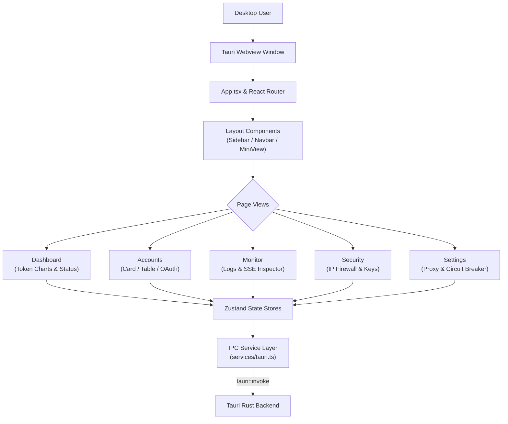

# Frontend UI Architecture, Design System, and State Management

> **Specification:** `02-spec/21-app/05-frontend-ui-and-state-management.md`
> **Status:** Production-Ready
> **Source Files:** `src/App.tsx`, `src/components/`, `src/stores/`, `src/pages/`, `src/services/`, `src/types/`, `src/i18n.ts`

---

## 1. Frontend Overview & Tech Stack

The user interface of Antigravity-Manager is built as a reactive, desktop-optimized Single-Page Application (SPA) loaded inside the Tauri Webview container (WebKit on macOS/Linux, WebView2 on Windows).

### Technology Matrix
- **Core Framework:** React 19 (`react`, `react-dom`) with React Router 7 (`react-router`, `react-router-dom`)
- **Build System:** Vite 7 with `@vitejs/plugin-react` and TypeScript 5.8
- **Styling System:** TailwindCSS 3.4, DaisyUI 5, Emotion, and Ant Design 5 components
- **State Management:** Zustand 5 (`zustand`)
- **Data Visualization:** Recharts 3.5 for token utilization timelines and model usage graphs
- **Drag-and-Drop:** `@dnd-kit/core` and `@dnd-kit/sortable` for account priority ordering
- **Internationalization:** `i18next` and `react-i18next` with Chinese and English translations

---

## 2. Component Hierarchy & Navigation

### 2.1 Shell & Layout (`src/components/layout/`)
- **`Sidebar.tsx`:** Primary navigation menu providing fast switching between Dashboard, Accounts, Monitor, Security, and Settings. Displays active proxy status pill.
- **`Navbar.tsx`:** Header containing quick proxy toggle, language switcher, theme toggle (dark/light), and window controls.
- **`MiniView.tsx`:** Specialized compact floating widget mode for unobtrusive desktop monitoring. Displays current proxy status, active account, and live token throughput.

### 2.2 Views & Pages (`src/pages/`)
1. **Dashboard (`pages/Dashboard.tsx`):**
   - Real-time proxy status indicator (port, uptime, active connections).
   - Upstream quota summary gauges across all accounts.
   - Interactive token consumption charts (input vs output tokens per model over time).
2. **Accounts (`pages/Accounts.tsx`):**
   - Renders accounts in Card or Table view.
   - Drag-and-drop prioritization governing rotation order.
   - Visual quota indicators (5-hour window percentage bar and weekly quota bar).
   - Device profile binding modal and OAuth login initiation.
3. **Monitor (`pages/Monitor.tsx`):**
   - Paginated real-time stream of HTTP requests passing through the proxy.
   - Filtering by status code (200, 429, 500), model name, or full-text request body search.
   - Log Detail Drawer displaying exact headers, request payloads, response bodies, and token breakdown.
4. **Security (`pages/Security.tsx`):**
   - Real-time IP connection monitor.
   - IP Blacklist & Whitelist configuration tables with expiration timers.
   - Master API key management (generate, copy, revoke).
5. **Settings (`pages/Settings.tsx`):**
   - Network bindings (Host IP, Port, Body limits).
   - Upstream model mapping overrides (alias translation).
   - Circuit Breaker controls (`lock_on_zero_quota`, max backoff steps).
   - Startup behavior (Run on boot, minimize to tray, auto-check updates).

---

## 3. Zustand State Architecture (`src/stores/`)

The application decouples UI components from backend IPC calls using dedicated Zustand stores:

### 3.1 Account Store
- **State:** `accounts: Account[]`, `selectedAccountId: string | null`, `isLoading: boolean`.
- **Actions:**
  - `loadAccounts()`: Calls `commands::list_accounts` and syncs token manager rate-limit countdowns.
  - `reorderAccounts(newOrder)`: Persists prioritized account sequence to backend.
  - `deleteAccount(id)`: Removes credentials and updates pool.

### 3.2 Proxy Store
- **State:** `isRunning: boolean`, `status: ProxyStatus`, `stats: ProxyStats`, `schedulingConfig: SchedulingConfig`.
- **Actions:**
  - `startProxy()` / `stopProxy()`: Toggles proxy listener.
  - `refreshStats()`: Fetches live connection count and total tokens processed.

### 3.3 Config Store
- **State:** `config: AppConfig`, `isDirty: boolean`.
- **Actions:**
  - `loadConfig()`: Pulls settings from disk.
  - `saveConfig(patch)`: Atomically updates configuration file and broadcasts changes to proxy engine.

---

## 4. Internationalization & System Detection (`src/i18n.ts`)

- Multi-language engine powered by `i18next`.
- Translation dictionaries stored in `src/locales/en.json` and `src/locales/zh.json`.
- **System Language Auto-Detection (`src-tauri/src/modules/i18n.rs`):**
  - On first boot without an explicit user preference, the backend inspects the host OS locale via `sys_locale::get_locale()`.
  - Automatically initializes the UI in Chinese (`zh`) if the system locale begins with `zh`, defaulting to English (`en`) otherwise.
