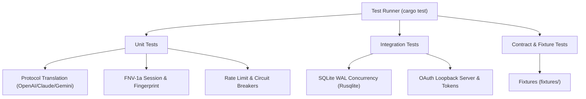

# Testing, Verification, and Fixture Specifications

> **Specification:** `02-spec/21-app/07-testing-and-verification.md`
> **Status:** Production-Ready
> **Source Directories:** `src-tauri/src/proxy/tests/`, `src-tauri/tests/`, `02-spec/21-app/fixtures/`

---

## 1. Overview & Test Architecture

The Antigravity-Manager verification suite provides multi-layered validation across the reverse proxy gateway, database persistence, protocol mappers, and Tauri IPC interfaces. Over 520 automated unit and integration tests are maintained within `src-tauri/`.



---

## 2. Test Fixtures Directory (`fixtures/`)

Representative wire payloads are stored under `02-spec/21-app/fixtures/`:

| Fixture File | Protocol / Purpose | Verification Target |
|---|---|---|
| [`openai-chat-request.json`](fixtures/openai-chat-request.json) | OpenAI `/v1/chat/completions` request | Validates JSON deserialization into `OpenAIRequest` |
| [`claude-message-request.json`](fixtures/claude-message-request.json) | Claude `/v1/messages` request | Validates conversion to upstream Gemini format |
| [`gemini-rpc-envelope.json`](fixtures/gemini-rpc-envelope.json) | Upstream Antigravity RPC payload | Validates signed 64-bit integer `sessionId` & envelope |
| [`proxy-request-log.json`](fixtures/proxy-request-log.json) | 18-column SQLite log record | Validates `ProxyRequestLog` persistence schema |

---

## 3. Core Test Suites & Coverage Requirements

### 3.1 Session ID & Fingerprinting (`proxy/common/session.rs`, `proxy/session_manager.rs`)
- **Deterministic FNV-1a Hashing:** Verifies that given identical `account_id`, `fingerprint`, and `generation`, `derive_session_scoped` returns an exact signed 64-bit decimal string.
- **Upstream Session Scoping:** Verifies that session generation bumps correctly invalidate accumulated tokens while preserving conversation context.

### 3.2 Protocol Translation Mappers (`proxy/mappers/`)
- **OpenAI Streaming:** Verifies SSE chunks emit `data: {"object":"chat.completion.chunk",...}` with accurate deltas and terminating `data: [DONE]`.
- **Claude Tool Rewriting:** Verifies transformation of Claude tool calls (`EnterPlanMode`, `grep`, `read`) to upstream Gemini equivalents.
- **Thinking Blocks:** Verifies stripping of `<think>` tags and preservation of thought signatures in `SignatureCache`.

### 3.3 SQLite WAL Concurrency & Migrations (`modules/proxy_db.rs`, `security_db.rs`)
- **WAL Pragma Conformance:** Verifies connections execute with `PRAGMA journal_mode = WAL` and `PRAGMA busy_timeout = 5000`.
- **18-Column Schema Persistence:** Verifies insertion, indexing, and pagination over `request_logs`.

---

## 4. CI/CD Automated Test Execution

Automated test gates must be executed in local workflows and GitHub Actions:

```bash
# Run full Rust workspace test suite
cargo test --workspace -- --nocapture

# Run specific proxy integration tests
cargo test --package antigravity-manager --test security_integration_tests
```

---

## 5. Verification & Acceptance Criteria

- **AC-TST-001 (Fixture Validation):** All sample JSON payloads in `fixtures/` deserialize without error into their respective backend Rust structs.
- **AC-TST-002 (Deterministic Hash Test):** Given `account_id = "test-account"`, `fingerprint = "sid-12345678"`, `generation = 0`, the FNV-1a hashing function returns an integer parseable as `i64`.
- **AC-TST-003 (CI Pipeline Inclusion):** Continuous integration workflow `.github/workflows/ci.yml` executes `cargo test --workspace` as a mandatory blocking quality gate.
