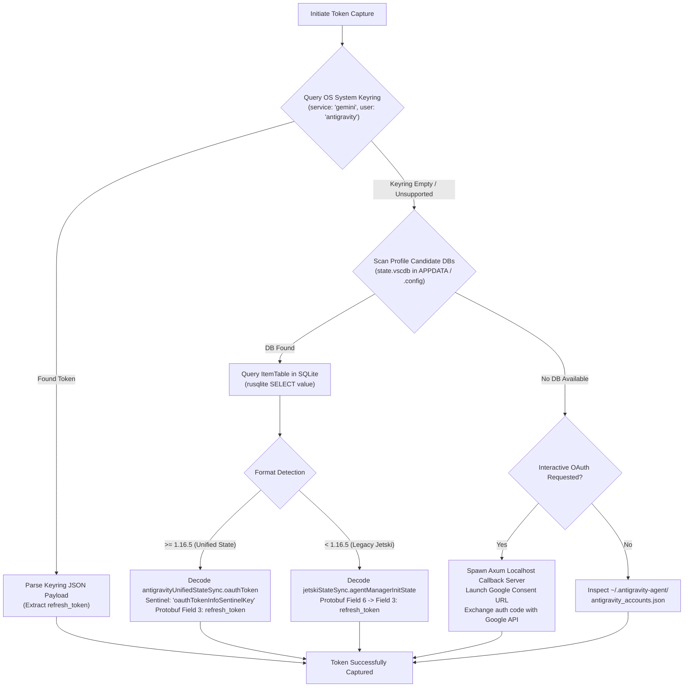
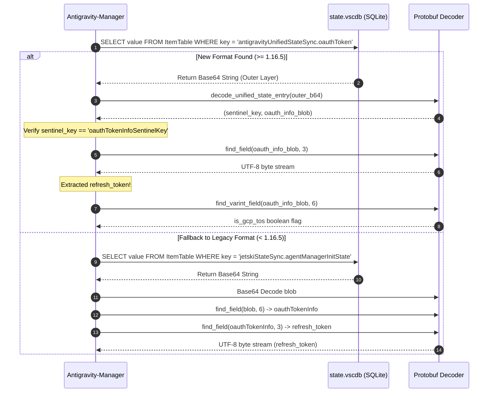
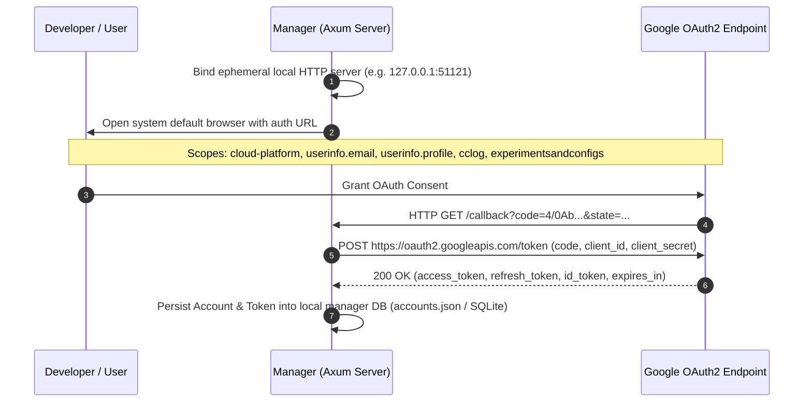

# Refresh Token Capture Architecture & Protocols

> Authoritative guide detailing how Antigravity-Manager discovers, parses, and extracts OAuth refresh tokens across operating systems, profiles, and runtimes.

---

## 1. Overview of Token Capture Pathways

Antigravity-Manager captures refresh tokens through four distinct pathways, evaluated in a deterministic fallback chain:



---

## 2. Pathway 1: OS System Keyring (Modern >= 2.0.0 & agy CLI)

The modern Antigravity IDE and `agy` CLI persist credentials directly to the host OS credential store. Antigravity-Manager queries this directly via `read_from_system_keyring()` in `src-tauri/src/modules/integration.rs`:

| Platform | Underlying API / Command | Service / Target Name | User / Account |
| :--- | :--- | :--- | :--- |
| **Windows** | Win32 `advapi32.dll::CredReadW` | `gemini:antigravity` | `antigravity` |
| **macOS** | `/usr/bin/security find-generic-password` | `gemini` | `antigravity` |
| **Linux** | `secret-tool lookup` | `gemini` | `antigravity` |

### Keyring Payload Format

The decrypted credential blob is formatted as a JSON object:
```json
{
  "token": {
    "access_token": "ya29.a0...",
    "refresh_token": "1//04...",
    "token_type": "Bearer",
    "expiry": "2026-09-15T12:00:00Z"
  }
}
```
If the payload contains the `go-keyring-base64:` prefix (macOS format), the manager strips the prefix and decodes the Base64 bytes prior to JSON parsing.

---

## 3. Pathway 2: Profile SQLite Database (`state.vscdb`)

When the OS Keyring is empty or during profile migrations, the manager inspects local SQLite storage via `extract_oauth_state_from_file()` in `src-tauri/src/modules/migration.rs`.

### Candidate Database Locations

The candidate path resolver in `src-tauri/src/modules/db.rs` checks:
- **Windows:** `%APPDATA%\Antigravity\User\globalStorage\state.vscdb` and `%APPDATA%\Antigravity IDE\User\globalStorage\state.vscdb`
- **macOS:** `~/Library/Application Support/Antigravity/User/globalStorage/state.vscdb`
- **Linux:** `~/.config/Antigravity/User/globalStorage/state.vscdb`

### Protobuf Extraction Sequence



### Protobuf Wire Encoding Details

1. **New Unified State Format (`antigravityUnifiedStateSync.oauthToken`):**
   - **Outer Wrapper:** Protobuf Field 1 contains nested protobuf.
   - **Middle Layer:** Field 2 contains inner state entry.
   - **Inner Entry:** Field 1 contains Base64-encoded string payload.
   - **OAuthInfo Structure:**
     - `Field 3 (Length-Delimited, Wire Type 2)`: Refresh Token (UTF-8 string).
     - `Field 6 (Varint, Wire Type 0)`: `is_gcp_tos` acceptance flag (`1` = true).
2. **Enterprise Project ID:**
   - Queried from key `antigravityUnifiedStateSync.enterprisePreferences`.
   - Field 3 in the decoded inner message holds the Google Cloud Project ID string.

---

## 4. Pathway 3: Interactive Browser OAuth Consent

When adding a fresh account without an existing installation, the manager runs an interactive OAuth2 flow defined in `src-tauri/src/modules/oauth.rs`:



### Client Credentials & Scopes

- **Standard Google Client ID:** `1071006060591-tmhssin2h21lcre235vtolojh4g403ep.apps.googleusercontent.com`
- **Redirect URI:** `http://127.0.0.1:<random_port>/callback`
- **Offline Access:** `access_type=offline` and `prompt=consent` are mandatory parameters to force Google to return a `refresh_token`.

---

## 5. Pathway 4: V1 Directory Migration (`~/.antigravity-agent/`)

For backward compatibility, the manager scans `~/.antigravity-agent/antigravity_accounts.json` via `import_from_v1()` in `src-tauri/src/modules/migration.rs`:
- Extracts legacy user profiles, backup file paths, and cached access tokens.
- Re-reads referenced `state.vscdb` backup snapshots to restore persistent refresh tokens.

---

## 6. Implementation Checklist for AI Agents

When implementing or debugging token capture in new tools or plugins:
1. [ ] Check OS Keyring first (`gemini:antigravity`) using native OS APIs to minimize file I/O locks.
2. [ ] If accessing `state.vscdb`, open SQLite with read-only flag or query while Antigravity is dormant to avoid database lock errors.
3. [ ] Parse protobuf with wire-type awareness (Wire type 2 for length-delimited strings, Wire type 0 for varints).
4. [ ] Always verify `refresh_token` format (starts with `1//` for standard Google OAuth offline tokens).
