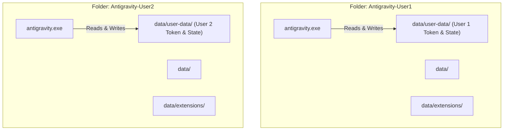
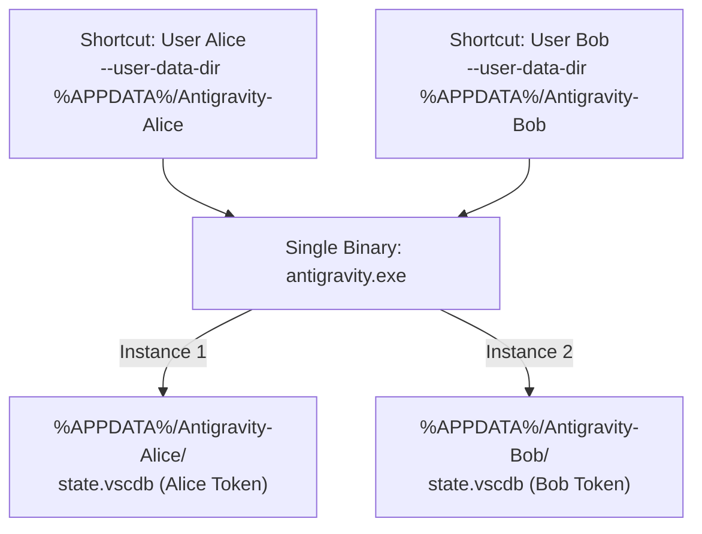

# Portable Folder Copy & Multi-User Antigravity Guide

> Practical guide explaining how to duplicate Antigravity folders to run independent, simultaneous instances for different users and accounts.

---

## 1. Quick Answer: Is It Possible?

**YES, 100% possible.**

You can copy the Antigravity folder and open multiple instances for different users simultaneously.

There are two primary methods to do this:

1. **Method A (The Portable Folder Method — Recommended):**
   Copy the Antigravity application folder and add a `data/` directory inside it. This enables VS Code/Electron **Portable Mode**. You can launch each folder by simply double-clicking its `antigravity.exe`.
2. **Method B (The Profile Data Directory Method — Storage Efficient):**
   Keep a single Antigravity installation and duplicate only the user data folder (`%APPDATA%\Antigravity`), launching each profile with `--user-data-dir`.

---

## 2. Method A: The Portable Folder Copy Method (Step-by-Step)

VS Code and Antigravity natively support **Portable Mode**. When an application directory contains a folder named `data`, Antigravity isolates all session data, login tokens, cookies, extensions, and single-instance locks inside that directory.



### Step-by-Step Setup

1. **Locate your Antigravity installation directory:**
   - Typically found at `%LOCALAPPDATA%\Programs\Antigravity` or `C:\Program Files\Antigravity`.
2. **Copy the entire folder:**
   - Copy `Antigravity` to `C:\AI-Tools\Antigravity-Alice`.
   - Copy `Antigravity` to `C:\AI-Tools\Antigravity-Bob`.
3. **Enable Portable Mode:**
   - Inside `Antigravity-Alice\`, create an empty folder named `data`.
   - Inside `Antigravity-Bob\`, create an empty folder named `data`.
4. **(Optional) Seed Existing Login:**
   - If you want to copy an existing logged-in session, copy the contents of `%APPDATA%\Antigravity` into `Antigravity-Alice\data\user-data\`.
5. **Launch:**
   - Double-click `Antigravity-Alice\antigravity.exe`. Log in as User 1.
   - Double-click `Antigravity-Bob\antigravity.exe`. Log in as User 2.
   - Both windows run side-by-side with separate PIDs, distinct accounts, and zero interference.

---

## 3. Method B: Shared Binary with Copied Profile Directories

If you do not want to duplicate the ~400MB application binaries, you can duplicate only the user profile storage:



### Step-by-Step Setup

1. **Copy the user data directory:**
   ```powershell
   # Windows PowerShell example:
   Copy-Item -Recurse "$env:APPDATA\Antigravity" "$env:APPDATA\Antigravity-Alice"
   Copy-Item -Recurse "$env:APPDATA\Antigravity" "$env:APPDATA\Antigravity-Bob"
   ```
2. **Create Desktop Shortcuts:**
   - **Shortcut 1 Target:**
     `"C:\Users\<user>\AppData\Local\Programs\Antigravity\antigravity.exe" --user-data-dir "%APPDATA%\Antigravity-Alice" --password-store="basic"`
   - **Shortcut 2 Target:**
     `"C:\Users\<user>\AppData\Local\Programs\Antigravity\antigravity.exe" --user-data-dir "%APPDATA%\Antigravity-Bob" --password-store="basic"`
3. **Launch:**
   - Open both shortcuts. Each opens in its own window with independent user state.

---

## 4. How Antigravity-Manager Integrates with Copied Folders

The Antigravity-Manager codebase specifically scans for portable mode databases. In `src-tauri/src/modules/db.rs:31-42`:

```rust
if let Some(antigravity_path) = get_antigravity_path(target_ide) {
    if let Some(parent_dir) = antigravity_path.parent() {
        paths.push(
            PathBuf::from(parent_dir)
                .join("data")
                .join("user-data")
                .join("User")
                .join("globalStorage")
                .join("state.vscdb"),
        );
    }
}
```

When you point Antigravity-Manager's executable configuration to `Antigravity-Alice\antigravity.exe`, it automatically locates `data/user-data/User/globalStorage/state.vscdb` and can inject or extract tokens directly for that instance.

---

## 5. Comparison: Which Method Should You Use?

| Feature | Method A: Portable Folder Copy | Method B: Copied Profile Data Dir |
| :--- | :--- | :--- |
| **Simplicity** | Double-click `antigravity.exe` directly | Requires shortcut with CLI flags |
| **Portability** | Can be moved to external SSD / USB | Bound to `%APPDATA%` path |
| **Disk Usage** | ~450 MB per instance | ~30-50 MB per instance |
| **Extension Isolation** | Completely independent extensions | Can share or isolate extensions |
| **Crash / Lock Isolation** | 100% isolated lock files | 100% isolated lock files |
