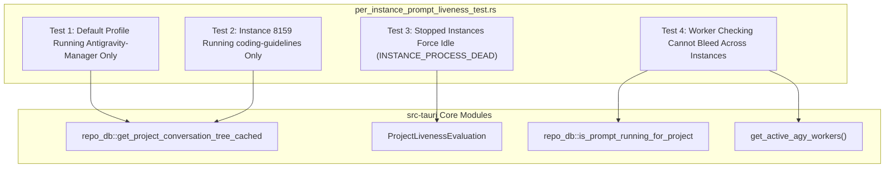

# 118 Component Specification: Frontend Status Logic & Integration Test Suite

## 1. Executive Summary & Purpose

This specification defines the frontend component behavior, state evaluation fixes, and integration test suite architecture for **Task 118: Instance Prompt Execution Status Fix**.

### 1.1 Problem Statement & Visual Evidence
User testing revealed severe cross-instance state pollution and false-positive running indicators across two instances:
1. **Sequence 1 — Default Profile (`default`)**:
   - Actively running **only** `Antigravity-Manager`.
   - Projects `SpecBuilder` and `coding-guidelines` were completely idle in reality.
   - **Bug**: The frontend UI and status evaluation previously showed `SpecBuilder` and `coding-guidelines` as running or displayed active pulses due to stale historical status strings and permissive OR-conditions.
2. **Sequence 2 — Instance 8159 (`default-copy-8159`)**:
   - Actively running **only** `coding-guidelines`.
   - Projects `Antigravity-Manager` and `SpecBuilder` were completely idle in reality.
   - **Bug**: The UI falsely reported `Antigravity-Manager` and `SpecBuilder` as running, inheriting active state from the default instance or from cloned historical database records.

### 1.2 Core Architectural Fixes
This specification establishes four non-negotiable architectural mandates:
1. **Strict Liveness Sourced Exclusively from `is_running: boolean`**:
   The frontend previously evaluated `c.is_running || c.status === 'RUNNING'`. Because SQLite databases often retain `status = 'RUNNING'` from unfinished historical sessions, hard process kills, or cloned database snapshots, this fallback completely bypassed backend real-time process verification. **All frontend components must base liveness strictly on the `is_running` boolean.**
2. **Instance-Scoped Worker Verification**:
   Backend worker checks in `repo_db::is_prompt_running_for_project` must verify both `instance_id` and `project_id`, preventing active workers in `default` from bleeding into `default-copy-8159`.
3. **Dead Instance Process Gate (`INSTANCE_PROCESS_DEAD`)**:
   If an instance OS process is dead (`is_running = false`), every project and conversation under that instance is unconditionally reported as idle (`is_running = false`).
4. **Isolated Project Tree Queries**:
   Frontend queries must isolate project trees per instance, preventing foreign workspace bleed.

---

## 2. Frontend Component Specifications

### 2.1 `src/pages/Instances.tsx`

`Instances.tsx` is the primary dashboard rendering instance cards, active task indicators, and recent projects.

#### 2.1.1 `fetchRunningTasks` Polling Loop
- **Location**: `src/pages/Instances.tsx` (~line 240)
- **Role**: Periodically queries `get_project_conversation_tree` to populate `projectTreeNodes` and filter `runningTreeNodes`.
- **Flawed Code**:
  ```typescript
  // FLAWED: c.status === 'RUNNING' overrides backend verification
  const running = data.filter(
      (node) => Boolean(node.is_running) || Boolean(node.conversations?.some((c) => c.is_running || c.status === 'RUNNING'))
  );
  ```
- **Remediated Implementation**:
  ```typescript
  // FIXED: Strict evaluation based exclusively on backend is_running
  const running = data.filter(
      (node) => Boolean(node.is_running) || Boolean(node.conversations?.some((c) => Boolean(c.is_running)))
  );
  ```

#### 2.1.2 Card-Level Active Task Detection (`hasActiveTask`)
- **Location**: `src/pages/Instances.tsx` (~line 1015)
- **Role**: Determines whether the card header displays the animated green/cyan execution dot and active indicator.
- **Flawed Code**:
  ```typescript
  // FLAWED: Evaluated c.status === 'RUNNING'
  const hasActiveTask = Boolean(inst.is_running) && runningTreeNodes.some((node) => {
      const isInstanceMatch = inst.config.is_default
          ? (node.instance_id === 'default' || node.instance_id === '__default__' || !node.instance_id || node.instance_id === inst.config.id)
          : node.instance_id === inst.config.id;
      const isNodeRunning = Boolean(node.is_running) || Boolean(node.conversations?.some((c) => c.is_running || c.status === 'RUNNING'));
      return isInstanceMatch && isNodeRunning;
  });
  ```
- **Remediated Implementation**:
  ```typescript
  // FIXED: Strict liveness via is_running boolean only
  const hasActiveTask = Boolean(inst.is_running) && runningTreeNodes.some((node) => {
      const isInstanceMatch = inst.config.is_default
          ? (node.instance_id === 'default' || node.instance_id === '__default__' || !node.instance_id || node.instance_id === inst.config.id)
          : node.instance_id === inst.config.id;
      const isNodeRunning = Boolean(node.is_running) || Boolean(node.conversations?.some((c) => Boolean(c.is_running)));
      return isInstanceMatch && isNodeRunning;
  });
  ```

#### 2.1.3 Project Sorting Priority (`sortedProjects`)
- **Location**: `src/pages/Instances.tsx` (~line 1372)
- **Role**: Sorts projects within the instance card so that actively running projects appear first.
- **Flawed Code**:
  ```typescript
  // FLAWED: c.status === 'RUNNING' caused idle projects with stale status to float to the top
  const sortedProjects = [...instanceProjects].sort((a, b) => {
      const aRunning = Boolean(inst.is_running) && Boolean(a.is_running || a.conversations?.some((c) => c.is_running || c.status === 'RUNNING'));
      const bRunning = Boolean(inst.is_running) && Boolean(b.is_running || b.conversations?.some((c) => c.is_running || c.status === 'RUNNING'));
      if (aRunning !== bRunning) return aRunning ? -1 : 1;
      // ...
  });
  ```
- **Remediated Implementation**:
  ```typescript
  // FIXED: Strictly rely on is_running
  const sortedProjects = [...instanceProjects].sort((a, b) => {
      const aRunning = Boolean(inst.is_running) && Boolean(a.is_running || a.conversations?.some((c) => Boolean(c.is_running)));
      const bRunning = Boolean(inst.is_running) && Boolean(b.is_running || b.conversations?.some((c) => Boolean(c.is_running)));
      if (aRunning !== bRunning) return aRunning ? -1 : 1;
      const aLatest = Math.max(0, ...(a.conversations || []).map((c) => new Date(c.last_modified).getTime() || 0));
      const bLatest = Math.max(0, ...(b.conversations || []).map((c) => new Date(c.last_modified).getTime() || 0));
      if (bLatest !== aLatest) return bLatest - aLatest;
      return a.repo_name.localeCompare(b.repo_name);
  });
  ```

#### 2.1.4 Individual Project Running Badge (`isProjRunning`)
- **Location**: `src/pages/Instances.tsx` (~line 1400)
- **Role**: Controls rendering of the glowing `RUNNING` badge inside each project pill.
- **Flawed Code**:
  ```typescript
  // FLAWED: c.status === 'RUNNING' activated badge on idle projects
  const isProjRunning = Boolean(inst.is_running) && Boolean(proj.is_running || proj.conversations?.some((c) => c.is_running || c.status === 'RUNNING'));
  ```
- **Remediated Implementation**:
  ```typescript
  // FIXED: Completely purged c.status === 'RUNNING'
  const isProjRunning = Boolean(inst.is_running) && Boolean(proj.is_running || proj.conversations?.some((c) => Boolean(c.is_running)));
  ```
- **UI Contract**:
  - When `isProjRunning === true`:
    ```tsx
    <span className="px-1 py-0.2 rounded-[4px] text-[9px] font-bold bg-cyan-500/15 text-cyan-600 dark:text-cyan-300 border border-cyan-400/30 flex items-center gap-0.5">
        <span className="w-1 h-1 rounded-full bg-cyan-500 animate-pulse" />
        RUNNING
    </span>
    ```
  - When `isProjRunning === false`:
    No running badge rendered. Only the turn count pill `{totalTurns} turns` is rendered.

---

### 2.2 `src/components/instances/PromptTreeViewModal.tsx`

`PromptTreeViewModal.tsx` allows users to explore project conversation trees, prompt steps, and running sessions. All occurrences of `c.status === 'RUNNING'` must be purged.

#### 2.2.1 Audit of Flawed Conditions in `PromptTreeViewModal.tsx`
The following 9 locations must be updated to eliminate `|| c.status === 'RUNNING'`:

1. **Auto-Selection on Modal Open** (~line 107):
   - *Previous*: `if (conv.is_running === true || conv.status === 'RUNNING')`
   - *Remediated*: `if (Boolean(conv.is_running))`
2. **Initial Target Project Conversation Selection** (~line 656):
   - *Previous*: `const runningConv = target.conversations.find((c) => c.is_running === true || c.status === 'RUNNING');`
   - *Remediated*: `const runningConv = target.conversations.find((c) => Boolean(c.is_running));`
3. **Prioritized Project Pool Sorting** (~lines 694–695):
   - *Previous*:
     ```typescript
     const aRunning = a.is_running || a.conversations.some((c) => c.is_running || c.status === 'RUNNING');
     const bRunning = b.is_running || b.conversations.some((c) => c.is_running || c.status === 'RUNNING');
     ```
   - *Remediated*:
     ```typescript
     const aRunning = Boolean(a.is_running) || a.conversations.some((c) => Boolean(c.is_running));
     const bRunning = Boolean(b.is_running) || b.conversations.some((c) => Boolean(c.is_running));
     ```
4. **Global Running Conversation Sweep** (~line 714):
   - *Previous*: `if (conv.is_running === true || conv.status === 'RUNNING')`
   - *Remediated*: `if (Boolean(conv.is_running))`
5. **Running Filter Tab** (~line 1158):
   - *Previous*: `list = list.filter((p) => p.is_running || p.conversations.some((c) => c.is_running || c.status === 'RUNNING'));`
   - *Remediated*: `list = list.filter((p) => Boolean(p.is_running) || p.conversations.some((c) => Boolean(c.is_running)));`
6. **Active Filter Multi-Tier Sorting** (~lines 1176–1177):
   - *Previous*:
     ```typescript
     const aRunning = a.is_running || a.conversations.some((c) => c.is_running || c.status === 'RUNNING');
     const bRunning = b.is_running || b.conversations.some((c) => c.is_running || c.status === 'RUNNING');
     ```
   - *Remediated*:
     ```typescript
     const aRunning = Boolean(a.is_running) || a.conversations.some((c) => Boolean(c.is_running));
     const bRunning = Boolean(b.is_running) || b.conversations.some((c) => Boolean(c.is_running));
     ```
7. **`sortConversations` Filter** (~line 1208):
   - *Previous*: `sorted = sorted.filter((c) => c.is_running || c.status === 'RUNNING');`
   - *Remediated*: `sorted = sorted.filter((c) => Boolean(c.is_running));`
8. **`sortConversations` Rank Comparator** (~lines 1211–1212):
   - *Previous*:
     ```typescript
     const aRunning = a.is_running || a.status === 'RUNNING';
     const bRunning = b.is_running || b.status === 'RUNNING';
     ```
   - *Remediated*:
     ```typescript
     const aRunning = Boolean(a.is_running);
     const bRunning = Boolean(b.is_running);
     ```
9. **Row Item Running Badge** (~line 1234):
   - *Previous*: `const isRunning = conv.is_running || conv.status === 'RUNNING';`
   - *Remediated*: `const isRunning = Boolean(conv.is_running);`

---

## 3. Test Suite Architecture: `src-tauri/tests/per_instance_prompt_liveness_test.rs`

### 3.1 Architecture Overview
The integration test suite in `src-tauri/tests/per_instance_prompt_liveness_test.rs` is an automated, deterministic test harness testing multi-instance project isolation, worker boundaries, and process-gated prompt liveness without requiring live IDE graphical windows.



### 3.2 Required Test Cases

#### 3.2.1 Test Case 1: Default Profile Running Antigravity-Manager Only
- **Function Name**: `test_default_profile_running_antigravity_manager_only`
- **Scenario**:
  - The Default profile has 3 workspace folders in storage:
    1. `Antigravity-Manager`
    2. `SpecBuilder`
    3. `coding-guidelines`
  - The Default instance operating system process is **ALIVE**.
  - An active execution is initiated for `Antigravity-Manager` (`is_running = true`).
  - `SpecBuilder` and `coding-guidelines` have historical conversations where `not_fully_idle = 0` (or status string `'RUNNING'` from past terminated sessions).
- **Assertions**:
  1. `is_prompt_running_for_project("Antigravity-Manager", "default") == true`.
  2. `is_prompt_running_for_project("SpecBuilder", "default") == false`.
  3. `is_prompt_running_for_project("coding-guidelines", "default") == false`.
  4. Querying project tree for `"default"` reports `is_running == true` strictly for `Antigravity-Manager`.
  5. Both `SpecBuilder` and `coding-guidelines` evaluate strictly to `is_running == false`.

#### 3.2.2 Test Case 2: Instance 8159 Running coding-guidelines Only
- **Function Name**: `test_instance_8159_running_coding_guidelines_only`
- **Scenario**:
  - Instance `default-copy-8159` (ID: `default-copy-8159`) has 3 cloned workspace folders:
    1. `coding-guidelines`
    2. `Antigravity-Manager`
    3. `SpecBuilder`
  - Instance 8159 process is **ALIVE**.
  - Default profile process is **IDLE** or running unrelated tasks.
  - Active execution is dispatched on Instance 8159 **only** for `coding-guidelines`.
- **Assertions**:
  1. `is_prompt_running_for_project("coding-guidelines", "default-copy-8159") == true`.
  2. `is_prompt_running_for_project("Antigravity-Manager", "default-copy-8159") == false`.
  3. `is_prompt_running_for_project("SpecBuilder", "default-copy-8159") == false`.
  4. Querying project tree for `default-copy-8159` with `only_running = true` returns **only** `coding-guidelines`.
  5. Zero leakage: `Antigravity-Manager` on 8159 is NOT marked running even if `Antigravity-Manager` on Default is running.

#### 3.2.3 Test Case 3: Stopped Instances Report All Projects as Idle (`INSTANCE_PROCESS_DEAD`)
- **Function Name**: `test_stopped_instance_projects_forced_idle_instance_process_dead`
- **Scenario**:
  - An instance configuration exists, but its OS process is dead or terminated (`is_instance_alive == false`, PID not found).
  - Its SQLite database or active prompt records contain historical entries with `status = "RUNNING"` or `not_fully_idle = 1`.
- **Assertions**:
  1. Process liveness check reports `false`.
  2. `ProjectLivenessEvaluation` for all projects in that instance yields `is_running == false`.
  3. All conversation nodes yield `is_running == false`.
  4. Evaluation rationale strictly contains `"INSTANCE_PROCESS_DEAD: instance PID not found or process terminated -> forced idle"`.
  5. Active tasks count is strictly `0`.

#### 3.2.4 Test Case 4: Worker Checking Cannot Bleed Across Instances
- **Function Name**: `test_worker_checking_cannot_bleed_across_instances`
- **Scenario**:
  - An AGY worker is spawned on the Default instance for `Antigravity-Manager`.
  - The worker key registered in `get_active_agy_workers()` is `"default:d:/work/Antigravity-Manager"`.
  - Instance 8159 (`default-copy-8159`) queries `is_prompt_running_for_project("Antigravity-Manager", "default-copy-8159")`.
- **Assertions**:
  1. The worker lookup for `default-copy-8159` must NOT match `"default:d:/work/Antigravity-Manager"`.
  2. `is_prompt_running_for_project("Antigravity-Manager", "default-copy-8159")` returns `false`.
  3. Worker keys must strictly match `{instance_id}:{repo_path}` or verify instance prefix.

---

## 4. Verification Matrix

| Component / Subsystem | Target Check | Expected State | Validation Method |
|:---|:---|:---|:---|
| `src/pages/Instances.tsx` | `c.status === 'RUNNING'` references | **0 occurrences** | Automated codebase search |
| `src/components/instances/PromptTreeViewModal.tsx` | `c.status === 'RUNNING'` references | **0 occurrences** | Automated codebase search |
| Default Instance UI | `Antigravity-Manager` badge | `RUNNING` badge present | E2E + UI Verification |
| Default Instance UI | `SpecBuilder` & `coding-guidelines` | Idle (turn count only, no pulse) | E2E + UI Verification |
| Instance 8159 UI | `coding-guidelines` badge | `RUNNING` badge present | E2E + UI Verification |
| Instance 8159 UI | `Antigravity-Manager` & `SpecBuilder` | Idle (turn count only, no pulse) | E2E + UI Verification |
| Stopped Instance | All projects | Strictly Idle (`is_running = false`) | Integration Test Case 3 |
| Worker Cross-Check | Cross-instance probe | Strictly isolated (`false`) | Integration Test Case 4 |
