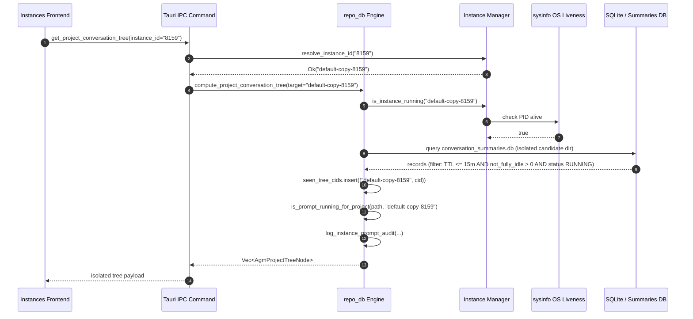

# Specification: Cross-Instance Running Detection Isolation & Multi-Instance Liveness Architecture

> **Spec ID:** `120-isolate-cross-instance-running-detection`  
> **Sub-Document:** `01-architecture-spec.md`  
> **Status:** APPROVED & ARCHITECTED  
> **Domain:** Backend Rust (`src-tauri/src/modules/repo_db.rs`, `src-tauri/src/modules/instance.rs`, `src-tauri/src/modules/logger.rs`), Frontend React (`src/pages/Instances.tsx`)  
> **Author:** Worker 01 (Architecture & Root Cause Analysis Author)  
> **Date:** October 2026  

---

## 1. Executive Summary & Topology Definition

### 1.1 Multi-Instance Operating Architecture
Antigravity Manager (AGM) provides cross-platform multi-instance virtualization for Antigravity IDE and Google Gemini agent runtimes. The operating model partitions instance state into distinct sandboxes:

1. **Default Profile (Sequence 1 / `default`)**:
   - Configuration: Stored in default user profile paths (`~/.gemini`, `~/.config/Code/User`, or Windows `%APPDATA%/Code/User`).
   - Workspaces: Discovered via default `User/workspaceStorage`.
   - Execution Context: OS processes spawned under the host user environment without custom environment overrides.

2. **Cloned Secondary Profiles (e.g., Sequence 2 / `default-copy-8159` / shorthand `8159`)**:
   - Configuration: Stored in isolated directory trees (e.g., `instances/default-copy-8159/home`, `instances/default-copy-8159/data`).
   - Workspaces: Cloned from source instance storage or independently opened in `instances/<id>/data/User/workspaceStorage`.
   - Execution Context: OS processes spawned with isolated `USERPROFILE`, `HOME`, and credential tokens (`JETSKI_OAUTH_TOKEN`, `GEMINI_CLI_OAUTH_TOKEN`).

```
+---------------------------------------------------------------------------------------------------+
|                                   Antigravity Manager Desktop App                                 |
+---------------------------------------------------------------------------------------------------+
                               |                                                 |
             Default Profile (`default`)                       Secondary Profile (`default-copy-8159`)
             - Home: ~/.gemini                                 - Home: instances/default-copy-8159/home
             - Workspaces: Antigravity-Manager                 - Workspaces: coding-guidelines
             - Process PID: 40120                              - Process PID: 51280
             - State: RUNNING (Prompt in-flight)               - State: RUNNING (Prompt in-flight)
                               |                                                 |
                               +-----------------------+-------------------------+
                                                       |
                                            repo_db Database & Runtime
                                            - running_projects table
                                            - active_prompts table
                                            - active_agy_workers map
                                            - conversation_summaries.db
```

### 1.2 Observed Pathology: Cross-Instance Execution Bleed
Under previous implementations, when two instances were active concurrently (e.g., `default` executing `Antigravity-Manager` and `default-copy-8159` executing `coding-guidelines`), the AGM interface suffered cross-instance running detection contamination:
- The `default` card displayed `coding-guidelines` as active or running.
- The `default-copy-8159` card displayed `Antigravity-Manager` as running.
- Historical idle workspaces opened in either instance were marked running whenever an unrelated prompt executed in another instance.

---

## 2. The 6 Core Architectural Root Causes & Remediation

Six distinct architectural design flaws in the running detection pipeline caused this state bleed:

```
+-------------------------------------------------------------------------------------------------------+
|                                    Detection Pipeline Architecture                                    |
+-------------------------------------------------------------------------------------------------------+
| 1. DB Primary Key Collision       | `running_projects` PK `id` lacked instance scope (`{repo}-{hash}`) |
| 2. Cross-Instance CID Collision   | `seen_tree_cids` was global `HashSet<String>` across all instances|
| 3. Loose Path Substring Matching  | Step 4 path matching evaluated `contains(&clean_target)`          |
| 4. Unbounded TTL & Inverted OR    | `conversation_summaries.db` ignored timestamp & used `|| RUNNING` |
| 5. Worker Key Invariant Drift     | `get_active_agy_workers` lacked path & instance normalization     |
| 6. Suffix Query Incompleteness    | `resolve_instance_id` failed on suffix shorthand (e.g., "8159")   |
+-------------------------------------------------------------------------------------------------------+
```

### 2.1 Primary Key Collision in `running_projects` SQLite Table
- **Location**: `src-tauri/src/modules/repo_db.rs` -> `detect_running_projects`
- **Flawed Code**:
  ```rust
  let project_id = format!(
      "{}-{}",
      repo_name.to_lowercase(),
      entry.file_name().to_string_lossy()
  );
  ```
- **Architectural Flaw**: Cloned profiles inherit identical workspace folder storage hash names (`entry.file_name()`) from the parent instance. When `detect_running_projects` executed for `default` and then for `default-copy-8159`, both generated identical `id` values (e.g., `antigravity-manager-d58c5517`). SQLite's `INSERT ... ON CONFLICT(id) DO UPDATE SET instance_id = excluded.instance_id` mutated the row's owning `instance_id`. As a result, the two instances continually overwrote each other's records, causing erratic UI status shifts and dropping rows when filtered by `instance_id`.
- **Remediation Specification**: Redesign the primary key format to explicitly include the `target_id` prefix:
  ```rust
  let project_id = format!(
      "{}:{}-{}",
      target_id,
      repo_name.to_lowercase(),
      entry.file_name().to_string_lossy()
  );
  ```
  Every record in `running_projects` is strictly namespaced by instance ID, ensuring zero row contention and preserving independent lifecycle states.

### 2.2 Cross-Instance CID Deduplication in Conversation Tree
- **Location**: `src-tauri/src/modules/repo_db.rs` -> `compute_project_conversation_tree`
- **Flawed Code**:
  ```rust
  let mut seen_tree_cids = std::collections::HashSet::new();
  // ...
  if !seen_tree_cids.insert(cid.clone()) {
      continue;
  }
  ```
- **Architectural Flaw**: When an instance is cloned from `default`, its initial `.gemini` folder retains copies of earlier conversation summaries and transcripts sharing the same conversation IDs (`cid`). Because `seen_tree_cids` stored only raw `String` CIDs without instance qualification, the first instance scanned permanently claimed those CIDs. The second instance dropped all shared CIDs during tree generation, hiding valid cloned conversation histories or associating conversations with the wrong instance card.
- **Remediation Specification**: Switch `seen_tree_cids` to a composite tuple set qualified by normalized instance ID:
  ```rust
  let mut seen_tree_cids: std::collections::HashSet<(String, String)> = std::collections::HashSet::new();
  // ...
  let cid_key = (norm_owning_inst.clone(), cid.clone());
  if !seen_tree_cids.insert(cid_key) {
      continue;
  }
  ```

### 2.3 Loose Substring Path Matching in `is_prompt_running_for_project`
- **Location**: `src-tauri/src/modules/repo_db.rs` -> `is_prompt_running_for_project` (Step 4)
- **Flawed Code**:
  ```rust
  let matches_path = clean_p == clean_target
      || clean_p.contains(&clean_target)
      || clean_target.contains(&clean_p);
  ```
- **Architectural Flaw**: Step 4 inspected `workspace_uris` from `conversation_summaries.db`. Using bidirectional `contains()` meant that a prompt running in `d:/work/Antigravity-Manager` matched any sibling or nested directory containing the name, such as `d:/work/Antigravity-Manager-Docs` or `d:/work`. When `clean_target` was a parent folder or common substring, it triggered false-positive liveness for completely unrelated workspaces.
- **Remediation Specification**: Enforce normalized strict path equality:
  ```rust
  let matches_path = clean_p == clean_target;
  ```
  Both `clean_p` and `clean_target` are processed via `normalize_path_for_compare` (lowercased, forward slashes, trailing slashes trimmed). Only exact path matches trigger affirmative liveness.

### 2.4 Unbounded Turn Timestamp & Inverted OR Logic in `conversation_summaries.db`
- **Location**: `src-tauri/src/modules/repo_db.rs` -> `is_prompt_running_for_project` (Step 4)
- **Flawed Code**:
  ```rust
  let (status, not_fully_idle, ws_uris_opt, _last_time_str) = item;
  let is_conv_running = if is_explicit_idle {
      false
  } else {
      not_fully_idle != 0 || status.contains("RUNNING")
  };
  ```
- **Architectural Flaw**:
  1. `_last_time_str` was discarded. Stale sessions from days or weeks earlier that ended unexpectedly while in `"RUNNING"` status remained permanently at the top of the table, causing indefinite false-positive running detections.
  2. The relaxed OR condition `not_fully_idle != 0 || status.contains("RUNNING")` allowed sessions with `not_fully_idle == 0` (idle turn) but un-cleared `"RUNNING"` text to be evaluated as active.
- **Remediation Specification**:
  1. Enforce a 15-minute Time-To-Live (900 seconds) based on `last_modified_time`:
     ```rust
     let is_recent = chrono::DateTime::parse_from_rfc3339(&last_time_str)
         .map(|dt| dt.timestamp() >= now - 900)
         .unwrap_or(false);
     if !is_recent {
         continue;
     }
     ```
  2. Enforce strict AND logic (`not_fully_idle > 0 && status.contains("RUNNING")`) alongside strict idle supremacy:
     ```rust
     let is_idle_count = not_fully_idle == 0;
     let has_idle_status = status.contains("IDLE")
         || status.contains("COMPLETED")
         || status.contains("FAILED")
         || status.contains("CANCELLED");
     let is_explicit_idle = is_idle_count || has_idle_status;

     let is_conv_running = if is_explicit_idle {
         false
     } else {
         not_fully_idle > 0 && status.contains("RUNNING")
     };
     ```

### 2.5 Worker Key Matching Normalization in `get_active_agy_workers`
- **Location**: `src-tauri/src/modules/repo_db.rs` -> `is_prompt_running_for_project` (Step 2)
- **Flawed Code**:
  ```rust
  let expected_prefix = format!("{}:", norm_inst);
  // ...
  let has_prefix = key.starts_with(&expected_prefix);
  let is_default_match = norm_inst == "default" && !key.contains(':');
  let matches_inst = norm_inst == "all" || has_prefix || is_default_match;
  let matches_proj = key.contains(project_id);
  ```
- **Architectural Flaw**:
  1. `key.contains(project_id)` was a loose substring check, matching projects with overlapping names.
  2. Path slashes in `key` (e.g., Windows backslashes `\`) clashed with `project_id` forward slashes `/`.
  3. If `norm_inst` was `"8159"` while the worker registered as `"default-copy-8159:path"`, prefix matching failed.
- **Remediation Specification**:
  1. Resolve instance alias beforehand via `resolve_instance_id`.
  2. Decompose the worker key into `(worker_inst, worker_path)` by splitting on the first `:`.
  3. Compare `worker_inst == resolved_inst || (resolved_inst == "default" && worker_inst.is_empty())`.
  4. Compare `normalize_path_for_compare(worker_path) == normalize_path_for_compare(project_id)`.

### 2.6 Suffix Matching in `resolve_instance_id`
- **Location**: `src-tauri/src/modules/instance.rs` -> `resolve_instance_id`
- **Flawed Code**:
  `resolve_instance_id` checked exact match against `i.id` or `i.name`, and attempted numeric parse against `i.seq_num`. When given shorthand suffix `"8159"` for instance `"default-copy-8159"`, numeric parse compared `8159` to `seq_num` (which was `Some(2)`), and exact match failed, returning `Err("Instance '8159' not found")`.
- **Architectural Flaw**: Users and API consumers frequently identify cloned instances by their distinct trailing suffix (`8159`). When functions like `is_prompt_running_for_project("d:/work/repo", "8159")` were invoked, the unresolved ID could not find instance directories or workers registered under `"default-copy-8159"`.
- **Remediation Specification**: Add suffix matching to `resolve_instance_id`:
  ```rust
  if let Some(inst) = registry.instances.iter().find(|i| {
      i.id.ends_with(&format!("-{}", clean))
          || i.id.eq_ignore_ascii_case(clean)
          || i.name.ends_with(&format!("-{}", clean))
          || i.name.eq_ignore_ascii_case(clean)
  }) {
      return Ok(inst.id.clone());
  }
  ```

---

## 3. Structured Audit Logging Specification

To guarantee observability and eliminate speculative debugging, all liveness evaluation routines MUST emit structured audit log entries through `crate::modules::logger::log_instance_prompt_audit`.

### 3.1 Logger Signature & Envelope
```rust
pub fn log_instance_prompt_audit(
    instance_id: &str,
    project_name: &str,
    repo_path: &str,
    is_instance_active: bool,
    is_running: bool,
    active_tasks: usize,
    rationale: &str,
);
```

### 3.2 Output Format
```text
[InstancePromptAudit] instance='<instance_id>' project='<project_name>' path='<repo_path>' is_instance_active=<bool> is_running=<bool> active_tasks=<usize> rationale='<rationale>'
```

### 3.3 Audit Emission Checkpoints
1. **`detect_running_projects`**: Emitted for each discovered workspace folder in `workspaceStorage`.
2. **`is_prompt_running_for_project`**:
   - `ACTIVE_PROMPT_DB_RUNNING`: Active in-memory or database prompt with fresh TTL.
   - `ACTIVE_WORKER_MATCHED`: Verified alive OS child PID matching scoped instance and path.
   - `CONVERSATION_SUMMARY_ACTIVE_TURN`: Live conversation summary turn within 15-minute TTL.
   - `IDLE_NO_MATCH`: No active workers or sessions detected; project marked idle.
3. **`compute_project_conversation_tree`**: Emitted for every project tree node generated, detailing child running tasks count and liveness decision.

---

## 4. Sequence & Data Flow Architecture



---

## 5. Invariants & Verification Matrix

| Property | Rule | Enforcement Mechanism |
|---|---|---|
| **Primary Key Isolation** | No two instances can share `running_projects.id` | Format: `{target_id}:{repo_name}-{hash}` |
| **CID Deduplication** | Cloned CIDs must not suppress conversations across instances | `HashSet<(String, String)>` holding `(instance_id, cid)` |
| **Path Equality** | Paths must never match on partial substrings | Strict normalized equality: `clean_p == clean_target` |
| **Conversation TTL** | Old sessions never evaluate as running | 15-minute (900s) timestamp cutoff on `last_modified_time` |
| **Idle Supremacy** | `not_fully_idle == 0` or idle status is strictly idle | `is_explicit_idle -> false`, strict AND for running |
| **Worker Key Scoping** | Subagent worker keys must match exact instance and path | Split `:` into `(inst, path)` with normalized equality |
| **Suffix Resolution** | Shorthand numeric suffixes resolve to full instance ID | Suffix check in `resolve_instance_id` (`-8159` -> `default-copy-8159`) |
| **Structured Audit Trail** | Every liveness decision must be traceable in logs | `log_instance_prompt_audit` at all evaluation gates |

---

## 6. Coding Guidelines & Hygiene Compliance

1. **Strictly Positive Booleans**:
   - Variables: `is_instance_active`, `is_running`, `is_recent`, `is_idle_count`, `has_running_prompts`, `is_conv_running`.
   - Never use double negatives or negative names (`is_not_running`, `non_idle`).
2. **LF Line Endings**: All files authored with LF (`\n`).
3. **Strict Relative Paths**: All documentation, code references, and script calls adhere strictly to repository-relative paths.
4. **Zero Git Commands**: Subagent executes zero git operations.
