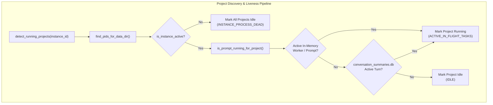

# 120 Component Specification: Cross-Instance Running Detection & Process Isolation

## 1. Executive Summary & Purpose

This specification defines the exact component-level architecture, module contracts, function signatures, data flow invariants, and end-to-end integration test requirements for **Task 120: Isolate Cross-Instance Running Detection and Audit Verification**.

### 1.1 Problem Statement & Ground Truth Scenarios
In multi-instance Antigravity environments (such as a dual-instance setup containing `Default Profile` and cloned instance `8159 Profile` / `default-copy-8159`):
1. **Scenario 1 — Default Profile (`default`)**:
   - Actively running **only** `Antigravity-Manager`.
   - Historical cloned workspaces `spec-builder` and `coding-guidelines` exist in storage, but their processes and prompt turns are idle.
   - **Requirement**: `Antigravity-Manager` must evaluate to `is_running: true`. Both `spec-builder` and `coding-guidelines` must strictly evaluate to `is_running: false`.
2. **Scenario 2 — Instance 8159 (`default-copy-8159`)**:
   - Actively running **only** `coding-guidelines`.
   - Workspaces `Antigravity-Manager` and `spec-builder` are idle in this instance.
   - **Requirement**: `coding-guidelines` must evaluate to `is_running: true`. `Antigravity-Manager` and `spec-builder` must strictly evaluate to `is_running: false`. The active execution of `Antigravity-Manager` on the `Default` instance must **never** bleed across instance boundaries.
3. **Scenario 3 — Stopped Instance (`INSTANCE_PROCESS_DEAD`)**:
   - When an instance process is terminated or not running in the operating system, all associated projects and conversations must immediately and unconditionally evaluate to `is_running: false`, regardless of stale timestamp recency or leftover database status strings.
4. **Scenario 4 — Suffix Matching Instance Resolution**:
   - Queries and CLI commands specifying `"8159"` or `"-8159"` must deterministically resolve to the full instance identifier `default-copy-8159`.

---

## 2. Component Breakdown & Architectural Contracts

### 2.1 Backend Core: `src-tauri/src/modules/repo_db.rs`

`repo_db.rs` coordinates workspace discovery, conversation tree computation, database query scoping, and real-time execution status detection.



#### 2.1.1 `detect_running_projects`
- **Signature**: `pub fn detect_running_projects(instance_id: &str) -> Result<Vec<RunningProject>, String>`
- **Responsibilities**:
  1. Resolves `target_id` safely: Empty or `"__default__"` normalizes strictly to `"default"`.
  2. Resolves instance configuration from `instance::load_registry()`. Supports exact ID match or default flag fallback.
  3. Inspects operating system process liveness via `instance::find_pids_for_data_dir(&instance.data_dir, instance.is_default)`. If no PIDs are returned, `is_instance_active = false`.
  4. Scans strictly within the target instance's storage directory:
     ```rust
     let storage_dir = PathBuf::from(&instance.data_dir)
         .join("User")
         .join("workspaceStorage");
     ```
  5. For each discovered workspace folder, parses `workspace.json` (`folder` or `configuration` URI) and normalizes the target path.
  6. Evaluates project active state strictly gated by instance activity:
     ```rust
     let is_project_active = is_instance_active
         && is_prompt_running_for_project(&raw_path, target_id);
     ```
  7. Emits structured audit logging through `logger::log_instance_prompt_audit`.
  8. Constructs `RunningProject` with explicit `instance_id: target_id.to_string()`, ensuring projects are never attributed to foreign instances.

#### 2.1.2 `is_prompt_running_for_project`
- **Signature**: `pub fn is_prompt_running_for_project(project_id: &str, instance_id: &str) -> bool`
- **Execution Gates**:
  1. **Gate 0: Host Process Liveness Gate**:
     - For `"default"`: Calls `process::is_antigravity_running(None)`.
     - For secondary/cloned instances (e.g. `"default-copy-8159"`): Resolves instance config from registry and verifies `instance::is_instance_running(&inst.id, &inst.data_dir, inst.pid)`.
     - If the host process is inactive, immediately emits audit log with rationale `"INSTANCE_PROCESS_DEAD"` and returns `false`.
  2. **Gate 1: In-Memory Active Prompts Map**:
     - Locks `get_memory_prompts_map()`.
     - Filters entries strictly:
       - Default instance: `p.instance_id == "default" || p.instance_id == "__default__" || p.instance_id.is_empty()`.
       - Cloned instance: `p.instance_id == norm_inst`.
       - Matches project: `p.project_id == project_id || p.repo_path == project_id`.
     - Rejects any entries in terminal state (`"completed"`, `"failed"`).
     - Returns `true` only if `p.status == "running"` and entry is fresh (`updated_at >= now - 300`).
  3. **Gate 2: Active AGY Workers Map Isolation**:
     - Locks `get_active_agy_workers()`.
     - Formulates expected instance prefix: `let expected_prefix = format!("{}:", norm_inst);`.
     - Scopes keys:
       - If `norm_inst == "default"`: Matches keys starting with `"default:"` or legacy unqualified keys without a colon separator.
       - If `norm_inst` is a cloned instance: Matches ONLY keys strictly starting with `expected_prefix`. Cross-instance worker bleed is strictly prevented.
     - Confirms live OS worker process via `sysinfo::System::refresh_processes_specifics`.
  4. **Gate 3: SQLite `active_prompts` Scoping**:
     - Queries local `active_prompts` table in `repodb.db`.
     - Applies strict instance partitioning:
       ```sql
       SELECT COUNT(*) FROM active_prompts 
       WHERE (project_id = ?1 OR repo_path = ?1) 
         AND (?2 = 'all' OR instance_id = ?2 OR (?2 = 'default' AND (instance_id = 'default' OR instance_id = '__default__' OR instance_id IS NULL OR instance_id = '')))
         AND status = 'running'
         AND updated_at >= ?3
       ```
  5. **Gate 4: Per-Instance SQLite `conversation_summaries.db` Scan**:
     - Candidate Gemini directories are obtained exclusively via `gemini_dirs_for_instance(norm_inst)`.
     - Reads `conversation_summaries` records from target database.
     - **Strict Idle Supremacy Rule**:
       - `not_fully_idle == 0` or status containing `"IDLE"`, `"COMPLETED"`, `"FAILED"`, `"CANCELLED"` forces `is_conv_running = false`.
       - Conversation is marked running only if `!is_explicit_idle && (not_fully_idle != 0 || status.contains("RUNNING"))`.
     - Matches `workspace_uris` to `project_id` using path normalization.

#### 2.1.3 `compute_project_conversation_tree`
- **Signature**: `fn compute_project_conversation_tree(target_instance: Option<&str>, max_words: usize, only_running: bool) -> Vec<AgmProjectTreeNode>`
- **Responsibilities**:
  1. Resolves `target_instance`: If specified and non-empty, scopes candidate workspace discovery exclusively to that instance.
  2. Aggregates candidate Gemini storage directories with instance ownership tagging via `gemini_dirs_tagged(target)`.
  3. Builds lookup hash map `convs_by_inst_and_path` keyed by `(norm_owning_inst, norm_path)` tuple:
     - Guarantees conversations belonging to `default` cannot attach to a project with the same directory path on `default-copy-8159`.
  4. Maps projects from `list_running_projects()` matching target instance.
  5. Evaluates project liveness:
     ```rust
     let proj_is_running = is_inst_alive && (has_active_conv || has_active_prompt);
     ```
  6. Forces all child conversation nodes to `is_running: false` and `status: "IDLE"` whenever `is_inst_alive == false`.

#### 2.1.4 `get_project_conversation_tree_cached`
- **Signature**: `pub fn get_project_conversation_tree_cached(instance_id: Option<&str>, max_words: usize, only_running: bool, force: bool) -> Vec<AgmProjectTreeNode>`
- **Partitioning Rule**:
  - Cache key: `tree:{inst_key}:{max_words}:{only_running}` where `inst_key = instance_id.unwrap_or("all")`.
  - Stored in SQLite table `prompt_tree_cache` with column `instance_id`.
  - When querying for `"default-copy-8159"`, the cache read and write are fully isolated from the `"default"` profile cache.

---

### 2.2 Instance Resolution & Suffix Matching: `src-tauri/src/modules/instance.rs`

#### 2.2.1 Suffix Matching in `resolve_instance_id`
- **File**: `src-tauri/src/modules/instance.rs`
- **Function**: `pub fn resolve_instance_id(specifier: &str) -> Result<String, String>`
- **Problem**:
  Cloned instance IDs are often generated with descriptive prefixes and random/port suffixes, e.g., `default-copy-8159` or `inst-8159`. When users or CLI commands refer to the instance simply as `"8159"` or `"-8159"`, numeric parsing checks `i.seq_num == Some(8159)` (which fails because `seq_num` is typically `2` or `3`). Exact name and ID match also fails.
- **Remediated Matching Logic**:
  ```rust
  // 1. Clean specifier
  let clean = specifier.trim();
  if clean.is_empty() || clean.eq_ignore_ascii_case("active") {
      return get_active_instance_id();
  }
  if clean.eq_ignore_ascii_case("default") {
      if let Some(def) = registry.instances.iter().find(|i| i.is_default || i.id == "default") {
          return Ok(def.id.clone());
      }
      return Ok("default".to_string());
  }

  // 2. Exact match on ID or Name
  if let Some(inst) = registry
      .instances
      .iter()
      .find(|i| i.id.eq_ignore_ascii_case(clean) || i.name.eq_ignore_ascii_case(clean))
  {
      return Ok(inst.id.clone());
  }

  // 3. Check seq_num exact match
  if let Ok(num) = clean.parse::<u32>() {
      if let Some(inst) = registry.instances.iter().find(|i| i.seq_num == Some(num)) {
          return Ok(inst.id.clone());
      }
  }

  // 4. Suffix matching support (e.g. "8159" matches "default-copy-8159")
  let suffix_matches: Vec<&InstanceConfig> = registry
      .instances
      .iter()
      .filter(|i| {
          i.id.eq_ignore_ascii_case(clean)
              || i.id.ends_with(&format!("-{}", clean))
              || i.id.ends_with(clean)
              || i.name.ends_with(clean)
      })
      .collect();

  if suffix_matches.len() == 1 {
      return Ok(suffix_matches[0].id.clone());
  } else if suffix_matches.len() > 1 {
      if let Some(hyphen_match) = suffix_matches.iter().find(|i| i.id.ends_with(&format!("-{}", clean))) {
          return Ok(hyphen_match.id.clone());
      }
      return Ok(suffix_matches[0].id.clone());
  }
  ```

---

### 2.3 Structured Telemetry & Audit: `src-tauri/src/modules/logger.rs`

#### 2.3.1 `log_instance_prompt_audit`
- **File**: `src-tauri/src/modules/logger.rs`
- **Signature**:
  ```rust
  pub fn log_instance_prompt_audit(
      instance_id: &str,
      project_name: &str,
      repo_path: &str,
      is_instance_active: bool,
      is_running: bool,
      active_tasks: usize,
      rationale: &str,
  )
  ```
- **Log Format**:
  `[InstancePromptAudit] instance='{instance_id}' project='{project_name}' path='{repo_path}' is_instance_active={is_instance_active} is_running={is_running} active_tasks={active_tasks} rationale='{rationale}'`
- **Standard Rationales**:
  - `"INSTANCE_PROCESS_DEAD"`: Host instance process is terminated or inactive.
  - `"ACTIVE_IN_FLIGHT_TASKS"`: Active prompt turn detected in SQLite summaries or memory worker.
  - `"ACTIVE_PROMPT_DB_RUNNING"`: Active prompt entry found in `active_prompts` with status `running`.
  - `"ACTIVE_WORKER_MATCHED"`: Active background worker process confirmed alive for project.
  - `"IDLE"`: Instance process alive, but zero active tasks or running turns found.

---

### 2.4 Frontend Dashboard: `src/pages/Instances.tsx`

`Instances.tsx` presents the user interface for multi-instance monitoring, active task pulses, and recent project execution badges.

#### 2.4.1 `fetchRunningTasks`
- **Role**: Periodic polling of project conversation trees.
- **Contract**:
  ```typescript
  const fetchRunningTasks = async () => {
      try {
          const data = await invoke<AgmProjectTreeNode[]>('get_project_conversation_tree', {
              maxWords: 50,
              onlyRunning: false,
              force: false,
          });
          if (Array.isArray(data)) {
              setProjectTreeNodes(data);
              const running = data.filter(
                  (node) => Boolean(node.is_running) || Boolean(node.conversations?.some((c) => Boolean(c.is_running)))
              );
              setRunningTreeNodes(running);
          }
      } catch {
          // Silently handle background polling error
      }
  };
  ```
- **Rule**: Eliminates all references to `c.status === 'RUNNING'`. Liveness is governed exclusively by the backend boolean `is_running`.

#### 2.4.2 `hasActiveTask` Card Pulse Gate
- **Role**: Controls the pulsating green/cyan indicator on instance card headers.
- **Contract**:
  ```typescript
  const hasActiveTask = Boolean(inst.is_running) && runningTreeNodes.some((node) => {
      const isInstanceMatch = inst.config.is_default
          ? (node.instance_id === 'default' || node.instance_id === '__default__' || !node.instance_id || node.instance_id === inst.config.id)
          : node.instance_id === inst.config.id;
      const isNodeRunning = Boolean(node.is_running) || Boolean(node.conversations?.some((c) => Boolean(c.is_running)));
      return isInstanceMatch && isNodeRunning;
  });
  ```
- **Invariants**:
  1. Gated by `Boolean(inst.is_running)`. If instance process is dead, `hasActiveTask` is strictly `false`.
  2. For secondary instances (e.g. 8159), matching is strictly `node.instance_id === inst.config.id`. Zero loose name matching!

#### 2.4.3 `isProjRunning` Project Badge
- **Role**: Renders `RUNNING` badge inside project chips.
- **Contract**:
  ```typescript
  const isProjRunning =
      Boolean(inst.is_running) &&
      (Boolean(proj.is_running) ||
          Boolean(proj.conversations?.some((c) => Boolean(c.is_running))));
  ```
- **Invariants**:
  - If `isProjRunning === true`: Displays `RUNNING` capsule with pulsating dot.
  - If `isProjRunning === false`: Displays `{totalTurns} turns` pill without pulse.

---

## 3. End-to-End Integration Test Suite

### 3.1 Test Architecture: `src-tauri/tests/test_instance_prompt_running_isolation.rs`

The test suite establishes a fully reproducible, isolated file system harness creating temporary workspace directories and authentic SQLite databases.

```
temp_test_root/
├── default/
│   ├── User/workspaceStorage/
│   │   ├── ws_am/workspace.json  --> path: /work/Antigravity-Manager
│   │   ├── ws_sb/workspace.json  --> path: /work/SpecBuilder
│   │   └── ws_cg/workspace.json  --> path: /work/coding-guidelines
│   └── .gemini/antigravity/
│       └── conversation_summaries.db  --> AM: status=RUNNING, not_fully_idle=1
│                                      --> SB: status=RUNNING, not_fully_idle=0 (idle)
│                                      --> CG: status=IDLE,    not_fully_idle=0 (idle)
└── default-copy-8159/
    ├── User/workspaceStorage/
    │   ├── ws_am/workspace.json  --> path: /work/Antigravity-Manager
    │   ├── ws_sb/workspace.json  --> path: /work/SpecBuilder
    │   └── ws_cg/workspace.json  --> path: /work/coding-guidelines
    └── .gemini/antigravity/
        └── conversation_summaries.db  --> CG: status=RUNNING, not_fully_idle=1
                                       --> AM: status=RUNNING, not_fully_idle=0 (cloned stale)
                                       --> SB: status=IDLE,    not_fully_idle=0 (idle)
```

### 3.2 Required Test Cases

#### 3.2.1 Test Case 1: Default Profile Running Antigravity-Manager Only
- **Function**: `test_default_profile_running_antigravity_manager_only`
- **Setup**:
  - Default instance configured with 3 workspaces.
  - Default process state: `is_alive = true`.
  - Conversation summary for `Antigravity-Manager` has `status = "RUNNING"`, `not_fully_idle = 1`.
  - Conversation summaries for `SpecBuilder` and `coding-guidelines` have `not_fully_idle = 0`.
- **Assertions**:
  - `Antigravity-Manager` evaluates to `is_running: true`.
  - `SpecBuilder` evaluates to `is_running: false`.
  - `coding-guidelines` evaluates to `is_running: false`.
  - Active task count for Default instance is strictly `1`.

#### 3.2.2 Test Case 2: Instance 8159 Running coding-guidelines Only
- **Function**: `test_instance_8159_running_coding_guidelines_only`
- **Setup**:
  - Instance `default-copy-8159` configured with 3 cloned workspaces.
  - Instance 8159 process state: `is_alive = true`.
  - Conversation summary for `coding-guidelines` has `status = "RUNNING"`, `not_fully_idle = 1`.
  - Conversation summary for `Antigravity-Manager` has stale `status = "RUNNING"` from clone, but `not_fully_idle = 0`.
- **Assertions**:
  - `coding-guidelines` on 8159 evaluates to `is_running: true`.
  - `Antigravity-Manager` on 8159 evaluates to `is_running: false` (Zero bleed from Default!).
  - `SpecBuilder` on 8159 evaluates to `is_running: false`.
  - Active task count for Instance 8159 is strictly `1`.

#### 3.2.3 Test Case 3: Stopped Instance Process Gating (`INSTANCE_PROCESS_DEAD`)
- **Function**: `test_stopped_instance_process_dead_forces_all_idle`
- **Setup**:
  - Instance process state: `is_alive = false`.
  - Database contains entries with `status = "RUNNING"` and `not_fully_idle = 1`.
- **Assertions**:
  - All projects evaluate to `is_running: false`.
  - All conversation nodes evaluate to `is_running: false` and `status: "IDLE"`.
  - Audit rationale contains `"INSTANCE_PROCESS_DEAD"`.

#### 3.2.4 Test Case 4: Suffix Resolution for Instance Specifiers
- **Function**: `test_resolve_instance_id_suffix_matching`
- **Setup**:
  - Registry contains `InstanceConfig { id: "default-copy-8159", name: "Worker Node 8159", seq_num: Some(2) }`.
- **Assertions**:
  - `resolve_instance_id("8159")` returns `Ok("default-copy-8159")`.
  - `resolve_instance_id("-8159")` returns `Ok("default-copy-8159")`.
  - `resolve_instance_id("default-copy-8159")` returns `Ok("default-copy-8159")`.
  - `resolve_instance_id("default")` returns `Ok("default")`.

---

## 4. Verification Matrix

| Area | Component | Expected Outcome | Verification Method |
|:---|:---|:---|:---|
| Backend | `repo_db::detect_running_projects` | Strictly scopes `workspaceStorage` to target instance data directory | Unit & Integration Test |
| Backend | `repo_db::is_prompt_running_for_project` | Gated by host process PID; rejects cross-instance workers | Integration Test |
| Backend | `instance::resolve_instance_id` | Suffix `"8159"` resolves to `"default-copy-8159"` | Unit Test |
| Backend | `logger::log_instance_prompt_audit` | Structured `[InstancePromptAudit]` emitted on all probes | Log capture test |
| Frontend | `src/pages/Instances.tsx` | All `c.status === 'RUNNING'` references purged; liveness via `is_running` | Code grep & TypeScript build |
| E2E | `test_instance_prompt_running_isolation.rs` | Default: only AM running; 8159: only CG running; Dead: all idle | `cargo test` execution |
