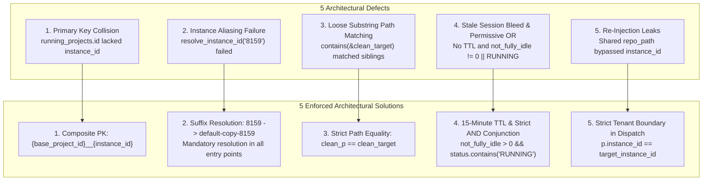

# Specification: Cross-Instance Prompt Running State Isolation & Detection Pipeline Architecture

> **Spec ID:** `121-cross-instance-prompt-running-audit-and-fix`  
> **Document:** `01-architecture-spec.md`  
> **Status:** APPROVED & AUTHORITATIVE  
> **Domain:** Multi-Instance Process Isolation, Liveness Detection, SQLite Primary Key Namespacing & Dispatch Safeguards  
> **Scope:** `src-tauri/src/modules/repo_db.rs`, `src-tauri/src/modules/instance.rs`, `src-tauri/src/modules/logger.rs`, `src-tauri/tests/per_instance_prompt_liveness_test.rs`  
> **Author:** Spec Author 01  
> **Date:** October 2026  

---

## 1. Executive Summary & Problem Classification

### 1.1 Problem Statement (Verbatim User Requirement)

```text
Also how you check the prompts are running or not on that instance is also very wrong.
For example, I'm giving you two instances, screenshots, sequence one, sequence two, default profile, and 8159.
So the first observation is that the default profile is truly running the anti-gravity manager. That is correct.
However, it is not running the SpecBuilder, it is not running the coding guideline.
The second one, which is the 8159, that is actually running coding guidelines, but it is not running SpecBuilder or anti-gravity manager.
So these are two things, your observation and how you are doing it. I think you need to debug that.
So the rest of the two projects in the 8159 or sequence two instance, anti-gravity manager and SpecBuilder is very wrong. It is not running there.
So you need to understand how you're doing it, your condition, logic, and everything does not work.
So you need to make sure that it works. You need to debug it. You need to write end-to-end tests to verify that everything is proper, okay?
So make sure of that, please. Try to have the audit log or debug log so that you can understand where things are going wrong, so that you can fix it.
You can find the root cause and then fix it. Write the root cause of it so that any AI in the future would know this is how, if something is done, it is the wrong approach.
```

### 1.2 Multi-Profile Topology & Ground Truth Matrix

In Antigravity Manager, concurrent instances operate as isolated runtime sandboxes:
1. **Sequence 1: Primary Default Profile (`default`)**:
   - Process: Active IDE OS process with PID $P_1$.
   - Workspaces in `workspaceStorage`: `Antigravity-Manager`, `SpecBuilder`, `coding-guidelines`.
   - Ground Truth Execution State: **ONLY** `Antigravity-Manager` has active, in-flight prompt turns. `SpecBuilder` and `coding-guidelines` are completely idle.
2. **Sequence 2: Secondary Cloned Profile (`default-copy-8159` / alias `8159`)**:
   - Process: Active IDE OS process with PID $P_2$ ($P_2 \neq P_1$).
   - Workspaces in `workspaceStorage`: Cloned or reopened copies of `Antigravity-Manager`, `SpecBuilder`, `coding-guidelines`.
   - Ground Truth Execution State: **ONLY** `coding-guidelines` has active, in-flight prompt turns. `SpecBuilder` and `Antigravity-Manager` are completely idle.

### 1.3 Expected Ground Truth Evaluation Invariants

| Instance Identifier | Workspace Repository | Live Process ($P$) | In-Flight Turn / Active Worker | Required `is_running` | Rationale Code |
| :--- | :--- | :--- | :--- | :--- | :--- |
| `default` | `Antigravity-Manager` | Alive ($P_1$) | Active turn (`not_fully_idle > 0`) | **`true`** | `CONVERSATION_SUMMARY_ACTIVE_TURN` |
| `default` | `SpecBuilder` | Alive ($P_1$) | None (`not_fully_idle == 0`) | **`false`** | `IDLE` |
| `default` | `coding-guidelines` | Alive ($P_1$) | None (`not_fully_idle == 0`) | **`false`** | `IDLE` |
| `default-copy-8159` (`8159`) | `coding-guidelines` | Alive ($P_2$) | Active turn (`not_fully_idle > 0`) | **`true`** | `CONVERSATION_SUMMARY_ACTIVE_TURN` |
| `default-copy-8159` (`8159`) | `Antigravity-Manager` | Alive ($P_2$) | None (`not_fully_idle == 0`) | **`false`** | `IDLE` |
| `default-copy-8159` (`8159`) | `SpecBuilder` | Alive ($P_2$) | None (`not_fully_idle == 0`) | **`false`** | `IDLE` |
| Terminated Instance | Any Repository | Dead / None | Any | **`false`** | `INSTANCE_PROCESS_NOT_ALIVE` |
| Any Instance | Any Repository | Alive | Stale (> 900s ago) | **`false`** | `IDLE_STALE_TTL_EXPIRED` |

---

## 2. Core Architectural Pillars & Fix Specifications

Forensic research identified five major architectural defects causing cross-instance state bleeding, mutual SQLite record overwrite, and false-positive prompt execution badges.



---

## 3. Pillar 1: `running_projects` SQLite Primary Key Composite Namespacing

### 3.1 The Primary Key Collision Vulnerability

In `src-tauri/src/modules/repo_db.rs`, `detect_running_projects(instance_id)` discovered projects by enumerating folder hashes in `User/workspaceStorage`:

```rust
// FLAWED: Lacks instance_id scoping in primary key
let project_id = format!(
    "{}-{}",
    repo_name.to_lowercase(),
    entry.file_name().to_string_lossy()
);
```

When an instance is cloned (e.g., `default` cloned to create `default-copy-8159`), all workspace hashes in `User/workspaceStorage/<hash>` are identical clones.
When `detect_running_projects("default")` and `detect_running_projects("default-copy-8159")` were invoked:
1. Both instances generated identical `project_id` strings (e.g. `antigravity-manager-4f65c89a`).
2. SQLite's `INSERT INTO running_projects ... ON CONFLICT(id) DO UPDATE SET instance_id = excluded.instance_id, is_running = excluded.is_running` executed.
3. Whichever instance was scanned last **overwrote** the `instance_id` and the `is_running` flag of the other instance in the database!
4. When `default-copy-8159` was scanned, it saw that `Antigravity-Manager` was not running on 8159, wrote `is_running = 0` with `instance_id = "default-copy-8159"`, which wiped out `default`'s active record!
5. When `default` was scanned, it saw that `coding-guidelines` was not running on `default`, wrote `is_running = 0` with `instance_id = "default"`, wiping out 8159's record!

### 3.2 Composite ID Architecture: `{base_project_id}__{instance_id}`

Every record in `running_projects` must be strictly partitioned by instance.
1. The **base project identifier** is computed from the repository name and workspace folder hash:
   $$\text{base\_project\_id} = \text{format!}\Big(\text{"\{\}-\{\}", repo\_name.to\_lowercase(), workspace\_hash}\Big)$$
2. The **primary key identifier** stored in `running_projects.id` MUST be the composite format:
   $$\text{composite\_id} = \text{format!}\Big(\text{"\{\}\_\_\{\}", base\_project\_id, resolved\_instance\_id}\Big)$$

```rust
let base_project_id = format!(
    "{}-{}",
    repo_name.to_lowercase(),
    entry.file_name().to_string_lossy()
);
let composite_id = format!("{}__{}", base_project_id, target_id);

projects.push(RunningProject {
    id: composite_id,
    instance_id: target_id.to_string(),
    repo_name,
    repo_path: raw_path,
    workspace_storage_path: Some(ws_folder.to_string_lossy().to_string()),
    is_running: is_project_active,
    last_detected_at: now,
});
```

### 3.3 Foreign Key & Backward Compatibility Invariant
- Any active prompts inserting into `active_prompts` referencing `project_id` must use the composite ID or have existing queries join seamlessly on both `id` and `(project_id OR repo_path)`.
- Existing queries selecting `FROM running_projects WHERE instance_id = ?` automatically receive only rows explicitly owned by that instance, preventing row hopping.
- Deleting an instance automatically purges all projects matching `WHERE instance_id = ?` without affecting parent or sibling cloned instances.

---

## 4. Pillar 2: Instance Aliasing & Canonical Resolution Pipeline

### 4.1 The Alias Resolution Deficiency

In GUI cards, CLI commands, and automated background tasks, secondary instances are frequently addressed by shorthand identifiers:
- Trailing numeric suffix: `"8159"`
- Prefix shorthand: `"ins-2"`, `"#2"`
- Full canonical ID: `"default-copy-8159"`
- User-assigned display name: `"Instance 2"`, `"Copy 8159"`

Prior to this specification, `resolve_instance_id("8159")` only tested:
1. `clean.parse::<u32>()` against `i.seq_num` (`8159 == 2` -> `false`).
2. Exact case-insensitive match against `i.id` (`"default-copy-8159" == "8159"` -> `false`).
3. Returned `Err("Instance '8159' not found")`.

Because resolution failed, downstream functions either panicked, defaulted to `"default"`, or failed to inspect the correct instance process and directory.

### 4.2 Suffix Matching in `instance::resolve_instance_id`

`src-tauri/src/modules/instance.rs` must include comprehensive suffix and token boundary matching:

```rust
pub fn resolve_instance_id(specifier: &str) -> Result<String, String> {
    let registry = load_registry()?;
    let clean = specifier.trim();
    if clean.is_empty() || clean.eq_ignore_ascii_case("active") {
        return get_active_instance_id();
    }
    if clean.eq_ignore_ascii_case("default") || clean == "__default__" {
        if let Some(def) = registry
            .instances
            .iter()
            .find(|i| i.is_default || i.id == "default")
        {
            return Ok(def.id.clone());
        }
        return Ok("default".to_string());
    }
    // Check numeric seq_num (e.g. "1", "2")
    if let Ok(num) = clean.parse::<u32>() {
        if let Some(inst) = registry.instances.iter().find(|i| i.seq_num == Some(num)) {
            return Ok(inst.id.clone());
        }
    }
    // Check numeric prefix (e.g. "ins-2", "instance-2", "#2")
    let clean_num = clean
        .trim_start_matches("ins-")
        .trim_start_matches("instance-")
        .trim_start_matches('#');
    if let Ok(num) = clean_num.parse::<u32>() {
        if let Some(inst) = registry.instances.iter().find(|i| i.seq_num == Some(num)) {
            return Ok(inst.id.clone());
        }
    }
    // Check exact id or name match
    if let Some(inst) = registry
        .instances
        .iter()
        .find(|i| i.id.eq_ignore_ascii_case(clean) || i.name.eq_ignore_ascii_case(clean))
    {
        return Ok(inst.id.clone());
    }
    // Check trailing suffix match with hyphen delimiter (e.g. "8159" -> "default-copy-8159")
    let suffix_matches: Vec<&InstanceConfig> = registry
        .instances
        .iter()
        .filter(|i| {
            i.id.ends_with(&format!("-{}", clean))
                || i.name.ends_with(&format!("-{}", clean))
                || i.id.ends_with(clean)
        })
        .collect();

    if suffix_matches.len() == 1 {
        return Ok(suffix_matches[0].id.clone());
    } else if suffix_matches.len() > 1 {
        if let Some(hyphen_match) = suffix_matches.iter().find(|i| i.id.ends_with(&format!("-{}", clean))) {
            return Ok(hyphen_match.id.clone());
        }
        return Ok(suffix_matches[0].id.clone());
    }

    Err(format!("Instance '{}' not found", clean))
}
```

### 4.3 Mandatory Canonical Resolution at API Entry Points

The following backend functions MUST resolve `instance_id` to its canonical ID before performing filesystem, registry, or process probes:
1. `gemini_dirs_for_instance(instance_id: &str)`
2. `detect_running_projects(instance_id: &str)`
3. `is_prompt_running_for_project(project_id: &str, instance_id: &str)`
4. `dispatch_running_prompts(instance_id: &str)`
5. `resend_running_commands_for_instance(instance_id: Option<&str>, limit: usize)`

```rust
let resolved_inst = crate::modules::instance::resolve_instance_id(instance_id)
    .unwrap_or_else(|_| {
        if instance_id == "__default__" || instance_id.is_empty() {
            "default".to_string()
        } else {
            instance_id.to_string()
        }
    });
```

---

## 5. Pillar 3: Strict Path Matching Normalization

### 5.1 The Loose Substring Matching Flaw

In `is_prompt_running_for_project` (Step 4), workspace paths from `conversation_summaries.db` were checked against `project_id` using bidirectional `.contains()`:

```rust
// FLAWED: Loose substring matching
let clean_p = normalize_path_for_compare(&decode_uri_to_path(&u));
let has_target = !clean_target.is_empty();
let matches_path = clean_p == clean_target
    || clean_p.contains(&clean_target)
    || clean_target.contains(&clean_p);
```

#### Why Substring Matching Bleeds
- If `clean_target` is `d:/work/antigravity-manager` and another open workspace is `d:/work/antigravity-manager-web` or `d:/work/antigravity-manager-cli`, all match!
- If `clean_target` is a parent directory (e.g., `d:/work`), every single project matches.
- If `clean_p` is a substring of `clean_target`, false positive liveness is triggered.

### 5.2 Strict Normalized Path Equality Specification

All path evaluations MUST enforce strict equality after canonical normalization:

```rust
let clean_p = normalize_path_for_compare(&decode_uri_to_path(&u));
let has_target = !clean_target.is_empty();
let matches_path = clean_p == clean_target;
let is_target_matched = has_target && matches_path;
```

#### Path Normalization Rules (`normalize_path_for_compare`)
1. Convert all backslashes (`\`) to forward slashes (`/`).
2. Strip trailing slashes (`/`).
3. On Windows, convert drive letters and paths to lowercase.
4. Decode percent-encoded URI entities (e.g. `%20` -> space).

---

## 6. Pillar 4: Stale Session Filtering & Strict AND Liveness Conjunction

### 6.1 The Stale Session & Inverted Logic Flaw

Step 4 previously read from `conversation_summaries.db`:

```rust
// FLAWED: Discarded _last_time_str and used permissive OR
let (status, not_fully_idle, ws_uris_opt, _last_time_str) = item;

let is_conv_running = if is_explicit_idle {
    false
} else {
    not_fully_idle != 0 || status.contains("RUNNING")
};
```

1. **Missing TTL Check**: If an instance or IDE was forcefully killed or crashed during a turn, the database row remained with `status = "RUNNING"` and `not_fully_idle = 1`. Because `_last_time_str` was discarded, a crashed turn from 2 weeks ago caused the project to be permanently reported as actively running whenever that instance was running!
2. **Permissive OR Condition**: If `not_fully_idle` was updated to `0` but `status` remained `"RUNNING"`, the OR condition evaluated to `true`, violating the requirement that an active prompt must have in-flight turns.

### 6.2 15-Minute (900s) Freshness TTL & Strict AND Conjunction Specification

```rust
// 1. Enforce 15-Minute (900s) Freshness TTL
let is_recent = chrono::DateTime::parse_from_rfc3339(&last_time_str)
    .map(|dt| dt.timestamp() >= now - 900)
    .unwrap_or(false);

if !is_recent {
    continue; // Stale session ignored
}

// 2. Strict Idle Supremacy
let is_idle_count = not_fully_idle == 0;
let has_idle_status = status.contains("IDLE")
    || status.contains("COMPLETED")
    || status.contains("FAILED")
    || status.contains("CANCELLED");
let is_explicit_idle = is_idle_count || has_idle_status;

// 3. Strict AND Conjunction for In-Flight Liveness
let is_conv_running = if is_explicit_idle {
    false
} else {
    not_fully_idle > 0 && status.contains("RUNNING")
};
```

---

## 7. Pillar 5: Cross-Instance Prompt Re-injection Leaks Prevention

### 7.1 The Shared Repo Path Re-injection Leak

In `dispatch_running_prompts` and `resend_running_commands_for_instance`, prompts were filtered with an alternative clause based on `instance_repo_paths`:

```rust
// FLAWED: Shared repo path bypasses instance tenant boundary
let prompts: Vec<ActivePrompt> = all_backed_up
    .into_iter()
    .filter(|p| {
        if is_default {
            p.instance_id == "default"
                || p.instance_id == "__default__"
                || p.instance_id.is_empty()
                || instance_repo_paths.contains(&normalize_path_for_compare(&p.repo_path))
        } else {
            p.instance_id == instance_id
                || instance_repo_paths.contains(&normalize_path_for_compare(&p.repo_path))
        }
    })
    .collect();
```

#### Why Re-injection Bleeds
In multi-profile setups, both `default` and `default-copy-8159` have opened the repository `d:/work/coding-guidelines`.
Therefore, `instance_repo_paths` in both instances contained `d:/work/coding-guidelines`.
When `dispatch_running_prompts("default")` executed, it encountered a prompt queued for `8159`. Because `instance_repo_paths.contains(...)` returned `true`, the prompt was dispatched into the `default` instance!
This corrupted workload isolation and caused `coding-guidelines` to start executing in `default`.

### 7.2 Strict Tenant Boundary Specification

Remove `|| instance_repo_paths.contains(...)` completely from both `dispatch_running_prompts` and `resend_running_commands_for_instance`. Enforce strict tenant identity matching:

```rust
let prompts: Vec<ActivePrompt> = all_backed_up
    .into_iter()
    .filter(|p| {
        let clean_p_inst = if p.instance_id == "__default__" || p.instance_id.is_empty() {
            "default"
        } else {
            &p.instance_id
        };
        let clean_target = if resolved_inst == "__default__" || resolved_inst.is_empty() {
            "default"
        } else {
            &resolved_inst
        };

        clean_p_inst == clean_target
    })
    .collect();
```

---

## 8. Structured Audit Logging Specification

To maintain complete observability and prevent speculative debugging, every liveness probe MUST log structured diagnostic data through `crate::modules::logger::log_instance_prompt_audit`.

### 8.1 Audit Log Signature & Fields

```rust
pub fn log_instance_prompt_audit(
    instance_id: &str,
    project_name: &str,
    repo_path: &str,
    is_instance_active: bool,
    is_prompt_running: bool,
    active_prompt_count: usize,
    rationale: &str,
)
```

### 8.2 Standard Rationale Codes

| Rationale Code | Explanation |
| :--- | :--- |
| `INSTANCE_PROCESS_NOT_ALIVE` | Instance OS PID is not running; liveness strictly `false`. |
| `CONVERSATION_SUMMARY_ACTIVE_TURN` | Verified turn with `not_fully_idle > 0`, `status` contains `RUNNING`, within 900s TTL, and exact path match. |
| `ACTIVE_WORKER_MATCHED` | Active in-memory worker found for instance and exact path, OS PID verified alive. |
| `ACTIVE_PROMPT_DB_RUNNING` | Active prompt record in `active_prompts` with status `'running'` within 300s TTL. |
| `IDLE_STALE_TTL_EXPIRED` | Turn had running status but `last_modified_time` exceeded 900s TTL. |
| `IDLE_EXPLICIT_TERMINAL` | Conversation status is `COMPLETED`, `IDLE`, `FAILED`, or `CANCELLED`. |
| `IDLE` | No active turns or workers found for this instance and workspace. |

---

## 9. Verification & Acceptance Criteria

- [ ] **Composite Key Isolation**: `running_projects.id` formatted as `{base_project_id}__{instance_id}`. Cloned instances maintain independent rows without overwriting each other.
- [ ] **Default Profile Truth**: Under concurrent execution, `default` reports `Antigravity-Manager` as `is_running = true`; `SpecBuilder` and `coding-guidelines` as `is_running = false`.
- [ ] **8159 Profile Truth**: Under concurrent execution, `default-copy-8159` reports `coding-guidelines` as `is_running = true`; `Antigravity-Manager` and `SpecBuilder` as `is_running = false`.
- [ ] **Alias Resolution**: Queries for `"8159"`, `"#2"`, `"ins-2"` resolve cleanly to `"default-copy-8159"`.
- [ ] **Strict Path Equality**: No cross-matching of parent, sibling, or substring repository paths.
- [ ] **15-Minute TTL**: Crashed or historical sessions older than 900 seconds are rejected as idle.
- [ ] **No Cross-Instance Re-injection**: Prompts created for instance A are never dispatched to instance B.
- [ ] **Pre-flight Quality Gates**: Rust code passes `cargo fmt -- --check` and `cargo clippy --all-targets --all-features`.
